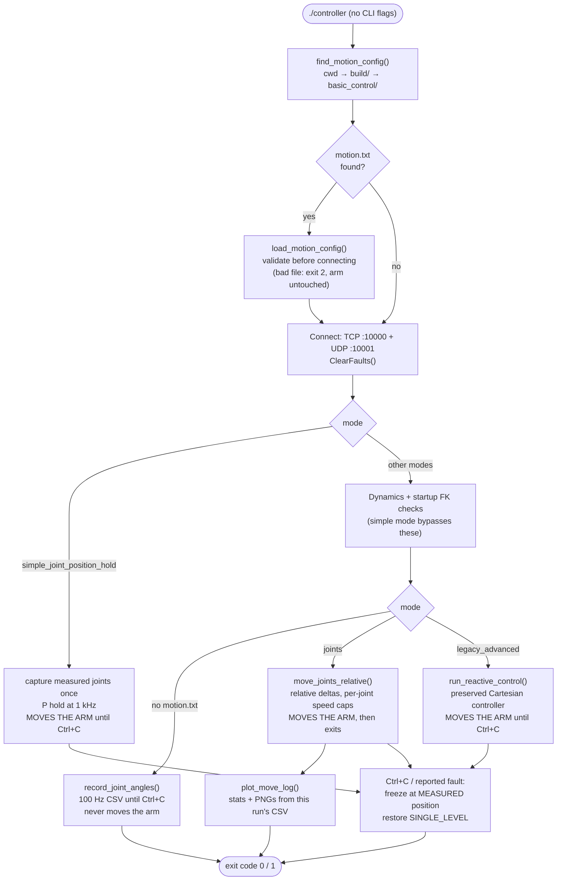
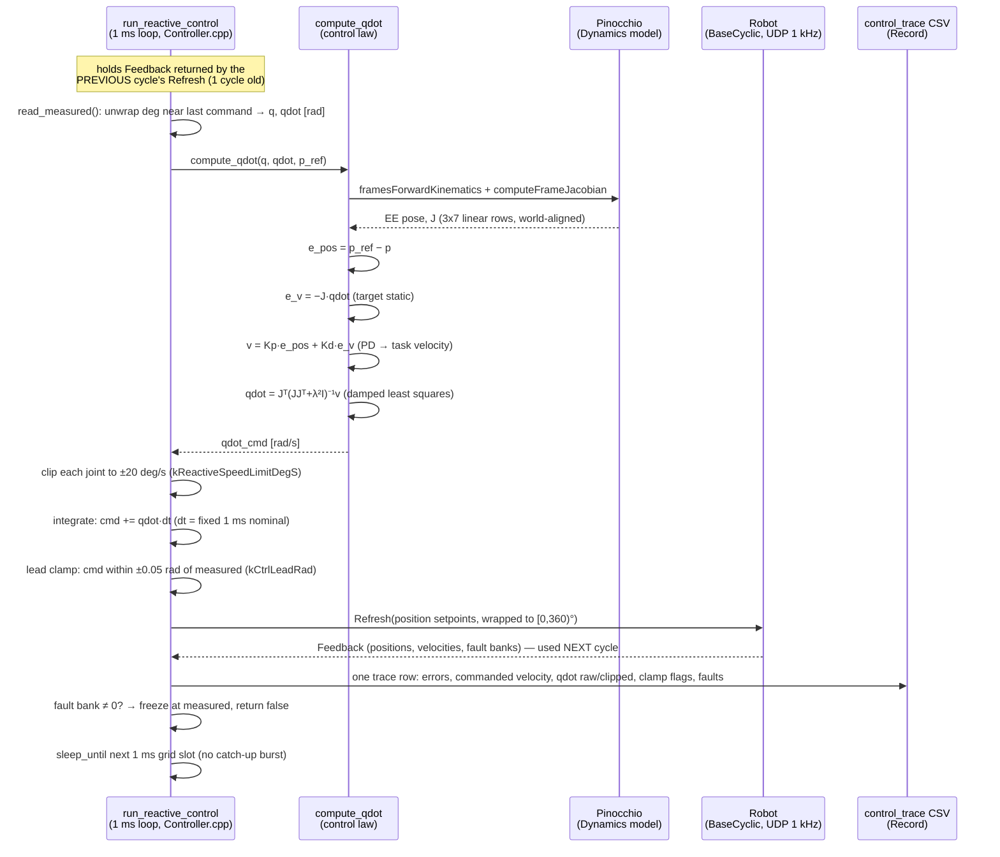

# Controller code map — basic_control

How the Kinova Gen3 controller in `basic_control/` fits together: the active
simple joint-position hold, the preserved legacy Cartesian controller, and the
shared robot/logging path. Companion docs: `architecture.md` (module ownership)
and `known-issues.md` (hardware safety constraints).

The active baseline computes and sends joint **position setpoints only**. The
legacy advanced controller remains velocity-resolved internally, but it too
ultimately sends integrated position setpoints rather than velocity or torque
commands.

## Program flow

The mode is selected purely by the presence and content of `motion.txt`
(searched: current dir → executable's dir → its parent). A leftover
`motion.txt` therefore **moves the arm on the next start** — rename or delete
it after a session.

## One simple hold step (1 ms cycle)

`run_simple_joint_position_hold` in
`src/controllers/simple_joint_position_hold/`. The target is captured once from
measured feedback after entering low-level servoing:

1. Unwrap measured joint positions beside the previous position command.
2. Compute `error = target - measured`.
3. Compute `raw_command = measured + 0.02 * error`.
4. Clamp each setpoint to `measured +/- 0.1 deg`.
5. Populate actuator position fields and call `BaseCyclic::Refresh`.
6. Log time, measured, target, error, and commanded position.
7. On Ctrl+C or a reported fault, send the latest measurement once and return;
   `ServoingModeGuard` restores single-level servoing.

No FK, Jacobian, Cartesian target, joint velocity command, or torque command is
part of this path.

## Legacy advanced control step (1 ms cycle)

`run_reactive_control` in
`src/controllers/legacy_advanced/Controller.cpp`. Constants in `src/Config.h`.

Details worth knowing when debugging:

- **Sensing is one cycle old**: each cycle controls on the feedback returned by
  the previous cycle's `Refresh`.
- **Integration uses the nominal 1 ms**, not the measured cycle time; the trace's
  `dt_s` column records what the cycle actually took.
- **Speed clipping is per joint**, so when any joint saturates, the Cartesian
  direction of motion distorts (`spclip_j*` flags in the trace show when).
- The target is **static** by construction (`e_v = −J·qdot` assumes zero
  reference twist), and the controlled frame is the **flange**
  (`EndEffector_Link`), not the gripper TCP the robot itself reports
  (≈0.12 m offset, see the startup FK cross-check).
- There is **no impedance/torque control** anywhere: the only command field ever
  set is actuator position. `Dynamics` exposes mass/gravity/Coriolis, but the
  loop uses Pinocchio solely for FK + Jacobian.

## File-by-file

| File | Owns | Key symbols |
|---|---|---|
| `src/main.cpp` | Entry point: mode selection, wiring, shutdown, exit codes | `main`, `g_stop` (SIGINT flag) |
| `src/Config.h` | All runtime settings (edit + rebuild; no CLI flags) | simple `kSimpleHoldKp`, `kSimpleHoldMaxCommandLeadDeg`; legacy Cartesian target/gains/clamps |
| `src/Connect.{h,cpp}` | Kortex sessions: TCP :10000 (high-level) + UDP :10001 (cyclic), RAII teardown | `Connect`, `base()`, `base_cyclic()` |
| `src/Measure.{h,cpp}` | Sensor reads; degrees → Pinocchio configuration | `measure_joint_angles`, `measure_configuration` |
| `src/Kinematics.{h,cpp}` | Forward kinematics; startup FK-vs-robot cross-check (+0.12 m TCP offset) | `forward_kinematics`, `report_fk_vs_robot` |
| `src/controllers/simple_joint_position_hold/` | Active measured-start P hold; pure proportional calculation plus low-level loop; position setpoints only. **Moves the arm** | `compute_simple_hold_step`, `run_simple_joint_position_hold` |
| `src/controllers/legacy_advanced/Controller.{h,cpp}` | Preserved Cartesian servo: PD → DLS → clip → integrate → lead clamp → stream. **Moves the arm** | `run_reactive_control`, `compute_qdot` (file-local), `report_position_error` |
| `src/Motion.{h,cpp}` | Joint-delta moves; shared low-level primitives; `motion.txt` loader; client-side watchdogs | `ServoingModeGuard` (RAII servoing mode), `send_positions`, `move_joints_relative`, `load_motion_config`, `kDefaultSpeedLimits` (45 deg/s), `kTrackingErrorLimitDeg` (3°/50 cycles), `kReachedToleranceDeg` (0.5°) |
| `src/Record.{h,cpp}`, `src/SimpleHoldRecord.cpp` | All CSV logging: recording, joint moves, simple hold, legacy trace; timestamped filenames; post-move plot runner | `SimpleHoldLogSample`, `ControlTraceSample`, `timestamped_csv_name` |
| `src/Timing.{h,cpp}` | Latency benchmarks (feedback round-trip, full cycle, dynamics solve). Compiled but not called from `main` | `time_feedback_roundtrip`, `time_control_cycle`, `time_dynamics_solve` |
| `../TrajectoryExecution/{include,src}/Dynamics.*` | External, reused, **do not edit**: URDF model, configuration conversion (continuous joints ↔ cos/sin), mass/gravity/Coriolis (unused by the loop). `coriolis_m_simplified` is a zero-returning placeholder | `Dynamics`, `convertJointAnglesToConfig`, `model_`, `data_` |
| `tools/query_limits.cpp` | Standalone read-only executable: prints the robot's kinematic hard/soft limits | `query_limits` binary |
| `scripts/plot_move.py`, `scripts/plot_joint.py` | Offline analysis of move logs (not part of the build) | — |
| `config/GEN3_custom.urdf` | Our copy of the arm model (see `decisions/custom-urdf.md`) | — |
| `motion.txt` | Optional runtime motion config; its presence arms a move on startup | `mode:`, `deltas_deg:`, `speeds_deg_s:`, `speed_limits_deg_s:` |
