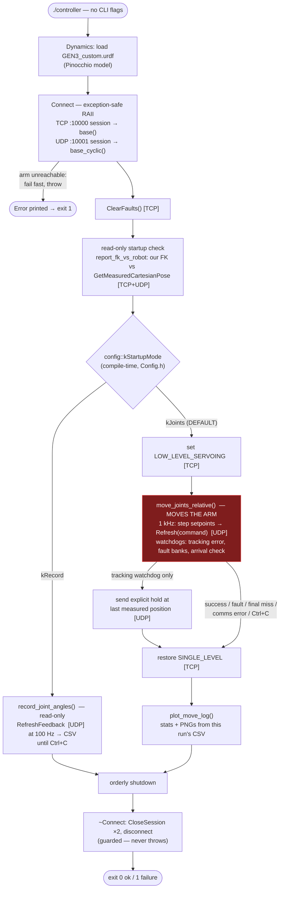

# Controller code map — basic_control

Use this as the fast route from a symptom to the responsible code and recorded
evidence. It describes the current source as checked on 2026-07-20; it is not a
line-by-line substitute for the implementation. Companion docs:
`architecture.md` (module ownership contract), `known-issues.md` (why the
safety numbers are what they are), and `decisions/` (design choices).

There is no task-space or velocity-resolved control law in this program. The
only way to move the arm is `move_joints_relative` (`Motion.cpp`): one-shot
relative moves, per joint, in degrees, streamed as **position** setpoints at
1 kHz over `BaseCyclic::Refresh`.

## Read this first

`basic_control` is hardware-facing. Do not treat `./controller` as a harmless
diagnostic: its default mode is the joint-motion path. Review `Config.h`, use
zero deltas or `kRecord` for a read-only session, and obtain the required arm
authorization before connecting. `tools/query_limits` is read-only but also
opens a real robot session.

The reliable debugging sequence is: capture the console reason, keep the
timestamped `move_log_*.csv`, run or inspect its plot, then open the function
named in the symptom table below. The CSV is the evidence; do not infer robot
state from the commanded trajectory alone.

## Program flow

Every box that talks to the robot is tagged with its channel: `[TCP]` is the
high-level/configuration session on port 10000, `[UDP]` the 1 kHz cyclic
session on port 10001 (both opened once by `Connect`, never reopened).

The mode is selected by `config::kStartupMode`, a compile-time constant in
`src/Config.h` (`kJoints` default, `kRecord`) — see
`decisions/motion-txt-removal.md`. Because `kJoints` is the default, a
plain `./controller` enters the motion path after its startup checks. The
shipped `kJointDeltasDeg` values are all zero, so it commands no displacement
until they are changed. Set `kStartupMode` to `kRecord` and rebuild for a
read-only run.

### What “stop” currently means

Do not assume every unsuccessful move sends a final measured-position command.
That extra UDP hold is sent only when the **tracking watchdog** trips. A base
fault, final-position miss, Ctrl+C, or cyclic communication exception exits the
loop and restores single-level servoing, but does not first send that explicit
hold. Treat any incomplete move as a reason to inspect the arm and the log
before the next command.

## Debug by symptom

| What you see | Inspect first | Evidence / likely boundary |
|---|---|---|
| Controller refuses to start or cannot reach the arm | `Connect.cpp`, then `Config.h` | TCP/UDP session creation is fail-fast; check IP, network, credentials and printed Kortex exception. |
| Startup FK and robot TCP disagree | `Kinematics.cpp`, `Measure.cpp`, URDF | `report_fk_vs_robot` compares the `EndEffector_Link` FK after a +0.12 m tool-z TCP offset with Kortex's measured Cartesian pose. It is informational, not a controller input. |
| It enters the wrong mode or commands an unexpected displacement | `Config.h`, then `main.cpp` | `kStartupMode`, `kJointDeltasDeg`, and `kJointSpeedsDegS` are compile-time settings; rebuild after changing them. |
| Arm does not follow the intended joint move | `Motion.cpp`: `move_joints_relative`, `send_positions` | Check commanded versus measured degrees and `err_j*_deg` in the move CSV before changing gains or limits; this path has no closed-loop controller gains to tune. |
| Move stops or reports incomplete | Console reason, then `Motion.cpp` watchdog branches | Distinguish base/actuator fault, tracking error (>3 degrees for 50 cycles), final error (>0.5 degrees on moving joints), Ctrl+C, and communication exception. |
| Move runs slowly, jitters, or misses the 1 kHz schedule | `move_log_*.csv`, `scripts/plot_move.py`, then `Motion.cpp` | Inspect `dt_s`, plot summary and late-cycle count. `Timing.cpp` is a separate benchmark, not part of normal execution. |
| Recorded data is missing or has unexpected rate | `Record.cpp`, `Config.h` | `record_joint_angles` uses `RefreshFeedback` at `kRecordRateHz` (100 Hz) and writes `joint_angles.csv`. |
| No plot or plot error after a move | `Record.cpp`: `plot_move_log`, then `scripts/plot_move.py` | Plotting is best-effort and locates the script relative to the executable. The CSV remains the primary artifact. |
| Need robot-enforced speed/acceleration limits | `tools/query_limits.cpp` | This separate utility opens a TCP session and prints Kortex hard and soft limits; it does not move the arm. |

## What the move log tells you

`move_joints_relative` writes one `MoveLogSample` per successful cyclic
refresh to a timestamped `move_log_*.csv`. Start with these columns:

| Columns | Question answered |
|---|---|
| `time_s`, `dt_s` | Did the loop retain its intended cadence, and when did the event happen? |
| `cmd_j*`, `meas_j*`, `err_j*` (degrees) | Did each joint receive, follow, and finally reach the requested position? |
| `vel_j*` (deg/s), `torque_j*` (Nm), `current_j*` (A) | Was the joint under unusual motion or load when tracking degraded? |
| `fault_j*`, `warn_j*`, `base_fault`, `base_warn`, `arm_state` | What did the robot report on that feedback frame? Preserve these values when reporting a failure. |
| `refresh_ok` | Did the cyclic exchange complete for that row? A failure path may add a final diagnostic row. |

`plot_move.py` summarizes timing, final error, overshoot and maximum absolute
error for moved joints, then writes a PNG alongside the CSV. Use it to narrow
the time window; use the CSV to establish the exact sequence.

## State and control boundaries

| Concern | Single owner / rule |
|---|---|
| Standalone robot-state read | `Measure.cpp::read_feedback` calls `RefreshFeedback`. Do not add a second feedback read inside the motion loop. |
| Cyclic motion frame | `Motion.cpp::send_positions` sends all seven actuator positions and receives that cycle's feedback from `Refresh(command)`. |
| Motion state | `move_joints_relative` owns ramp progress, frame IDs, watchdog counters and final-arrival evaluation for one move. |
| Configuration conversion | `Measure.cpp` converts joint degrees to the Pinocchio configuration through `Dynamics`; kinematics does not own SDK reads. |
| Persistent artifacts | `Record.cpp` owns CSV schemas, filenames, flushing and post-move plot invocation. |

## Kinova communication surface

Every Kortex RPC the code sends, and who sends it. Nothing else in the
repository talks to the arm.

| RPC | Channel | Called from | Purpose |
|---|---|---|---|
| `CreateSession` / `CloseSession` | both | `Connect.cpp` (ctor / dtor) | log in / out; credentials + timeouts in `Config.h` |
| `RefreshFeedback()` | UDP | `Measure.cpp` `read_feedback` — the single robot state reader; every standalone read (Record, Motion start state, Timing) goes through it | read one feedback frame (positions, velocities, torques, fault banks); read-only. The 1 kHz loop instead uses the feedback returned by `Refresh(command)` — same frame, no extra round trip |
| `Refresh(command)` | UDP | `Motion.cpp` `send_positions` (also used by `Timing.cpp`) | the only motion command in the codebase: stream 7 position setpoints, get the same cycle's feedback back |
| `SetServoingMode` | TCP | `Motion.cpp` (also `Timing.cpp`) | enter LOW_LEVEL_SERVOING for a move, then request SINGLE_LEVEL restoration when `move_joints_relative` finishes or handles its exceptions |
| `ClearFaults()` | TCP | `main.cpp` | clear latched faults once at startup |
| `GetMeasuredCartesianPose()` | TCP | `Kinematics.cpp` | robot's own TCP pose, for the startup FK cross-check |
| `GetKinematicHardLimits` / `GetAllKinematicSoftLimits` | TCP | `tools/query_limits.cpp` (separate binary) | print the speed/accel limits the base enforces |

## File-by-file

| File | Owns | Key symbols |
|---|---|---|
| `src/main.cpp` | Entry point: mode selection, wiring, shutdown, exit codes | `main`, `g_stop` (SIGINT flag) |
| `src/Config.h` | All runtime settings (edit + rebuild; no CLI flags), incl. the startup mode switch (`kStartupMode`) that replaced `motion.txt` | `kRobotIp`, session login/timeouts (`kSessionUsername`…), `kStartupMode` (`kJoints`/`kRecord`), `kJointDeltasDeg`/`kJointSpeedsDegS` |
| `src/Connect.{h,cpp}` | Kortex sessions: TCP :10000 (high-level) + UDP :10001 (cyclic). Exception-safe per-channel RAII: fails fast (throws) if the arm is unreachable, closes whatever opened if construction fails partway, destructor never throws | `Connect`, `Connect::Channel` (file-internal), `base()`, `base_cyclic()`, `router()` |
| `src/Measure.{h,cpp}` | Sensor reads; degrees → Pinocchio configuration | `measure_joint_angles`, `measure_configuration` |
| `src/Kinematics.{h,cpp}` | Forward kinematics; startup FK-vs-robot cross-check (+0.12 m TCP offset). Read-only, informational — no control law consumes it | `forward_kinematics`, `report_fk_vs_robot` |
| `src/Motion.{h,cpp}` | Joint-delta moves; 1 kHz cyclic frames; client-side watchdogs and final-arrival check. **The only motion path in the program** | `send_positions`, `move_joints_relative`, `speeds_within_limits`, `kDefaultSpeedLimits` (45 deg/s), `kTrackingErrorLimitDeg` (3°/50 cycles), `kReachedToleranceDeg` (0.5°) |
| `src/Record.{h,cpp}` | All CSV logging: 100 Hz recording, per-cycle move log; timestamped filenames; post-move plot runner | `record_joint_angles`, `MoveLogSample`, `timestamped_csv_name`, `plot_move_log` |
| `src/Timing.{h,cpp}` | Latency benchmarks (feedback round-trip, full cyclic command round-trip, dynamics solve). Compiled but not called from `main`; its cyclic control benchmark is hardware-facing | `time_feedback_roundtrip`, `time_control_cycle`, `time_dynamics_solve` |
| `../TrajectoryExecution/{include,src}/Dynamics.*` | External, reused, **do not edit**: URDF model, configuration conversion (continuous joints ↔ cos/sin), mass/gravity/Coriolis (unused by the loop). `coriolis_m_simplified` is a zero-returning placeholder | `Dynamics`, `convertJointAnglesToConfig`, `model_`, `data_` |
| `tools/query_limits.cpp` | Standalone read-only executable: prints the robot's kinematic hard/soft limits | `query_limits` binary |
| `scripts/plot_move.py`, `scripts/plot_joint.py` | Offline analysis of move logs (not part of the build) | — |
| `config/GEN3_custom.urdf` | Our copy of the arm model (see `decisions/custom-urdf.md`) | — |
