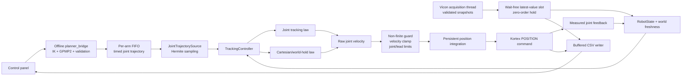

# Raw prompt log

Ground truth for the intent record. A UserPromptSubmit hook
(`.claude/hooks/append-prompt.sh`) appends every prompt Christian types,
verbatim, with a timestamp. Nothing — human or model — edits entries after
the fact. Later prompts may supersede earlier ones; supersession is noted
in `story.md`, never by rewriting this file.

Capture began 2026-08-12. Prompts before that date exist only in session
transcripts. Injected machine turns (task notifications) are excluded by
the hook; one that leaked in at 14:29:06 before that rule existed was
removed — the no-edit rule protects Christian's words, and it was not his
words.

## 2026-08-12 14:43:52 BST

i should be able to run the hardware from the interface

## 2026-08-12 14:48:38 BST

but when I go there now, I am not able to run the session. So, like, I sent a command to move the left arm and nothing moved. Actually, I'm getting this. 
error
—
Clearance is a property of this plan, measured when it was solved. Nothing measures clearance while the arm moves.
Solver output
verbatim · carries plan-initialisation quality and goal-orientation warnings
Model loaded successfully!
Number of joints: 15
Number of DOFs: 14
planner config: /home/christian/Desktop/HumanSL_MAIN/Christian_control/planner_bridge/build/../config/planner.yaml
  digest(fnv1a64)          = 0xb2ba50a25568f6e7
  motion.nominal_speed_mps = 0.05
  motion.min_duration_s    = 4
  motion.waypoints         = 10
  obstacles.epsilon_dist_m = 0.05
  obstacles.collision_sigma= 0.0005
  smoothness.qc_scale      = 1
  goal.position_sigma_xyz  = [0.01, 0.1, 0.01]
  goal.rotation_sigma_rpy  = [0.01, 0.01, 0.01]
  solver.max_iterations    = 1000
  path_following.position_prior_sigma_m     = 0.005
  path_following.rotation_prior_sigma_rad   = 0.01
  path_following.maximum_planning_error_m   = 0.005
  path_following.maximum_orientation_error_rad = 0.1
  path_following.validation_dt_s            = 0.002
  path_following.approach_velocity_fraction = 0.3
  path_following.approach_min_duration_s    = 2
  path_following.approach_waypoints         = 5
  path_following.max_chord_error_m          = 0.001
  seeding.randomised       = false
  seeding.EFFECTIVE_IK_SEED = 20260807   <- replan with seeding.ik_seed set to this to reproduce
path: circle, radius 0.1 m, 23 samples (chord error <= 1 mm), lap 12 s, declared in mount -> mount
Creating arm trajectory...
Generated 18757 dense position waypoints
Generated 18757 dense velocity waypoints
Actual frequency: 998.583 Hz
continuation IK: largest joint step 6.4781 deg, closure drift 2.1549 deg
== path validation ==
planning fidelity (traced phase only)
  e_command       (desired vs 500 Hz reconstruction)  max 4.594 mm, rms 1.179 mm, p95 2.772 mm, rot 0.019 deg   <- GATED
  e_planner       (desired vs GP-dense)               max 4.594 mm
  e_reconstruction(GP-dense vs reconstruction)        max 0.001 mm  (subsample + Hermite transport loss)
  worst point at t = 18.580 s, path parameter 0.983
  circle decomposition: out-of-plane 0.032 mm, radial 0.486 mm
collision (MODELLED geometry only)
  modelled_collision_valid: yes, minimum clearance 9935.000 mm at t = 0.056 s
  SDF contained: arm-workspace grid x [-1.12, 1.12] y [-1.44, 1.28] z [-1.04, 1.24] m; no obstacles; NOT modelled: the wearer, the torso, the other arm
dynamics
  max |qdot| 23.638 deg/s, max |qddot| 43.427 deg/s^2, limits ok: yes
  joint-limit margin 23.029 deg, ok: yes
start state
  first command vs measured 0.000 deg (splice guard), initial |qdot| 0.000 deg/s, finite: yes, ok: yes
verdict
  optimiser_converged      yes
  task_fidelity_valid      yes
  modelled_collision_valid yes
  joint_limits_valid       yes
  dynamic_limits_valid     yes
  start_state_valid        yes
  hardware_execution_allowed yes
  (every MODELLED check passed. The SDF does not contain the wearer, the torso or the other arm, so this is not a statement that the motion is safe near a person.)
arm: left, traced circle emitted, duration 18.7826 s like, the hardware is not needed.

## 2026-08-12 14:48:46 BST

but when I go there now, I am not able to run the session. So, like, I sent a command to move the left arm and nothing moved. Actually, I'm getting this. 
error
—
Clearance is a property of this plan, measured when it was solved. Nothing measures clearance while the arm moves.
Solver output
verbatim · carries plan-initialisation quality and goal-orientation warnings
Model loaded successfully!
Number of joints: 15
Number of DOFs: 14
planner config: /home/christian/Desktop/HumanSL_MAIN/Christian_control/planner_bridge/build/../config/planner.yaml
  digest(fnv1a64)          = 0xb2ba50a25568f6e7
  motion.nominal_speed_mps = 0.05
  motion.min_duration_s    = 4
  motion.waypoints         = 10
  obstacles.epsilon_dist_m = 0.05
  obstacles.collision_sigma= 0.0005
  smoothness.qc_scale      = 1
  goal.position_sigma_xyz  = [0.01, 0.1, 0.01]
  goal.rotation_sigma_rpy  = [0.01, 0.01, 0.01]
  solver.max_iterations    = 1000
  path_following.position_prior_sigma_m     = 0.005
  path_following.rotation_prior_sigma_rad   = 0.01
  path_following.maximum_planning_error_m   = 0.005
  path_following.maximum_orientation_error_rad = 0.1
  path_following.validation_dt_s            = 0.002
  path_following.approach_velocity_fraction = 0.3
  path_following.approach_min_duration_s    = 2
  path_following.approach_waypoints         = 5
  path_following.max_chord_error_m          = 0.001
  seeding.randomised       = false
  seeding.EFFECTIVE_IK_SEED = 20260807   <- replan with seeding.ik_seed set to this to reproduce
path: circle, radius 0.1 m, 23 samples (chord error <= 1 mm), lap 12 s, declared in mount -> mount
Creating arm trajectory...
Generated 18757 dense position waypoints
Generated 18757 dense velocity waypoints
Actual frequency: 998.583 Hz
continuation IK: largest joint step 6.4781 deg, closure drift 2.1549 deg
== path validation ==
planning fidelity (traced phase only)
  e_command       (desired vs 500 Hz reconstruction)  max 4.594 mm, rms 1.179 mm, p95 2.772 mm, rot 0.019 deg   <- GATED
  e_planner       (desired vs GP-dense)               max 4.594 mm
  e_reconstruction(GP-dense vs reconstruction)        max 0.001 mm  (subsample + Hermite transport loss)
  worst point at t = 18.580 s, path parameter 0.983
  circle decomposition: out-of-plane 0.032 mm, radial 0.486 mm
collision (MODELLED geometry only)
  modelled_collision_valid: yes, minimum clearance 9935.000 mm at t = 0.056 s
  SDF contained: arm-workspace grid x [-1.12, 1.12] y [-1.44, 1.28] z [-1.04, 1.24] m; no obstacles; NOT modelled: the wearer, the torso, the other arm
dynamics
  max |qdot| 23.638 deg/s, max |qddot| 43.427 deg/s^2, limits ok: yes
  joint-limit margin 23.029 deg, ok: yes
start state
  first command vs measured 0.000 deg (splice guard), initial |qdot| 0.000 deg/s, finite: yes, ok: yes
verdict
  optimiser_converged      yes
  task_fidelity_valid      yes
  modelled_collision_valid yes
  joint_limits_valid       yes
  dynamic_limits_valid     yes
  start_state_valid        yes
  hardware_execution_allowed yes
  (every MODELLED check passed. The SDF does not contain the wearer, the torso or the other arm, so this is not a statement that the motion is safe near a person.)
arm: left, traced circle emitted, duration 18.7826 s like, the hardware is not moving

## 2026-08-12 14:59:04 BST

yeah, I want you to kill the still section for me, please. Because I just spun it, and it is this.[Image #5] [Image #6]

## 2026-08-12 15:00:56 BST

kill the session

## 2026-08-12 15:03:21 BST

okay, I want you to make a change to the UI because I want to be able to change the velocity limits, all those, everything single thing, that config thing, I should be able to change it from there. So, please. Ask questions, what are the assumptions, what things are dependent.

## 2026-08-12 15:21:03 BST

so how do we plan the integration of the Viking segments and markers and the origin and any other thing that is actually required by those ones into the current controller and planner.

## 2026-08-12 16:15:43 BST

i want to resume my previous tasks

## 2026-08-12 16:20:43 BST

I've reviewed it, and it's pretty good.

## 2026-08-12 16:56:55 BST

are there any better flows to execute this? And would you be able to change the plan for this better flows? I mean, why would I use, like, execution rather than using, like, a self-driven like any of the better ones?

## 2026-08-12 17:12:41 BST

Go with option 1, and check basic_control too

## 2026-08-12 17:18:22 BST

please display and give me the control controller and planner architecture, and I want it often pros and in maths, so like I should be able to debug the controller just by looking at the mathematics if it's correct or not, if that makes sense.

And if it's not like that or if it's complicated by cars, like, then I should be able to see it. I need to see, like, what I control and what limits are being set that are not mine, or like, what I have control of and what I don't.

## 2026-08-12 17:21:39 BST

please display and give me the control controller and planner architecture, and I want it often pros and in maths, so like I should be able to debug the controller just by looking at the mathematics if it's correct or not, if that makes sense.

And if it's not like that or if it's complicated by cars, like, then I should be able to see it. I need to see, like, what I control and what limits are being set that are not mine, or like, what I have control of and what I don't.

## 2026-08-12 17:24:16 BST


 ▐▛███▜▌   Claude Code v2.1.228
▝▜█████▛▘  Opus 5 (1M context) with xhigh effort · Claude Max
  ▘▘ ▝▝    ~/Desktop/HumanSL_MAIN

 ⚠ 2 MCP servers need authentication · run /mcp

❯ please display and give me the control controller and planner architecture, and I want it often pros and in maths, so like I should be able to debug the controller  
  just by looking at the mathematics if it's correct or not, if that makes sense.                                                                                      
                                                                                                                                                                       
  And if it's not like that or if it's complicated by cars, like, then I should be able to see it. I need to see, like, what I control and what limits are being set   
  that are not mine, or like, what I have control of and what I don't.                                                                                                 
  ⎿  Interrupted · What should Claude do instead?

❯ /model                                                                                                                                                               
  ⎿  Set model to Opus 5 (1M context) and saved as your default for new sessions

❯ /effort                                                                                                                                                              
  ⎿  Set effort level to ultracode (this session only): xhigh + dynamic workflow orchestration


   
   

     

                                                                                               
─────────────────────────────────────────────────────────────────────────────────────────────────────────────────────────────────────────────────────────── ultracode ─
❯ Please display and give me the control controller and planner architecture, and I want it often pros and in maths, so like I should be able to debug the controller
  just by looking at the mathematics if it's correct or not, if that makes sense.

  And if it's not like that or if it's complicated by cars, like, then I should be able to see it. I need to see, like, what I control and what limits are being set
  that are not mine, or like, what I have control of and what I don't.
───────────────────────────────────────────────────────────────────────────────────────────────────────────────────────────────────────────────────────────────────────
  ⏵⏵ auto mode on (shift+tab to cycle)

## 2026-08-12 17:24:36 BST

Please design and explain the architecture of the robot’s planner, controller, and control system.

I want the explanation to be mathematically explicit enough that I can debug the controller by inspecting the equations and checking whether they are correct. Do not describe the system only at a high level or hide important behaviour behind vague terms such as “the controller adjusts the motion”.

Please provide:

1. An overall architecture diagram showing:
   - User commands and goals
   - The planner
   - Trajectory generation
   - The controller
   - The robot or vehicle
   - Feedback sensors and state estimation
   - Safety, limit, and constraint-handling components
   - The data passed between each component

2. A clear separation between:
   - What the planner controls
   - What the controller controls
   - What the robot hardware controls
   - What is controlled by safety systems, middleware, drivers, or other components
   - What is not under my control

3. A mathematical model of the system, including:
   - State variables
   - Control inputs
   - Measurements
   - Desired states or trajectories
   - System dynamics
   - The error calculation
   - The control law
   - Any inverse-kinematics, feedback, feedforward, PID, MPC, or other control equations
   - Coordinate frames and transformations
   - Units and sign conventions

4. All limits and constraints, such as:
   - Position, velocity, acceleration, and jerk limits
   - Torque, force, motor, steering, or actuator limits
   - Workspace and collision constraints
   - Sampling times and latency
   - Safety limits
   - Saturation, clipping, filtering, rate limiting, or fallback behaviour

For every limit or constraint, identify:

- Its mathematical form
- Where it is applied
- Which component owns it
- Whether it is configurable
- Whether it can override or modify my command
- What happens when the limit is exceeded
- How I can observe or debug it

5. A signal-flow or execution example showing one command from input to actuation. At each stage, show:

   desired input → planned trajectory → controller error → raw control output → constrained output → actuator command → measured response

6. A debugging-oriented explanation. For each stage, show:

   - The input
   - The output
   - The expected mathematical relationship
   - The invariants or checks that should hold
   - Typical failure modes
   - The plots, logs, or telemetry needed to diagnose problems

7. A worked numerical example using simple values. Show the calculations step by step so I can verify whether the controller produces the expected output.

8. A list of assumptions and ambiguities. Clearly distinguish between:

   - Facts about the proposed design
   - Design choices
   - Hardware-dependent behaviour
   - Safety requirements
   - Information that is currently unknown

9. The advantages, disadvantages, and trade-offs of the proposed planner/controller architecture. Explain how the architecture affects:

   - Stability
   - Tracking accuracy
   - Responsiveness
   - Safety
   - Computational cost
   - Ease of testing
   - Ease of debugging
   - Extensibility

The most important requirement is traceability: I should be able to follow a command through the equations and determine what changed it, why it changed, and which component was responsible. If any part of the system cannot be explained mathematically, explicitly identify that part and explain how it can still be inspected or tested.

## 2026-08-13 14:12:32 BST

how do i run ui

## 2026-08-13 14:38:07 BST

status t=92.0s err=nanmm rot=nanmrad task=nan null=nan deg/s leak=nanm/s sig=nan sat=0/500 j2=-64.1/126.9 j4=87.5/145.0 j6=-24.3/118.0 deg
status t=93.0s err=nanmm rot=nanmrad task=nan null=nan deg/s leak=nanm/s sig=nan sat=0/500 j2=-64.1/126.9 j4=87.5/145.0 j6=-24.3/118.0 deg
status t=94.0s err=nanmm rot=nanmrad task=nan null=nan deg/s leak=nanm/s sig=nan sat=0/500 j2=-64.1/126.9 j4=87.5/145.0 j6=-24.3/118.0 deg
status t=95.0s err=nanmm rot=nanmrad task=nan null=nan deg/s leak=nanm/s sig=nan sat=0/500 j2=-64.1/126.9 j4=87.5/145.0 j6=-24.3/118.0 deg
status t=96.0s err=nanmm rot=nanmrad task=nan null=nan deg/s leak=nanm/s sig=nan sat=0/500 j2=-64.1/126.9 j4=87.5/145.0 j6=-24.3/118.0 deg
status t=97.0s err=nanmm rot=nanmrad task=nan null=nan deg/s leak=nanm/s sig=nan sat=0/500 j2=-64.1/126.9 j4=87.5/145.0 j6=-24.3/118.0 deg
status t=98.0s err=nanmm rot=nanmrad task=nan null=nan deg/s leak=nanm/s sig=nan sat=0/500 j2=-64.1/126.9 j4=87.5/145.0 j6=-24.3/118.0 deg
status t=99.0s err=nanmm rot=nanmrad task=nan null=nan deg/s leak=nanm/s sig=nan sat=0/500 j2=-64.1/126.9 j4=87.5/145.0 j6=-24.3/118.0 deg
status t=100.0s err=nanmm rot=nanmrad task=nan null=nan deg/s leak=nanm/s sig=nan sat=0/500 j2=-64.1/126.9 j4=87.5/145.0 j6=-24.3/118.0 deg
status t=101.0s err=nanmm rot=nanmrad task=nan null=nan deg/s leak=nanm/s sig=nan sat=0/500 j2=-64.1/126.9 j4=87.5/145.0 j6=-24.3/118.0 deg
status t=102.0s err=nanmm rot=nanmrad task=nan null=nan deg/s leak=nanm/s sig=nan sat=0/500 j2=-64.1/126.9 j4=87.5/145.0 j6=-24.3/118.0 deg
status t=103.0s err=nanmm rot=nanmrad task=nan null=nan deg/s leak=nanm/s sig=nan sat=0/500 j2=-64.1/126.9 j4=87.5/145.0 j6=-24.3/118.0 deg
status t=104.0s err=nanmm rot=nanmrad task=nan null=nan deg/s leak=nanm/s sig=nan sat=0/500 j2=-64.1/126.9 j4=87.5/145.0 j6=-24.3/118.0 deg
status t=105.0s err=nanmm rot=nanmrad task=nan null=nan deg/s leak=nanm/s sig=nan sat=0/500 j2=-64.1/126.9 j4=87.5/145.0 j6=-24.3/118.0 deg
status t=106.0s err=nanmm rot=nanmrad task=nan null=nan deg/s leak=nanm/s sig=nan sat=0/500 j2=-64.1/126.9 j4=87.5/145.0 j6=-24.3/118.0 deg
status t=107.0s err=nanmm rot=nanmrad task=nan null=nan deg/s leak=nanm/s sig=nan sat=0/500 j2=-64.1/126.9 j4=87.5/145.0 j6=-24.3/118.0 deg
status t=108.0s err=nanmm rot=nanmrad task=nan null=nan deg/s leak=nanm/s sig=nan sat=0/500 j2=-64.1/126.9 j4=87.5/145.0 j6=-24.3/118.0 deg
status t=109.0s err=nanmm rot=nanmrad task=nan null=nan deg/s leak=nanm/s sig=nan sat=0/500 j2=-64.1/126.9 j4=87.5/145.0 j6=-24.3/118.0 deg
status t=110.0s err=nanmm rot=nanmrad task=nan null=nan deg/s leak=nanm/s sig=nan sat=0/500 j2=-64.1/126.9 j4=87.5/145.0 j6=-24.3/118.0 deg
status t=111.0s err=nanmm rot=nanmrad task=nan null=nan deg/s leak=nanm/s sig=nan sat=0/500 j2=-64.1/126.9 j4=87.5/145.0 j6=-24.3/118.0 deg
status t=112.0s err=nanmm rot=nanmrad task=nan null=nan deg/s leak=nanm/s sig=nan sat=0/500 j2=-64.1/126.9 j4=87.5/145.0 j6=-24.3/118.0 deg
status t=113.0s err=nanmm rot=nanmrad task=nan null=nan deg/s leak=nanm/s sig=nan sat=0/500 j2=-64.1/126.9 j4=87.5/145.0 j6=-24.3/118.0 deg
status t=114.0s err=nanmm rot=nanmrad task=nan null=nan deg/s leak=nanm/s sig=nan sat=0/500 j2=-64.1/126.9 j4=87.5/145.0 j6=-24.3/118.0 deg
status t=115.0s err=nanmm rot=nanmrad task=nan null=nan deg/s leak=nanm/s sig=nan sat=0/500 j2=-64.1/126.9 j4=87.5/145.0 j6=-24.3/118.0 deg
status t=116.0s err=nanmm rot=nanmrad task=nan null=nan deg/s leak=nanm/s sig=nan sat=0/500 j2=-64.1/126.9 j4=87.5/145.0 j6=-24.3/118.0 deg
status t=117.0s err=nanmm rot=nanmrad task=nan null=nan deg/s leak=nanm/s sig=nan sat=0/500 j2=-64.1/126.9 j4=87.5/145.0 j6=-24.3/118.0 deg
status t=118.0s err=nanmm rot=nanmrad task=nan null=nan deg/s leak=nanm/s sig=nan sat=0/500 j2=-64.1/126.9 j4=87.5/145.0 j6=-24.3/118.0 deg
status t=119.0s err=nanmm rot=nanmrad task=nan null=nan deg/s leak=nanm/s sig=nan sat=0/500 j2=-64.1/126.9 j4=87.5/145.0 j6=-24.3/118.0 deg
status t=120.0s err=nanmm rot=nanmrad task=nan null=nan deg/s leak=nanm/s sig=nan sat=0/500 j2=-64.1/126.9 j4=87.5/145.0 j6=-24.3/118.0 deg
status t=121.0s err=nanmm rot=nanmrad task=nan null=nan deg/s leak=nanm/s sig=nan sat=0/500 j2=-64.1/126.9 j4=87.5/145.0 j6=-24.3/118.0 deg
status t=122.0s err=nanmm rot=nanmrad task=nan null=nan deg/s leak=nanm/s sig=nan sat=0/500 j2=-64.1/126.9 j4=87.5/145.0 j6=-24.3/118.0 deg
status t=123.0s err=nanmm rot=nanmrad task=nan null=nan deg/s leak=nanm/s sig=nan sat=0/500 j2=-64.1/126.9 j4=87.5/145.0 j6=-24.3/118.0 deg
status t=124.0s err=nanmm rot=nanmrad task=nan null=nan deg/s leak=nanm/s sig=nan sat=0/500 j2=-64.1/126.9 j4=87.5/145.0 j6=-24.3/118.0 deg
status t=125.0s err=nanmm rot=nanmrad task=nan null=nan deg/s leak=nanm/s sig=nan sat=0/500 j2=-64.1/126.9 j4=87.5/145.0 j6=-24.3/118.0 deg
status t=126.0s err=nanmm rot=nanmrad task=nan null=nan deg/s leak=nanm/s sig=nan sat=0/500 j2=-64.1/126.9 j4=87.5/145.0 j6=-24.3/118.0 deg
status t=127.0s err=nanmm rot=nanmrad task=nan null=nan deg/s leak=nanm/s sig=nan sat=0/500 j2=-64.1/126.9 j4=87.5/145.0 j6=-24.3/118.0 deg
status t=128.0s err=nanmm rot=nanmrad task=nan null=nan deg/s leak=nanm/s sig=nan sat=0/500 j2=-64.1/126.9 j4=87.5/145.0 j6=-24.3/118.0 deg
status t=129.0s err=nanmm rot=nanmrad task=nan null=nan deg/s leak=nanm/s sig=nan sat=0/500 j2=-64.1/126.9 j4=87.5/145.0 j6=-24.3/118.0 deg
status t=130.0s err=nanmm rot=nanmrad task=nan null=nan deg/s leak=nanm/s sig=nan sat=0/500 j2=-64.1/126.9 j4=87.5/145.0 j6=-24.3/118.0 deg
status t=131.0s err=nanmm rot=nanmrad task=nan null=nan deg/s leak=nanm/s sig=nan sat=0/500 j2=-64.1/126.9 j4=87.5/145.0 j6=-24.3/118.0 deg
status t=132.0s err=nanmm rot=nanmrad task=nan null=nan deg/s leak=nanm/s sig=nan sat=0/500 j2=-64.1/126.9 j4=87.5/145.0 j6=-24.3/118.0 deg
status t=133.0s err=nanmm rot=nanmrad task=nan null=nan deg/s leak=nanm/s sig=nan sat=0/500 j2=-64.1/126.9 j4=87.5/145.0 j6=-24.3/118.0 deg
status t=134.0s err=nanmm rot=nanmrad task=nan null=nan deg/s leak=nanm/s sig=nan sat=0/500 j2=-64.1/126.9 j4=87.5/145.0 j6=-24.3/118.0 deg
status t=135.0s err=nanmm rot=nanmrad task=nan null=nan deg/s leak=nanm/s sig=nan sat=0/500 j2=-64.1/126.9 j4=87.5/145.0 j6=-24.3/118.0 deg
status t=136.0s err=nanmm rot=nanmrad task=nan null=nan deg/s leak=nanm/s sig=nan sat=0/500 j2=-64.1/126.9 j4=87.5/145.0 j6=-24.3/118.0 deg
status t=137.0s err=nanmm rot=nanmrad task=nan null=nan deg/s leak=nanm/s sig=nan sat=0/500 j2=-64.1/126.9 j4=87.5/145.0 j6=-24.3/118.0 deg
status t=138.0s err=nanmm rot=nanmrad task=nan null=nan deg/s leak=nanm/s sig=nan sat=0/500 j2=-64.1/126.9 j4=87.5/145.0 j6=-24.3/118.0 deg
status t=139.0s err=nanmm rot=nanmrad task=nan null=nan deg/s leak=nanm/s sig=nan sat=0/500 j2=-64.1/126.9 j4=87.5/145.0 j6=-24.3/118.0 deg
status t=140.0s err=nanmm rot=nanmrad task=nan null=nan deg/s leak=nanm/s sig=nan sat=0/500 j2=-64.1/126.9 j4=87.5/145.0 j6=-24.3/118.0 deg
status t=141.0s err=nanmm rot=nanmrad task=nan null=nan deg/s leak=nanm/s sig=nan sat=0/500 j2=-64.1/126.9 j4=87.5/145.0 j6=-24.3/118.0 deg
status t=142.0s err=nanmm rot=nanmrad task=nan null=nan deg/s leak=nanm/s sig=nan sat=0/500 j2=-64.1/126.9 j4=87.5/145.0 j6=-24.3/118.0 deg
status t=143.0s err=nanmm rot=nanmrad task=nan null=nan deg/s leak=nanm/s sig=nan sat=0/500 j2=-64.1/126.9 j4=87.5/145.0 j6=-24.3/118.0 deg
status t=144.0s err=nanmm rot=nanmrad task=nan null=nan deg/s leak=nanm/s sig=nan sat=0/500 j2=-64.1/126.9 j4=87.5/145.0 j6=-24.3/118.0 deg
status t=145.0s err=nanmm rot=nanmrad task=nan null=nan deg/s leak=nanm/s sig=nan sat=0/500 j2=-64.1/126.9 j4=87.5/145.0 j6=-24.3/118.0 deg
status t=146.0s err=nanmm rot=nanmrad task=nan null=nan deg/s leak=nanm/s sig=nan sat=0/500 j2=-64.1/126.9 j4=87.5/145.0 j6=-24.3/118.0 deg
loop stopped by user (Ctrl+C)
  desired p:  nan nan nan m,  current p: nan nan nan m
cycle overruns: 0 of 73272 cycles (dt > 1.5 x nominal)
[left] 73297 samples written
[left] log: /home/christian/Desktop/HumanSL_MAIN/runs/2026-08-13/loop_log_left_20260813_143253.csv
== Supervised session checklist (project CLAUDE.md) ==
  - arm(s): left
  - Christian present, workspace clear, e-stop in reach
  - Kinova web dashboard CLOSED (it blocks SetServoingMode)
  - This run is explicitly authorized
session artifacts: /home/christian/Desktop/HumanSL_MAIN/runs/2026-08-13/session_143532
waiting for the left controller thread's run log...
Model loaded successfully!
Number of joints: 15
Number of DOFs: 14
  left state source: /home/christian/Desktop/HumanSL_MAIN/runs/2026-08-13/loop_log_left_20260813_143533.csv
waiting for telemetry data in the left run log...
sending left's plan...
Model loaded successfully!
Number of joints: 15
Number of DOFs: 14
error: planner config: motion.nominal_speed_mps must be within [0.0001, 0.25] (got 0.5)
  left: bridge exited 1 — nothing was sent for this arm.
no plan was sent for any arm; stopping controller.
stopping controller...
Connected to arm at 192.168.1.9 (TCP + real-time UDP).
arm state: ARMSTATE_SERVOING_READY, base fault bank 0
joint 1 hard speed limit 80.0021 deg/s; configured qdot clip 50 deg/s
joint 2 hard speed limit 80.0021 deg/s; configured qdot clip 50 deg/s
joint 3 hard speed limit 80.0021 deg/s; configured qdot clip 50 deg/s
joint 4 hard speed limit 80.0021 deg/s; configured qdot clip 50 deg/s
joint 5 hard speed limit 70.004 deg/s; configured qdot clip 50 deg/s
joint 6 hard speed limit 70.004 deg/s; configured qdot clip 50 deg/s
joint 7 hard speed limit 70.004 deg/s; configured qdot clip 50 deg/s
kinematic hard-limit gate: PASS (seven live joint speed limits verify configured qdot clips; bundled schema has no live joint-position limits)
joint-limit gate: PASS (configured thresholds verified)
[left] == left arm (192.168.1.9) ==
joint                    1         2         3         4         5         6         7
position deg        294.20    295.88     76.77     87.46    184.84    335.72     77.55
velocity deg/s        0.00      0.00     -0.00      0.00      0.00      0.00      0.00
left end-effector (leftEndEffector_Link in leftbase_link): 0.3100 -0.4642 0.5283 (m, left-arm base frame)
  orientation rpy: 1.5713 -1.2086 1.5703 (rad, R = Rz*Ry*Rx)
mount-frame FK at the measured left configuration (other arm at nominal, model-only — not measured):
  right  tool frame ConfiguredTool_Link
    mount      p   -0.000000   -1.288035    0.440120   rpy    1.208507   -0.000000    0.000000
    base_link  p   -0.000000   -0.024860    1.307385   rpy    0.000007   -0.000000    0.000000
  left   tool frame leftEndEffector_Link
    mount      p    0.309993    0.386142    0.621310   rpy    1.570856   -0.000093    1.570616
    leftbase_link p    0.309993   -0.464219    0.528256   rpy    1.571332   -1.208593    1.570287
[left] reactive-pose position integration at 500 Hz (full settings in the CSV preamble)
[left] current startup pose: 0.31 -0.4642 0.5283 m in leftbase_link = 0.31 0.3861 0.6213 m in mount (goal-file frame); the arm will hold here
[left] HOLD AT START: the arm holds the measured startup joint position until the first validated trajectory; Ctrl+C to stop
[left]   trajectories: write TRAJ_BEGIN/TRAJ_END blocks to /tmp/humansl_bridge_targets_left (planner_bridge --arm left does this)
takeover hold: PASS (0.05 s unchanged POSITION command)
loop stopped by user (Ctrl+C)
  desired p:  nan nan nan m,  current p: nan nan nan m
cycle overruns: 0 of 40 cycles (dt > 1.5 x nominal)
[left] 65 samples written
[left] log: /home/christian/Desktop/HumanSL_MAIN/runs/2026-08-13/loop_log_left_20260813_143533.csvwhy are there such bounds my professor said i should try to move the arm as fast possible according to the physical limits of the      
  kinova arm so only the ones that have been set my kinova has hard limits since i am controlling in low level control

## 2026-08-13 14:41:05 BST

status t=92.0s err=nanmm rot=nanmrad task=nan null=nan deg/s leak=nanm/s sig=nan sat=0/500 j2=-64.1/126.9 j4=87.5/145.0 j6=-24.3/118.0 deg
status t=93.0s err=nanmm rot=nanmrad task=nan null=nan deg/s leak=nanm/s sig=nan sat=0/500 j2=-64.1/126.9 j4=87.5/145.0 j6=-24.3/118.0 deg
status t=94.0s err=nanmm rot=nanmrad task=nan null=nan deg/s leak=nanm/s sig=nan sat=0/500 j2=-64.1/126.9 j4=87.5/145.0 j6=-24.3/118.0 deg
status t=95.0s err=nanmm rot=nanmrad task=nan null=nan deg/s leak=nanm/s sig=nan sat=0/500 j2=-64.1/126.9 j4=87.5/145.0 j6=-24.3/118.0 deg
status t=96.0s err=nanmm rot=nanmrad task=nan null=nan deg/s leak=nanm/s sig=nan sat=0/500 j2=-64.1/126.9 j4=87.5/145.0 j6=-24.3/118.0 deg
status t=97.0s err=nanmm rot=nanmrad task=nan null=nan deg/s leak=nanm/s sig=nan sat=0/500 j2=-64.1/126.9 j4=87.5/145.0 j6=-24.3/118.0 deg
status t=98.0s err=nanmm rot=nanmrad task=nan null=nan deg/s leak=nanm/s sig=nan sat=0/500 j2=-64.1/126.9 j4=87.5/145.0 j6=-24.3/118.0 deg
status t=99.0s err=nanmm rot=nanmrad task=nan null=nan deg/s leak=nanm/s sig=nan sat=0/500 j2=-64.1/126.9 j4=87.5/145.0 j6=-24.3/118.0 deg
status t=100.0s err=nanmm rot=nanmrad task=nan null=nan deg/s leak=nanm/s sig=nan sat=0/500 j2=-64.1/126.9 j4=87.5/145.0 j6=-24.3/118.0 deg
status t=101.0s err=nanmm rot=nanmrad task=nan null=nan deg/s leak=nanm/s sig=nan sat=0/500 j2=-64.1/126.9 j4=87.5/145.0 j6=-24.3/118.0 deg
status t=102.0s err=nanmm rot=nanmrad task=nan null=nan deg/s leak=nanm/s sig=nan sat=0/500 j2=-64.1/126.9 j4=87.5/145.0 j6=-24.3/118.0 deg
status t=103.0s err=nanmm rot=nanmrad task=nan null=nan deg/s leak=nanm/s sig=nan sat=0/500 j2=-64.1/126.9 j4=87.5/145.0 j6=-24.3/118.0 deg
status t=104.0s err=nanmm rot=nanmrad task=nan null=nan deg/s leak=nanm/s sig=nan sat=0/500 j2=-64.1/126.9 j4=87.5/145.0 j6=-24.3/118.0 deg
status t=105.0s err=nanmm rot=nanmrad task=nan null=nan deg/s leak=nanm/s sig=nan sat=0/500 j2=-64.1/126.9 j4=87.5/145.0 j6=-24.3/118.0 deg
status t=106.0s err=nanmm rot=nanmrad task=nan null=nan deg/s leak=nanm/s sig=nan sat=0/500 j2=-64.1/126.9 j4=87.5/145.0 j6=-24.3/118.0 deg
status t=107.0s err=nanmm rot=nanmrad task=nan null=nan deg/s leak=nanm/s sig=nan sat=0/500 j2=-64.1/126.9 j4=87.5/145.0 j6=-24.3/118.0 deg
status t=108.0s err=nanmm rot=nanmrad task=nan null=nan deg/s leak=nanm/s sig=nan sat=0/500 j2=-64.1/126.9 j4=87.5/145.0 j6=-24.3/118.0 deg
status t=109.0s err=nanmm rot=nanmrad task=nan null=nan deg/s leak=nanm/s sig=nan sat=0/500 j2=-64.1/126.9 j4=87.5/145.0 j6=-24.3/118.0 deg
status t=110.0s err=nanmm rot=nanmrad task=nan null=nan deg/s leak=nanm/s sig=nan sat=0/500 j2=-64.1/126.9 j4=87.5/145.0 j6=-24.3/118.0 deg
status t=111.0s err=nanmm rot=nanmrad task=nan null=nan deg/s leak=nanm/s sig=nan sat=0/500 j2=-64.1/126.9 j4=87.5/145.0 j6=-24.3/118.0 deg
status t=112.0s err=nanmm rot=nanmrad task=nan null=nan deg/s leak=nanm/s sig=nan sat=0/500 j2=-64.1/126.9 j4=87.5/145.0 j6=-24.3/118.0 deg
status t=113.0s err=nanmm rot=nanmrad task=nan null=nan deg/s leak=nanm/s sig=nan sat=0/500 j2=-64.1/126.9 j4=87.5/145.0 j6=-24.3/118.0 deg
status t=114.0s err=nanmm rot=nanmrad task=nan null=nan deg/s leak=nanm/s sig=nan sat=0/500 j2=-64.1/126.9 j4=87.5/145.0 j6=-24.3/118.0 deg
status t=115.0s err=nanmm rot=nanmrad task=nan null=nan deg/s leak=nanm/s sig=nan sat=0/500 j2=-64.1/126.9 j4=87.5/145.0 j6=-24.3/118.0 deg
status t=116.0s err=nanmm rot=nanmrad task=nan null=nan deg/s leak=nanm/s sig=nan sat=0/500 j2=-64.1/126.9 j4=87.5/145.0 j6=-24.3/118.0 deg
status t=117.0s err=nanmm rot=nanmrad task=nan null=nan deg/s leak=nanm/s sig=nan sat=0/500 j2=-64.1/126.9 j4=87.5/145.0 j6=-24.3/118.0 deg
status t=118.0s err=nanmm rot=nanmrad task=nan null=nan deg/s leak=nanm/s sig=nan sat=0/500 j2=-64.1/126.9 j4=87.5/145.0 j6=-24.3/118.0 deg
status t=119.0s err=nanmm rot=nanmrad task=nan null=nan deg/s leak=nanm/s sig=nan sat=0/500 j2=-64.1/126.9 j4=87.5/145.0 j6=-24.3/118.0 deg
status t=120.0s err=nanmm rot=nanmrad task=nan null=nan deg/s leak=nanm/s sig=nan sat=0/500 j2=-64.1/126.9 j4=87.5/145.0 j6=-24.3/118.0 deg
status t=121.0s err=nanmm rot=nanmrad task=nan null=nan deg/s leak=nanm/s sig=nan sat=0/500 j2=-64.1/126.9 j4=87.5/145.0 j6=-24.3/118.0 deg
status t=122.0s err=nanmm rot=nanmrad task=nan null=nan deg/s leak=nanm/s sig=nan sat=0/500 j2=-64.1/126.9 j4=87.5/145.0 j6=-24.3/118.0 deg
status t=123.0s err=nanmm rot=nanmrad task=nan null=nan deg/s leak=nanm/s sig=nan sat=0/500 j2=-64.1/126.9 j4=87.5/145.0 j6=-24.3/118.0 deg
status t=124.0s err=nanmm rot=nanmrad task=nan null=nan deg/s leak=nanm/s sig=nan sat=0/500 j2=-64.1/126.9 j4=87.5/145.0 j6=-24.3/118.0 deg
status t=125.0s err=nanmm rot=nanmrad task=nan null=nan deg/s leak=nanm/s sig=nan sat=0/500 j2=-64.1/126.9 j4=87.5/145.0 j6=-24.3/118.0 deg
status t=126.0s err=nanmm rot=nanmrad task=nan null=nan deg/s leak=nanm/s sig=nan sat=0/500 j2=-64.1/126.9 j4=87.5/145.0 j6=-24.3/118.0 deg
status t=127.0s err=nanmm rot=nanmrad task=nan null=nan deg/s leak=nanm/s sig=nan sat=0/500 j2=-64.1/126.9 j4=87.5/145.0 j6=-24.3/118.0 deg
status t=128.0s err=nanmm rot=nanmrad task=nan null=nan deg/s leak=nanm/s sig=nan sat=0/500 j2=-64.1/126.9 j4=87.5/145.0 j6=-24.3/118.0 deg
status t=129.0s err=nanmm rot=nanmrad task=nan null=nan deg/s leak=nanm/s sig=nan sat=0/500 j2=-64.1/126.9 j4=87.5/145.0 j6=-24.3/118.0 deg
status t=130.0s err=nanmm rot=nanmrad task=nan null=nan deg/s leak=nanm/s sig=nan sat=0/500 j2=-64.1/126.9 j4=87.5/145.0 j6=-24.3/118.0 deg
status t=131.0s err=nanmm rot=nanmrad task=nan null=nan deg/s leak=nanm/s sig=nan sat=0/500 j2=-64.1/126.9 j4=87.5/145.0 j6=-24.3/118.0 deg
status t=132.0s err=nanmm rot=nanmrad task=nan null=nan deg/s leak=nanm/s sig=nan sat=0/500 j2=-64.1/126.9 j4=87.5/145.0 j6=-24.3/118.0 deg
status t=133.0s err=nanmm rot=nanmrad task=nan null=nan deg/s leak=nanm/s sig=nan sat=0/500 j2=-64.1/126.9 j4=87.5/145.0 j6=-24.3/118.0 deg
status t=134.0s err=nanmm rot=nanmrad task=nan null=nan deg/s leak=nanm/s sig=nan sat=0/500 j2=-64.1/126.9 j4=87.5/145.0 j6=-24.3/118.0 deg
status t=135.0s err=nanmm rot=nanmrad task=nan null=nan deg/s leak=nanm/s sig=nan sat=0/500 j2=-64.1/126.9 j4=87.5/145.0 j6=-24.3/118.0 deg
status t=136.0s err=nanmm rot=nanmrad task=nan null=nan deg/s leak=nanm/s sig=nan sat=0/500 j2=-64.1/126.9 j4=87.5/145.0 j6=-24.3/118.0 deg
status t=137.0s err=nanmm rot=nanmrad task=nan null=nan deg/s leak=nanm/s sig=nan sat=0/500 j2=-64.1/126.9 j4=87.5/145.0 j6=-24.3/118.0 deg
status t=138.0s err=nanmm rot=nanmrad task=nan null=nan deg/s leak=nanm/s sig=nan sat=0/500 j2=-64.1/126.9 j4=87.5/145.0 j6=-24.3/118.0 deg
status t=139.0s err=nanmm rot=nanmrad task=nan null=nan deg/s leak=nanm/s sig=nan sat=0/500 j2=-64.1/126.9 j4=87.5/145.0 j6=-24.3/118.0 deg
status t=140.0s err=nanmm rot=nanmrad task=nan null=nan deg/s leak=nanm/s sig=nan sat=0/500 j2=-64.1/126.9 j4=87.5/145.0 j6=-24.3/118.0 deg
status t=141.0s err=nanmm rot=nanmrad task=nan null=nan deg/s leak=nanm/s sig=nan sat=0/500 j2=-64.1/126.9 j4=87.5/145.0 j6=-24.3/118.0 deg
status t=142.0s err=nanmm rot=nanmrad task=nan null=nan deg/s leak=nanm/s sig=nan sat=0/500 j2=-64.1/126.9 j4=87.5/145.0 j6=-24.3/118.0 deg
status t=143.0s err=nanmm rot=nanmrad task=nan null=nan deg/s leak=nanm/s sig=nan sat=0/500 j2=-64.1/126.9 j4=87.5/145.0 j6=-24.3/118.0 deg
status t=144.0s err=nanmm rot=nanmrad task=nan null=nan deg/s leak=nanm/s sig=nan sat=0/500 j2=-64.1/126.9 j4=87.5/145.0 j6=-24.3/118.0 deg
status t=145.0s err=nanmm rot=nanmrad task=nan null=nan deg/s leak=nanm/s sig=nan sat=0/500 j2=-64.1/126.9 j4=87.5/145.0 j6=-24.3/118.0 deg
status t=146.0s err=nanmm rot=nanmrad task=nan null=nan deg/s leak=nanm/s sig=nan sat=0/500 j2=-64.1/126.9 j4=87.5/145.0 j6=-24.3/118.0 deg
loop stopped by user (Ctrl+C)
  desired p:  nan nan nan m,  current p: nan nan nan m
cycle overruns: 0 of 73272 cycles (dt > 1.5 x nominal)
[left] 73297 samples written
[left] log: /home/christian/Desktop/HumanSL_MAIN/runs/2026-08-13/loop_log_left_20260813_143253.csv
== Supervised session checklist (project CLAUDE.md) ==
  - arm(s): left
  - Christian present, workspace clear, e-stop in reach
  - Kinova web dashboard CLOSED (it blocks SetServoingMode)
  - This run is explicitly authorized
session artifacts: /home/christian/Desktop/HumanSL_MAIN/runs/2026-08-13/session_143532
waiting for the left controller thread's run log...
Model loaded successfully!
Number of joints: 15
Number of DOFs: 14
  left state source: /home/christian/Desktop/HumanSL_MAIN/runs/2026-08-13/loop_log_left_20260813_143533.csv
waiting for telemetry data in the left run log...
sending left's plan...
Model loaded successfully!
Number of joints: 15
Number of DOFs: 14
error: planner config: motion.nominal_speed_mps must be within [0.0001, 0.25] (got 0.5)
  left: bridge exited 1 — nothing was sent for this arm.
no plan was sent for any arm; stopping controller.
stopping controller...
Connected to arm at 192.168.1.9 (TCP + real-time UDP).
arm state: ARMSTATE_SERVOING_READY, base fault bank 0
joint 1 hard speed limit 80.0021 deg/s; configured qdot clip 50 deg/s
joint 2 hard speed limit 80.0021 deg/s; configured qdot clip 50 deg/s
joint 3 hard speed limit 80.0021 deg/s; configured qdot clip 50 deg/s
joint 4 hard speed limit 80.0021 deg/s; configured qdot clip 50 deg/s
joint 5 hard speed limit 70.004 deg/s; configured qdot clip 50 deg/s
joint 6 hard speed limit 70.004 deg/s; configured qdot clip 50 deg/s
joint 7 hard speed limit 70.004 deg/s; configured qdot clip 50 deg/s
kinematic hard-limit gate: PASS (seven live joint speed limits verify configured qdot clips; bundled schema has no live joint-position limits)
joint-limit gate: PASS (configured thresholds verified)
[left] == left arm (192.168.1.9) ==
joint                    1         2         3         4         5         6         7
position deg        294.20    295.88     76.77     87.46    184.84    335.72     77.55
velocity deg/s        0.00      0.00     -0.00      0.00      0.00      0.00      0.00
left end-effector (leftEndEffector_Link in leftbase_link): 0.3100 -0.4642 0.5283 (m, left-arm base frame)
  orientation rpy: 1.5713 -1.2086 1.5703 (rad, R = Rz*Ry*Rx)
mount-frame FK at the measured left configuration (other arm at nominal, model-only — not measured):
  right  tool frame ConfiguredTool_Link
    mount      p   -0.000000   -1.288035    0.440120   rpy    1.208507   -0.000000    0.000000
    base_link  p   -0.000000   -0.024860    1.307385   rpy    0.000007   -0.000000    0.000000
  left   tool frame leftEndEffector_Link
    mount      p    0.309993    0.386142    0.621310   rpy    1.570856   -0.000093    1.570616
    leftbase_link p    0.309993   -0.464219    0.528256   rpy    1.571332   -1.208593    1.570287
[left] reactive-pose position integration at 500 Hz (full settings in the CSV preamble)
[left] current startup pose: 0.31 -0.4642 0.5283 m in leftbase_link = 0.31 0.3861 0.6213 m in mount (goal-file frame); the arm will hold here
[left] HOLD AT START: the arm holds the measured startup joint position until the first validated trajectory; Ctrl+C to stop
[left]   trajectories: write TRAJ_BEGIN/TRAJ_END blocks to /tmp/humansl_bridge_targets_left (planner_bridge --arm left does this)
takeover hold: PASS (0.05 s unchanged POSITION command)
loop stopped by user (Ctrl+C)
  desired p:  nan nan nan m,  current p: nan nan nan m
cycle overruns: 0 of 40 cycles (dt > 1.5 x nominal)
[left] 65 samples written
[left] log: /home/christian/Desktop/HumanSL_MAIN/runs/2026-08-13/loop_log_left_20260813_143533.csv why are there such bounds my professor said i should try to move the arm as fast possible according to the physical limits of the      
  kinova arm so only the ones that have been set my kinova has hard limits since i am controlling in low level control

## 2026-08-13 14:51:39 BST

am i conneceted to vicon

## 2026-08-13 14:52:58 BST

can you change it to .206

## 2026-08-13 14:53:20 BST

so why did you try 210

## 2026-08-13 14:54:26 BST

where is the injected context frokm

## 2026-08-13 14:55:08 BST

how do people manage .remember

## 2026-08-13 14:56:57 BST

iasked a simple question did the story thing stop working

## 2026-08-13 14:58:02 BST

i want you to manage the memory  clean it up a little to improve your own performance

## 2026-08-13 14:59:04 BST

no, but what happened to, yesterday we worked on, on like how to improve, like, our workflow, and like it was crunching oris not  working. Look, you were supposed to have a hook.

## 2026-08-13 15:08:39 BST

yes go ahead

## 2026-08-13 15:10:25 BST

is it connected to UI

## 2026-08-13 15:11:05 BST

what would it take to wire vicon into the panel

## 2026-08-13 15:12:06 BST

I want you to understand first : status t=92.0s err=nanmm rot=nanmrad task=nan null=nan deg/s leak=nanm/s sig=nan sat=0/500 j2=-64.1/126.9 j4=87.5/145.0 j6=-24.3/118.0 deg
status t=93.0s err=nanmm rot=nanmrad task=nan null=nan deg/s leak=nanm/s sig=nan sat=0/500 j2=-64.1/126.9 j4=87.5/145.0 j6=-24.3/118.0 deg
status t=94.0s err=nanmm rot=nanmrad task=nan null=nan deg/s leak=nanm/s sig=nan sat=0/500 j2=-64.1/126.9 j4=87.5/145.0 j6=-24.3/118.0 deg
status t=95.0s err=nanmm rot=nanmrad task=nan null=nan deg/s leak=nanm/s sig=nan sat=0/500 j2=-64.1/126.9 j4=87.5/145.0 j6=-24.3/118.0 deg
status t=96.0s err=nanmm rot=nanmrad task=nan null=nan deg/s leak=nanm/s sig=nan sat=0/500 j2=-64.1/126.9 j4=87.5/145.0 j6=-24.3/118.0 deg
status t=97.0s err=nanmm rot=nanmrad task=nan null=nan deg/s leak=nanm/s sig=nan sat=0/500 j2=-64.1/126.9 j4=87.5/145.0 j6=-24.3/118.0 deg
status t=98.0s err=nanmm rot=nanmrad task=nan null=nan deg/s leak=nanm/s sig=nan sat=0/500 j2=-64.1/126.9 j4=87.5/145.0 j6=-24.3/118.0 deg
status t=99.0s err=nanmm rot=nanmrad task=nan null=nan deg/s leak=nanm/s sig=nan sat=0/500 j2=-64.1/126.9 j4=87.5/145.0 j6=-24.3/118.0 deg
status t=100.0s err=nanmm rot=nanmrad task=nan null=nan deg/s leak=nanm/s sig=nan sat=0/500 j2=-64.1/126.9 j4=87.5/145.0 j6=-24.3/118.0 deg
status t=101.0s err=nanmm rot=nanmrad task=nan null=nan deg/s leak=nanm/s sig=nan sat=0/500 j2=-64.1/126.9 j4=87.5/145.0 j6=-24.3/118.0 deg
status t=102.0s err=nanmm rot=nanmrad task=nan null=nan deg/s leak=nanm/s sig=nan sat=0/500 j2=-64.1/126.9 j4=87.5/145.0 j6=-24.3/118.0 deg
status t=103.0s err=nanmm rot=nanmrad task=nan null=nan deg/s leak=nanm/s sig=nan sat=0/500 j2=-64.1/126.9 j4=87.5/145.0 j6=-24.3/118.0 deg
status t=104.0s err=nanmm rot=nanmrad task=nan null=nan deg/s leak=nanm/s sig=nan sat=0/500 j2=-64.1/126.9 j4=87.5/145.0 j6=-24.3/118.0 deg
status t=105.0s err=nanmm rot=nanmrad task=nan null=nan deg/s leak=nanm/s sig=nan sat=0/500 j2=-64.1/126.9 j4=87.5/145.0 j6=-24.3/118.0 deg
status t=106.0s err=nanmm rot=nanmrad task=nan null=nan deg/s leak=nanm/s sig=nan sat=0/500 j2=-64.1/126.9 j4=87.5/145.0 j6=-24.3/118.0 deg
status t=107.0s err=nanmm rot=nanmrad task=nan null=nan deg/s leak=nanm/s sig=nan sat=0/500 j2=-64.1/126.9 j4=87.5/145.0 j6=-24.3/118.0 deg
status t=108.0s err=nanmm rot=nanmrad task=nan null=nan deg/s leak=nanm/s sig=nan sat=0/500 j2=-64.1/126.9 j4=87.5/145.0 j6=-24.3/118.0 deg
status t=109.0s err=nanmm rot=nanmrad task=nan null=nan deg/s leak=nanm/s sig=nan sat=0/500 j2=-64.1/126.9 j4=87.5/145.0 j6=-24.3/118.0 deg
status t=110.0s err=nanmm rot=nanmrad task=nan null=nan deg/s leak=nanm/s sig=nan sat=0/500 j2=-64.1/126.9 j4=87.5/145.0 j6=-24.3/118.0 deg
status t=111.0s err=nanmm rot=nanmrad task=nan null=nan deg/s leak=nanm/s sig=nan sat=0/500 j2=-64.1/126.9 j4=87.5/145.0 j6=-24.3/118.0 deg
status t=112.0s err=nanmm rot=nanmrad task=nan null=nan deg/s leak=nanm/s sig=nan sat=0/500 j2=-64.1/126.9 j4=87.5/145.0 j6=-24.3/118.0 deg
status t=113.0s err=nanmm rot=nanmrad task=nan null=nan deg/s leak=nanm/s sig=nan sat=0/500 j2=-64.1/126.9 j4=87.5/145.0 j6=-24.3/118.0 deg
status t=114.0s err=nanmm rot=nanmrad task=nan null=nan deg/s leak=nanm/s sig=nan sat=0/500 j2=-64.1/126.9 j4=87.5/145.0 j6=-24.3/118.0 deg
status t=115.0s err=nanmm rot=nanmrad task=nan null=nan deg/s leak=nanm/s sig=nan sat=0/500 j2=-64.1/126.9 j4=87.5/145.0 j6=-24.3/118.0 deg
status t=116.0s err=nanmm rot=nanmrad task=nan null=nan deg/s leak=nanm/s sig=nan sat=0/500 j2=-64.1/126.9 j4=87.5/145.0 j6=-24.3/118.0 deg
status t=117.0s err=nanmm rot=nanmrad task=nan null=nan deg/s leak=nanm/s sig=nan sat=0/500 j2=-64.1/126.9 j4=87.5/145.0 j6=-24.3/118.0 deg
status t=118.0s err=nanmm rot=nanmrad task=nan null=nan deg/s leak=nanm/s sig=nan sat=0/500 j2=-64.1/126.9 j4=87.5/145.0 j6=-24.3/118.0 deg
status t=119.0s err=nanmm rot=nanmrad task=nan null=nan deg/s leak=nanm/s sig=nan sat=0/500 j2=-64.1/126.9 j4=87.5/145.0 j6=-24.3/118.0 deg
status t=120.0s err=nanmm rot=nanmrad task=nan null=nan deg/s leak=nanm/s sig=nan sat=0/500 j2=-64.1/126.9 j4=87.5/145.0 j6=-24.3/118.0 deg
status t=121.0s err=nanmm rot=nanmrad task=nan null=nan deg/s leak=nanm/s sig=nan sat=0/500 j2=-64.1/126.9 j4=87.5/145.0 j6=-24.3/118.0 deg
status t=122.0s err=nanmm rot=nanmrad task=nan null=nan deg/s leak=nanm/s sig=nan sat=0/500 j2=-64.1/126.9 j4=87.5/145.0 j6=-24.3/118.0 deg
status t=123.0s err=nanmm rot=nanmrad task=nan null=nan deg/s leak=nanm/s sig=nan sat=0/500 j2=-64.1/126.9 j4=87.5/145.0 j6=-24.3/118.0 deg
status t=124.0s err=nanmm rot=nanmrad task=nan null=nan deg/s leak=nanm/s sig=nan sat=0/500 j2=-64.1/126.9 j4=87.5/145.0 j6=-24.3/118.0 deg
status t=125.0s err=nanmm rot=nanmrad task=nan null=nan deg/s leak=nanm/s sig=nan sat=0/500 j2=-64.1/126.9 j4=87.5/145.0 j6=-24.3/118.0 deg
status t=126.0s err=nanmm rot=nanmrad task=nan null=nan deg/s leak=nanm/s sig=nan sat=0/500 j2=-64.1/126.9 j4=87.5/145.0 j6=-24.3/118.0 deg
status t=127.0s err=nanmm rot=nanmrad task=nan null=nan deg/s leak=nanm/s sig=nan sat=0/500 j2=-64.1/126.9 j4=87.5/145.0 j6=-24.3/118.0 deg
status t=128.0s err=nanmm rot=nanmrad task=nan null=nan deg/s leak=nanm/s sig=nan sat=0/500 j2=-64.1/126.9 j4=87.5/145.0 j6=-24.3/118.0 deg
status t=129.0s err=nanmm rot=nanmrad task=nan null=nan deg/s leak=nanm/s sig=nan sat=0/500 j2=-64.1/126.9 j4=87.5/145.0 j6=-24.3/118.0 deg
status t=130.0s err=nanmm rot=nanmrad task=nan null=nan deg/s leak=nanm/s sig=nan sat=0/500 j2=-64.1/126.9 j4=87.5/145.0 j6=-24.3/118.0 deg
status t=131.0s err=nanmm rot=nanmrad task=nan null=nan deg/s leak=nanm/s sig=nan sat=0/500 j2=-64.1/126.9 j4=87.5/145.0 j6=-24.3/118.0 deg
status t=132.0s err=nanmm rot=nanmrad task=nan null=nan deg/s leak=nanm/s sig=nan sat=0/500 j2=-64.1/126.9 j4=87.5/145.0 j6=-24.3/118.0 deg
status t=133.0s err=nanmm rot=nanmrad task=nan null=nan deg/s leak=nanm/s sig=nan sat=0/500 j2=-64.1/126.9 j4=87.5/145.0 j6=-24.3/118.0 deg
status t=134.0s err=nanmm rot=nanmrad task=nan null=nan deg/s leak=nanm/s sig=nan sat=0/500 j2=-64.1/126.9 j4=87.5/145.0 j6=-24.3/118.0 deg
status t=135.0s err=nanmm rot=nanmrad task=nan null=nan deg/s leak=nanm/s sig=nan sat=0/500 j2=-64.1/126.9 j4=87.5/145.0 j6=-24.3/118.0 deg
status t=136.0s err=nanmm rot=nanmrad task=nan null=nan deg/s leak=nanm/s sig=nan sat=0/500 j2=-64.1/126.9 j4=87.5/145.0 j6=-24.3/118.0 deg
status t=137.0s err=nanmm rot=nanmrad task=nan null=nan deg/s leak=nanm/s sig=nan sat=0/500 j2=-64.1/126.9 j4=87.5/145.0 j6=-24.3/118.0 deg
status t=138.0s err=nanmm rot=nanmrad task=nan null=nan deg/s leak=nanm/s sig=nan sat=0/500 j2=-64.1/126.9 j4=87.5/145.0 j6=-24.3/118.0 deg
status t=139.0s err=nanmm rot=nanmrad task=nan null=nan deg/s leak=nanm/s sig=nan sat=0/500 j2=-64.1/126.9 j4=87.5/145.0 j6=-24.3/118.0 deg
status t=140.0s err=nanmm rot=nanmrad task=nan null=nan deg/s leak=nanm/s sig=nan sat=0/500 j2=-64.1/126.9 j4=87.5/145.0 j6=-24.3/118.0 deg
status t=141.0s err=nanmm rot=nanmrad task=nan null=nan deg/s leak=nanm/s sig=nan sat=0/500 j2=-64.1/126.9 j4=87.5/145.0 j6=-24.3/118.0 deg
status t=142.0s err=nanmm rot=nanmrad task=nan null=nan deg/s leak=nanm/s sig=nan sat=0/500 j2=-64.1/126.9 j4=87.5/145.0 j6=-24.3/118.0 deg
status t=143.0s err=nanmm rot=nanmrad task=nan null=nan deg/s leak=nanm/s sig=nan sat=0/500 j2=-64.1/126.9 j4=87.5/145.0 j6=-24.3/118.0 deg
status t=144.0s err=nanmm rot=nanmrad task=nan null=nan deg/s leak=nanm/s sig=nan sat=0/500 j2=-64.1/126.9 j4=87.5/145.0 j6=-24.3/118.0 deg
status t=145.0s err=nanmm rot=nanmrad task=nan null=nan deg/s leak=nanm/s sig=nan sat=0/500 j2=-64.1/126.9 j4=87.5/145.0 j6=-24.3/118.0 deg
status t=146.0s err=nanmm rot=nanmrad task=nan null=nan deg/s leak=nanm/s sig=nan sat=0/500 j2=-64.1/126.9 j4=87.5/145.0 j6=-24.3/118.0 deg
loop stopped by user (Ctrl+C)
  desired p:  nan nan nan m,  current p: nan nan nan m
cycle overruns: 0 of 73272 cycles (dt > 1.5 x nominal)
[left] 73297 samples written
[left] log: /home/christian/Desktop/HumanSL_MAIN/runs/2026-08-13/loop_log_left_20260813_143253.csv
== Supervised session checklist (project CLAUDE.md) ==
  - arm(s): left
  - Christian present, workspace clear, e-stop in reach
  - Kinova web dashboard CLOSED (it blocks SetServoingMode)
  - This run is explicitly authorized
session artifacts: /home/christian/Desktop/HumanSL_MAIN/runs/2026-08-13/session_143532
waiting for the left controller thread's run log...
Model loaded successfully!
Number of joints: 15
Number of DOFs: 14
  left state source: /home/christian/Desktop/HumanSL_MAIN/runs/2026-08-13/loop_log_left_20260813_143533.csv
waiting for telemetry data in the left run log...
sending left's plan...
Model loaded successfully!
Number of joints: 15
Number of DOFs: 14
error: planner config: motion.nominal_speed_mps must be within [0.0001, 0.25] (got 0.5)
  left: bridge exited 1 — nothing was sent for this arm.
no plan was sent for any arm; stopping controller.
stopping controller...
Connected to arm at 192.168.1.9 (TCP + real-time UDP).
arm state: ARMSTATE_SERVOING_READY, base fault bank 0
joint 1 hard speed limit 80.0021 deg/s; configured qdot clip 50 deg/s
joint 2 hard speed limit 80.0021 deg/s; configured qdot clip 50 deg/s
joint 3 hard speed limit 80.0021 deg/s; configured qdot clip 50 deg/s
joint 4 hard speed limit 80.0021 deg/s; configured qdot clip 50 deg/s
joint 5 hard speed limit 70.004 deg/s; configured qdot clip 50 deg/s
joint 6 hard speed limit 70.004 deg/s; configured qdot clip 50 deg/s
joint 7 hard speed limit 70.004 deg/s; configured qdot clip 50 deg/s
kinematic hard-limit gate: PASS (seven live joint speed limits verify configured qdot clips; bundled schema has no live joint-position limits)
joint-limit gate: PASS (configured thresholds verified)
[left] == left arm (192.168.1.9) ==
joint                    1         2         3         4         5         6         7
position deg        294.20    295.88     76.77     87.46    184.84    335.72     77.55
velocity deg/s        0.00      0.00     -0.00      0.00      0.00      0.00      0.00
left end-effector (leftEndEffector_Link in leftbase_link): 0.3100 -0.4642 0.5283 (m, left-arm base frame)
  orientation rpy: 1.5713 -1.2086 1.5703 (rad, R = Rz*Ry*Rx)
mount-frame FK at the measured left configuration (other arm at nominal, model-only — not measured):
  right  tool frame ConfiguredTool_Link
    mount      p   -0.000000   -1.288035    0.440120   rpy    1.208507   -0.000000    0.000000
    base_link  p   -0.000000   -0.024860    1.307385   rpy    0.000007   -0.000000    0.000000
  left   tool frame leftEndEffector_Link
    mount      p    0.309993    0.386142    0.621310   rpy    1.570856   -0.000093    1.570616
    leftbase_link p    0.309993   -0.464219    0.528256   rpy    1.571332   -1.208593    1.570287
[left] reactive-pose position integration at 500 Hz (full settings in the CSV preamble)
[left] current startup pose: 0.31 -0.4642 0.5283 m in leftbase_link = 0.31 0.3861 0.6213 m in mount (goal-file frame); the arm will hold here
[left] HOLD AT START: the arm holds the measured startup joint position until the first validated trajectory; Ctrl+C to stop
[left]   trajectories: write TRAJ_BEGIN/TRAJ_END blocks to /tmp/humansl_bridge_targets_left (planner_bridge --arm left does this)
takeover hold: PASS (0.05 s unchanged POSITION command)
loop stopped by user (Ctrl+C)
  desired p:  nan nan nan m,  current p: nan nan nan m
cycle overruns: 0 of 40 cycles (dt > 1.5 x nominal)
[left] 65 samples written
[left] log: /home/christian/Desktop/HumanSL_MAIN/runs/2026-08-13/loop_log_left_20260813_143533.csv why are there such bounds my professor said i should try to move the arm as fast possible according to the physical limits of the      
  kinova arm so only the ones that have been set my kinova has hard limits since i am controlling in low level control

## 2026-08-13 15:12:35 BST

I want you to understand first : status t=92.0s err=nanmm rot=nanmrad task=nan null=nan deg/s leak=nanm/s sig=nan sat=0/500 j2=-64.1/126.9 j4=87.5/145.0 j6=-24.3/118.0 deg
status t=93.0s err=nanmm rot=nanmrad task=nan null=nan deg/s leak=nanm/s sig=nan sat=0/500 j2=-64.1/126.9 j4=87.5/145.0 j6=-24.3/118.0 deg
status t=94.0s err=nanmm rot=nanmrad task=nan null=nan deg/s leak=nanm/s sig=nan sat=0/500 j2=-64.1/126.9 j4=87.5/145.0 j6=-24.3/118.0 deg
status t=95.0s err=nanmm rot=nanmrad task=nan null=nan deg/s leak=nanm/s sig=nan sat=0/500 j2=-64.1/126.9 j4=87.5/145.0 j6=-24.3/118.0 deg
status t=96.0s err=nanmm rot=nanmrad task=nan null=nan deg/s leak=nanm/s sig=nan sat=0/500 j2=-64.1/126.9 j4=87.5/145.0 j6=-24.3/118.0 deg
status t=97.0s err=nanmm rot=nanmrad task=nan null=nan deg/s leak=nanm/s sig=nan sat=0/500 j2=-64.1/126.9 j4=87.5/145.0 j6=-24.3/118.0 deg
status t=98.0s err=nanmm rot=nanmrad task=nan null=nan deg/s leak=nanm/s sig=nan sat=0/500 j2=-64.1/126.9 j4=87.5/145.0 j6=-24.3/118.0 deg
status t=99.0s err=nanmm rot=nanmrad task=nan null=nan deg/s leak=nanm/s sig=nan sat=0/500 j2=-64.1/126.9 j4=87.5/145.0 j6=-24.3/118.0 deg
status t=100.0s err=nanmm rot=nanmrad task=nan null=nan deg/s leak=nanm/s sig=nan sat=0/500 j2=-64.1/126.9 j4=87.5/145.0 j6=-24.3/118.0 deg
status t=101.0s err=nanmm rot=nanmrad task=nan null=nan deg/s leak=nanm/s sig=nan sat=0/500 j2=-64.1/126.9 j4=87.5/145.0 j6=-24.3/118.0 deg
status t=102.0s err=nanmm rot=nanmrad task=nan null=nan deg/s leak=nanm/s sig=nan sat=0/500 j2=-64.1/126.9 j4=87.5/145.0 j6=-24.3/118.0 deg
status t=103.0s err=nanmm rot=nanmrad task=nan null=nan deg/s leak=nanm/s sig=nan sat=0/500 j2=-64.1/126.9 j4=87.5/145.0 j6=-24.3/118.0 deg
status t=104.0s err=nanmm rot=nanmrad task=nan null=nan deg/s leak=nanm/s sig=nan sat=0/500 j2=-64.1/126.9 j4=87.5/145.0 j6=-24.3/118.0 deg
status t=105.0s err=nanmm rot=nanmrad task=nan null=nan deg/s leak=nanm/s sig=nan sat=0/500 j2=-64.1/126.9 j4=87.5/145.0 j6=-24.3/118.0 deg
status t=106.0s err=nanmm rot=nanmrad task=nan null=nan deg/s leak=nanm/s sig=nan sat=0/500 j2=-64.1/126.9 j4=87.5/145.0 j6=-24.3/118.0 deg
status t=107.0s err=nanmm rot=nanmrad task=nan null=nan deg/s leak=nanm/s sig=nan sat=0/500 j2=-64.1/126.9 j4=87.5/145.0 j6=-24.3/118.0 deg
status t=108.0s err=nanmm rot=nanmrad task=nan null=nan deg/s leak=nanm/s sig=nan sat=0/500 j2=-64.1/126.9 j4=87.5/145.0 j6=-24.3/118.0 deg
status t=109.0s err=nanmm rot=nanmrad task=nan null=nan deg/s leak=nanm/s sig=nan sat=0/500 j2=-64.1/126.9 j4=87.5/145.0 j6=-24.3/118.0 deg
status t=110.0s err=nanmm rot=nanmrad task=nan null=nan deg/s leak=nanm/s sig=nan sat=0/500 j2=-64.1/126.9 j4=87.5/145.0 j6=-24.3/118.0 deg
status t=111.0s err=nanmm rot=nanmrad task=nan null=nan deg/s leak=nanm/s sig=nan sat=0/500 j2=-64.1/126.9 j4=87.5/145.0 j6=-24.3/118.0 deg
status t=112.0s err=nanmm rot=nanmrad task=nan null=nan deg/s leak=nanm/s sig=nan sat=0/500 j2=-64.1/126.9 j4=87.5/145.0 j6=-24.3/118.0 deg
status t=113.0s err=nanmm rot=nanmrad task=nan null=nan deg/s leak=nanm/s sig=nan sat=0/500 j2=-64.1/126.9 j4=87.5/145.0 j6=-24.3/118.0 deg
status t=114.0s err=nanmm rot=nanmrad task=nan null=nan deg/s leak=nanm/s sig=nan sat=0/500 j2=-64.1/126.9 j4=87.5/145.0 j6=-24.3/118.0 deg
status t=115.0s err=nanmm rot=nanmrad task=nan null=nan deg/s leak=nanm/s sig=nan sat=0/500 j2=-64.1/126.9 j4=87.5/145.0 j6=-24.3/118.0 deg
status t=116.0s err=nanmm rot=nanmrad task=nan null=nan deg/s leak=nanm/s sig=nan sat=0/500 j2=-64.1/126.9 j4=87.5/145.0 j6=-24.3/118.0 deg
status t=117.0s err=nanmm rot=nanmrad task=nan null=nan deg/s leak=nanm/s sig=nan sat=0/500 j2=-64.1/126.9 j4=87.5/145.0 j6=-24.3/118.0 deg
status t=118.0s err=nanmm rot=nanmrad task=nan null=nan deg/s leak=nanm/s sig=nan sat=0/500 j2=-64.1/126.9 j4=87.5/145.0 j6=-24.3/118.0 deg
status t=119.0s err=nanmm rot=nanmrad task=nan null=nan deg/s leak=nanm/s sig=nan sat=0/500 j2=-64.1/126.9 j4=87.5/145.0 j6=-24.3/118.0 deg
status t=120.0s err=nanmm rot=nanmrad task=nan null=nan deg/s leak=nanm/s sig=nan sat=0/500 j2=-64.1/126.9 j4=87.5/145.0 j6=-24.3/118.0 deg
status t=121.0s err=nanmm rot=nanmrad task=nan null=nan deg/s leak=nanm/s sig=nan sat=0/500 j2=-64.1/126.9 j4=87.5/145.0 j6=-24.3/118.0 deg
status t=122.0s err=nanmm rot=nanmrad task=nan null=nan deg/s leak=nanm/s sig=nan sat=0/500 j2=-64.1/126.9 j4=87.5/145.0 j6=-24.3/118.0 deg
status t=123.0s err=nanmm rot=nanmrad task=nan null=nan deg/s leak=nanm/s sig=nan sat=0/500 j2=-64.1/126.9 j4=87.5/145.0 j6=-24.3/118.0 deg
status t=124.0s err=nanmm rot=nanmrad task=nan null=nan deg/s leak=nanm/s sig=nan sat=0/500 j2=-64.1/126.9 j4=87.5/145.0 j6=-24.3/118.0 deg
status t=125.0s err=nanmm rot=nanmrad task=nan null=nan deg/s leak=nanm/s sig=nan sat=0/500 j2=-64.1/126.9 j4=87.5/145.0 j6=-24.3/118.0 deg
status t=126.0s err=nanmm rot=nanmrad task=nan null=nan deg/s leak=nanm/s sig=nan sat=0/500 j2=-64.1/126.9 j4=87.5/145.0 j6=-24.3/118.0 deg
status t=127.0s err=nanmm rot=nanmrad task=nan null=nan deg/s leak=nanm/s sig=nan sat=0/500 j2=-64.1/126.9 j4=87.5/145.0 j6=-24.3/118.0 deg
status t=128.0s err=nanmm rot=nanmrad task=nan null=nan deg/s leak=nanm/s sig=nan sat=0/500 j2=-64.1/126.9 j4=87.5/145.0 j6=-24.3/118.0 deg
status t=129.0s err=nanmm rot=nanmrad task=nan null=nan deg/s leak=nanm/s sig=nan sat=0/500 j2=-64.1/126.9 j4=87.5/145.0 j6=-24.3/118.0 deg
status t=130.0s err=nanmm rot=nanmrad task=nan null=nan deg/s leak=nanm/s sig=nan sat=0/500 j2=-64.1/126.9 j4=87.5/145.0 j6=-24.3/118.0 deg
status t=131.0s err=nanmm rot=nanmrad task=nan null=nan deg/s leak=nanm/s sig=nan sat=0/500 j2=-64.1/126.9 j4=87.5/145.0 j6=-24.3/118.0 deg
status t=132.0s err=nanmm rot=nanmrad task=nan null=nan deg/s leak=nanm/s sig=nan sat=0/500 j2=-64.1/126.9 j4=87.5/145.0 j6=-24.3/118.0 deg
status t=133.0s err=nanmm rot=nanmrad task=nan null=nan deg/s leak=nanm/s sig=nan sat=0/500 j2=-64.1/126.9 j4=87.5/145.0 j6=-24.3/118.0 deg
status t=134.0s err=nanmm rot=nanmrad task=nan null=nan deg/s leak=nanm/s sig=nan sat=0/500 j2=-64.1/126.9 j4=87.5/145.0 j6=-24.3/118.0 deg
status t=135.0s err=nanmm rot=nanmrad task=nan null=nan deg/s leak=nanm/s sig=nan sat=0/500 j2=-64.1/126.9 j4=87.5/145.0 j6=-24.3/118.0 deg
status t=136.0s err=nanmm rot=nanmrad task=nan null=nan deg/s leak=nanm/s sig=nan sat=0/500 j2=-64.1/126.9 j4=87.5/145.0 j6=-24.3/118.0 deg
status t=137.0s err=nanmm rot=nanmrad task=nan null=nan deg/s leak=nanm/s sig=nan sat=0/500 j2=-64.1/126.9 j4=87.5/145.0 j6=-24.3/118.0 deg
status t=138.0s err=nanmm rot=nanmrad task=nan null=nan deg/s leak=nanm/s sig=nan sat=0/500 j2=-64.1/126.9 j4=87.5/145.0 j6=-24.3/118.0 deg
status t=139.0s err=nanmm rot=nanmrad task=nan null=nan deg/s leak=nanm/s sig=nan sat=0/500 j2=-64.1/126.9 j4=87.5/145.0 j6=-24.3/118.0 deg
status t=140.0s err=nanmm rot=nanmrad task=nan null=nan deg/s leak=nanm/s sig=nan sat=0/500 j2=-64.1/126.9 j4=87.5/145.0 j6=-24.3/118.0 deg
status t=141.0s err=nanmm rot=nanmrad task=nan null=nan deg/s leak=nanm/s sig=nan sat=0/500 j2=-64.1/126.9 j4=87.5/145.0 j6=-24.3/118.0 deg
status t=142.0s err=nanmm rot=nanmrad task=nan null=nan deg/s leak=nanm/s sig=nan sat=0/500 j2=-64.1/126.9 j4=87.5/145.0 j6=-24.3/118.0 deg
status t=143.0s err=nanmm rot=nanmrad task=nan null=nan deg/s leak=nanm/s sig=nan sat=0/500 j2=-64.1/126.9 j4=87.5/145.0 j6=-24.3/118.0 deg
status t=144.0s err=nanmm rot=nanmrad task=nan null=nan deg/s leak=nanm/s sig=nan sat=0/500 j2=-64.1/126.9 j4=87.5/145.0 j6=-24.3/118.0 deg
status t=145.0s err=nanmm rot=nanmrad task=nan null=nan deg/s leak=nanm/s sig=nan sat=0/500 j2=-64.1/126.9 j4=87.5/145.0 j6=-24.3/118.0 deg
status t=146.0s err=nanmm rot=nanmrad task=nan null=nan deg/s leak=nanm/s sig=nan sat=0/500 j2=-64.1/126.9 j4=87.5/145.0 j6=-24.3/118.0 deg
loop stopped by user (Ctrl+C)
  desired p:  nan nan nan m,  current p: nan nan nan m
cycle overruns: 0 of 73272 cycles (dt > 1.5 x nominal)
[left] 73297 samples written
[left] log: /home/christian/Desktop/HumanSL_MAIN/runs/2026-08-13/loop_log_left_20260813_143253.csv
== Supervised session checklist (project CLAUDE.md) ==
  - arm(s): left
  - Christian present, workspace clear, e-stop in reach
  - Kinova web dashboard CLOSED (it blocks SetServoingMode)
  - This run is explicitly authorized
session artifacts: /home/christian/Desktop/HumanSL_MAIN/runs/2026-08-13/session_143532
waiting for the left controller thread's run log...
Model loaded successfully!
Number of joints: 15
Number of DOFs: 14
  left state source: /home/christian/Desktop/HumanSL_MAIN/runs/2026-08-13/loop_log_left_20260813_143533.csv
waiting for telemetry data in the left run log...
sending left's plan...
Model loaded successfully!
Number of joints: 15
Number of DOFs: 14
error: planner config: motion.nominal_speed_mps must be within [0.0001, 0.25] (got 0.5)
  left: bridge exited 1 — nothing was sent for this arm.
no plan was sent for any arm; stopping controller.
stopping controller...
Connected to arm at 192.168.1.9 (TCP + real-time UDP).
arm state: ARMSTATE_SERVOING_READY, base fault bank 0
joint 1 hard speed limit 80.0021 deg/s; configured qdot clip 50 deg/s
joint 2 hard speed limit 80.0021 deg/s; configured qdot clip 50 deg/s
joint 3 hard speed limit 80.0021 deg/s; configured qdot clip 50 deg/s
joint 4 hard speed limit 80.0021 deg/s; configured qdot clip 50 deg/s
joint 5 hard speed limit 70.004 deg/s; configured qdot clip 50 deg/s
joint 6 hard speed limit 70.004 deg/s; configured qdot clip 50 deg/s
joint 7 hard speed limit 70.004 deg/s; configured qdot clip 50 deg/s
kinematic hard-limit gate: PASS (seven live joint speed limits verify configured qdot clips; bundled schema has no live joint-position limits)
joint-limit gate: PASS (configured thresholds verified)
[left] == left arm (192.168.1.9) ==
joint                    1         2         3         4         5         6         7
position deg        294.20    295.88     76.77     87.46    184.84    335.72     77.55
velocity deg/s        0.00      0.00     -0.00      0.00      0.00      0.00      0.00
left end-effector (leftEndEffector_Link in leftbase_link): 0.3100 -0.4642 0.5283 (m, left-arm base frame)
  orientation rpy: 1.5713 -1.2086 1.5703 (rad, R = Rz*Ry*Rx)
mount-frame FK at the measured left configuration (other arm at nominal, model-only — not measured):
  right  tool frame ConfiguredTool_Link
    mount      p   -0.000000   -1.288035    0.440120   rpy    1.208507   -0.000000    0.000000
    base_link  p   -0.000000   -0.024860    1.307385   rpy    0.000007   -0.000000    0.000000
  left   tool frame leftEndEffector_Link
    mount      p    0.309993    0.386142    0.621310   rpy    1.570856   -0.000093    1.570616
    leftbase_link p    0.309993   -0.464219    0.528256   rpy    1.571332   -1.208593    1.570287
[left] reactive-pose position integration at 500 Hz (full settings in the CSV preamble)
[left] current startup pose: 0.31 -0.4642 0.5283 m in leftbase_link = 0.31 0.3861 0.6213 m in mount (goal-file frame); the arm will hold here
[left] HOLD AT START: the arm holds the measured startup joint position until the first validated trajectory; Ctrl+C to stop
[left]   trajectories: write TRAJ_BEGIN/TRAJ_END blocks to /tmp/humansl_bridge_targets_left (planner_bridge --arm left does this)
takeover hold: PASS (0.05 s unchanged POSITION command)
loop stopped by user (Ctrl+C)
  desired p:  nan nan nan m,  current p: nan nan nan m
cycle overruns: 0 of 40 cycles (dt > 1.5 x nominal)
[left] 65 samples written
[left] log: /home/christian/Desktop/HumanSL_MAIN/runs/2026-08-13/loop_log_left_20260813_143533.csv why are there such bounds my professor said i should try to move the arm as fast possible according to the physical limits of the      
  kinova arm so only the ones that have been set my kinova has hard limits since i am controlling in low level control. what are the hidden assumptions and what do you think i want

## 2026-08-13 15:15:23 BST

run /intent-sync

## 2026-08-13 15:18:12 BST

what is gtsam and gpmp2 in layman terms

## 2026-08-13 15:21:43 BST

why does it say no gtsam

## 2026-08-13 15:24:35 BST

so ask me questions and lets clarify hidden assumptions so its clearly scoped

## 2026-08-13 15:24:46 BST

so ask me questions and lets clarify hidden assumptions so its clearly scoped

## 2026-08-13 15:31:14 BST

please can you ask question i dont know your intent and if you goals are akigned what are the hidden assumption

## 2026-08-13 15:32:43 BST

what are the actual hidden assumptions, and can you ask more questions, because I want to see if we are aligned.in understand what are my issues and what needs to be changed and how you can help me

## 2026-08-13 15:35:39 BST

yh but do you truly understand what this is for this is for my SRL arm stability problem being able to keep the end effector true in the world i feel like you need to truly understand this to understand why this is important and how this should be implemented

## 2026-08-13 15:35:54 BST

commit this

## 2026-08-13 15:43:20 BST

okay update the story and memory with all of this but how does it shape how you designed and my intended goal because i want to wire in the world frame but i dont know if i am overloading you with info and tasks

## 2026-08-13 15:46:49 BST

okay lets prepare for the stage 0 lab session

## 2026-08-13 15:58:41 BST

so what is the goal and our objectives

## 2026-08-13 16:03:11 BST

identify misaligments aor confusion for a human

## 2026-08-13 16:04:05 BST

my problem is if i try run the controller alone with my safelty limits the controller faults

## 2026-08-13 16:05:19 BST

my problem is if i try run the controller alone with my safelty limits the arm faults i am reffering to the chicken head controller if i tell it to go a far distand it just faults

## 2026-08-13 16:07:58 BST

yes thats right, apply all the fixes

## 2026-08-13 16:13:43 BST

commit the doc changes

## 2026-08-13 16:16:24 BST

okay lets go do the lab session

## 2026-08-13 16:25:51 BST

okay lets go do the lab session, my problem is what i need to do is world to mount transformation because the velocity of the end effector velocity is dependednt on base velocity. so i need to calculate orientation and position change but i need to show it mathematically and that counts in the introduction to the vicon and its a big part but i did not see you mention it which is what i worrying me. You are not engaging the problem with me mathematicallly so i am not able to see what and when you create changes. anyway this should give you a good idea of what direction i am reffering to fo the introduction of vicon. please ask question [Image #1] [Image #2] [Image #3] this is how i want things to represent the transformation i should go into the code and clearly identify this quickly

## 2026-08-13 16:37:33 BST

lets start by removing some boundaries because current ones are limituiing me

## 2026-08-13 16:38:11 BST

okay we are back from the lab and we are using live recording

## 2026-08-13 16:58:22 BST

what do you think i think should be done where does my project currently start and what is missing

## 2026-08-13 17:26:20 BST

This is directionally strong, but it is too eager to reconstruct the plan it thinks i want rather than agentically deciding what the system requires. correctly identifies the most important immediate fact:
You have a working base-relative Cartesian controller and a working Vicon stream, but nothing currently turns Vicon measurements into a world-fixed control objective.

That is the correct integration boundary. However, it then makes several shortcuts sound safer and simpler than they really are. but you mix two different architectures. Architecture A: world-frame feedback controller
The controller directly compares measured world end-effector pose with desired world end-effector pose.
Architecture B: world-reference adapter
A fixed world target is converted into a moving base-relative reference, and the existing controller remains unchanged internally. 4. The 100 Hz to 500 Hz timing problem is almost entirely missing
A non-blocking slot is necessary, but it is not sufficient. The right split is:
Derive base-motion contribution now
Implement pose-only world holding firstEach Vicon snapshot needs at least: 
Frame number
Source or receive timestamp
Pose
Validity or occlusion status
Sample age
Possibly reported source latency
Sequence number so the controller knows whether the sample is new
The controller must define what happens between Vicon frames. At 100 Hz, one pose is reused for approximately five 500 Hz control cycles.
This becomes particularly important for a PD controller. If the desired base-relative pose changes in steps every 10 ms and the derivative is calculated naively, the derivative term can produce spikes every time a new Vicon frame arrives.
The first implementation can use zero-order hold for slow movement, but it should:
Log sample age
Avoid differentiating repeated samples as though they were new
Estimate velocity only when a new sample arrives
Filter the estimated velocity
Eventually interpolate or extrapolate the base pose
A controller that uses stale Vicon data without knowing it is stale is more dangerous than one that has no Vicon integration.

6. “That gap is the project” is too narrow
Connecting Vicon to the controller is the next major milestone. It is not the whole project.
The scientific project is closer to:
Designing and evaluating a system that maintains an end-effector pose in the external world while its supporting base moves.

That includes:
World-state estimation
Frame calibration
Reference generation
Motion compensation
Latency handling
Occlusion and dropout handling
Safety
Quantitative evaluation
Potentially dual-arm operation and planning later
Simply wiring the systems together proves integration. It does not yet prove successful stabilisation. can you check the mujoco project because i done it pretty well there so it can be a rough estimate ask qeuestion with implementation

## 2026-08-13 17:48:07 BST

do you have a plan

## 2026-08-13 17:50:28 BST

ok go ahead with slice 1

## 2026-08-13 18:07:55 BST

this was slice 2, but how many more slices are left?

## 2026-08-13 18:17:25 BST

commit slice 1

## 2026-08-13 18:18:15 BST

rebuild and lets run it to validate the columns

## 2026-08-13 18:26:33 BST

ok lets go ahead with the hold slice

## 2026-08-13 19:02:39 BST

look at the msc project as reference because i used it tfor the way to control and improve my my ideas so those should give rough estimates of what i want but yh. You're treating world hold as a new control problem, but it isn't. The simulation already contains the working reference implementation of the world-frame controller and has already validated the frame maths under base motion. Before finalising this hardware design, inspect the simulation implementation and use it as the source of truth. Trace exactly how the simulation constructs the world/base/EE transforms, computes the desired world pose, position/orientation errors, transforms those quantities for the Jacobian/controller, and handles base translation/rotation. Then map that implementation onto hardware rather than re-deriving an alternative architecture.

The new hardware work should be limited to the things simulation did not need: obtaining the equivalent world_T_B from Vicon, establishing the fixed relationship between the Vicon Mount frame and the model's mount/base frame if one exists, handling the 100 Hz Vicon versus 500 Hz controller rate, Vicon validity/staleness/dropout behaviour, and arbitration between world hold and trajectory/planner references. Show me a side-by-side mapping of simulation component → hardware equivalent → genuinely new hardware logic, and call out anywhere the proposed hardware maths differs from the simulation. If there is no reason for a difference, reuse the simulation convention rather than introducing a new one.

## 2026-08-13 19:10:58 BST

go ahead

## 2026-08-13 19:42:41 BST

commit slice 2 and lets run it

## 2026-08-13 19:54:43 BST

what has been implemented

## 2026-08-13 19:55:03 BST

what has been implemented

## 2026-08-13 19:56:53 BST

what graphs should i have or need

## 2026-08-13 19:59:42 BST

what graphs should i have or need

## 2026-08-13 20:02:35 BST

go ahead and build the plotting scripts

## 2026-08-13 20:12:25 BST

there should be a way to see all the plotting scripts in the UI, so I can basically generate or like see them live in the UI, so I can debug within the UI.

## 2026-08-13 20:33:58 BST

&lt;&lt;autonomous-loop-dynamic&gt;&gt;

## 2026-08-13 20:40:42 BST

continue I've recorded a video offline called Day 301 decreasing test, so I can basically tune it tomorrow.

## 2026-08-13 20:41:20 BST

there should be a way to see all the plotting scripts in the UI, so I can basically generate or like see them live in the UI, so I can debug within the UI.n the vicon

## 2026-08-13 20:44:26 BST

I've recorded a video offline called Day 301 decreasing test, so I can basically tune it tomorrow. This is on Vicon PC

## 2026-08-13 20:46:48 BST

can yout= record vicon data for 30 senonds so i can reuse for testing

## 2026-08-14 13:06:50 BST

Update the existing codebase audit and architecture artifact so it accurately describes the current HumanSL_MAIN controller, not the historical implementation.

Scope:
- Work in /home/christian/Desktop/HumanSL_MAIN.
- Begin with a read-only verification of the active branch, commit, dirty working-tree state, standalone build targets, and actual controller entry point.
- Do not run the physical robot, controller executable, hardware-facing binaries, or Vicon acquisition.
- Do not modify controller logic, safety gates, limits, configuration, or user work in progress.
- Preserve the previous audit as historical evidence. Do not silently overwrite or reinterpret its historical claims as current facts.

The updated artifact should clearly separate:
1. Current verified architecture
   - Active standalone projects and build boundaries.
   - The current runtime path from startup through the control loop, command generation, safety supervision, Kortex send/feedback, logging, and shutdown.
   - The planner versus controller responsibility boundary.
   - Current Vicon and world-hold involvement, including any mismatch between stale comments and the actual call path.

2. Gates, limits, and stop conditions
   - Inventory each relevant gate or limit.
   - For every item, state where it is implemented, its input, action, what it protects, what it may impede, and whether it is safety-critical, experimental, diagnostic, or legacy.
   - Keep source evidence separate from assumptions and from physical-robot proof.

3. Current observability and visualization
   - Identify the browser panel, replay capability, scene view, CSV plots, run analysis, and world-hold/Vicon plots.
   - State exactly what each visualization consumes and whether it shows replay/logged data, live growing logs, source-derived reconstruction, or independently measured physical behavior.
   - Document the requested → sent → measured telemetry chain, timestamp alignment requirements, and the available fault, limit, freshness, hold, and stop-event fields.

4. Worked debugging method
   - Give a safe, read

## 2026-08-14 13:07:06 BST

Update the existing codebase audit and architecture artifact so it accurately describes the current HumanSL_MAIN controller, not the historical implementation.

Scope:
- Work in /home/christian/Desktop/HumanSL_MAIN.
- Begin with a read-only verification of the active branch, commit, dirty working-tree state, standalone build targets, and actual controller entry point.
- Do not run the physical robot, controller executable, hardware-facing binaries, or Vicon acquisition.
- Do not modify controller logic, safety gates, limits, configuration, or user work in progress.
- Preserve the previous audit as historical evidence. Do not silently overwrite or reinterpret its historical claims as current facts.

The updated artifact should clearly separate:
1. Current verified architecture
   - Active standalone projects and build boundaries.
   - The current runtime path from startup through the control loop, command generation, safety supervision, Kortex send/feedback, logging, and shutdown.
   - The planner versus controller responsibility boundary.
   - Current Vicon and world-hold involvement, including any mismatch between stale comments and the actual call path.

2. Gates, limits, and stop conditions
   - Inventory each relevant gate or limit.
   - For every item, state where it is implemented, its input, action, what it protects, what it may impede, and whether it is safety-critical, experimental, diagnostic, or legacy.
   - Keep source evidence separate from assumptions and from physical-robot proof.

3. Current observability and visualization
   - Identify the browser panel, replay capability, scene view, CSV plots, run analysis, and world-hold/Vicon plots.
   - State exactly what each visualization consumes and whether it shows replay/logged data, live growing logs, source-derived reconstruction, or independently measured physical behavior.
   - Document the requested → sent → measured telemetry chain, timestamp alignment requirements, and the available fault, limit, freshness, hold, and stop-event fields.

4. Worked debugging method
   - Give a safe, read-only sequence for selecting an existing run, validating the CSV header/preamble, plotting requested/sent/measured values, inspecting gate events, and replaying it in the panel.
   - Include a concise template for turning one run into a dissertation-ready causal explanation: observed symptom → evidence → relevant gate/design choice → conclusion → next experiment.
   - Explicitly label what can and cannot be concluded from a CSV or replay alone.

Deliverables:
- Produce an updated, current architecture-and-debugging audit in the repository documentation.
- Include a compact system diagram and a gate/telemetry table.
- Add a short “what changed since the previous audit” section.
- Before making any documentation edits, show me the proposed file target and outline. After edits, report every file changed and the evidence used.

## 2026-08-14 13:57:40 BST

update the architecture map artifact too

## 2026-08-14 14:13:22 BST

run intent-sync to fold the story up to date

## 2026-08-14 14:17:41 BST

[Image #3] [Image #4] [Image #5] [Image #6] [Image #7] there are currently some formatting issues all over it, and also, can you make sure that the language is there so a student, an engineering student, can actually go through it and understand it and be able to like debug his own code? If an engineering student cannot go through these two artefacts and understand this is, okay, how my entire code works, this is how the controller works, this is how the planner works, and this is how the Viking integration actually works, how like, things are being done, for example, like, how do you find the end effector position on the Viking, and how does that, like a student should be able to do all of that.

So if they're not, if they're not able to do that, that means that it is not, it's not been done correctly. Also fix the formatting issues.

## 2026-08-14 14:33:46 BST

can you go through the artifacts and metadata and see, like, if there are any more issues or, like, anything that is missing that would be useful for a student?

## 2026-08-14 14:34:12 BST

can you go through the artifacts and artifacts and see, like, if there are any more issues or, like, anything that is missing that would be useful for a student?

## 2026-08-14 14:53:27 BST

Please red-team all of the attached artifacts. Review them as a critical but constructive expert, focusing on both:
Visual issues — layout, hierarchy, readability, spacing, alignment, contrast, typography, consistency, confusing controls, missing feedback, accessibility, and whether the visuals communicate the intended information clearly.
Technical and explanatory issues — incorrect or unclear explanations, missing assumptions, ambiguous terminology, contradictions, incomplete workflows, unsupported claims, missing edge cases, inaccurate diagrams, missing units or constraints, and places where a student may misunderstand the system.
Review the artifacts from two perspectives:
A student using or learning from them
What would confuse a beginner?
What prior knowledge is assumed but not stated?
What information, examples, definitions, or instructions are missing?
Is it clear what the student is expected to do, observe, calculate, or conclude?
Are there enough worked examples and explanations to support independent learning?
An expert checking the quality and correctness
Are the technical explanations accurate and complete?
Are the diagrams, labels, equations, terminology, and implementation details consistent?
Are there hidden assumptions, failure modes, edge cases, or ambiguities?
Could any statement be interpreted in multiple ways?
Is anything visually presented in a way that conflicts with the technical explanation?
Do not merely summarise the artifacts. Actively look for problems, omissions, inconsistencies, and opportunities for improvement. Be particularly attentive to small or subtle issues that may appear acceptable at first glance but could cause confusion or incorrect implementation.
For every issue you find, provide:
Artifact and location — page, section, figure, screen, paragraph, or element
Issue
Why it matters
Who is affected — beginner, advanced student, instructor, developer, or all users
Severity — critical, high, medium, or low
Recommended change
Example of improved wording, layout, diagram, or content, where appropriate
Also identify:
Missing concepts, definitions, examples, diagrams, instructions, or validation steps
Information that should be moved, grouped, simplified, or explained earlier
Places where the visual design and written explanation do not match
Technical claims that need evidence, clarification, or qualification
Questions a student is likely to ask that the artifacts currently do not answer
Any parts that are unnecessarily complex, redundant, or distracting
Accessibility and usability problems
Any safety, reliability, privacy, or data-handling concerns
After reviewing everything, produce the following sections:
1. Executive summary
Give the most important findings in a concise list.
2. Critical and high-priority issues
List the issues that could cause misunderstanding, incorrect use, failed implementation, or serious accessibility problems.
3. Detailed visual review
Review the visual presentation separately from the technical content.
4. Detailed technical and explanatory review
Check correctness, completeness, terminology, assumptions, examples, diagrams, equations, and workflows.
5. Student-readiness review
Explain whether a student could understand and use the material independently. Identify the missing scaffolding they would need.
6. Cross-artifact inconsistencies
Compare all artifacts and identify conflicting terminology, values, labels, workflows, assumptions, or design patterns.
7. Recommended improvements
Prioritise the changes into:
Must fix
Should fix
Nice to have
8. Final completeness checklist
State whether the artifacts adequately cover:
Purpose and learning objectives
Required background knowledge
Definitions and terminology
Step-by-step instructions
Worked examples
Visual explanations
Technical correctness
Edge cases and failure modes
Validation or testing
Accessibility
Expected student outcomes
If something cannot be verified from the artifacts, explicitly say “Not verifiable from the provided material” rather than guessing. Distinguish between confirmed errors, likely problems, and suggestions for improvement.
Stronger version for finding subtle problems
If you want the review to be especially rigorous, add this at the end:
Before writing the final review, perform a second pass specifically looking for issues that are easy to overlook:
inconsistent terminology or capitalisation
undefined acronyms and symbols
missing units, scales, directions, or reference frames
unexplained transitions between steps
diagrams that omit inputs, outputs, feedback, ownership, or timing
examples that do not match the stated rules
controls or actions without visible confirmation or error feedback
assumptions about software, hardware, permissions, files, or prior knowledge
content that is technically correct but pedagogically difficult
content that looks visually clear but is technically misleading
content that is technically complete but visually difficult to use
cases where a student could follow the instructions successfully but still misunderstand the underlying concept
Do not soften the criticism to be polite. Be precise, evidence-based, and constructive. use workflows

## 2026-08-14 15:06:14 BST

fix everything the review finds and republish

## 2026-08-14 15:34:01 BST

so was everything added or did you, like, omit some things? For example, like, is there anything that the red team actually found that they said that should have been there that's not there? Or that's saying, oh, like, this is a conflict and that's not been addressed?

## 2026-08-14 15:39:15 BST

use workflows to basically go and add the problems if it requires me and fix the maps and paths and more if gaps are there and add all the issues that each agent mentioned.

## 2026-08-14 19:17:32 BST

write me a script using the vicon code that tracks the pose of the segment that i have identified as torso

## 2026-08-14 19:23:18 BST

why can i not run it ? [Image #1]

## 2026-08-14 19:27:40 BST

why does vicon nexus 2.8.1 not work with the port we mentioned

## 2026-08-14 19:30:21 BST

yeah, but NetSys does not run at 210, on 210 at all. It only works on 206. Can you check on 206 if, like, it connects?

## 2026-08-14 19:32:53 BST

yeah, yeah, I just connected it, so now it should connect to 206, but now it doesn't connect to 801.

## 2026-08-14 19:51:09 BST

fixed it for now i want to know why if torso pose can be accurately measured using segment

## 2026-08-14 19:54:36 BST

is it tracking orientation of what the cluster describes. and what is the fall back plan if it dissapears

## 2026-08-14 19:56:33 BST

but this is all you printed i can tell anything from  this can t(s)   frame          x(m)     y(m)     z(m)   move(mm)  turn(deg)  state

## 2026-08-14 20:03:55 BST

are this recorded? I want to have some recording so i have some data for the weekend for me to work

## 2026-08-14 20:03:59 BST

are this recorded? I want to have some recording so i have some data for the weekend for me to work on

## 2026-08-14 20:14:38 BST

the data is enough, can you just put them in a CSV file that I can find it?

## 2026-08-16 21:49:00 BST

Implementation planning is complete: 26 reviewable tasks across five sequential plans.

1. [Characterize and extract the execution core](/home/christian/Desktop/HumanSL_MAIN/docs/superpowers/plans/2026-08-16-01-characterize-and-extract-execution-core.md)
2. [Build the dual-arm MuJoCo twin](/home/christian/Desktop/HumanSL_MAIN/docs/superpowers/plans/2026-08-16-02-dual-arm-mujoco-twin.md)
3. [Add realistic Vicon and scripted scenarios](/home/christian/Desktop/HumanSL_MAIN/docs/superpowers/plans/2026-08-16-03-realistic-vicon-and-scenarios.md)
4. [Connect the full planner and atomic dual-arm handoff](/home/christian/Desktop/HumanSL_MAIN/docs/superpowers/plans/2026-08-16-04-full-planner-simulation-handoff.md)
5. [Integrate the panel and run final acceptance](/home/christian/Desktop/HumanSL_MAIN/docs/superpowers/plans/2026-08-16-05-panel-and-acceptance.md)

No production code was changed, committed, or run.
Two execution options:

1. Subagent-driven (recommended): execute Plan 01 task-by-task with a fresh implementer and review gate for each task.
2. Inline execution: execute Plan 01 in this session with checkpoints.

Which approach do you want?
Edited 5 files+1,365-0Review changes
UndoReview
docs/superpowers/plans/2026-08-16-01-characterize-and-extract-execution-core.mddocs/superpowers/plans/2026-08-16-01-characterize-and-extract-execution-core.md+289-0
docs/superpowers/plans/2026-08-16-02-dual-arm-mujoco-twin.mddocs/superpowers/plans/2026-08-16-02-dual-arm-mujoco-twin.md+263-0
docs/superpowers/plans/2026-08-16-03-realistic-vicon-and-scenarios.mddocs/superpowers/plans/2026-08-16-03-realistic-vicon-and-scenarios.md+259-0
docs/superpowers/plans/2026-08-16-04-full-planner-simulation-handoff.mddocs/superpowers/plans/2026-08-16-04-full-planner-simulation-handoff.md+277-0
docs/superpowers/plans/2026-08-16-05-panel-and-acceptance.mddocs/superpowers/plans/2026-08-16-05-panel-and-acceptance.md+277-0


# Execution Twin Multi-Agent Workflow Plan

> **For the coordinating agent:** REQUIRED SUB-SKILLS: use `superpowers:subagent-driven-development` for task execution and review; use `superpowers:dispatching-parallel-agents` only for independent read-only investigations. Do not dispatch implementation agents in parallel.

**Status:** Proposed orchestration plan. No implementation starts until Christian approves this workflow and the workspace-baseline decision in Gate 0.

**Goal:** Execute the approved HumanSL execution-twin design through multiple focused agents without allowing concurrent edits, hidden scope growth, hardware execution, or evidence created by the new implementation to become its only proof of correctness.

**Architecture:** One coordinating agent owns the dependency graph, safety constraints, progress ledger, integration, and user communication. A fresh implementation agent owns one numbered task at a time. A separate reviewer checks both specification compliance and engineering quality after every task. Independent evidence-gathering agents may run concurrently when they are read-only and operate on disjoint questions. The five existing implementation plans remain the detailed source of task requirements.

**Plan set:**

1. `2026-08-16-01-characterize-and-extract-execution-core.md`
2. `2026-08-16-02-dual-arm-mujoco-twin.md`
3. `2026-08-16-03-realistic-vicon-and-scenarios.md`
4. `2026-08-16-04-full-planner-simulation-handoff.md`
5. `2026-08-16-05-panel-and-acceptance.md`

## Non-negotiable constraints

- Preserve the pose/twist-only boundary. Planned joint posture, `q_ref`, `qdot_ref`, elbow targets, and planner null-space bias do not enter the controller.
- The shared execution core is a Level-2 refactor of the hardware controller. Characterization evidence must exist before extraction and replay must pass afterward.
- No robot-facing executable may be run. Hardware revalidation is a later supervised activity described by a runbook only.
- `humansl_sim` must be structurally incapable of linking Kortex or selecting hardware at runtime.
- GPMP2 remains external to the 500 Hz loop and retains its joint-space internals.
- World pose and twist, including `world_T_mount`, remain explicit in planner and controller frame conversions.
- Realistic Vicon emits pose at 100 Hz; the production estimator derives Mount twist only for advancing samples; the 500 Hz controller uses coherent zero-order-held state.
- Both arms share one simulation tick and paired planner results activate atomically.
- MuJoCo receives the same integrated position requests as hardware, but its actuator dynamics remain a generic plant.
- Interactive visual testing and plots are the normal development workflow. The comprehensive deterministic acceptance matrix runs once at the end.
- Preserve unrelated dirty-tree work. No commit, push, or installation without Christian's explicit authorization.

## Why this uses multiple agents but not concurrent writers

The work spans real-time control, kinematics/model provenance, MuJoCo, Vicon timing, planner IPC, panel process ownership, and scientific evidence. Those areas benefit from fresh specialist context and independent review.

They do not all benefit from concurrent implementation. The current feature branch contains substantial uncommitted work, and the plans intentionally build on one another. Two agents editing shared CMake files, controller interfaces, or the simulation runner at once would create ambiguous ownership and make review evidence unreliable. Therefore:

- Read-only audits may fan out in parallel when their questions and outputs are independent.
- Exactly one agent may modify the production workspace at a time.
- Review agents are read-only.
- The coordinator never makes an unreviewed fix; findings return to the task implementer.
- A later wave does not start until the previous wave's gate is accepted.

## Agent roles

### Coordinating agent

- Reads the approved design, this workflow, the active phase plan, `AGENTS.md`, and `docs/intent/story.md`.
- Verifies the workspace and creates the per-plan progress ledger.
- Produces one self-contained task brief per numbered task.
- Dispatches agents, records their identities, and preserves reports outside conversational memory.
- Resolves cross-task interfaces and runs independent integration verification.
- Stops on a load-bearing conflict, unsafe action, or requirement ambiguity.
- Does not write task fixes itself.

### Read-only investigation agent

- Receives one narrow evidence question and exact paths.
- May inspect source, logs, build metadata, models, or tests.
- Does not edit, build hardware targets for execution, install dependencies, or change repository state.
- Returns evidence with file/symbol/command references and clearly labels unknowns.

### Task implementation agent

- Receives exactly one numbered task brief, earlier interface decisions needed by that task, allowed paths, and global constraints.
- Reads every file before editing it and follows test-first steps from the task plan.
- Uses existing installed dependencies and does not install anything.
- Runs only the task's hardware-free tests.
- Self-reviews the diff and writes a durable task report containing commands and outputs.
- Does not broaden scope, commit, push, or operate hardware.

### Task review agent

- Receives the task brief, implementer report, complete task diff, and binding constraints.
- Gives two explicit verdicts: specification compliance and engineering quality.
- Checks real-time safety, frame/unit/timestamp clarity, boundary preservation, test independence, and unintended behaviour changes where relevant.
- Does not edit files or merely repeat the implementer's tests.

### Final red-team agent

- Reviews the complete integrated diff and the progress ledger using the most capable available model.
- Attempts to show how the implementation could be fundamentally wrong while its new tests still pass.
- Checks the full call path, Kortex-link exclusion, paired-arm atomicity, deterministic evidence provenance, and hardware-revalidation boundary.
- Produces one consolidated finding set for at most one final fix wave.

## Gate 0: Workspace and baseline decision

The current branch is `codex/world-cartesian-controller`, and the execution-twin plans depend on substantial uncommitted controller, planner, Vicon, panel, documentation, and test changes. A new worktree created from the current Git `HEAD` would omit those changes.

Before implementation agents are dispatched, Christian chooses one of these execution baselines:

1. **Checkpoint baseline — recommended.** Authorize one explicit checkpoint commit containing the already-approved prerequisite work and planning documents, then create an isolated execution-twin worktree/branch from it. This gives every task and review an exact Git base without changing the intended code.
2. **Current dirty feature workspace.** Explicitly authorize execution in the present feature workspace. The coordinator enforces one writer at a time and captures per-task patches and SHA-256 snapshots because commit-range review is unavailable.

The coordinator must then:

- record branch, `HEAD`, `git status --short`, dependency versions, source/config/model hashes, and selected baseline mode;
- identify which dirty files are prerequisites versus unrelated user work;
- create a separate progress ledger for each of the five phase plans;
- scan all five plans once for contradictions before Task 01.1;
- stop if any planned edit would overwrite an unidentified user change.

**Gate 0 passes when:** the baseline is explicit, recoverable, and review packages can represent every task's complete change.

## Per-task agent loop

Every numbered task in Plans 01–05 follows the same loop:

1. The coordinator records the task base and generates a brief from the task plan.
2. One fresh implementation agent edits and tests only that task.
3. The coordinator checks the returned report for changed files, test commands, outputs, assumptions, and concerns.
4. One fresh task reviewer inspects the brief, report, and complete task diff.
5. Any Critical/Important finding or confirmed specification gap returns to the same implementer for a scoped fix.
6. A fresh scoped re-review verifies only the findings and fix diff.
7. After at most five fix rounds, a real load-bearing residual blocks the workflow and is presented to Christian. Minor or contestable findings are recorded with explicit rulings, never silently discarded.
8. The coordinator runs the independent gate command(s), updates the ledger, and only then releases the next task.

The implementer and reviewer must be different agents. Self-review is required but never substitutes for independent review.

## Wave 0: Parallel read-only reconnaissance

Three read-only agents run concurrently before Plan 01 changes code:

| Agent | Independent question | Required output |
|---|---|---|
| W0-A: controller evidence | What pre-existing logs, tests, and call paths can characterize current configured execution behaviour without inventing missing Cartesian fields? | Evidence inventory, usable fields by log schema, gaps, and proposed replay inputs. |
| W0-B: build/dependency | What compilers, CMake targets, Eigen, Pinocchio, MuJoCo, GPMP2/GTSAM, GLFW, and test runners are already available? | Version/path matrix and hardware-free build commands; no installation. |
| W0-C: model/frame provenance | Which URDF/MJCF assets, joint order, Mount transforms, base frames, flange/tool/TCP transforms, and units are authoritative? | Frame/model provenance table and conflicts requiring resolution. |

The coordinator reconciles the three reports. They are evidence inputs to Plan 01 Task 1 and Plan 02 Task 1, not permission to skip those tasks.

## Wave 1: Characterize and extract the execution core

Execute Plan 01 Tasks 1–5 sequentially with one implementer and one reviewer per task.

Dependency path:

```text
01.1 freeze evidence
  -> 01.2 immutable configuration
  -> 01.3 explicit execution contract
  -> 01.4 reusable core + hardware runner wiring
  -> 01.5 offline-only status and revalidation runbook
```

Review emphasis:

- 01.1: independent pre-change evidence and source/config hashes.
- 01.2: no live direct configuration reads remain in the cycle path.
- 01.3: pose/twist-only input and unchanged controller/safety ordering.
- 01.4: replay equivalence, real-time restrictions, and unchanged Kortex ownership.
- 01.5: no claim of physical equivalence before supervised hardware revalidation.

**Gate 1 passes when:** pre-extraction traces and post-extraction replay agree within the frozen tolerances; hardware-free tests pass; the hardware target builds but is not run; and the shared core has no Kortex dependency.

Christian reviews Gate 1 because it is the highest-risk hardware-controller refactor boundary.

## Wave 2: Build the exact dual-arm MuJoCo twin

Execute Plan 02 Tasks 1–5 sequentially. W0-B and W0-C reports seed Task 02.1, but the task implementer independently verifies them.

Dependency path:

```text
02.1 provenance
  -> 02.2 exact-frame dual-arm MJCF
  -> 02.3 MuJoCo/Pinocchio parity
  -> 02.4 command/feedback adapter
  -> 02.5 dual-arm coordinator + humansl_sim
```

Review emphasis:

- Exact right/left joint order, axes, limits, `mount_T_base`, and configured TCPs.
- MuJoCo/Pinocchio forward-kinematics and Jacobian parity across nontrivial sampled states.
- Exactly 2 ms control ticks with deterministic physics substeps.
- Integrated position requests reach generic MuJoCo position actuators through a simulation adapter.
- Link and symbol evidence proves `humansl_sim` cannot load Kortex.

**Gate 2 passes when:** exact model/frame parity tests pass, both arms execute one shared-core tick coherently, a headless deterministic run succeeds, and Kortex exclusion is proven independently from source assertions.

## Wave 3: Add realistic Vicon and scenarios

Execute Plan 03 Tasks 1–5 sequentially. Before Tasks 03.1 and 03.2, two read-only agents may independently review the analytic motion equations and production estimator contract in parallel. Their findings go to the implementers; they do not edit.

Dependency path:

```text
03.1 scripted Mount truth ----+
                               -> 03.3 runner integration
03.2 100 Hz Vicon emulator ---+

03.4 shared scene -> 03.5 executed clearance and infeasible hold
03.3 runner integration ------^
```

Although Tasks 03.1 and 03.2 are logically independent, they both touch build/config surfaces; implementation remains one writer at a time.

Review emphasis:

- Analytic SE(3) truth pose/twist consistency.
- Exactly one derivative update per advancing 100 Hz Vicon sample.
- No direct MuJoCo truth velocity in realistic mode.
- Coherent pose/twist/sequence/timestamp/age zero-order hold at 500 Hz.
- Raw and filtered estimator outputs remain visible for plots.
- Planned and executed clearance are clearly separate claims.
- Infeasible holds eventually use the existing joint-boundary full-frame hold and warning, not an invented escape posture.

**Gate 3 passes when:** identical seeds reproduce sensor/scenario traces, ideal and realistic modes are explicitly switchable, timing tests prove 100/500 Hz behaviour, and executed-clearance monitoring follows actual MuJoCo state.

## Wave 4: Connect the full external planner pipeline

Execute Plan 04 Tasks 1–5 sequentially. The request/result contracts are frozen by Task 04.1 before any process or activation implementation begins.

Dependency path:

```text
04.1 versioned paired contracts
  -> 04.2 coherent dual request
  -> 04.3 paired external planner result
  -> 04.4 atomic two-arm activation
  -> 04.5 live and deterministic planner modes
```

Review emphasis:

- GPMP2 remains unchanged internally and outside the control process.
- The controller receives only timed world TCP pose/twist and provenance.
- Both arms derive from one coherent Mount snapshot.
- Both references activate on one common cycle or neither activates.
- A rejected replacement cannot disturb the active valid reference.
- Latest-wins coalescing is bounded and non-blocking for the 500 Hz loop.
- Planned collision/inter-arm clearance is labelled as applying only to GPMP2's internal joint branch.
- Deterministic acceptance injects fixed planner outputs; live asynchronous solve timing is tested only as a contract and interactive behaviour.

**Gate 4 passes when:** paired round-trip, coherent request, failure preservation, all-or-neither activation, coalescing, and full live-process contract tests pass without placing planner/file/pipe work in the control thread.

Christian reviews Gate 4 because it freezes the planner/controller boundary and dual-arm activation semantics.

## Wave 5: Panel, telemetry, plots, and final evidence

Execute Plan 05 Tasks 1–6 sequentially. After Task 05.4 freezes telemetry names, independent read-only agents may review plot completeness and acceptance evidence design in parallel before Tasks 05.5 and 05.6.

Dependency path:

```text
05.1 simulation process ownership
  -> 05.2 parity/experiment manifests
  -> 05.3 panel controls
  -> 05.4 telemetry schema
  -> 05.5 plots
  -> 05.6 final acceptance matrix
```

Review emphasis:

- Hardware and simulation sessions are mutually exclusive.
- Hardware-parity mode locks production values and displays `offline-validated only`.
- Experiment overrides are simulation-only, explicit, and fully recorded.
- Shared telemetry retains hardware semantics; simulator truth uses `sim_` names.
- Plots expose raw and filtered 100 Hz Vicon twist, ZOH stepping, world Cartesian error, command limiting/integration, actuator response, joint margins, replans, clearance/contact, and timing.
- Acceptance thresholds are frozen before reading the C++ acceptance result.
- Python comparison is permitted only for identical plant/scenario hashes.
- First failing evidence is retained and investigated; the suite is not repeatedly tuned until green.

**Gate 5 passes when:** panel visual testing works for both modes, plots are generated from recorded runs, all hardware-free builds/tests pass, deterministic acceptance completes once against pre-frozen thresholds, and the hardware revalidation runbook remains unexecuted.

## Final whole-system review

After Gate 5, dispatch one final red-team reviewer over the complete implementation range and all five ledgers. The reviewer must answer:

1. Can the hardware and simulation paths diverge before the intended adapter seam?
2. Can `humansl_sim` reach Kortex through direct or transitive linkage?
3. Can planned joint posture influence the controller despite the pose/twist-only contract?
4. Can stale or repeated Vicon samples create false velocity updates?
5. Can one arm activate a new plan without the other?
6. Can planner latency or C++ output influence acceptance thresholds?
7. Can a test pass while using inconsistent frames, TCPs, units, hashes, or timestamps?
8. Are planned-path and executed-path clearance claims kept distinct?
9. Does every hardware-parity claim still say `offline-validated only`?

There is at most one consolidated final fix wave, followed by one scoped re-review. Any remaining load-bearing finding blocks completion and is reported rather than explained away.

## Progress and evidence records

Each phase gets its own ignored Subagent-Driven Development workspace and ledger. Durable project evidence belongs in the run directories and documentation required by the five plans; agent chatter does not become architecture.

For every task, record:

- task brief and exact base snapshot;
- implementer identity/model and report;
- files changed;
- test commands and exact outcomes;
- review verdicts and fix rounds;
- hashes/provenance where the task produces scientific evidence;
- any deferred minor with an explicit ruling.

The coordinator may mark a task complete only after its review gate is clean or the formal fix-round breaker has been handled. A plan may be marked complete only after its phase gate passes.

## Human approval checkpoints

- **Before implementation:** choose and authorize the Gate 0 baseline.
- **After Gate 1:** approve the characterized execution-core extraction before building simulation on it.
- **After Gate 2:** visually inspect exact dual-arm model/frame/TCP behaviour.
- **After Gate 4:** approve the final paired planner/controller boundary.
- **After Gate 5:** review plots and acceptance evidence.
- **Before any future robot run:** separately authorize and supervise the hardware revalidation runbook. This workflow never implies that authorization.

## Completion condition

The workflow is complete only when all 26 numbered tasks, all five phase gates, and the final red-team review are complete; the simulation remains Kortex-free; the controller boundary remains world pose/twist only; deterministic evidence and interactive plots are available; and no physical-hardware equivalence claim is made without later supervised revalidation.


review the plans and then set yourself a goal aligned with me and execute it make no mistakes

## 2026-08-16 21:49:55 BST

Implementation planning is complete: 26 reviewable tasks across five sequential plans.

1. [Characterize and extract the execution core](/home/christian/Desktop/HumanSL_MAIN/docs/superpowers/plans/2026-08-16-01-characterize-and-extract-execution-core.md)
2. [Build the dual-arm MuJoCo twin](/home/christian/Desktop/HumanSL_MAIN/docs/superpowers/plans/2026-08-16-02-dual-arm-mujoco-twin.md)
3. [Add realistic Vicon and scripted scenarios](/home/christian/Desktop/HumanSL_MAIN/docs/superpowers/plans/2026-08-16-03-realistic-vicon-and-scenarios.md)
4. [Connect the full planner and atomic dual-arm handoff](/home/christian/Desktop/HumanSL_MAIN/docs/superpowers/plans/2026-08-16-04-full-planner-simulation-handoff.md)
5. [Integrate the panel and run final acceptance](/home/christian/Desktop/HumanSL_MAIN/docs/superpowers/plans/2026-08-16-05-panel-and-acceptance.md)

No production code was changed, committed, or run.
Two execution options:

1. Subagent-driven (recommended): execute Plan 01 task-by-task with a fresh implementer and review gate for each task.
2. Inline execution: execute Plan 01 in this session with checkpoints.

Which approach do you want?
Edited 5 files+1,365-0Review changes
UndoReview
docs/superpowers/plans/2026-08-16-01-characterize-and-extract-execution-core.mddocs/superpowers/plans/2026-08-16-01-characterize-and-extract-execution-core.md+289-0
docs/superpowers/plans/2026-08-16-02-dual-arm-mujoco-twin.mddocs/superpowers/plans/2026-08-16-02-dual-arm-mujoco-twin.md+263-0
docs/superpowers/plans/2026-08-16-03-realistic-vicon-and-scenarios.mddocs/superpowers/plans/2026-08-16-03-realistic-vicon-and-scenarios.md+259-0
docs/superpowers/plans/2026-08-16-04-full-planner-simulation-handoff.mddocs/superpowers/plans/2026-08-16-04-full-planner-simulation-handoff.md+277-0
docs/superpowers/plans/2026-08-16-05-panel-and-acceptance.mddocs/superpowers/plans/2026-08-16-05-panel-and-acceptance.md+277-0


# Execution Twin Multi-Agent Workflow Plan

> **For the coordinating agent:** REQUIRED SUB-SKILLS: use `superpowers:subagent-driven-development` for task execution and review; use `superpowers:dispatching-parallel-agents` only for independent read-only investigations. Do not dispatch implementation agents in parallel.

**Status:** Proposed orchestration plan. No implementation starts until Christian approves this workflow and the workspace-baseline decision in Gate 0.

**Goal:** Execute the approved HumanSL execution-twin design through multiple focused agents without allowing concurrent edits, hidden scope growth, hardware execution, or evidence created by the new implementation to become its only proof of correctness.

**Architecture:** One coordinating agent owns the dependency graph, safety constraints, progress ledger, integration, and user communication. A fresh implementation agent owns one numbered task at a time. A separate reviewer checks both specification compliance and engineering quality after every task. Independent evidence-gathering agents may run concurrently when they are read-only and operate on disjoint questions. The five existing implementation plans remain the detailed source of task requirements.

**Plan set:**

1. `2026-08-16-01-characterize-and-extract-execution-core.md`
2. `2026-08-16-02-dual-arm-mujoco-twin.md`
3. `2026-08-16-03-realistic-vicon-and-scenarios.md`
4. `2026-08-16-04-full-planner-simulation-handoff.md`
5. `2026-08-16-05-panel-and-acceptance.md`

## Non-negotiable constraints

- Preserve the pose/twist-only boundary. Planned joint posture, `q_ref`, `qdot_ref`, elbow targets, and planner null-space bias do not enter the controller.
- The shared execution core is a Level-2 refactor of the hardware controller. Characterization evidence must exist before extraction and replay must pass afterward.
- No robot-facing executable may be run. Hardware revalidation is a later supervised activity described by a runbook only.
- `humansl_sim` must be structurally incapable of linking Kortex or selecting hardware at runtime.
- GPMP2 remains external to the 500 Hz loop and retains its joint-space internals.
- World pose and twist, including `world_T_mount`, remain explicit in planner and controller frame conversions.
- Realistic Vicon emits pose at 100 Hz; the production estimator derives Mount twist only for advancing samples; the 500 Hz controller uses coherent zero-order-held state.
- Both arms share one simulation tick and paired planner results activate atomically.
- MuJoCo receives the same integrated position requests as hardware, but its actuator dynamics remain a generic plant.
- Interactive visual testing and plots are the normal development workflow. The comprehensive deterministic acceptance matrix runs once at the end.
- Preserve unrelated dirty-tree work. No commit, push, or installation without Christian's explicit authorization.

## Why this uses multiple agents but not concurrent writers

The work spans real-time control, kinematics/model provenance, MuJoCo, Vicon timing, planner IPC, panel process ownership, and scientific evidence. Those areas benefit from fresh specialist context and independent review.

They do not all benefit from concurrent implementation. The current feature branch contains substantial uncommitted work, and the plans intentionally build on one another. Two agents editing shared CMake files, controller interfaces, or the simulation runner at once would create ambiguous ownership and make review evidence unreliable. Therefore:

- Read-only audits may fan out in parallel when their questions and outputs are independent.
- Exactly one agent may modify the production workspace at a time.
- Review agents are read-only.
- The coordinator never makes an unreviewed fix; findings return to the task implementer.
- A later wave does not start until the previous wave's gate is accepted.

## Agent roles

### Coordinating agent

- Reads the approved design, this workflow, the active phase plan, `AGENTS.md`, and `docs/intent/story.md`.
- Verifies the workspace and creates the per-plan progress ledger.
- Produces one self-contained task brief per numbered task.
- Dispatches agents, records their identities, and preserves reports outside conversational memory.
- Resolves cross-task interfaces and runs independent integration verification.
- Stops on a load-bearing conflict, unsafe action, or requirement ambiguity.
- Does not write task fixes itself.

### Read-only investigation agent

- Receives one narrow evidence question and exact paths.
- May inspect source, logs, build metadata, models, or tests.
- Does not edit, build hardware targets for execution, install dependencies, or change repository state.
- Returns evidence with file/symbol/command references and clearly labels unknowns.

### Task implementation agent

- Receives exactly one numbered task brief, earlier interface decisions needed by that task, allowed paths, and global constraints.
- Reads every file before editing it and follows test-first steps from the task plan.
- Uses existing installed dependencies and does not install anything.
- Runs only the task's hardware-free tests.
- Self-reviews the diff and writes a durable task report containing commands and outputs.
- Does not broaden scope, commit, push, or operate hardware.

### Task review agent

- Receives the task brief, implementer report, complete task diff, and binding constraints.
- Gives two explicit verdicts: specification compliance and engineering quality.
- Checks real-time safety, frame/unit/timestamp clarity, boundary preservation, test independence, and unintended behaviour changes where relevant.
- Does not edit files or merely repeat the implementer's tests.

### Final red-team agent

- Reviews the complete integrated diff and the progress ledger using the most capable available model.
- Attempts to show how the implementation could be fundamentally wrong while its new tests still pass.
- Checks the full call path, Kortex-link exclusion, paired-arm atomicity, deterministic evidence provenance, and hardware-revalidation boundary.
- Produces one consolidated finding set for at most one final fix wave.

## Gate 0: Workspace and baseline decision

The current branch is `codex/world-cartesian-controller`, and the execution-twin plans depend on substantial uncommitted controller, planner, Vicon, panel, documentation, and test changes. A new worktree created from the current Git `HEAD` would omit those changes.

Before implementation agents are dispatched, Christian chooses one of these execution baselines:

1. **Checkpoint baseline — recommended.** Authorize one explicit checkpoint commit containing the already-approved prerequisite work and planning documents, then create an isolated execution-twin worktree/branch from it. This gives every task and review an exact Git base without changing the intended code.
2. **Current dirty feature workspace.** Explicitly authorize execution in the present feature workspace. The coordinator enforces one writer at a time and captures per-task patches and SHA-256 snapshots because commit-range review is unavailable.

The coordinator must then:

- record branch, `HEAD`, `git status --short`, dependency versions, source/config/model hashes, and selected baseline mode;
- identify which dirty files are prerequisites versus unrelated user work;
- create a separate progress ledger for each of the five phase plans;
- scan all five plans once for contradictions before Task 01.1;
- stop if any planned edit would overwrite an unidentified user change.

**Gate 0 passes when:** the baseline is explicit, recoverable, and review packages can represent every task's complete change.

## Per-task agent loop

Every numbered task in Plans 01–05 follows the same loop:

1. The coordinator records the task base and generates a brief from the task plan.
2. One fresh implementation agent edits and tests only that task.
3. The coordinator checks the returned report for changed files, test commands, outputs, assumptions, and concerns.
4. One fresh task reviewer inspects the brief, report, and complete task diff.
5. Any Critical/Important finding or confirmed specification gap returns to the same implementer for a scoped fix.
6. A fresh scoped re-review verifies only the findings and fix diff.
7. After at most five fix rounds, a real load-bearing residual blocks the workflow and is presented to Christian. Minor or contestable findings are recorded with explicit rulings, never silently discarded.
8. The coordinator runs the independent gate command(s), updates the ledger, and only then releases the next task.

The implementer and reviewer must be different agents. Self-review is required but never substitutes for independent review.

## Wave 0: Parallel read-only reconnaissance

Three read-only agents run concurrently before Plan 01 changes code:

| Agent | Independent question | Required output |
|---|---|---|
| W0-A: controller evidence | What pre-existing logs, tests, and call paths can characterize current configured execution behaviour without inventing missing Cartesian fields? | Evidence inventory, usable fields by log schema, gaps, and proposed replay inputs. |
| W0-B: build/dependency | What compilers, CMake targets, Eigen, Pinocchio, MuJoCo, GPMP2/GTSAM, GLFW, and test runners are already available? | Version/path matrix and hardware-free build commands; no installation. |
| W0-C: model/frame provenance | Which URDF/MJCF assets, joint order, Mount transforms, base frames, flange/tool/TCP transforms, and units are authoritative? | Frame/model provenance table and conflicts requiring resolution. |

The coordinator reconciles the three reports. They are evidence inputs to Plan 01 Task 1 and Plan 02 Task 1, not permission to skip those tasks.

## Wave 1: Characterize and extract the execution core

Execute Plan 01 Tasks 1–5 sequentially with one implementer and one reviewer per task.

Dependency path:

```text
01.1 freeze evidence
  -> 01.2 immutable configuration
  -> 01.3 explicit execution contract
  -> 01.4 reusable core + hardware runner wiring
  -> 01.5 offline-only status and revalidation runbook
```

Review emphasis:

- 01.1: independent pre-change evidence and source/config hashes.
- 01.2: no live direct configuration reads remain in the cycle path.
- 01.3: pose/twist-only input and unchanged controller/safety ordering.
- 01.4: replay equivalence, real-time restrictions, and unchanged Kortex ownership.
- 01.5: no claim of physical equivalence before supervised hardware revalidation.

**Gate 1 passes when:** pre-extraction traces and post-extraction replay agree within the frozen tolerances; hardware-free tests pass; the hardware target builds but is not run; and the shared core has no Kortex dependency.

Christian reviews Gate 1 because it is the highest-risk hardware-controller refactor boundary.

## Wave 2: Build the exact dual-arm MuJoCo twin

Execute Plan 02 Tasks 1–5 sequentially. W0-B and W0-C reports seed Task 02.1, but the task implementer independently verifies them.

Dependency path:

```text
02.1 provenance
  -> 02.2 exact-frame dual-arm MJCF
  -> 02.3 MuJoCo/Pinocchio parity
  -> 02.4 command/feedback adapter
  -> 02.5 dual-arm coordinator + humansl_sim
```

Review emphasis:

- Exact right/left joint order, axes, limits, `mount_T_base`, and configured TCPs.
- MuJoCo/Pinocchio forward-kinematics and Jacobian parity across nontrivial sampled states.
- Exactly 2 ms control ticks with deterministic physics substeps.
- Integrated position requests reach generic MuJoCo position actuators through a simulation adapter.
- Link and symbol evidence proves `humansl_sim` cannot load Kortex.

**Gate 2 passes when:** exact model/frame parity tests pass, both arms execute one shared-core tick coherently, a headless deterministic run succeeds, and Kortex exclusion is proven independently from source assertions.

## Wave 3: Add realistic Vicon and scenarios

Execute Plan 03 Tasks 1–5 sequentially. Before Tasks 03.1 and 03.2, two read-only agents may independently review the analytic motion equations and production estimator contract in parallel. Their findings go to the implementers; they do not edit.

Dependency path:

```text
03.1 scripted Mount truth ----+
                               -> 03.3 runner integration
03.2 100 Hz Vicon emulator ---+

03.4 shared scene -> 03.5 executed clearance and infeasible hold
03.3 runner integration ------^
```

Although Tasks 03.1 and 03.2 are logically independent, they both touch build/config surfaces; implementation remains one writer at a time.

Review emphasis:

- Analytic SE(3) truth pose/twist consistency.
- Exactly one derivative update per advancing 100 Hz Vicon sample.
- No direct MuJoCo truth velocity in realistic mode.
- Coherent pose/twist/sequence/timestamp/age zero-order hold at 500 Hz.
- Raw and filtered estimator outputs remain visible for plots.
- Planned and executed clearance are clearly separate claims.
- Infeasible holds eventually use the existing joint-boundary full-frame hold and warning, not an invented escape posture.

**Gate 3 passes when:** identical seeds reproduce sensor/scenario traces, ideal and realistic modes are explicitly switchable, timing tests prove 100/500 Hz behaviour, and executed-clearance monitoring follows actual MuJoCo state.

## Wave 4: Connect the full external planner pipeline

Execute Plan 04 Tasks 1–5 sequentially. The request/result contracts are frozen by Task 04.1 before any process or activation implementation begins.

Dependency path:

```text
04.1 versioned paired contracts
  -> 04.2 coherent dual request
  -> 04.3 paired external planner result
  -> 04.4 atomic two-arm activation
  -> 04.5 live and deterministic planner modes
```

Review emphasis:

- GPMP2 remains unchanged internally and outside the control process.
- The controller receives only timed world TCP pose/twist and provenance.
- Both arms derive from one coherent Mount snapshot.
- Both references activate on one common cycle or neither activates.
- A rejected replacement cannot disturb the active valid reference.
- Latest-wins coalescing is bounded and non-blocking for the 500 Hz loop.
- Planned collision/inter-arm clearance is labelled as applying only to GPMP2's internal joint branch.
- Deterministic acceptance injects fixed planner outputs; live asynchronous solve timing is tested only as a contract and interactive behaviour.

**Gate 4 passes when:** paired round-trip, coherent request, failure preservation, all-or-neither activation, coalescing, and full live-process contract tests pass without placing planner/file/pipe work in the control thread.

Christian reviews Gate 4 because it freezes the planner/controller boundary and dual-arm activation semantics.

## Wave 5: Panel, telemetry, plots, and final evidence

Execute Plan 05 Tasks 1–6 sequentially. After Task 05.4 freezes telemetry names, independent read-only agents may review plot completeness and acceptance evidence design in parallel before Tasks 05.5 and 05.6.

Dependency path:

```text
05.1 simulation process ownership
  -> 05.2 parity/experiment manifests
  -> 05.3 panel controls
  -> 05.4 telemetry schema
  -> 05.5 plots
  -> 05.6 final acceptance matrix
```

Review emphasis:

- Hardware and simulation sessions are mutually exclusive.
- Hardware-parity mode locks production values and displays `offline-validated only`.
- Experiment overrides are simulation-only, explicit, and fully recorded.
- Shared telemetry retains hardware semantics; simulator truth uses `sim_` names.
- Plots expose raw and filtered 100 Hz Vicon twist, ZOH stepping, world Cartesian error, command limiting/integration, actuator response, joint margins, replans, clearance/contact, and timing.
- Acceptance thresholds are frozen before reading the C++ acceptance result.
- Python comparison is permitted only for identical plant/scenario hashes.
- First failing evidence is retained and investigated; the suite is not repeatedly tuned until green.

**Gate 5 passes when:** panel visual testing works for both modes, plots are generated from recorded runs, all hardware-free builds/tests pass, deterministic acceptance completes once against pre-frozen thresholds, and the hardware revalidation runbook remains unexecuted.

## Final whole-system review

After Gate 5, dispatch one final red-team reviewer over the complete implementation range and all five ledgers. The reviewer must answer:

1. Can the hardware and simulation paths diverge before the intended adapter seam?
2. Can `humansl_sim` reach Kortex through direct or transitive linkage?
3. Can planned joint posture influence the controller despite the pose/twist-only contract?
4. Can stale or repeated Vicon samples create false velocity updates?
5. Can one arm activate a new plan without the other?
6. Can planner latency or C++ output influence acceptance thresholds?
7. Can a test pass while using inconsistent frames, TCPs, units, hashes, or timestamps?
8. Are planned-path and executed-path clearance claims kept distinct?
9. Does every hardware-parity claim still say `offline-validated only`?

There is at most one consolidated final fix wave, followed by one scoped re-review. Any remaining load-bearing finding blocks completion and is reported rather than explained away.

## Progress and evidence records

Each phase gets its own ignored Subagent-Driven Development workspace and ledger. Durable project evidence belongs in the run directories and documentation required by the five plans; agent chatter does not become architecture.

For every task, record:

- task brief and exact base snapshot;
- implementer identity/model and report;
- files changed;
- test commands and exact outcomes;
- review verdicts and fix rounds;
- hashes/provenance where the task produces scientific evidence;
- any deferred minor with an explicit ruling.

The coordinator may mark a task complete only after its review gate is clean or the formal fix-round breaker has been handled. A plan may be marked complete only after its phase gate passes.

## Human approval checkpoints

- **Before implementation:** choose and authorize the Gate 0 baseline.
- **After Gate 1:** approve the characterized execution-core extraction before building simulation on it.
- **After Gate 2:** visually inspect exact dual-arm model/frame/TCP behaviour.
- **After Gate 4:** approve the final paired planner/controller boundary.
- **After Gate 5:** review plots and acceptance evidence.
- **Before any future robot run:** separately authorize and supervise the hardware revalidation runbook. This workflow never implies that authorization.

## Completion condition

The workflow is complete only when all 26 numbered tasks, all five phase gates, and the final red-team review are complete; the simulation remains Kortex-free; the controller boundary remains world pose/twist only; deterministic evidence and interactive plots are available; and no physical-hardware equivalence claim is made without later supervised revalidation.


review the plans and critically review implementation

## 2026-08-16 21:59:47 BST

this should clarify things a little on where we stand

## 2026-08-16 21:59:51 BST

this should clarify things a little on where we standcan you explain current architecture


Saturday 1:15 AM


Worked for 2m 8s


The current system is an offline planner feeding a 500 Hz feedback controller. Only basic_control/controller communicates with the Kinova arms; planning, Vicon acquisition, logging, and the browser UI remain outside the control loop.



Repository-level structure
There are four active standalone projects under Christian_control/:
basic_control: the only arm-moving program, containing control, safety, Kortex communication, Vicon consumption and logging.
planner_bridge: hardware-free GPMP2/GTSAM planning and trajectory validation.
vicon: sensing-only connection, snapshot validation, recording and replay.
tools/panel: browser UI for configuration, planning, sessions, telemetry and offline analysis.
The inherited root TrajectoryGeneration/, TrajectoryExecution/, ViconDataStream/ and root main.cpp are frozen and are not part of any active build. There is no root build; each active project has its own CMake or Python entry point. See [docs/architecture.md (line 10)](/home/christian/Desktop/HumanSL_MAIN/docs/architecture.md:10).
Planning and reference handoff
The planner:
Reads an initial joint state, normally from a previous controller CSV.
Reads an arm-specific goal and planner configuration.
Converts goals from mount, right_base, or left_base into the common mount frame.
Runs IK and GPMP2.
Time-parameterises and validates the result.
Emits a complete TRAJ_BEGIN … TRAJ_END block only after validation succeeds.
The emitted block contains time, seven joint positions, and seven joint velocities. It is buffered so a failed solve cannot leave a partial trajectory in the controller input. This is visible in [BridgeMain.cpp (line 809)](/home/christian/Desktop/HumanSL_MAIN/Christian_control/planner_bridge/src/BridgeMain.cpp:809).
A per-arm FIFO passes that block to the controller:
Right: /tmp/humansl_bridge_targets_right
Left: /tmp/humansl_bridge_targets_left
The controller validates the trajectory again, then applies a 2° splice guard before replacing the current trajectory. It samples accepted trajectories using cubic Hermite interpolation in [Targets.cpp (line 237)](/home/christian/Desktop/HumanSL_MAIN/Christian_control/basic_control/src/Targets.cpp:237).
Importantly, the planner generates a reference, not a hardware command.
Control-law dispatch
TrackingController selects between two real control laws:
Situation    Active law
Timed trajectory is running    Joint tracking
Idle hold with trusted Vicon    Cartesian world-frame hold
No Vicon has ever engaged    Original joint-position hold
Explicit PoseReference    Cartesian pose tracking, but no production source currently creates one


For an active trajectory:
\[
\dot q_{\text{raw}}
=
\dot q_{\text{ref}}
+
K_{p,j}\,\mathrm{wrap}(q_{\text{ref}}-q_{\text{measured}})
\]The wrapped error avoids false full-turn errors where Kortex reports angles in \([0,360^\circ)\). The dispatch and equation are in [Controller.cpp (line 70)](/home/christian/Desktop/HumanSL_MAIN/Christian_control/basic_control/src/Controller.cpp:70).
During an idle hold, fresh Vicon data allows the Cartesian law to hold the end-effector pose in the room:
\[
e_p = p_d^W-p^W,\qquad
e_R=\log(R_d^W R^{W\top})
\]\[
\dot x =
K_p e_{\text{pose}}+
K_d(\dot x_{\text{ref}}-\dot x_{\text{measured}})
\]\[
\dot q_{\text{raw}}
=
J_W^\top
(J_WJ_W^\top+\lambda^2I)^{-1}\dot x
+
\dot q_{\text{null}}
\]The world-frame assembly and DLS solve are in [Controller.cpp (line 105)](/home/christian/Desktop/HumanSL_MAIN/Christian_control/basic_control/src/Controller.cpp:105) and [ReactiveLaw.h (line 184)](/home/christian/Desktop/HumanSL_MAIN/Christian_control/basic_control/src/ReactiveLaw.h:184).
Active trajectories always take precedence over world hold. When a trajectory ends, its endpoint becomes an idle hold and the world hold can re-anchor there.
Vicon/world-hold path
Vicon runs on its own acquisition thread. It validates segment poses, suppresses duplicate frames and publishes the newest fixed-size snapshot into a wait-free triple buffer. The 500 Hz loop performs one non-blocking read per cycle; blocking Vicon SDK calls never enter the control thread. See [ViconSource.cpp (line 39)](/home/christian/Desktop/HumanSL_MAIN/Christian_control/basic_control/src/ViconSource.cpp:39) and [BasePose.h (line 123)](/home/christian/Desktop/HumanSL_MAIN/Christian_control/basic_control/src/BasePose.h:123).
The controller currently computes:
\[
{}^WT_B
=
{}^WT_{\text{MountSegment}}\;
{}^{\text{MountSegment}}T_{\text{mount}}\;
{}^{\text{mount}}T_B
\]However, the Mount-segment-to-mount calibration is currently treated as identity. The last transform comes from the URDF.
The world hold has four states:
Inactive: waiting for a fresh Mount sample.
Engaged: holding the captured end-effector world pose.
Frozen: Vicon is stale or invalid; the last transform is retained.
LatchedOff: excessive translation or rotation error permanently disables world hold for the run.
Current parameters are a 50 ms freshness threshold, 2 s authority ramp, 80 mm translation latch, 0.5 rad rotation latch, and re-anchoring after a dropout longer than 200 ms. See [Config.h (line 325)](/home/christian/Desktop/HumanSL_MAIN/Christian_control/basic_control/src/Config.h:325) and [WorldHold.h (line 102)](/home/christian/Desktop/HumanSL_MAIN/Christian_control/basic_control/src/WorldHold.h:102).
Shared actuation and safety path
Both laws produce only a raw joint velocity. From there, they share exactly the same path:
Replace non-finite output with zero for that cycle.
Clamp each joint’s velocity.
Integrate into persistent joint-position setpoints.
Limit command lead over measured position.
Enforce the per-cycle rate envelope.
Hold the entire frame if a bounded joint would move farther outside its software boundary.
Send one Kortex POSITION command and receive feedback.
That common path is explicit in [Runner.cpp (line 432)](/home/christian/Desktop/HumanSL_MAIN/Christian_control/basic_control/src/Runner.cpp:432) and [Actuation.cpp (line 48)](/home/christian/Desktop/HumanSL_MAIN/Christian_control/basic_control/src/Actuation.cpp:48).
The current uncommitted configuration clips joints 1–4 at 76°/s and joints 5–7 at 66.5°/s—95% of the live hard limits reported by the robot. These values have not necessarily reached the existing binaries because the working tree is dirty.
Before control begins, each arm goes through:
Per-arm process lock.
Kortex connection and fault clear.
Readiness checks.
Live hard-limit verification.
Firmware joint-limit write/readback.
Switch to low-level servoing.
A fixed 50 ms unchanged-position takeover hold.
Integrator and controller seeding from final measured feedback.
Runtime stops include following error, leaving low-level servoing, live faults, joint-boundary violations, stale cyclic acknowledgements, repeated non-finite commands, repeated overruns and communication failures. Their precedence is defined in [StopPriority.h (line 43)](/home/christian/Desktop/HumanSL_MAIN/Christian_control/basic_control/src/StopPriority.h:43).
There is no software e-stop. SIGINT or the panel stop follows the graceful shutdown path; the physical e-stop remains outside the software architecture.
Main architectural gaps
The important remaining gaps are:
Planning is still mount-relative. planner_bridge does not yet consume live Vicon or define goals in the external room frame.
World-frame compensation operates during idle hold, not while a planned joint trajectory is active.
PoseReference is implemented, but no production reference source populates it.
The Mount-segment-to-mount calibration is still identity.
Measured base twist is currently zero, so world hold is feedback-only; base-motion feedforward has not been added.
The production Vicon snapshot currently carries five segments and does not yet include the separately intended torso segment.
Inter-arm clearance code exists but is not called by the production planner.
The panel orchestrates and observes; it does not independently enforce motion safety or currently expose all world-hold/Vicon telemetry.
So the architecture has the correct central separation—reference generation, feedback control, limits, integration and hardware actuation—but the complete “plan and move in world coordinates while the wearer moves” chain is only wired on the idle-control side today.


Saturday 1:17 AM


the are 2 controllers


Saturday 1:25 AM


Worked for 12s


You’re correct: there are two controllers.
Joint-space trajectory controller:
\[
\dot q_{\text{raw}}=\dot q_{\text{ref}}+K_{p,j}\,\mathrm{wrap}(q_{\text{ref}}-q_{\text{measured}})
\]Cartesian resolved-velocity controller:
\[
\dot q_{\text{raw}}=J^\#\left(K_p e_{\text{pose}}+K_d e_{\text{twist}}\right)+\dot q_{\text{null}}
\]The Cartesian controller is used by the Vicon world-frame hold during idle periods. Its explicit PoseReference input remains unwired, but the controller itself is reachable.
They are packaged behind one TrackingController C++ class, which caused my imprecise wording. Architecturally, the correct description is:
reference
    ↓
controller selection
    ├── joint-space controller
    └── Cartesian controller
              ↓
          qdot_raw
              ↓
shared velocity limits
              ↓
shared position integration
              ↓
shared safety and Kortex actuation
So: two feedback controllers, one dispatch point, and one shared command/safety pipeline.


Saturday 1:25 AM


q reference is from where 


Saturday 1:30 AM


Worked for 16s


q_ref comes from the timed joint trajectory produced by planner_bridge.
Cartesian goal
    ↓
IK + GPMP2 planner
    ↓
timed trajectory: [t, q, qdot]
    ↓
TRAJ block through per-arm FIFO
    ↓
JointTrajectorySource samples it at current time
    ↓
q_ref(t), qdot_ref(t)
    ↓
joint controller
More precisely:
planner_bridge converts the Cartesian goal into a joint trajectory and emits rows containing:
time_s  q1...q7_deg  qdot1...qdot7_deg_s
The output is created in [BridgeMain.cpp (line 816)](/home/christian/Desktop/HumanSL_MAIN/Christian_control/planner_bridge/src/BridgeMain.cpp:816).
The controller’s input thread reads the TRAJ_BEGIN … TRAJ_END block from the per-arm FIFO, validates it and places it in a single-slot mailbox.

At 500 Hz, JointTrajectorySource samples the trajectory using cubic Hermite interpolation:

\[
(q_{\text{ref}}(t),\dot q_{\text{ref}}(t))
=
\text{SampleJointTrajectory}(\text{trajectory},t)
\]This happens in [Targets.cpp (line 289)](/home/christian/Desktop/HumanSL_MAIN/Christian_control/basic_control/src/Targets.cpp:289) and [JointTrajectory.cpp (line 188)](/home/christian/Desktop/HumanSL_MAIN/Christian_control/basic_control/src/JointTrajectory.cpp:188).
The sampled values become:
joint.q_rad = sample.q_rad;             // q_ref
joint.qdot_rad_s = sample.qdot_rad_s;   // qdot_ref
They are passed through Reference to the joint controller.
There are two special cases:
Before the first trajectory, q_ref is the measured joint position captured at startup, with qdot_ref = 0. This creates the initial joint hold in [Main.cpp (line 494)](/home/christian/Desktop/HumanSL_MAIN/Christian_control/basic_control/src/Main.cpp:494).
After a trajectory finishes, q_ref is its final joint point and qdot_ref = 0.
When fresh Vicon world hold is active, that idle q_ref is present but not used—the Cartesian controller takes control. During an active trajectory, the planner-generated q_ref(t) takes precedence.
So q_ref is not from Vicon and is not the Kortex position command. It is a planner-generated reference that the joint controller tracks; the resulting velocity is subsequently limited and integrated into the actual Kortex position command.


Saturday 1:30 AM


is there any way the planner can output cartesian poses 


Saturday 1:48 AM


Worked for 41s


Yes. The planner already contains timed Cartesian poses internally; it simply does not expose them through the current controller interface.
Current flow:
Cartesian goal/path
    ↓
CartesianPath: [t, pose]
    ↓
IK + GPMP2
    ↓
validated joint trajectory: [t, q, qdot]
    ↓
TRAJ block
CartesianPath is explicitly an ordered, timed sequence of poses in one declared frame in [CartesianPath.h (line 33)](/home/christian/Desktop/HumanSL_MAIN/Christian_control/planner_bridge/src/CartesianPath.h:33). But FormatTrajectoryBlock() serializes only joint positions and velocities, and Main.cpp wires only JointTrajectorySource.
There are three realistic options:
Export poses for analysis only
Forward-kinematics the validated joint trajectory and write:
t, frame, position, quaternion, linear velocity, angular velocity
This would not change robot behaviour. It is the safest first step if you only want to inspect the planner’s Cartesian trajectory.
Execute a Cartesian pose trajectory
Add a pose-trajectory wire format and a CartesianTrajectorySource that interpolates it and populates the existing PoseReference:
pose.p_desired
pose.rotation
pose.twist
pose.frame
The Cartesian controller already consumes this contract in [Controller.cpp (line 151)](/home/christian/Desktop/HumanSL_MAIN/Christian_control/basic_control/src/Controller.cpp:151).
Output both joint and Cartesian references
TimedReference {
    t
    q_ref, qdot_ref
    pose_ref, twist_ref, frame
}
This is my recommendation for eventual execution. It preserves the planner’s intended joint branch while making the Cartesian reference available for world-frame control and evaluation.
The important warning is that replacing the validated joint trajectory with pose-only execution changes what the planner has proved. The Cartesian controller’s online inverse kinematics can choose a different joint path, so GPMP2’s joint-limit and collision validation would no longer necessarily describe the executed motion.
Therefore:
For plotting/debugging: export Cartesian poses only.
For controlling the arm: emit both joint and Cartesian references, then explicitly decide how the two controllers use them.
Every pose must carry its frame and timestamp; the present planner supports mount, right_base, and left_base, but not yet a calibrated Vicon-world frame.
This would be an architecture change, so I have not modified anything.


Saturday 1:49 AM


my plan is now to replace the now two controllers with the cartesian one that follows the plans given by the planner because its hard to explain 2 controllers


Saturday 1:57 AM


Worked for 59s


That is a coherent direction. My reading is that you want one production feedback law for every phase:
planner
  → timed Cartesian pose/twist reference
  → world-frame transformation
  → Cartesian resolved-velocity controller
  → shared limits/integration/safety
  → Kinova
The repository previously implemented almost exactly this in commit b3ec71e1: TrajectoryPoseSource converted the planner’s \(q_{\text{nom}}(t)\) into:
\[
X_{\text{ref}}(t)=FK(q_{\text{nom}}(t)), \qquad
V_{\text{ref}}(t)=J(q_{\text{nom}})\dot q_{\text{nom}}(t)
\]The Cartesian controller was the sole primary controller. That implementation was later rolled back because you then wanted the joint-planner/controller split restored—not because the approach was technically impossible.
One important decision: because the Gen3 is redundant, pose tracking alone does not guarantee the arm follows GPMP2’s planned joint branch. The previous implementation retained \(q_{\text{nom}}(t)\) only as a null-space posture guide:
\[
\dot q =
J^\# V_{\text{Cartesian}}
+
N\left[\dot q_{\text{nom}}+
K_q\,\mathrm{wrap}(q_{\text{nom}}-q)\right]
\]That remains one hierarchical Cartesian controller, not two competing controllers, while helping preserve the planner’s collision-checked posture.
Do you want \(q_{\text{nom}}(t)\) retained only as this secondary null-space guide, or should the controller receive strictly Cartesian pose/twist references with no planned joint posture at all?


Saturday 1:58 AM


One genome can only receive joint Cartesian pose twist references with no planned joint posture


Saturday 2:04 AM


Worked for 27s


Confirmed: the controller-facing reference will contain only:
\[
\{t,\;X_{\mathrm{ref}},\;V_{\mathrm{ref}},\;\text{frame}\}
\]No \(q_{\text{nom}}\), \(\dot q_{\text{nom}}\), or posture guidance.
Should GPMP2 still calculate its joint trajectory internally and convert it at the output boundary using
\[
X_{\mathrm{ref}}=FK(q_{\mathrm{plan}}),\qquad
V_{\mathrm{ref}}=J(q_{\mathrm{plan}})\dot q_{\mathrm{plan}},
\]or do you want the planner itself changed to plan directly in Cartesian pose space? I recommend retaining GPMP2 internally and exposing only its Cartesian image initially.


Saturday 2:04 AM


Full access

## 2026-08-16 22:08:58 BST

what is wrong with the fabricated simbols

## 2026-08-17 00:15:46 BST

fix the plans, vendor mujoco into third_party

## 2026-08-17 00:54:47 BST

The reliable way is to stop depending on the agent remembering your preference. Put the important rules into repository structure, automated checks, and mandatory review gates.

Think of it as four layers.

## 1. A permanent engineering contract

Create one short authoritative document, for example:

```text
docs/engineering/humansl-engineering-contract.md
```

Then require every implementation agent to read it through `AGENTS.md`.

It should contain hard rules such as:

- Equations, frames, units and measured/reference distinctions are written before control code.
- Simulator ground truth cannot enter production control calculations.
- The execution core cannot depend on MuJoCo, Kortex, file I/O, terminal I/O or the panel.
- GPMP2 and Vicon operations remain outside the 500 Hz path.
- Comments explain physical assumptions and decisions, not syntax.
- Tests must use an independent oracle where feasible.
- Generic managers, factories and services are prohibited unless they replace existing complexity.
- Existing behaviour is characterised before refactoring.
- Simulation results are never described as physical proof.

Keep it concise. If it becomes a fifty-page style guide, agents will satisfy it superficially.

## 2. Make violations fail mechanically

This is the strongest enforcement. Arrange the CMake targets so shortcuts do not compile.

For example:

```text
humansl_execution_core
    allowed: Eigen, frame contracts, controller mathematics
    forbidden: MuJoCo, Kortex, panel, CSV/file code

humansl_kortex_adapter
    depends on: execution_core + Kortex

humansl_mujoco_adapter
    depends on: execution_core + MuJoCo
```

Add architecture tests that fail when:

- A core file includes MuJoCo or Kortex headers.
- Core code accesses `mjData`, sites or bodies.
- Core code writes files or prints to the terminal.
- Sim-only fields enter production state contracts.
- A new source file bypasses the shared limits/integration path.
- More than one module writes the run-log schema.
- A 500 Hz source calls planner or blocking APIs.

Even a simple repository check is useful:

```text
test_no_mujoco_in_execution_core
test_no_kortex_in_execution_core
test_no_io_in_execution_core
test_sim_target_has_no_kortex_linkage
test_hardware_and_sim_link_same_core
```

The key principle is:

> If an agent takes the tempting shortcut, the build or architecture test should fail.

## 3. Give every agent a constrained change packet

Do not give an agent “build the simulator.” Give it one bounded slice.

Each slice should include:

```text
Outcome
Physical meaning
Equations
Inputs and outputs
Frames and units
Files it may modify
Files it must not modify
Existing behaviour that must remain
Required tests
Independent evidence
Explicitly excluded work
```

A useful agent instruction is:

```text
Before editing:

1. Read AGENTS.md and the HumanSL engineering contract.
2. Trace the current call path.
3. State the equation, frames and units involved.
4. List the files you intend to change and why.
5. Identify the independent evidence that will validate the change.
6. Stop if the proposed implementation requires changing an approved
   interface or architectural boundary.

During implementation:

- Make one coherent change.
- Do not introduce generic infrastructure.
- Do not use simulator-only state in controller calculations.
- Keep blocking work outside the cyclic path.
- Add the smallest test that would fail for a frame, sign or timing error.

Before completion:

- Run unit, architecture and replay tests.
- Show the resulting call path.
- Report any physical behaviour not proven.
```

That prompt should accompany every dispatched task, not only the first one.

## 4. Separate implementation from judgment

One agent should not be the sole author and validator of a safety-relevant slice.

Use these roles:

1. **Implementer:** makes the bounded change.
2. **Mathematics reviewer:** verifies equations, frames, units and signs.
3. **Architecture reviewer:** checks ownership, dependencies and readability.
4. **Test reviewer:** asks whether fundamentally wrong physics could still pass.
5. **Integration owner:** accepts or rejects the slice against the full pipeline.

The reviewers should inspect the code independently rather than merely reading the implementer’s summary.

For parallel work, freeze the shared contracts first. Agents working on MuJoCo, Vicon, the planner and panel should consume those contracts, not each invent a variation.

## Required gates for every slice

A slice should not be integrated unless all of these are true:

- The physical purpose can be explained in a paragraph.
- Its equation-to-code map is visible.
- Frames and units appear in names or explicit contracts.
- The main call path is easy to follow.
- There is one obvious owner for each responsibility.
- No duplicate logging, configuration or safety path was introduced.
- Tests include at least one independent or negative check.
- Architecture tests pass.
- Pre-refactor trace replay still matches where behaviour should be preserved.
- The diff contains no unrelated refactoring.
- Unproven hardware behaviour is stated explicitly.

## Specific protection against the MuJoCo shortcut

Make the simulation adapter expose only what hardware could provide:

```cpp
struct MeasuredArmState {
    JointVector q_rad;
    JointVector qdot_rad_s;
};

struct WorldMountSample {
    Pose world_T_mount;
    Twist estimated_mount_twist_world;
    double age_s;
    std::uint64_t sequence;
};
```

The execution core receives those structures. It does not receive `mjModel`, `mjData`, body IDs or site positions.

MuJoCo end-effector ground truth should go through a completely separate validation contract:

```cpp
struct SimulationGroundTruth {
    Pose mujoco_world_T_ee;
};
```

Only plotting and validation code can see it. A dependency test should enforce that separation.

## Preventing gradual drift

At each major milestone:

- Regenerate or review the architecture call-path map.
- Run the architecture dependency checks.
- Replay the golden execution traces.
- Review newly added public interfaces.
- Search for duplicated configuration, logging and frame conversions.
- Confirm the simulation target still has no Kortex linkage.
- Confirm controller code still has no MuJoCo dependency.
- Have a fresh reviewer explain one complete 500 Hz cycle from the source.

If the reviewer cannot explain the cycle without jumping unpredictably between many files, the milestone is not finished even if tests pass.

The central lesson is: prose tells agents what you value; compilation boundaries, tests and review gates keep the project that way.Use separate reviews:
Controls reviewer: stability, Jacobian inversion, saturation and sampled-data behaviour.
State-estimation reviewer: Vicon timing, differentiation, filtering and calibration.
Experimental-design reviewer: hypotheses, baselines, confounders and metrics.
Wearable-robotics reviewer: Mount flex, wearer geometry, dual-arm interaction and physical feasibility.
Safety reviewer: checks that diagnostics were not accidentally converted into stops.
Simplification reviewer: removes unnecessary abstractions and generic AI-style structure.
Then have one synthesis pass reconcile disagreements. You remain the decision-maker.
What a supervisor-level decomposition should produce
It should result in testable hypotheses, for example:
World-Cartesian control produces less world-pose drift than a frozen-joint baseline under identical Mount motion.
Including measured Mount twist reduces dynamic error compared with pose feedback alone.
Vicon filtering reduces twist noise but increases phase lag.
Tracking degradation correlates with \(\rho_v>1\), saturation and singular-value reduction.
A world-fixed hold gradually consumes joint margin under sustained Mount displacement.
The executed redundant posture can diverge from GPMP2’s planned branch despite similar end-effector tracking.
Ideal MuJoCo actuation validates kinematics and logic but does not predict hardware gain performance.
Those are scientific statements you can test. None inherently requires introducing a new robot stop.You’re right. Frame transformations are only one part of the engineering. The deeper SRL problem is:

> Can two redundant arms maintain useful world-frame behaviour while their wearable base moves, measurements are delayed/noisy, joint range is finite, and the robot remains safe around its wearer?

Every part of that question needs mathematical treatment.

## 1. What state is actually observable?

The controller needs:

\[
x =
\{q,\dot q,{}^WT_M,{}^WV_M\}
\]

But these quantities arrive differently:

- \(q,\dot q\): Kinova feedback at approximately 500 Hz.
- \( {}^WT_M \): Vicon pose at approximately 100 Hz.
- \( {}^WV_M \): not directly measured; estimated by differentiating pose.
- Calibration \( {}^MT_B \): assumed fixed but physically affected by backpack flex.

The design must define:

- Timestamp alignment between Kinova and Vicon.
- Whether a Vicon sample represents capture time or receive time.
- Zero-order hold versus prediction.
- What happens when samples are late, repeated or missing.
- How much filter delay is acceptable.
- Whether Mount-to-base flex is small enough to model as rigid.

This is state-estimation engineering, not just transformation code.

## 2. Mount-twist estimation

Translation and rotation must be differentiated correctly:

\[
v^W_M =
\frac{p^W_{M,k}-p^W_{M,k-1}}{\Delta t}
\]

\[
\omega^W_M =
\frac{\log(R^W_{M,k}R^{W\top}_{M,k-1})}{\Delta t}
\]

Important decisions include:

- Differentiating only when the Vicon sequence advances.
- Resetting after occlusion instead of differentiating across a gap.
- Filtering noise without introducing too much delay.
- Handling orientation discontinuities and quaternion sign.
- Representing estimator validity separately from pose validity.

A smoother twist estimate is not automatically better: filtering reduces noise but delays the measured disturbance.

## 3. Correct end-effector motion decomposition

For the wearable system:

\[
v^W_E =
v^W_M
+
\omega^W_M\times(p^W_E-p^W_M)
+
J_v^W(q)\dot q
\]

\[
\omega^W_E =
\omega^W_M+J_\omega^W(q)\dot q
\]

This decomposition separates:

- Motion caused by the wearer/backpack.
- Motion caused by the robot joints relative to the backpack.

Tests must independently excite each term:

- Mount translation with stationary joints.
- Mount rotation with stationary joints.
- Joint motion with a stationary Mount.
- Combined Mount and joint motion.

## 4. Pose error on \(SE(3)\)

Position subtraction is straightforward, but orientation error is not:

\[
e_p=p_d-p
\]

\[
e_R=\log(R_dR^\top)
\]

The design must establish:

- Error direction and sign.
- Whether angular error is expressed in world or body coordinates.
- Behaviour near \(180^\circ\).
- Quaternion normalisation and sign equivalence.
- Separate translational and rotational gains.
- Whether orientation can be disabled without changing translation behaviour.

A sign error here can make the wearable robot amplify base motion.

## 5. Closed-loop control and inner-servo assumptions

The proposed controller is approximately:

\[
V_{\text{task}}
=
K_p e_{\text{pose}}
+
K_d(V_d-V_{\text{measured}})
\]

But this is not commanding Cartesian velocity directly to an ideal robot. It produces joint velocity, integrates that into joint position, and sends position commands to Kinova’s internal servo.

The actual cascade is:

```text
Cartesian controller
→ resolved joint velocity
→ software integration
→ joint-position request
→ Kinova internal position servo
→ physical arm
```

The engineering questions are:

- What inner-servo bandwidth is being assumed?
- Are the outer-loop gains reasonable for that bandwidth?
- How do delay and filtering affect stability?
- What happens after saturation?
- Is the discrete 2 ms implementation stable?
- Are gains dimensionally correct?

MuJoCo with arbitrary position-actuator gains cannot answer whether hardware gains are stable. It can validate the controller structure and sampled-data logic.

## 6. Jacobian inversion and singularities

The DLS inverse is:

\[
J^\#_\lambda =
J^\top(JJ^\top+\lambda^2I)^{-1}
\]

The design must define:

- How \(\lambda\) is chosen.
- Whether damping changes with singularity proximity.
- What minimum singular value generates a warning.
- How much Cartesian tracking is intentionally sacrificed near singularities.
- Whether translational and rotational tasks require scaling because their units differ.
- What happens if the requested task velocity is infeasible.

Without this, “DLS” is only a formula with an arbitrary tuning constant.

## 7. Redundancy and posture evolution

Each arm has seven joints but a six-dimensional Cartesian task. Therefore:

\[
\dot q =
J^\#V_{\text{task}}
+
(I-J^\#J)\dot q_{\text{null}}
\]

The null-space policy determines:

- Elbow motion.
- Joint-limit approach.
- Clearance from the wearer.
- Inter-arm clearance.
- Whether the executed posture follows GPMP2’s collision-free branch.
- Whether prolonged world hold consumes the remaining joint range.

This is central to the SRL because the arm may hold the same end-effector pose using several radically different elbow configurations.

A joint-limit objective alone does not solve wearer avoidance or preserve GPMP2’s branch.

## 8. Feasibility of world stabilisation

World hold is not always physically possible.

The joint velocity required to reject Mount motion is related to:

\[
\dot q_{\text{required}}
\approx
-J^\#V_{\text{base at EE}}
\]

If the wearer moves too quickly, or the arm approaches a singularity or joint limit, the required velocity can exceed the arm’s limits.

The system needs a defined feasibility concept:

- Required versus available joint velocity.
- Remaining joint-position margin.
- Singular-value margin.
- Predicted time until a bounded joint reaches its limit.
- Whether to warn, replan, relax orientation or stop.
- How to report that perfect world hold was impossible.

Otherwise tracking failure looks like controller failure when it may be a physical reachability failure.

## 9. Saturation and command shaping

Independent per-joint clipping:

\[
\dot q_i\leftarrow
\operatorname{clip}(\dot q_i,-\dot q_{i,\max},\dot q_{i,\max})
\]

can change the Cartesian direction of motion.

The project should explicitly decide between:

- Independent joint clipping.
- Uniform scaling of the full joint-velocity vector.
- Task-priority saturation.
- Acceleration and jerk limiting.
- Preserving null-space motion versus task motion under saturation.

This affects tracking, stability and how honestly the commanded task is represented.

## 10. Position-command integration

The software sends position requests:

\[
q_{\text{cmd},k+1}
=
q_{\text{cmd},k}
+
\Delta t\,\dot q_{\text{limited},k}
\]

That requires decisions about:

- Seeding from fresh measured position.
- Measured versus nominal \(\Delta t\).
- Command lead over measured position.
- Missed cycles and overruns.
- Continuous-joint wrapping.
- Bounded-joint limits.
- Whether integration freezes during stale world state.
- What happens when feedback stops following the request.

This integration is part of the controller, not a trivial conversion.

## 11. Reference trajectory consistency

A pose and twist trajectory must be mathematically consistent:

\[
\dot T_d(t)\leftrightarrow V_d(t)
\]

Questions include:

- Does interpolation reproduce the projected GPMP2 trajectory?
- Is angular velocity consistent with orientation interpolation?
- Is the final twist exactly zero?
- What happens when trajectory time pauses?
- Is a replacement continuous in pose and twist?
- Do both arms activate on the same logical tick?
- What state does the non-planned arm hold?

A smooth-looking pose trajectory can still have an inconsistent twist reference.

## 12. Planning versus executed posture

GPMP2 validates a joint path:

\[
q_{\text{GPMP2}}(t)
\]

The Cartesian controller may execute another path:

\[
q_{\text{executed}}(t)\neq q_{\text{GPMP2}}(t)
\]

even when both produce a similar end-effector trajectory.

Therefore the project must distinguish:

- Planner-path collision clearance.
- Predicted controller-executed clearance.
- MuJoCo-observed clearance.
- Physical clearance.

These are different claims. A planner clearance result cannot automatically be called an execution guarantee.

## 13. Dual-arm coupling

The arms are not two unrelated single-arm systems. They share:

- One Mount.
- One wearer.
- Overlapping workspaces.
- A shared stop policy.
- Potentially conflicting redundant postures.
- Physical reaction forces through the backpack.

The design must consider:

- Inter-arm distance using executed configurations.
- Synchronized trajectory activation.
- One arm holding while the other replans.
- Whether one arm’s fault stops both.
- Whether both controllers simultaneously demand motion that the wearable base cannot physically resist.
- Whether the simulated Mount is prescribed or dynamically affected by arm reaction forces.

A scripted, immovable Mount ignores the reaction forces transmitted into the wearer. That limitation needs to be explicit.

## 14. Wearer and human safety geometry

This is specific to a wearable SRL. Avoiding a box in the room is not sufficient.

The model eventually needs to distinguish:

- Torso.
- Head.
- Shoulders and arms.
- Backpack/Mount.
- Right SRL.
- Left SRL.
- External obstacles.

Safety margins should account for:

- Vicon uncertainty.
- Calibration error.
- Latency.
- Human movement between samples.
- Collision-model approximation.
- Tracking error.
- Redundant elbow motion.

The required margin is not simply a geometric number; it is an uncertainty and response-time problem.

## 15. Hold infeasibility and escape behaviour

Holding a world pose while the wearer moves can walk the arm toward a joint limit.

The system must define:

- When a hold is becoming infeasible.
- Whether orientation may be relaxed.
- Whether a new posture should be planned.
- Whether the target should be projected to a nearby achievable pose.
- Whether the arm enters a controlled stop.
- What happens to the other arm.

“Continue world hold until a joint-boundary stop” is a valid policy only if it is deliberate and documented.

## 16. Calibration and structural flex

The model assumes:

\[
{}^MT_B=\text{constant}
\]

On a backpack, that may be only approximately true.

Engineering questions include:

- How is \( {}^MT_B \) calibrated?
- Is the marker cluster attached rigidly enough?
- How much does the plate flex under arm load?
- Does the torso move relative to the Mount?
- Is the tool/TCP transform correct?
- What world-position error does each calibration uncertainty create?

This establishes the minimum error floor. No controller tuning can remove an unobserved changing calibration transform.

## 17. External loads and interaction

A Cartesian position controller may hold well in free space but behave differently while:

- Carrying a payload.
- Contacting an object.
- Being pushed by the wearer.
- Experiencing cable or clothing forces.
- Accelerating both arms simultaneously.

The project must state whether it assumes free-space motion or includes interaction. If contact is expected, stiffness, force limiting and impedance become relevant—not just pose tracking.

## 18. A proper SRL error budget

World tracking error should be decomposed into:

\[
e_{\text{total}}
=
e_{\text{Vicon}}
+
e_{\text{calibration}}
+
e_{\text{kinematics}}
+
e_{\text{timing}}
+
e_{\text{controller}}
+
e_{\text{actuation}}
+
e_{\text{flex}}
\]

Not literally as simple scalar addition, but as separate measurable contributors.

The simulator should expose:

- True Mount state versus estimated Mount state.
- True end-effector state versus kinematically estimated state.
- Reference versus estimated state.
- Reference versus simulator ground truth.
- Commanded versus simulated joint response.

That lets you identify whether an error came from estimation, control, actuation or modelling.

## What every agent should be required to answer

For every robotics-related change:

1. What physical behaviour is being implemented?
2. What equations define it?
3. What are the frames, units and signs?
4. Which quantities are measured, estimated, referenced or simulated?
5. At what rates and timestamps do they exist?
6. What assumptions make the method valid?
7. When is the requested behaviour physically infeasible?
8. What happens near limits, singularities or stale data?
9. What safety claim does the implementation support—and what does it not?
10. What independent test would fail if the mathematics were wrong?
11. How is this specific to the wearable dual-arm SRL?
12. What remains unverified on physical hardware?

That broader checklist—not transformations alone—is what should become the permanent mathematical and robotics engineering standard for the project. I want you to use a workflow implementation plan to follow the previous plans that we've set before. It might be a bit like off the chart, but I want you to basically create the workflow to achieve those plans.Instead, require a visible Robotics Analysis Packet before every significant implementation task. The agent earns the right to edit code by demonstrating the physical and mathematical model.
For HumanSL, every packet should contain:
Physical objective
State the actual phenomenon, not the software feature.
\[
{}^W T_E(t) \rightarrow {}^W T_{E,d}(t)
\]Meaning: maintain or track the end-effector pose in the world while the wearable base moves.

System decomposition
\[
{}^W T_E =
{}^W T_M\,
{}^M T_B\,
{}^B T_E(q)
\]This separates:
Vicon world-to-Mount measurement
Mount-to-robot-base calibration
Robot forward kinematics
Tool/TCP definition
The agent must explain which component each task changes.

Motion decomposition
Using one explicitly declared twist convention:
\[
{}^W V_E =
{}^W V_{E,\text{base motion}}
+
{}^W J_E(q)\dot q
\]This forces the agent to distinguish motion caused by the wearer from motion produced by the joints. It must then show mathematically how the controller’s measured-twist term compensates for base motion, rather than casually adding an unexplained feedforward term.

Error decomposition
At first order:
\[
\delta x_E \approx
A_M\delta x_{\text{Vicon}}
+ A_C\delta x_{\text{calibration}}
+ J(q)\delta q
+ \delta x_{\text{actuator}}
+ \delta x_{\text{delay}}
\]This creates an error budget. If simulation tracking is poor, the agent knows which physical contribution to investigate.

Time decomposition
The packet must state:
Physics substep rate
Controller: 500 Hz
Vicon: 100 Hz
Planner: asynchronous
Reference sampling/interpolation
Timestamps, age and zero-order-hold behaviour

Limiting cases
Before coding, the agent predicts what should happen when:
Mount is stationary.
Mount translates at constant velocity.
Mount rotates about the TCP.
Vicon repeats the same sample five times.
Calibration is deliberately wrong.
Reference pose is constant.
Planner output is infeasible.
One arm’s replacement trajectory is rejected.

Falsifiable predictions
The agent must state expected plots and signs before seeing results—for example:
Reusing a Vicon sequence produces no new derivative.
Constant Mount translation produces opposite compensating relative arm motion.
World TCP error remains bounded while base-relative TCP position changes.
Increasing simulated Vicon latency increases phase lag.
Wrong transform direction amplifies rather than rejects Mount motion.

Multi-agent structure
Each significant task should pass through four different perspectives:
Robotics analyst
Produces the model, equations, frames, assumptions, limiting cases and predicted evidence. Read-only.

Adversarial analysis reviewer
Tries to break the derivation:
Are transforms multiplied in the right order?
Are spatial and body twists mixed?
Is the Jacobian relative to the moving base?
Are angular and linear components expressed at the same point?
Does the proposed experiment distinguish two competing explanations?

Implementation agent
Implements only the accepted mathematical contract. Every code change must map to an equation, invariant or measurable requirement.

Evidence reviewer
Compares the result against predictions written before implementation—not merely against tests created by the implementation agent.

Only the implementation agent writes code, and only one writing agent operates at a time.
The task anchor
Every agent brief should begin with this:
Your job is to resolve the stated robotics question, not merely complete file edits. Before implementation, define the physical system, frames, units, timestamps, governing equations, assumptions, controllable and observed variables, limiting cases and falsifiable predictions. Decompose end-effector behaviour into reference, Mount motion, calibration, kinematics, sensing, latency, control and actuation contributions. Do not implement until the analysis reviewer accepts this model. Every implementation change must trace to an accepted equation, invariant or measurement. If the mathematics is ambiguous, stop and report the ambiguity rather than selecting a convenient convention.

Keeping it practical
Not every task needs a thesis-length derivation.
Frame, controller, Vicon, kinematics and model tasks require the full packet.
IPC and serialization tasks require contracts, timing and invariants.
Panel tasks need only state ownership, safety boundaries and evidence provenance.
Mechanical build changes need a short dependency argument.
This prevents “thinking mathematically” from becoming another form of procrastination.
The main workflow should therefore gain a Robotics Analysis Gate before implementation, not just more code reviewers. That is the mechanism that keeps the agents doing the MSc as an engineering investigation instead of merely assembling software. I have not changed the workflow file from this side conversation. I want you to also follow this to make sure that you keep yourself on task. This might be a very, very, very long task, so I want you to set yourself a goal and don't stop until, like, um, until the goal, which is the one that I wanted to basically connect the, create a Mujoco simulation so I can test it out.

So, yeah, what is it called, that Mujoco, the, the things, the simulation should already be there. I want to also make sure that everything is, um, working as it should according to the engineering plan that we have. So this is a very long task. I need you to create yourself a goal with multiagent workflow and use the things I have pasted to keep yourself correct.

## 2026-08-17 00:56:23 BST

The reliable way is to stop depending on the agent remembering your preference. Put the important rules into repository structure, automated checks, and mandatory review gates.

Think of it as four layers.

## 1. A permanent engineering contract

Create one short authoritative document, for example:

```text
docs/engineering/humansl-engineering-contract.md
```

Then require every implementation agent to read it through `AGENTS.md`.

It should contain hard rules such as:

- Equations, frames, units and measured/reference distinctions are written before control code.
- Simulator ground truth cannot enter production control calculations.
- The execution core cannot depend on MuJoCo, Kortex, file I/O, terminal I/O or the panel.
- GPMP2 and Vicon operations remain outside the 500 Hz path.
- Comments explain physical assumptions and decisions, not syntax.
- Tests must use an independent oracle where feasible.
- Generic managers, factories and services are prohibited unless they replace existing complexity.
- Existing behaviour is characterised before refactoring.
- Simulation results are never described as physical proof.

Keep it concise. If it becomes a fifty-page style guide, agents will satisfy it superficially.

## 2. Make violations fail mechanically

This is the strongest enforcement. Arrange the CMake targets so shortcuts do not compile.

For example:

```text
humansl_execution_core
    allowed: Eigen, frame contracts, controller mathematics
    forbidden: MuJoCo, Kortex, panel, CSV/file code

humansl_kortex_adapter
    depends on: execution_core + Kortex

humansl_mujoco_adapter
    depends on: execution_core + MuJoCo
```

Add architecture tests that fail when:

- A core file includes MuJoCo or Kortex headers.
- Core code accesses `mjData`, sites or bodies.
- Core code writes files or prints to the terminal.
- Sim-only fields enter production state contracts.
- A new source file bypasses the shared limits/integration path.
- More than one module writes the run-log schema.
- A 500 Hz source calls planner or blocking APIs.

Even a simple repository check is useful:

```text
test_no_mujoco_in_execution_core
test_no_kortex_in_execution_core
test_no_io_in_execution_core
test_sim_target_has_no_kortex_linkage
test_hardware_and_sim_link_same_core
```

The key principle is:

> If an agent takes the tempting shortcut, the build or architecture test should fail.

## 3. Give every agent a constrained change packet

Do not give an agent “build the simulator.” Give it one bounded slice.

Each slice should include:

```text
Outcome
Physical meaning
Equations
Inputs and outputs
Frames and units
Files it may modify
Files it must not modify
Existing behaviour that must remain
Required tests
Independent evidence
Explicitly excluded work
```

A useful agent instruction is:

```text
Before editing:

1. Read AGENTS.md and the HumanSL engineering contract.
2. Trace the current call path.
3. State the equation, frames and units involved.
4. List the files you intend to change and why.
5. Identify the independent evidence that will validate the change.
6. Stop if the proposed implementation requires changing an approved
   interface or architectural boundary.

During implementation:

- Make one coherent change.
- Do not introduce generic infrastructure.
- Do not use simulator-only state in controller calculations.
- Keep blocking work outside the cyclic path.
- Add the smallest test that would fail for a frame, sign or timing error.

Before completion:

- Run unit, architecture and replay tests.
- Show the resulting call path.
- Report any physical behaviour not proven.
```

That prompt should accompany every dispatched task, not only the first one.

## 4. Separate implementation from judgment

One agent should not be the sole author and validator of a safety-relevant slice.

Use these roles:

1. **Implementer:** makes the bounded change.
2. **Mathematics reviewer:** verifies equations, frames, units and signs.
3. **Architecture reviewer:** checks ownership, dependencies and readability.
4. **Test reviewer:** asks whether fundamentally wrong physics could still pass.
5. **Integration owner:** accepts or rejects the slice against the full pipeline.

The reviewers should inspect the code independently rather than merely reading the implementer’s summary.

For parallel work, freeze the shared contracts first. Agents working on MuJoCo, Vicon, the planner and panel should consume those contracts, not each invent a variation.

## Required gates for every slice

A slice should not be integrated unless all of these are true:

- The physical purpose can be explained in a paragraph.
- Its equation-to-code map is visible.
- Frames and units appear in names or explicit contracts.
- The main call path is easy to follow.
- There is one obvious owner for each responsibility.
- No duplicate logging, configuration or safety path was introduced.
- Tests include at least one independent or negative check.
- Architecture tests pass.
- Pre-refactor trace replay still matches where behaviour should be preserved.
- The diff contains no unrelated refactoring.
- Unproven hardware behaviour is stated explicitly.

## Specific protection against the MuJoCo shortcut

Make the simulation adapter expose only what hardware could provide:

```cpp
struct MeasuredArmState {
    JointVector q_rad;
    JointVector qdot_rad_s;
};

struct WorldMountSample {
    Pose world_T_mount;
    Twist estimated_mount_twist_world;
    double age_s;
    std::uint64_t sequence;
};
```

The execution core receives those structures. It does not receive `mjModel`, `mjData`, body IDs or site positions.

MuJoCo end-effector ground truth should go through a completely separate validation contract:

```cpp
struct SimulationGroundTruth {
    Pose mujoco_world_T_ee;
};
```

Only plotting and validation code can see it. A dependency test should enforce that separation.

## Preventing gradual drift

At each major milestone:

- Regenerate or review the architecture call-path map.
- Run the architecture dependency checks.
- Replay the golden execution traces.
- Review newly added public interfaces.
- Search for duplicated configuration, logging and frame conversions.
- Confirm the simulation target still has no Kortex linkage.
- Confirm controller code still has no MuJoCo dependency.
- Have a fresh reviewer explain one complete 500 Hz cycle from the source.

If the reviewer cannot explain the cycle without jumping unpredictably between many files, the milestone is not finished even if tests pass.

The central lesson is: prose tells agents what you value; compilation boundaries, tests and review gates keep the project that way.Use separate reviews:
Controls reviewer: stability, Jacobian inversion, saturation and sampled-data behaviour.
State-estimation reviewer: Vicon timing, differentiation, filtering and calibration.
Experimental-design reviewer: hypotheses, baselines, confounders and metrics.
Wearable-robotics reviewer: Mount flex, wearer geometry, dual-arm interaction and physical feasibility.
Safety reviewer: checks that diagnostics were not accidentally converted into stops.
Simplification reviewer: removes unnecessary abstractions and generic AI-style structure.
Then have one synthesis pass reconcile disagreements. You remain the decision-maker.
What a supervisor-level decomposition should produce
It should result in testable hypotheses, for example:
World-Cartesian control produces less world-pose drift than a frozen-joint baseline under identical Mount motion.
Including measured Mount twist reduces dynamic error compared with pose feedback alone.
Vicon filtering reduces twist noise but increases phase lag.
Tracking degradation correlates with \(\rho_v>1\), saturation and singular-value reduction.
A world-fixed hold gradually consumes joint margin under sustained Mount displacement.
The executed redundant posture can diverge from GPMP2’s planned branch despite similar end-effector tracking.
Ideal MuJoCo actuation validates kinematics and logic but does not predict hardware gain performance.
Those are scientific statements you can test. None inherently requires introducing a new robot stop.You’re right. Frame transformations are only one part of the engineering. The deeper SRL problem is:

> Can two redundant arms maintain useful world-frame behaviour while their wearable base moves, measurements are delayed/noisy, joint range is finite, and the robot remains safe around its wearer?

Every part of that question needs mathematical treatment.

## 1. What state is actually observable?

The controller needs:

\[
x =
\{q,\dot q,{}^WT_M,{}^WV_M\}
\]

But these quantities arrive differently:

- \(q,\dot q\): Kinova feedback at approximately 500 Hz.
- \( {}^WT_M \): Vicon pose at approximately 100 Hz.
- \( {}^WV_M \): not directly measured; estimated by differentiating pose.
- Calibration \( {}^MT_B \): assumed fixed but physically affected by backpack flex.

The design must define:

- Timestamp alignment between Kinova and Vicon.
- Whether a Vicon sample represents capture time or receive time.
- Zero-order hold versus prediction.
- What happens when samples are late, repeated or missing.
- How much filter delay is acceptable.
- Whether Mount-to-base flex is small enough to model as rigid.

This is state-estimation engineering, not just transformation code.

## 2. Mount-twist estimation

Translation and rotation must be differentiated correctly:

\[
v^W_M =
\frac{p^W_{M,k}-p^W_{M,k-1}}{\Delta t}
\]

\[
\omega^W_M =
\frac{\log(R^W_{M,k}R^{W\top}_{M,k-1})}{\Delta t}
\]

Important decisions include:

- Differentiating only when the Vicon sequence advances.
- Resetting after occlusion instead of differentiating across a gap.
- Filtering noise without introducing too much delay.
- Handling orientation discontinuities and quaternion sign.
- Representing estimator validity separately from pose validity.

A smoother twist estimate is not automatically better: filtering reduces noise but delays the measured disturbance.

## 3. Correct end-effector motion decomposition

For the wearable system:

\[
v^W_E =
v^W_M
+
\omega^W_M\times(p^W_E-p^W_M)
+
J_v^W(q)\dot q
\]

\[
\omega^W_E =
\omega^W_M+J_\omega^W(q)\dot q
\]

This decomposition separates:

- Motion caused by the wearer/backpack.
- Motion caused by the robot joints relative to the backpack.

Tests must independently excite each term:

- Mount translation with stationary joints.
- Mount rotation with stationary joints.
- Joint motion with a stationary Mount.
- Combined Mount and joint motion.

## 4. Pose error on \(SE(3)\)

Position subtraction is straightforward, but orientation error is not:

\[
e_p=p_d-p
\]

\[
e_R=\log(R_dR^\top)
\]

The design must establish:

- Error direction and sign.
- Whether angular error is expressed in world or body coordinates.
- Behaviour near \(180^\circ\).
- Quaternion normalisation and sign equivalence.
- Separate translational and rotational gains.
- Whether orientation can be disabled without changing translation behaviour.

A sign error here can make the wearable robot amplify base motion.

## 5. Closed-loop control and inner-servo assumptions

The proposed controller is approximately:

\[
V_{\text{task}}
=
K_p e_{\text{pose}}
+
K_d(V_d-V_{\text{measured}})
\]

But this is not commanding Cartesian velocity directly to an ideal robot. It produces joint velocity, integrates that into joint position, and sends position commands to Kinova’s internal servo.

The actual cascade is:

```text
Cartesian controller
→ resolved joint velocity
→ software integration
→ joint-position request
→ Kinova internal position servo
→ physical arm
```

The engineering questions are:

- What inner-servo bandwidth is being assumed?
- Are the outer-loop gains reasonable for that bandwidth?
- How do delay and filtering affect stability?
- What happens after saturation?
- Is the discrete 2 ms implementation stable?
- Are gains dimensionally correct?

MuJoCo with arbitrary position-actuator gains cannot answer whether hardware gains are stable. It can validate the controller structure and sampled-data logic.

## 6. Jacobian inversion and singularities

The DLS inverse is:

\[
J^\#_\lambda =
J^\top(JJ^\top+\lambda^2I)^{-1}
\]

The design must define:

- How \(\lambda\) is chosen.
- Whether damping changes with singularity proximity.
- What minimum singular value generates a warning.
- How much Cartesian tracking is intentionally sacrificed near singularities.
- Whether translational and rotational tasks require scaling because their units differ.
- What happens if the requested task velocity is infeasible.

Without this, “DLS” is only a formula with an arbitrary tuning constant.

## 7. Redundancy and posture evolution

Each arm has seven joints but a six-dimensional Cartesian task. Therefore:

\[
\dot q =
J^\#V_{\text{task}}
+
(I-J^\#J)\dot q_{\text{null}}
\]

The null-space policy determines:

- Elbow motion.
- Joint-limit approach.
- Clearance from the wearer.
- Inter-arm clearance.
- Whether the executed posture follows GPMP2’s collision-free branch.
- Whether prolonged world hold consumes the remaining joint range.

This is central to the SRL because the arm may hold the same end-effector pose using several radically different elbow configurations.

A joint-limit objective alone does not solve wearer avoidance or preserve GPMP2’s branch.

## 8. Feasibility of world stabilisation

World hold is not always physically possible.

The joint velocity required to reject Mount motion is related to:

\[
\dot q_{\text{required}}
\approx
-J^\#V_{\text{base at EE}}
\]

If the wearer moves too quickly, or the arm approaches a singularity or joint limit, the required velocity can exceed the arm’s limits.

The system needs a defined feasibility concept:

- Required versus available joint velocity.
- Remaining joint-position margin.
- Singular-value margin.
- Predicted time until a bounded joint reaches its limit.
- Whether to warn, replan, relax orientation or stop.
- How to report that perfect world hold was impossible.

Otherwise tracking failure looks like controller failure when it may be a physical reachability failure.

## 9. Saturation and command shaping

Independent per-joint clipping:

\[
\dot q_i\leftarrow
\operatorname{clip}(\dot q_i,-\dot q_{i,\max},\dot q_{i,\max})
\]

can change the Cartesian direction of motion.

The project should explicitly decide between:

- Independent joint clipping.
- Uniform scaling of the full joint-velocity vector.
- Task-priority saturation.
- Acceleration and jerk limiting.
- Preserving null-space motion versus task motion under saturation.

This affects tracking, stability and how honestly the commanded task is represented.

## 10. Position-command integration

The software sends position requests:

\[
q_{\text{cmd},k+1}
=
q_{\text{cmd},k}
+
\Delta t\,\dot q_{\text{limited},k}
\]

That requires decisions about:

- Seeding from fresh measured position.
- Measured versus nominal \(\Delta t\).
- Command lead over measured position.
- Missed cycles and overruns.
- Continuous-joint wrapping.
- Bounded-joint limits.
- Whether integration freezes during stale world state.
- What happens when feedback stops following the request.

This integration is part of the controller, not a trivial conversion.

## 11. Reference trajectory consistency

A pose and twist trajectory must be mathematically consistent:

\[
\dot T_d(t)\leftrightarrow V_d(t)
\]

Questions include:

- Does interpolation reproduce the projected GPMP2 trajectory?
- Is angular velocity consistent with orientation interpolation?
- Is the final twist exactly zero?
- What happens when trajectory time pauses?
- Is a replacement continuous in pose and twist?
- Do both arms activate on the same logical tick?
- What state does the non-planned arm hold?

A smooth-looking pose trajectory can still have an inconsistent twist reference.

## 12. Planning versus executed posture

GPMP2 validates a joint path:

\[
q_{\text{GPMP2}}(t)
\]

The Cartesian controller may execute another path:

\[
q_{\text{executed}}(t)\neq q_{\text{GPMP2}}(t)
\]

even when both produce a similar end-effector trajectory.

Therefore the project must distinguish:

- Planner-path collision clearance.
- Predicted controller-executed clearance.
- MuJoCo-observed clearance.
- Physical clearance.

These are different claims. A planner clearance result cannot automatically be called an execution guarantee.

## 13. Dual-arm coupling

The arms are not two unrelated single-arm systems. They share:

- One Mount.
- One wearer.
- Overlapping workspaces.
- A shared stop policy.
- Potentially conflicting redundant postures.
- Physical reaction forces through the backpack.

The design must consider:

- Inter-arm distance using executed configurations.
- Synchronized trajectory activation.
- One arm holding while the other replans.
- Whether one arm’s fault stops both.
- Whether both controllers simultaneously demand motion that the wearable base cannot physically resist.
- Whether the simulated Mount is prescribed or dynamically affected by arm reaction forces.

A scripted, immovable Mount ignores the reaction forces transmitted into the wearer. That limitation needs to be explicit.

## 14. Wearer and human safety geometry

This is specific to a wearable SRL. Avoiding a box in the room is not sufficient.

The model eventually needs to distinguish:

- Torso.
- Head.
- Shoulders and arms.
- Backpack/Mount.
- Right SRL.
- Left SRL.
- External obstacles.

Safety margins should account for:

- Vicon uncertainty.
- Calibration error.
- Latency.
- Human movement between samples.
- Collision-model approximation.
- Tracking error.
- Redundant elbow motion.

The required margin is not simply a geometric number; it is an uncertainty and response-time problem.

## 15. Hold infeasibility and escape behaviour

Holding a world pose while the wearer moves can walk the arm toward a joint limit.

The system must define:

- When a hold is becoming infeasible.
- Whether orientation may be relaxed.
- Whether a new posture should be planned.
- Whether the target should be projected to a nearby achievable pose.
- Whether the arm enters a controlled stop.
- What happens to the other arm.

“Continue world hold until a joint-boundary stop” is a valid policy only if it is deliberate and documented.

## 16. Calibration and structural flex

The model assumes:

\[
{}^MT_B=\text{constant}
\]

On a backpack, that may be only approximately true.

Engineering questions include:

- How is \( {}^MT_B \) calibrated?
- Is the marker cluster attached rigidly enough?
- How much does the plate flex under arm load?
- Does the torso move relative to the Mount?
- Is the tool/TCP transform correct?
- What world-position error does each calibration uncertainty create?

This establishes the minimum error floor. No controller tuning can remove an unobserved changing calibration transform.

## 17. External loads and interaction

A Cartesian position controller may hold well in free space but behave differently while:

- Carrying a payload.
- Contacting an object.
- Being pushed by the wearer.
- Experiencing cable or clothing forces.
- Accelerating both arms simultaneously.

The project must state whether it assumes free-space motion or includes interaction. If contact is expected, stiffness, force limiting and impedance become relevant—not just pose tracking.

## 18. A proper SRL error budget

World tracking error should be decomposed into:

\[
e_{\text{total}}
=
e_{\text{Vicon}}
+
e_{\text{calibration}}
+
e_{\text{kinematics}}
+
e_{\text{timing}}
+
e_{\text{controller}}
+
e_{\text{actuation}}
+
e_{\text{flex}}
\]

Not literally as simple scalar addition, but as separate measurable contributors.

The simulator should expose:

- True Mount state versus estimated Mount state.
- True end-effector state versus kinematically estimated state.
- Reference versus estimated state.
- Reference versus simulator ground truth.
- Commanded versus simulated joint response.

That lets you identify whether an error came from estimation, control, actuation or modelling.

## What every agent should be required to answer

For every robotics-related change:

1. What physical behaviour is being implemented?
2. What equations define it?
3. What are the frames, units and signs?
4. Which quantities are measured, estimated, referenced or simulated?
5. At what rates and timestamps do they exist?
6. What assumptions make the method valid?
7. When is the requested behaviour physically infeasible?
8. What happens near limits, singularities or stale data?
9. What safety claim does the implementation support—and what does it not?
10. What independent test would fail if the mathematics were wrong?
11. How is this specific to the wearable dual-arm SRL?
12. What remains unverified on physical hardware?

That broader checklist—not transformations alone—is what should become the permanent mathematical and robotics engineering standard for the project. I want you to use a workflow implementation plan to follow the previous plans that we've set before. It might be a bit like off the chart, but I want you to basically create the workflow to achieve those plans.Instead, require a visible Robotics Analysis Packet before every significant implementation task. The agent earns the right to edit code by demonstrating the physical and mathematical model.
For HumanSL, every packet should contain:
Physical objective
State the actual phenomenon, not the software feature.
\[
{}^W T_E(t) \rightarrow {}^W T_{E,d}(t)
\]Meaning: maintain or track the end-effector pose in the world while the wearable base moves.

System decomposition
\[
{}^W T_E =
{}^W T_M\,
{}^M T_B\,
{}^B T_E(q)
\]This separates:
Vicon world-to-Mount measurement
Mount-to-robot-base calibration
Robot forward kinematics
Tool/TCP definition
The agent must explain which component each task changes.

Motion decomposition
Using one explicitly declared twist convention:
\[
{}^W V_E =
{}^W V_{E,\text{base motion}}
+
{}^W J_E(q)\dot q
\]This forces the agent to distinguish motion caused by the wearer from motion produced by the joints. It must then show mathematically how the controller’s measured-twist term compensates for base motion, rather than casually adding an unexplained feedforward term.

Error decomposition
At first order:
\[
\delta x_E \approx
A_M\delta x_{\text{Vicon}}
+ A_C\delta x_{\text{calibration}}
+ J(q)\delta q
+ \delta x_{\text{actuator}}
+ \delta x_{\text{delay}}
\]This creates an error budget. If simulation tracking is poor, the agent knows which physical contribution to investigate.

Time decomposition
The packet must state:
Physics substep rate
Controller: 500 Hz
Vicon: 100 Hz
Planner: asynchronous
Reference sampling/interpolation
Timestamps, age and zero-order-hold behaviour

Limiting cases
Before coding, the agent predicts what should happen when:
Mount is stationary.
Mount translates at constant velocity.
Mount rotates about the TCP.
Vicon repeats the same sample five times.
Calibration is deliberately wrong.
Reference pose is constant.
Planner output is infeasible.
One arm’s replacement trajectory is rejected.

Falsifiable predictions
The agent must state expected plots and signs before seeing results—for example:
Reusing a Vicon sequence produces no new derivative.
Constant Mount translation produces opposite compensating relative arm motion.
World TCP error remains bounded while base-relative TCP position changes.
Increasing simulated Vicon latency increases phase lag.
Wrong transform direction amplifies rather than rejects Mount motion.

Multi-agent structure
Each significant task should pass through four different perspectives:
Robotics analyst
Produces the model, equations, frames, assumptions, limiting cases and predicted evidence. Read-only.

Adversarial analysis reviewer
Tries to break the derivation:
Are transforms multiplied in the right order?
Are spatial and body twists mixed?
Is the Jacobian relative to the moving base?
Are angular and linear components expressed at the same point?
Does the proposed experiment distinguish two competing explanations?

Implementation agent
Implements only the accepted mathematical contract. Every code change must map to an equation, invariant or measurable requirement.

Evidence reviewer
Compares the result against predictions written before implementation—not merely against tests created by the implementation agent.

Only the implementation agent writes code, and only one writing agent operates at a time.
The task anchor
Every agent brief should begin with this:
Your job is to resolve the stated robotics question, not merely complete file edits. Before implementation, define the physical system, frames, units, timestamps, governing equations, assumptions, controllable and observed variables, limiting cases and falsifiable predictions. Decompose end-effector behaviour into reference, Mount motion, calibration, kinematics, sensing, latency, control and actuation contributions. Do not implement until the analysis reviewer accepts this model. Every implementation change must trace to an accepted equation, invariant or measurement. If the mathematics is ambiguous, stop and report the ambiguity rather than selecting a convenient convention.

Keeping it practical
Not every task needs a thesis-length derivation.
Frame, controller, Vicon, kinematics and model tasks require the full packet.
IPC and serialization tasks require contracts, timing and invariants.
Panel tasks need only state ownership, safety boundaries and evidence provenance.
Mechanical build changes need a short dependency argument.
This prevents “thinking mathematically” from becoming another form of procrastination.
The main workflow should therefore gain a Robotics Analysis Gate before implementation, not just more code reviewers. That is the mechanism that keeps the agents doing the MSc as an engineering investigation instead of merely assembling software. I have not changed the workflow file from this side conversation. I want you to also follow this to make sure that you keep yourself on task. This might be a very, very, very long task, so I want you to set yourself a goal and don't stop until, like, um, until the goal, which is the one that I wanted to basically connect the, create a Mujoco simulation so I can test it out.

So, yeah, what is it called, that Mujoco, the, the things, the simulation should already be there. I want to also make sure that everything is, um, working as it should according to the engineering plan that we have. So this is a very long task. I need you to create yourself a goal with multiagent workflow and use the things I have pasted to keep yourself correct.use ultracode

## 2026-08-17 01:01:45 BST

keep going until the sim is working

## 2026-08-17 01:10:49 BST

Multi-agent structure
Each significant task should pass through four different perspectives:
Robotics analyst
Produces the model, equations, frames, assumptions, limiting cases and predicted evidence. Read-only.

Adversarial analysis reviewer
Tries to break the derivation:
Are transforms multiplied in the right order?
Are spatial and body twists mixed?
Is the Jacobian relative to the moving base?
Are angular and linear components expressed at the same point?
Does the proposed experiment distinguish two competing explanations?

Implementation agent
Implements only the accepted mathematical contract. Every code change must map to an equation, invariant or measurable requirement.

Evidence reviewer
Compares the result against predictions written before implementation—not merely against tests created by the implementation agent.

Only the implementation agent writes code, and only one writing agent operates at a time. is this happening?

## 2026-08-17 01:18:26 BST

You’re right: the mathematical reasoning gate I described would improve correctness, but it would not prevent bloated, scattered, over-defensive code.

You are describing three separate problems:

- **Comprehension distance:** understanding one behaviour requires opening 15 files.
- **Change radius:** modifying one concern requires unrelated edits across the repository.
- **Policy leakage:** telemetry and safety checks appear inside controller logic instead of having clear owners.

The workflow therefore needs a second gate: a **code-shape and simplicity gate**.

## Agent safety is not robot safety

This distinction must be explicit:

- **Agent safety:** don’t run hardware without permission, preserve user files, audit before editing. These belong in the agent workflow.
- **Robot safety:** joint limits, finite-value checks, stale feedback, stop priority, communication failure and shutdown. These belong in a small, explicit runtime safety boundary.
- **Research diagnostics:** unusual conditions worth measuring but which do not require stopping. These belong in telemetry.
- **Speculative defensive checks:** guards added because something “might be unsafe” without a defined hazard. These should not be added.

The LLM must not translate its own cautious operating instructions into extra production-code gates.

Every proposed runtime guard should answer:

1. What specific physical or software hazard does it address?
2. Where is that hazard first observable?
3. What response is required: reject, limit, hold, stop, or only log?
4. Which single component owns it?
5. How is it tested?
6. Is an equivalent check already present?

If those questions cannot be answered, the guard does not enter production code.

## The intended readable pipeline

The principal execution flow should be understandable from one orchestration file:

```text
CycleInput
    ↓
ControllerLaw
    ↓
raw joint velocity
    ↓
SafetyPolicy              ← one generic runtime-safety stage
    ↓
limited joint velocity
    ↓
PositionIntegrator
    ↓
ActuatorRequest
    ↓
CycleResult ─────────────→ TelemetrySnapshot → asynchronous writer
```

Hardware lifecycle safety sits outside this core:

```text
KortexSession:
connection → startup gates → control cycles → fault/stop → restoration

SimulationAdapter:
MuJoCo state → control cycles → simulated position requests
```

Someone reading the execution core should not encounter CSV formatting, plotting, Kortex startup policy, terminal output or planner IPC.

## Telemetry should observe the pipeline

Telemetry should not be implemented as logging statements scattered through controller functions.

Instead, the components return meaningful results:

```text
ControllerResult
- Cartesian error
- measured/reference twist
- raw joint velocity

SafetyResult
- limited joint velocity
- joint margins
- saturation flags
- stop reason

CycleResult
- controller result
- safety result
- integrated command
```

At the outer execution boundary:

```text
TelemetrySnapshot = makeTelemetrySnapshot(CycleInput, CycleResult)
```

One asynchronous writer serializes that snapshot.

This means:

- Controller mathematics does not know CSV exists.
- Safety does not know how it is plotted.
- The logger does not reconstruct controller state.
- Simulation-only truth has an explicit `sim_` extension.
- Adding telemetry usually changes a predictable cluster: result/schema, writer, parser and test.

That may still be three or four files, but they are always the same obvious files. The goal is not literally “one file per change”; it is **predictable locality**.

## Code-shape rules for the agents

Every implementation task should have these constraints:

1. **One owner per concern**

   Telemetry, controller mathematics, safety policy, integration and hardware communication each have one canonical owner.

2. **No cross-cutting side effects**

   Pure controller and safety functions return results. They do not log, write files, print or mutate global diagnostic state.

3. **Validate once at the boundary**

   Do not repeatedly check the same condition in the parser, runner, controller, safety stage and writer.

4. **No speculative abstractions**

   No manager, service, registry, event bus or factory unless it replaces existing complexity or has two genuine current implementations.

5. **File-touch budget**

   Before editing, the agent predicts which production files must change. If a conceptually small task unexpectedly requires many production files, it stops and reports the hidden coupling instead of continuing to spread the implementation.

6. **Concept budget**

   The task report lists:

   - Production concepts added
   - Production concepts removed
   - New classes/structs
   - New runtime branches
   - New safety gates
   - Why each is unavoidable

7. **Readable main path**

   A reviewer must be able to trace one 500 Hz cycle without jumping through numerous wrapper layers.

8. **Prefer deletion or consolidation**

   A refactor should replace or consolidate existing complexity, not put a new abstraction over the old implementation while leaving both paths alive.

## The additional agent review

After mathematical review, a separate simplicity reviewer should ask:

- Can I understand the control cycle from one file?
- Does this feature have one obvious owner?
- Did telemetry enter controller mathematics?
- Was the same validation added in several layers?
- Was an agent-operational precaution accidentally turned into runtime policy?
- Could one result struct replace several callbacks/helpers?
- Did the change introduce more concepts than it removed?
- Will the next person know exactly where to modify this behaviour?
- Could the same outcome be achieved with fewer branches, files or abstractions?

A task fails this review even if every test passes.

## Recommended workflow

Each task should pass through:

```text
Robotics analysis
    ↓
Mathematical review
    ↓
Code-shape proposal
    ↓
Simplicity review
    ↓
Implementation
    ↓
Behaviour/evidence review
    ↓
Final readability review
```

The important addition is that the agent must propose the **shape of the code before writing it**:

> “This concern will be owned by X. The main flow remains visible in Y. Telemetry is assembled only at Z. The change touches these files. It adds one concept and removes two duplicated paths.”

That is what prevents mathematically correct work from turning into an unreadable codebase.

My reading of your desired outcome is: **the complete 500 Hz command flow should be readable from one central file, while details live in small components, and telemetry or safety should never obscure that flow.** Is that the right standard?

## 2026-08-17 01:19:50 BST

keep going until the sim is working

## 2026-08-17 01:20:52 BST

keep going until the goal is achieved

## 2026-08-17 08:18:42 BST

keep going until the sim is working

## 2026-08-17 08:22:23 BST

this images should ground you more to the real world problem

## 2026-08-17 10:35:24 BST

keep going until the sim is working

## 2026-08-17 11:02:28 BST

i believe this is a ultracode workflow that needs to be do in a different folder and it should probably ask questions before executing like brainstorm before so we are aligned./goal Transform /home/christian/Desktop/HumanSL_MAIN/Christian_control into
one coherent, readable, maintainable MSc robotics software project without
changing its intended physical behaviour or weakening robot safety.

PRIMARY OUTCOME

A robotics PhD who has not worked on this repository must be able to understand:

1. how a goal becomes a planned world-frame trajectory;
2. how Vicon and joint feedback become measured robot state;
3. how the controller computes raw joint velocity;
4. how safety and limits transform that into an actuator command;
5. how the command and measured response become telemetry;
6. how simulation uses the same relevant production logic;
7. how the panel configures, runs, and diagnoses the system;

without reading tens of unrelated files or reconstructing duplicated concepts.

This is not a request to apply superficial formatting, blindly split large
files, create more abstraction layers, or optimize only for line count. The
goal is lower cognitive load, lower change-propagation cost, one owner per
concept, and a visibly unified system.

MANDATORY FIRST PHASE: AUDIT, DO NOT EDIT

Before modifying code:

- Read AGENTS.md, the engineering contract, robotics analysis workflow,
  intent story, architecture documents, every active build file, and relevant
  current diffs.
- Preserve all existing uncommitted work. Never discard or overwrite changes.
- Inventory every file under Christian_control and classify it as:
  active production, test, tooling/UI, generated artifact, configuration,
  current documentation, historical documentation, or unused/superseded.
- Trace the real end-to-end workflows:
  configure → build → plan → simulate/run → command → telemetry → diagnosis.
- Build a dependency and ownership map based on actual calls, includes,
  subprocesses, file formats, FIFOs, configuration reads, and generated files.
- Do not assume a file is obsolete merely because it is currently unreachable.
- Do not run any robot-facing executable.

SEMANTIC DUPLICATION AUDIT

Find concepts that exist in multiple forms or locations, including:

- duplicated variables or fields representing the same physical quantity;
- duplicated configuration constants or limits;
- multiple names for the same frame, pose, timestamp, state, or command;
- duplicate radians/degrees or metres/millimetres conversions;
- duplicate kinematics or transform implementations;
- duplicate trajectory parsing, validation, and serialization;
- duplicate safety predicates or stop decisions;
- duplicate telemetry definitions, derivations, schemas, and readers;
- duplicate session/build/freshness checks across shell, Python, C++, and JS;
- duplicated UI interpretations of production state;
- old and new implementations that coexist.

For every duplicate, identify:

- its physical or software meaning;
- all readers and writers;
- its authoritative owner today, if one exists;
- whether the copies can disagree;
- which representation should become canonical;
- which copies should be deleted, generated, or reduced to boundary adapters.

Do not merge variables merely because their names look similar. Frames, units,
timestamps, measured state, estimated state, reference state, requested command,
limited command, sent command, acknowledgement, and measured response must
remain explicitly distinct.

TARGET ARCHITECTURE RULES

Propose a target architecture satisfying these rules:

- One canonical owner for every concept.
- One clear root-level workflow for building and operating the project.
- One readable end-to-end data flow.
- Plain structs, pure functions, and explicit control flow are preferred.
- Do not introduce managers, services, registries, factories, event buses,
  plugin systems, or generic frameworks unless they replace more complexity
  than they add and have at least two genuine current uses.
- Do not create an interface merely to move code behind another file.
- A module boundary must correspond to a real responsibility or runtime
  boundary.
- Shared physical mathematics and contracts must not be copied between the
  controller, planner, simulation, Vicon, and panel.
- Hardware, simulation, and UI adapters may differ, but they must consume
  canonical contracts rather than redefining their meaning.
- Historical reasoning belongs in versioned documentation, not large production
  header comments.
- Generated files must be visibly generated and must not become competing
  sources of truth.
- Prefer deletion and consolidation over adding wrappers around old paths.

READABILITY AND LOCALITY REQUIREMENTS

For every important concept, a reader must find:

- one owner file;
- at most two closely related implementation files;
- one clearly named test location;
- no competing implementation elsewhere.

A reader must be able to understand the normal control cycle from one
orchestration file:

CycleInput
→ measurement/state estimation
→ reference
→ controller law
→ raw joint velocity
→ safety and limits
→ position integration
→ actuator request
→ CycleResult
→ TelemetrySnapshot.

Detailed mathematics may live in focused supporting files, but the main flow
must remain visible without chasing callbacks or hidden state.

SAFETY REQUIREMENTS

Do not remove, weaken, reorder, or reinterpret a safety behavior simply to
reduce code.

Create one safety inventory. Every runtime guard must state:

- the specific hazard;
- the signal where the hazard is first observable;
- units and timing semantics;
- its single owning component;
- its action: reject, limit, hold, stop, warn, or log only;
- its precedence relative to other stop reasons;
- its test or independent evidence;
- whether an equivalent check exists elsewhere.

Consolidate duplicated safety decisions. All controller modes and both hardware
and simulation execution must pass through the same applicable command-safety
pipeline.

Keep these separate:

- agent/workflow caution;
- experimental diagnostics;
- operator warnings;
- command limits;
- runtime robot stops;
- firmware protections;
- physical laboratory procedures.

Do not turn diagnostic metrics into motion changes or stops without Christian’s
explicit approval.

TELEMETRY REQUIREMENTS

Telemetry must become one coherent subsystem:

- one canonical TelemetrySnapshot contract;
- one assembly boundary;
- one schema definition;
- one asynchronous serialization path;
- one documented place for derived offline metrics;
- one compatibility/versioning policy.

Controller, planner, Vicon, safety, actuation, simulation, CSV tooling, and the
panel must not independently redefine telemetry field meaning.

Adding a raw telemetry field should normally require changing:

1. the canonical snapshot/schema;
2. the single assembly location;
3. focused tests or consumers that actually use it.

Controller mathematics must not know about CSV, plotting, browser rendering,
or file formatting.

CONFIGURATION REQUIREMENTS

Identify one canonical source for every configurable quantity. Remove situations
where the panel parses C++ source or multiple YAML/C++/JavaScript values must be
manually synchronized.

Configuration must make units, frames, arm identity, applicability, defaults,
and validation ownership explicit.

A value may be repeated in a generated artifact or recorded run manifest, but
not as another hand-maintained authority.

MIGRATION METHOD

Do not perform a one-shot rewrite.

After the audit:

1. Present the proposed target architecture and concept-ownership table.
2. Present two credible alternatives and their tradeoffs.
3. Show the intended files and concepts to add, consolidate, move, and delete.
4. Show how current behaviour will be characterized independently.
5. Stop and obtain Christian’s explicit approval before architecture changes.

After approval, work in small vertical slices. Each slice must:

- begin with current behaviour and independent evidence;
- state the files and concepts it will touch;
- have a strict file-touch budget;
- consolidate one ownership boundary or remove one duplicated path;
- preserve behaviour unless separately approved;
- run focused tests and affected hardware-free suites;
- compare against pre-refactor traces, contracts, or existing behaviour;
- review the diff for accidental complexity;
- update current documentation;
- report production concepts/files/branches added and removed;
- leave the repository working before continuing.

If a slice unexpectedly spreads across many files, stop. Treat that spread as
evidence of hidden coupling and redesign the boundary before continuing.

QUALITY GATES

A slice does not pass merely because tests pass. It must also improve at least
one of:

- number of canonical concept owners;
- duplicate definitions;
- dependency cycles;
- files touched by a representative change;
- branches in the main workflow;
- oversized mixed-responsibility modules;
- production line count;
- concept count;
- configuration authorities;
- telemetry definition locations.

It must not worsen another measure without a documented reason.

Use representative change scenarios as architecture tests:

- Change one controller gain.
- Change one joint limit.
- Add one planner parameter.
- Add one raw telemetry measurement.
- Add one derived diagnostic.
- Trace one Vicon sample into the controller.
- Trace one stop reason from hazard to code and test.
- Trace one planned pose into the actuator request.
- Run the same controller logic in simulation.

For each scenario, report how many production files a developer must inspect
and modify. Important concepts should require no more than three closely related
production files. If they require more, the architecture is not yet complete.

PROHIBITED SHORTCUTS

- No wholesale rewrite.
- No deleting tests to simplify the tree.
- No weakening assertions or acceptance thresholds.
- No mocks that merely repeat the new implementation’s assumptions.
- No new abstraction layer that leaves the old path alive underneath.
- No duplicate compatibility path without a defined removal checkpoint.
- No moving complexity from C++ into Python, shell, JavaScript, or documentation.
- No hiding unclear code behind a façade while retaining duplicated ownership.
- No claims of physical safety or equivalence from offline tests.
- No robot-facing execution.
- No commit or push unless Christian explicitly requests it.

VERIFIABLE END STATE

Continue until all of the following are true:

- The active architecture is explainable in one concise document.
- The normal system path has one visible owner at every boundary.
- Every important concept has one canonical representation.
- Safety guards have one traceable, predictable decision path.
- Telemetry has one canonical contract and assembly path.
- Configuration values have one authoritative source.
- Planner, controller, Vicon, simulation, and panel do not duplicate physical
  mathematics or semantic validation without an explicitly justified boundary.
- Superseded production paths are removed.
- Historical documents are clearly separated from current operating guidance.
- All relevant hardware-free builds and tests pass.
- Pre-refactor characterization evidence still matches where behaviour was
  meant to remain unchanged.
- The final report shows reduced change-propagation cost using the representative
  change scenarios above.
- The final report lists all production files, concepts, branches, safety gates,
  and configuration authorities added and removed.
- No robot-facing command was executed.

Begin with the read-only audit and target-architecture proposal. Do not start
implementation until Christian approves the architecture.

## 2026-08-17 11:19:37 BST

this simulation is only for a few secods is not attached to a possibly moving base like in the other msc_project or in the real worls

## 2026-08-17 13:19:34 BST

can you keep going

## 2026-08-17 13:24:52 BST

let go

## 2026-08-17 13:25:50 BST

keep going

## 2026-08-17 16:42:23 BST

run it with the viewer

## 2026-08-17 18:04:17 BST

```
    inlined from ‘PacketType Eigen::internal::unary_evaluator<Eigen::Transpose<Derived>, Eigen::internal::IndexBased>::packet(Eigen::Index, Eigen::Index) const [with int LoadMode = 16; PacketType = __vector(2) double; ArgType = const Eigen::Matrix<double, 1, 6, 1, 1, 6>]’ at /home/christian/Desktop/HumanSL_MAIN/third_party/include/eigen3/Eigen/src/Core/CoreEvaluators.h:350:58,
    inlined from ‘PacketType Eigen::internal::binary_evaluator<Eigen::CwiseBinaryOp<BinaryOp, Lhs, Rhs>, Eigen::internal::IndexBased, Eigen::internal::IndexBased>::packet(Eigen::Index, Eigen::Index) const [with int LoadMode = 16; PacketType = __vector(2) double; BinaryOp = Eigen::internal::scalar_product_op<double, double>; Lhs = const Eigen::Transpose<const Eigen::Matrix<double, 1, 6, 1, 1, 6> >; Rhs = const Eigen::Block<Eigen::Matrix<double, 6, -1, 0>, 6, 1, true>]’ at /home/christian/Desktop/HumanSL_MAIN/third_party/include/eigen3/Eigen/src/Core/CoreEvaluators.h:782:80,
    inlined from ‘PacketType Eigen::internal::redux_evaluator<_XprType>::packetByOuterInner(Eigen::Index, Eigen::Index) const [with int LoadMode = 16; PacketType = __vector(2) double; _XprType = Eigen::CwiseBinaryOp<Eigen::internal::scalar_product_op<double, double>, const Eigen::Transpose<const Eigen::Matrix<double, 1, 6, 1, 1, 6> >, const Eigen::Block<Eigen::Matrix<double, 6, -1, 0>, 6, 1, true> >]’ at /home/christian/Desktop/HumanSL_MAIN/third_party/include/eigen3/Eigen/src/Core/Redux.h:386:54,
    inlined from ‘static PacketType Eigen::internal::redux_vec_unroller<Func, Evaluator, Start, 1>::run(const Evaluator&, const Func&) [with PacketType = __vector(2) double; Func = Eigen::internal::scalar_sum_op<double, double>; Evaluator = Eigen::internal::redux_evaluator<Eigen::CwiseBinaryOp<Eigen::internal::scalar_product_op<double, double>, const Eigen::Transpose<const Eigen::Matrix<double, 1, 6, 1, 1, 6> >, const Eigen::Block<Eigen::Matrix<double, 6, -1, 0>, 6, 1, true> > >; int Start = 0]’ at /home/christian/Desktop/HumanSL_MAIN/third_party/include/eigen3/Eigen/src/Core/Redux.h:177:66,
    inlined from ‘static PacketType Eigen::internal::redux_vec_unroller<Func, Evaluator, Start, Length>::run(const Evaluator&, const Func&) [with PacketType = __vector(2) double; Func = Eigen::internal::scalar_sum_op<double, double>; Evaluator = Eigen::internal::redux_evaluator<Eigen::CwiseBinaryOp<Eigen::internal::scalar_product_op<double, double>, const Eigen::Transpose<const Eigen::Matrix<double, 1, 6, 1, 1, 6> >, const Eigen::Block<Eigen::Matrix<double, 6, -1, 0>, 6, 1, true> > >; int Start = 0; int Length = 3]’ at /home/christian/Desktop/HumanSL_MAIN/third_party/include/eigen3/Eigen/src/Core/Redux.h:158:93,
    inlined from ‘static Eigen::internal::redux_impl<Func, Evaluator, 3, 2>::Scalar Eigen::internal::redux_impl<Func, Evaluator, 3, 2>::run(const Evaluator&, const Func&, const XprType&) [with XprType = Eigen::CwiseBinaryOp<Eigen::internal::scalar_product_op<double, double>, const Eigen::Transpose<const Eigen::Matrix<double, 1, 6, 1, 1, 6> >, const Eigen::Block<Eigen::Matrix<double, 6, -1, 0>, 6, 1, true> >; Func = Eigen::internal::scalar_sum_op<double, double>; Evaluator = Eigen::internal::redux_evaluator<Eigen::CwiseBinaryOp<Eigen::internal::scalar_product_op<double, double>, const Eigen::Transpose<const Eigen::Matrix<double, 1, 6, 1, 1, 6> >, const Eigen::Block<Eigen::Matrix<double, 6, -1, 0>, 6, 1, true> > >]’ at /home/christian/Desktop/HumanSL_MAIN/third_party/include/eigen3/Eigen/src/Core/Redux.h:344:115,
    inlined from ‘typename Eigen::internal::traits<T>::Scalar Eigen::DenseBase<Derived>::redux(const Func&) const [with BinaryOp = Eigen::internal::scalar_sum_op<double, double>; Derived = Eigen::CwiseBinaryOp<Eigen::internal::scalar_product_op<double, double>, const Eigen::Transpose<const Eigen::Matrix<double, 1, 6, 1, 1, 6> >, const Eigen::Block<Eigen::Matrix<double, 6, -1, 0>, 6, 1, true> >]’ at /home/christian/Desktop/HumanSL_MAIN/third_party/include/eigen3/Eigen/src/Core/Redux.h:418:56,
    inlined from ‘typename Eigen::internal::traits<T>::Scalar Eigen::DenseBase<Derived>::sum() const [with Derived = Eigen::CwiseBinaryOp<Eigen::internal::scalar_product_op<double, double>, const Eigen::Transpose<const Eigen::Matrix<double, 1, 6, 1, 1, 6> >, const Eigen::Block<Eigen::Matrix<double, 6, -1, 0>, 6, 1, true> >]’ at /home/christian/Desktop/HumanSL_MAIN/third_party/include/eigen3/Eigen/src/Core/Redux.h:463:25,
    inlined from ‘static void Eigen::internal::generic_product_impl<Lhs, Rhs, Eigen::DenseShape, Eigen::DenseShape, 6>::addTo(Dst&, const Lhs&, const Rhs&) [with Dst = Eigen::Transpose<Eigen::Block<Eigen::Block<Eigen::Matrix<double, -1, -1>, -1, -1, false>, -1, 1, true> >; Lhs = Eigen::Matrix<double, 1, 6, 1, 1, 6>; Rhs = Eigen::Block<Eigen::Matrix<double, 6, -1, 0>, 6, 1, true>]’ at /home/christian/Desktop/HumanSL_MAIN/third_party/include/eigen3/Eigen/src/Core/ProductEvaluators.h:257:65,
    inlined from ‘static void Eigen::internal::Assignment<DstXprType, Eigen::Product<Lhs, Rhs, Options>, Eigen::internal::add_assign_op<Scalar, Scalar>, Eigen::internal::Dense2Dense, typename Eigen::internal::enable_if<((Options == Eigen::DefaultProduct) || (Options == Eigen::AliasFreeProduct))>::type>::run(DstXprType&, const SrcXprType&, const Eigen::internal::add_assign_op<Scalar, Scalar>&) [with DstXprType = Eigen::Transpose<Eigen::Block<Eigen::Block<Eigen::Matrix<double, -1, -1>, -1, -1, false>, -1, 1, true> >; Lhs = Eigen::Matrix<double, 1, 6, 1, 1, 6>; Rhs = Eigen::Block<Eigen::Matrix<double, 6, -1, 0>, 6, 1, true>; int Options = 0; Scalar = double]’ at /home/christian/Desktop/HumanSL_MAIN/third_party/include/eigen3/Eigen/src/Core/ProductEvaluators.h:163:42,
    inlined from ‘void Eigen::internal::call_assignment_no_alias(Dst&, const Src&, const Func&) [with Dst = Eigen::Block<Eigen::Block<Eigen::Matrix<double, -1, -1>, -1, -1, false>, -1, 1, true>; Src = Eigen::Product<Eigen::Matrix<double, 1, 6, 1, 1, 6>, Eigen::Block<Eigen::Matrix<double, 6, -1, 0>, 6, 1, true>, 0>; Func = add_assign_op<double, double>]’ at /home/christian/Desktop/HumanSL_MAIN/third_party/include/eigen3/Eigen/src/Core/AssignEvaluator.h:890:49,
    inlined from ‘ExpressionType& Eigen::NoAlias<ExpressionType, StorageBase>::operator+=(const StorageBase<OtherDerived>&) [with OtherDerived = Eigen::Product<Eigen::Matrix<double, 1, 6, 1, 1, 6>, Eigen::Block<Eigen::Matrix<double, 6, -1, 0>, 6, 1, true>, 0>; ExpressionType = Eigen::Block<Eigen::Block<Eigen::Matrix<double, -1, -1>, -1, -1, false>, -1, 1, true>; StorageBase = Eigen::MatrixBase]’ at /home/christian/Desktop/HumanSL_MAIN/third_party/include/eigen3/Eigen/src/Core/NoAlias.h:51:31,
    inlined from ‘static void pinocchio::impl::CoriolisMatrixBackwardStep<Scalar, Options, JointCollectionTpl>::algo(const pinocchio::JointModelBase<OtherDerived>&, const Model&, Data&) [with JointModel = pinocchio::JointModelMimic<pinocchio::JointModelRevoluteTpl<double, 0, 0> >; Scalar = double; int Options = 0; JointCollectionTpl = pinocchio::JointCollectionDefaultTpl]’ at /home/christian/Desktop/HumanSL_MAIN/third_party/include/pinocchio/algorithm/rnea.hxx:604:75:
/usr/lib/gcc/x86_64-linux-gnu/13/include/emmintrin.h:127:22: warning: ‘*(__m128d*)((char*)&Mat_tmp + offsetof(Eigen::type, Eigen::Matrix<double, 1, 6, 1, 1, 6>::<unnamed>.Eigen::PlainObjectBase<Eigen::Matrix<double, 1, 6, 1, 1, 6> >::<unnamed>.Eigen::MatrixBase<Eigen::Matrix<double, 1, 6, 1, 1, 6> >::<unnamed>.Eigen::DenseBase<Eigen::Matrix<double, 1, 6, 1, 1, 6> >::<unnamed>.Eigen::DenseCoeffsBase<Eigen::Matrix<double, 1, 6, 1, 1, 6>, 3>::<unnamed>.Eigen::DenseCoeffsBase<Eigen::Matrix<double, 1, 6, 1, 1, 6>, 1>::<unnamed>.Eigen::DenseCoeffsBase<Eigen::Matrix<double, 1, 6, 1, 1, 6>, 0>::<unnamed>))’ may be used uninitialized [-Wmaybe-uninitialized]
  127 |   return *(__m128d *)__P;
      |                      ^~~
/home/christian/Desktop/HumanSL_MAIN/third_party/include/pinocchio/algorithm/rnea.hxx: In static member function ‘static void pinocchio::impl::CoriolisMatrixBackwardStep<Scalar, Options, JointCollectionTpl>::algo(const pinocchio::JointModelBase<OtherDerived>&, const Model&, Data&) [with JointModel = pinocchio::JointModelMimic<pinocchio::JointModelRevoluteTpl<double, 0, 0> >; Scalar = double; int Options = 0; JointCollectionTpl = pinocchio::JointCollectionDefaultTpl]’:
/home/christian/Desktop/HumanSL_MAIN/third_party/include/pinocchio/algorithm/rnea.hxx:580:66: note: ‘Mat_tmp’ declared here
  580 |         typename PINOCCHIO_EIGEN_PLAIN_ROW_MAJOR_TYPE(MatrixNV6) Mat_tmp(jmodel.nv(), 6);
      |                                                                  ^~~~~~~
In function ‘__m128d _mm_load_pd(const double*)’,
    inlined from ‘Packet Eigen::internal::pload(const typename unpacket_traits<T>::type*) [with Packet = __vector(2) double]’ at /home/christian/Desktop/HumanSL_MAIN/third_party/include/eigen3/Eigen/src/Core/arch/SSE/PacketMath.h:716:123,
    inlined from ‘Packet Eigen::internal::ploadt(const typename unpacket_traits<T>::type*) [with Packet = __vector(2) double; int Alignment = 16]’ at /home/christian/Desktop/HumanSL_MAIN/third_party/include/eigen3/Eigen/src/Core/GenericPacketMath.h:967:25,
    inlined from ‘PacketType Eigen::internal::evaluator<Eigen::PlainObjectBase<Derived> >::packet(Eigen::Index, Eigen::Index) const [with int LoadMode = 16; PacketType = __vector(2) double; Derived = Eigen::Matrix<double, 1, 6, 1, 1, 6>]’ at /home/christian/Desktop/HumanSL_MAIN/third_party/include/eigen3/Eigen/src/Core/CoreEvaluators.h:236:42,
    inlined from ‘PacketType Eigen::internal::unary_evaluator<Eigen::Transpose<Derived>, Eigen::internal::IndexBased>::packet(Eigen::Index, Eigen::Index) const [with int LoadMode = 16; PacketType = __vector(2) double; ArgType = const Eigen::Matrix<double, 1, 6, 1, 1, 6>]’ at /home/christian/Desktop/HumanSL_MAIN/third_party/include/eigen3/Eigen/src/Core/CoreEvaluators.h:350:58,
    inlined from ‘PacketType Eigen::internal::binary_evaluator<Eigen::CwiseBinaryOp<BinaryOp, Lhs, Rhs>, Eigen::internal::IndexBased, Eigen::internal::IndexBased>::packet(Eigen::Index, Eigen::Index) const [with int LoadMode = 16; PacketType = __vector(2) double; BinaryOp = Eigen::internal::scalar_product_op<double, double>; Lhs = const Eigen::Transpose<const Eigen::Matrix<double, 1, 6, 1, 1, 6> >; Rhs = const Eigen::Block<Eigen::Matrix<double, 6, -1, 0>, 6, 1, true>]’ at /home/christian/Desktop/HumanSL_MAIN/third_party/include/eigen3/Eigen/src/Core/CoreEvaluators.h:782:80,
    inlined from ‘PacketType Eigen::internal::redux_evaluator<_XprType>::packetByOuterInner(Eigen::Index, Eigen::Index) const [with int LoadMode = 16; PacketType = __vector(2) double; _XprType = Eigen::CwiseBinaryOp<Eigen::internal::scalar_product_op<double, double>, const Eigen::Transpose<const Eigen::Matrix<double, 1, 6, 1, 1, 6> >, const Eigen::Block<Eigen::Matrix<double, 6, -1, 0>, 6, 1, true> >]’ at /home/christian/Desktop/HumanSL_MAIN/third_party/include/eigen3/Eigen/src/Core/Redux.h:386:54,
    inlined from ‘static PacketType Eigen::internal::redux_vec_unroller<Func, Evaluator, Start, 1>::run(const Evaluator&, const Func&) [with PacketType = __vector(2) double; Func = Eigen::internal::scalar_sum_op<double, double>; Evaluator = Eigen::internal::redux_evaluator<Eigen::CwiseBinaryOp<Eigen::internal::scalar_product_op<double, double>, const Eigen::Transpose<const Eigen::Matrix<double, 1, 6, 1, 1, 6> >, const Eigen::Block<Eigen::Matrix<double, 6, -1, 0>, 6, 1, true> > >; int Start = 2]’ at /home/christian/Desktop/HumanSL_MAIN/third_party/include/eigen3/Eigen/src/Core/Redux.h:177:66,
    inlined from ‘static PacketType Eigen::internal::redux_vec_unroller<Func, Evaluator, Start, Length>::run(const Evaluator&, const Func&) [with PacketType = __vector(2) double; Func = Eigen::internal::scalar_sum_op<double, double>; Evaluator = Eigen::internal::redux_evaluator<Eigen::CwiseBinaryOp<Eigen::internal::scalar_product_op<double, double>, const Eigen::Transpose<const Eigen::Matrix<double, 1, 6, 1, 1, 6> >, const Eigen::Block<Eigen::Matrix<double, 6, -1, 0>, 6, 1, true> > >; int Start = 1; int Length = 2]’ at /home/christian/Desktop/HumanSL_MAIN/third_party/include/eigen3/Eigen/src/Core/Redux.h:159:111,
    inlined from ‘static PacketType Eigen::internal::redux_vec_unroller<Func, Evaluator, Start, Length>::run(const Evaluator&, const Func&) [with PacketType = __vector(2) double; Func = Eigen::internal::scalar_sum_op<double, double>; Evaluator = Eigen::internal::redux_evaluator<Eigen::CwiseBinaryOp<Eigen::internal::scalar_product_op<double, double>, const Eigen::Transpose<const Eigen::Matrix<double, 1, 6, 1, 1, 6> >, const Eigen::Block<Eigen::Matrix<double, 6, -1, 0>, 6, 1, true> > >; int Start = 0; int Length = 3]’ at /home/christian/Desktop/HumanSL_MAIN/third_party/include/eigen3/Eigen/src/Core/Redux.h:159:111,
    inlined from ‘static Eigen::internal::redux_impl<Func, Evaluator, 3, 2>::Scalar Eigen::internal::redux_impl<Func, Evaluator, 3, 2>::run(const Evaluator&, const Func&, const XprType&) [with XprType = Eigen::CwiseBinaryOp<Eigen::internal::scalar_product_op<double, double>, const Eigen::Transpose<const Eigen::Matrix<double, 1, 6, 1, 1, 6> >, const Eigen::Block<Eigen::Matrix<double, 6, -1, 0>, 6, 1, true> >; Func = Eigen::internal::scalar_sum_op<double, double>; Evaluator = Eigen::internal::redux_evaluator<Eigen::CwiseBinaryOp<Eigen::internal::scalar_product_op<double, double>, const Eigen::Transpose<const Eigen::Matrix<double, 1, 6, 1, 1, 6> >, const Eigen::Block<Eigen::Matrix<double, 6, -1, 0>, 6, 1, true> > >]’ at /home/christian/Desktop/HumanSL_MAIN/third_party/include/eigen3/Eigen/src/Core/Redux.h:344:115,
    inlined from ‘typename Eigen::internal::traits<T>::Scalar Eigen::DenseBase<Derived>::redux(const Func&) const [with BinaryOp = Eigen::internal::scalar_sum_op<double, double>; Derived = Eigen::CwiseBinaryOp<Eigen::internal::scalar_product_op<double, double>, const Eigen::Transpose<const Eigen::Matrix<double, 1, 6, 1, 1, 6> >, const Eigen::Block<Eigen::Matrix<double, 6, -1, 0>, 6, 1, true> >]’ at /home/christian/Desktop/HumanSL_MAIN/third_party/include/eigen3/Eigen/src/Core/Redux.h:418:56,
    inlined from ‘typename Eigen::internal::traits<T>::Scalar Eigen::DenseBase<Derived>::sum() const [with Derived = Eigen::CwiseBinaryOp<Eigen::internal::scalar_product_op<double, double>, const Eigen::Transpose<const Eigen::Matrix<double, 1, 6, 1, 1, 6> >, const Eigen::Block<Eigen::Matrix<double, 6, -1, 0>, 6, 1, true> >]’ at /home/christian/Desktop/HumanSL_MAIN/third_party/include/eigen3/Eigen/src/Core/Redux.h:463:25,
    inlined from ‘static void Eigen::internal::generic_product_impl<Lhs, Rhs, Eigen::DenseShape, Eigen::DenseShape, 6>::addTo(Dst&, const Lhs&, const Rhs&) [with Dst = Eigen::Transpose<Eigen::Block<Eigen::Block<Eigen::Matrix<double, -1, -1>, -1, -1, false>, -1, 1, true> >; Lhs = Eigen::Matrix<double, 1, 6, 1, 1, 6>; Rhs = Eigen::Block<Eigen::Matrix<double, 6, -1, 0>, 6, 1, true>]’ at /home/christian/Desktop/HumanSL_MAIN/third_party/include/eigen3/Eigen/src/Core/ProductEvaluators.h:257:65,
    inlined from ‘static void Eigen::internal::Assignment<DstXprType, Eigen::Product<Lhs, Rhs, Options>, Eigen::internal::add_assign_op<Scalar, Scalar>, Eigen::internal::Dense2Dense, typename Eigen::internal::enable_if<((Options == Eigen::DefaultProduct) || (Options == Eigen::AliasFreeProduct))>::type>::run(DstXprType&, const SrcXprType&, const Eigen::internal::add_assign_op<Scalar, Scalar>&) [with DstXprType = Eigen::Transpose<Eigen::Block<Eigen::Block<Eigen::Matrix<double, -1, -1>, -1, -1, false>, -1, 1, true> >; Lhs = Eigen::Matrix<double, 1, 6, 1, 1, 6>; Rhs = Eigen::Block<Eigen::Matrix<double, 6, -1, 0>, 6, 1, true>; int Options = 0; Scalar = double]’ at /home/christian/Desktop/HumanSL_MAIN/third_party/include/eigen3/Eigen/src/Core/ProductEvaluators.h:163:42,
    inlined from ‘void Eigen::internal::call_assignment_no_alias(Dst&, const Src&, const Func&) [with Dst = Eigen::Block<Eigen::Block<Eigen::Matrix<double, -1, -1>, -1, -1, false>, -1, 1, true>; Src = Eigen::Product<Eigen::Matrix<double, 1, 6, 1, 1, 6>, Eigen::Block<Eigen::Matrix<double, 6, -1, 0>, 6, 1, true>, 0>; Func = add_assign_op<double, double>]’ at /home/christian/Desktop/HumanSL_MAIN/third_party/include/eigen3/Eigen/src/Core/AssignEvaluator.h:890:49,
    inlined from ‘ExpressionType& Eigen::NoAlias<ExpressionType, StorageBase>::operator+=(const StorageBase<OtherDerived>&) [with OtherDerived = Eigen::Product<Eigen::Matrix<double, 1, 6, 1, 1, 6>, Eigen::Block<Eigen::Matrix<double, 6, -1, 0>, 6, 1, true>, 0>; ExpressionType = Eigen::Block<Eigen::Block<Eigen::Matrix<double, -1, -1>, -1, -1, false>, -1, 1, true>; StorageBase = Eigen::MatrixBase]’ at /home/christian/Desktop/HumanSL_MAIN/third_party/include/eigen3/Eigen/src/Core/NoAlias.h:51:31,
    inlined from ‘static void pinocchio::impl::CoriolisMatrixBackwardStep<Scalar, Options, JointCollectionTpl>::algo(const pinocchio::JointModelBase<OtherDerived>&, const Model&, Data&) [with JointModel = pinocchio::JointModelMimic<pinocchio::JointModelRevoluteTpl<double, 0, 0> >; Scalar = double; int Options = 0; JointCollectionTpl = pinocchio::JointCollectionDefaultTpl]’ at /home/christian/Desktop/HumanSL_MAIN/third_party/include/pinocchio/algorithm/rnea.hxx:604:75:
/usr/lib/gcc/x86_64-linux-gnu/13/include/emmintrin.h:127:22: warning: ‘*(__m128d*)((char*)&Mat_tmp + offsetof(Eigen::type, Eigen::Matrix<double, 1, 6, 1, 1, 6>::<unnamed>.Eigen::PlainObjectBase<Eigen::Matrix<double, 1, 6, 1, 1, 6> >::m_storage.Eigen::DenseStorage<double, 6, 1, 6, 1>::m_data.Eigen::internal::plain_array<double, 6, 1, 16>::array[4]))’ may be used uninitialized [-Wmaybe-uninitialized]
  127 |   return *(__m128d *)__P;
      |                      ^~~
/home/christian/Desktop/HumanSL_MAIN/third_party/include/pinocchio/algorithm/rnea.hxx: In static member function ‘static void pinocchio::impl::CoriolisMatrixBackwardStep<Scalar, Options, JointCollectionTpl>::algo(const pinocchio::JointModelBase<OtherDerived>&, const Model&, Data&) [with JointModel = pinocchio::JointModelMimic<pinocchio::JointModelRevoluteTpl<double, 0, 0> >; Scalar = double; int Options = 0; JointCollectionTpl = pinocchio::JointCollectionDefaultTpl]’:
/home/christian/Desktop/HumanSL_MAIN/third_party/include/pinocchio/algorithm/rnea.hxx:580:66: note: ‘Mat_tmp’ declared here
  580 |         typename PINOCCHIO_EIGEN_PLAIN_ROW_MAJOR_TYPE(MatrixNV6) Mat_tmp(jmodel.nv(), 6);
      |                                                                  ^~~~~~~
In function ‘__m128d _mm_load_pd(const double*)’,
    inlined from ‘Packet Eigen::internal::pload(const typename unpacket_traits<T>::type*) [with Packet = __vector(2) double]’ at /home/christian/Desktop/HumanSL_MAIN/third_party/include/eigen3/Eigen/src/Core/arch/SSE/PacketMath.h:716:123,
    inlined from ‘Packet Eigen::internal::ploadt(const typename unpacket_traits<T>::type*) [with Packet = __vector(2) double; int Alignment = 16]’ at /home/christian/Desktop/HumanSL_MAIN/third_party/include/eigen3/Eigen/src/Core/GenericPacketMath.h:967:25,
    inlined from ‘PacketType Eigen::internal::evaluator<Eigen::PlainObjectBase<Derived> >::packet(Eigen::Index, Eigen::Index) const [with int LoadMode = 16; PacketType = __vector(2) double; Derived = Eigen::Matrix<double, 1, 6, 1, 1, 6>]’ at /home/christian/Desktop/HumanSL_MAIN/third_party/include/eigen3/Eigen/src/Core/CoreEvaluators.h:236:42,
    inlined from ‘PacketType Eigen::internal::unary_evaluator<Eigen::Transpose<Derived>, Eigen::internal::IndexBased>::packet(Eigen::Index, Eigen::Index) const [with int LoadMode = 16; PacketType = __vector(2) double; ArgType = const Eigen::Matrix<double, 1, 6, 1, 1, 6>]’ at /home/christian/Desktop/HumanSL_MAIN/third_party/include/eigen3/Eigen/src/Core/CoreEvaluators.h:350:58,
    inlined from ‘PacketType Eigen::internal::binary_evaluator<Eigen::CwiseBinaryOp<BinaryOp, Lhs, Rhs>, Eigen::internal::IndexBased, Eigen::internal::IndexBased>::packet(Eigen::Index, Eigen::Index) const [with int LoadMode = 16; PacketType = __vector(2) double; BinaryOp = Eigen::internal::scalar_product_op<double, double>; Lhs = const Eigen::Transpose<const Eigen::Matrix<double, 1, 6, 1, 1, 6> >; Rhs = const Eigen::Block<Eigen::Matrix<double, 6, -1, 0>, 6, 1, true>]’ at /home/christian/Desktop/HumanSL_MAIN/third_party/include/eigen3/Eigen/src/Core/CoreEvaluators.h:782:80,
    inlined from ‘PacketType Eigen::internal::redux_evaluator<_XprType>::packetByOuterInner(Eigen::Index, Eigen::Index) const [with int LoadMode = 16; PacketType = __vector(2) double; _XprType = Eigen::CwiseBinaryOp<Eigen::internal::scalar_product_op<double, double>, const Eigen::Transpose<const Eigen::Matrix<double, 1, 6, 1, 1, 6> >, const Eigen::Block<Eigen::Matrix<double, 6, -1, 0>, 6, 1, true> >]’ at /home/christian/Desktop/HumanSL_MAIN/third_party/include/eigen3/Eigen/src/Core/Redux.h:386:54,
    inlined from ‘static PacketType Eigen::internal::redux_vec_unroller<Func, Evaluator, Start, 1>::run(const Evaluator&, const Func&) [with PacketType = __vector(2) double; Func = Eigen::internal::scalar_sum_op<double, double>; Evaluator = Eigen::internal::redux_evaluator<Eigen::CwiseBinaryOp<Eigen::internal::scalar_product_op<double, double>, const Eigen::Transpose<const Eigen::Matrix<double, 1, 6, 1, 1, 6> >, const Eigen::Block<Eigen::Matrix<double, 6, -1, 0>, 6, 1, true> > >; int Start = 1]’ at /home/christian/Desktop/HumanSL_MAIN/third_party/include/eigen3/Eigen/src/Core/Redux.h:177:66,
    inlined from ‘static PacketType Eigen::internal::redux_vec_unroller<Func, Evaluator, Start, Length>::run(const Evaluator&, const Func&) [with PacketType = __vector(2) double; Func = Eigen::internal::scalar_sum_op<double, double>; Evaluator = Eigen::internal::redux_evaluator<Eigen::CwiseBinaryOp<Eigen::internal::scalar_product_op<double, double>, const Eigen::Transpose<const Eigen::Matrix<double, 1, 6, 1, 1, 6> >, const Eigen::Block<Eigen::Matrix<double, 6, -1, 0>, 6, 1, true> > >; int Start = 1; int Length = 2]’ at /home/christian/Desktop/HumanSL_MAIN/third_party/include/eigen3/Eigen/src/Core/Redux.h:158:93,
    inlined from ‘static PacketType Eigen::internal::redux_vec_unroller<Func, Evaluator, Start, Length>::run(const Evaluator&, const Func&) [with PacketType = __vector(2) double; Func = Eigen::internal::scalar_sum_op<double, double>; Evaluator = Eigen::internal::redux_evaluator<Eigen::CwiseBinaryOp<Eigen::internal::scalar_product_op<double, double>, const Eigen::Transpose<const Eigen::Matrix<double, 1, 6, 1, 1, 6> >, const Eigen::Block<Eigen::Matrix<double, 6, -1, 0>, 6, 1, true> > >; int Start = 0; int Length = 3]’ at /home/christian/Desktop/HumanSL_MAIN/third_party/include/eigen3/Eigen/src/Core/Redux.h:159:111,
    inlined from ‘static Eigen::internal::redux_impl<Func, Evaluator, 3, 2>::Scalar Eigen::internal::redux_impl<Func, Evaluator, 3, 2>::run(const Evaluator&, const Func&, const XprType&) [with XprType = Eigen::CwiseBinaryOp<Eigen::internal::scalar_product_op<double, double>, const Eigen::Transpose<const Eigen::Matrix<double, 1, 6, 1, 1, 6> >, const Eigen::Block<Eigen::Matrix<double, 6, -1, 0>, 6, 1, true> >; Func = Eigen::internal::scalar_sum_op<double, double>; Evaluator = Eigen::internal::redux_evaluator<Eigen::CwiseBinaryOp<Eigen::internal::scalar_product_op<double, double>, const Eigen::Transpose<const Eigen::Matrix<double, 1, 6, 1, 1, 6> >, const Eigen::Block<Eigen::Matrix<double, 6, -1, 0>, 6, 1, true> > >]’ at /home/christian/Desktop/HumanSL_MAIN/third_party/include/eigen3/Eigen/src/Core/Redux.h:344:115,
    inlined from ‘typename Eigen::internal::traits<T>::Scalar Eigen::DenseBase<Derived>::redux(const Func&) const [with BinaryOp = Eigen::internal::scalar_sum_op<double, double>; Derived = Eigen::CwiseBinaryOp<Eigen::internal::scalar_product_op<double, double>, const Eigen::Transpose<const Eigen::Matrix<double, 1, 6, 1, 1, 6> >, const Eigen::Block<Eigen::Matrix<double, 6, -1, 0>, 6, 1, true> >]’ at /home/christian/Desktop/HumanSL_MAIN/third_party/include/eigen3/Eigen/src/Core/Redux.h:418:56,
    inlined from ‘typename Eigen::internal::traits<T>::Scalar Eigen::DenseBase<Derived>::sum() const [with Derived = Eigen::CwiseBinaryOp<Eigen::internal::scalar_product_op<double, double>, const Eigen::Transpose<const Eigen::Matrix<double, 1, 6, 1, 1, 6> >, const Eigen::Block<Eigen::Matrix<double, 6, -1, 0>, 6, 1, true> >]’ at /home/christian/Desktop/HumanSL_MAIN/third_party/include/eigen3/Eigen/src/Core/Redux.h:463:25,
    inlined from ‘static void Eigen::internal::generic_product_impl<Lhs, Rhs, Eigen::DenseShape, Eigen::DenseShape, 6>::addTo(Dst&, const Lhs&, const Rhs&) [with Dst = Eigen::Transpose<Eigen::Block<Eigen::Block<Eigen::Matrix<double, -1, -1>, -1, -1, false>, -1, 1, true> >; Lhs = Eigen::Matrix<double, 1, 6, 1, 1, 6>; Rhs = Eigen::Block<Eigen::Matrix<double, 6, -1, 0>, 6, 1, true>]’ at /home/christian/Desktop/HumanSL_MAIN/third_party/include/eigen3/Eigen/src/Core/ProductEvaluators.h:257:65,
    inlined from ‘static void Eigen::internal::Assignment<DstXprType, Eigen::Product<Lhs, Rhs, Options>, Eigen::internal::add_assign_op<Scalar, Scalar>, Eigen::internal::Dense2Dense, typename Eigen::internal::enable_if<((Options == Eigen::DefaultProduct) || (Options == Eigen::AliasFreeProduct))>::type>::run(DstXprType&, const SrcXprType&, const Eigen::internal::add_assign_op<Scalar, Scalar>&) [with DstXprType = Eigen::Transpose<Eigen::Block<Eigen::Block<Eigen::Matrix<double, -1, -1>, -1, -1, false>, -1, 1, true> >; Lhs = Eigen::Matrix<double, 1, 6, 1, 1, 6>; Rhs = Eigen::Block<Eigen::Matrix<double, 6, -1, 0>, 6, 1, true>; int Options = 0; Scalar = double]’ at /home/christian/Desktop/HumanSL_MAIN/third_party/include/eigen3/Eigen/src/Core/ProductEvaluators.h:163:42,
    inlined from ‘void Eigen::internal::call_assignment_no_alias(Dst&, const Src&, const Func&) [with Dst = Eigen::Block<Eigen::Block<Eigen::Matrix<double, -1, -1>, -1, -1, false>, -1, 1, true>; Src = Eigen::Product<Eigen::Matrix<double, 1, 6, 1, 1, 6>, Eigen::Block<Eigen::Matrix<double, 6, -1, 0>, 6, 1, true>, 0>; Func = add_assign_op<double, double>]’ at /home/christian/Desktop/HumanSL_MAIN/third_party/include/eigen3/Eigen/src/Core/AssignEvaluator.h:890:49,
    inlined from ‘ExpressionType& Eigen::NoAlias<ExpressionType, StorageBase>::operator+=(const StorageBase<OtherDerived>&) [with OtherDerived = Eigen::Product<Eigen::Matrix<double, 1, 6, 1, 1, 6>, Eigen::Block<Eigen::Matrix<double, 6, -1, 0>, 6, 1, true>, 0>; ExpressionType = Eigen::Block<Eigen::Block<Eigen::Matrix<double, -1, -1>, -1, -1, false>, -1, 1, true>; StorageBase = Eigen::MatrixBase]’ at /home/christian/Desktop/HumanSL_MAIN/third_party/include/eigen3/Eigen/src/Core/NoAlias.h:51:31,
    inlined from ‘static void pinocchio::impl::CoriolisMatrixBackwardStep<Scalar, Options, JointCollectionTpl>::algo(const pinocchio::JointModelBase<OtherDerived>&, const Model&, Data&) [with JointModel = pinocchio::JointModelMimic<pinocchio::JointModelRevoluteTpl<double, 0, 0> >; Scalar = double; int Options = 0; JointCollectionTpl = pinocchio::JointCollectionDefaultTpl]’ at /home/christian/Desktop/HumanSL_MAIN/third_party/include/pinocchio/algorithm/rnea.hxx:604:75:
/usr/lib/gcc/x86_64-linux-gnu/13/include/emmintrin.h:127:22: warning: ‘*(__m128d*)((char*)&Mat_tmp + offsetof(Eigen::type, Eigen::Matrix<double, 1, 6, 1, 1, 6>::<unnamed>.Eigen::PlainObjectBase<Eigen::Matrix<double, 1, 6, 1, 1, 6> >::m_storage.Eigen::DenseStorage<double, 6, 1, 6, 1>::m_data.Eigen::internal::plain_array<double, 6, 1, 16>::array[2]))’ may be used uninitialized [-Wmaybe-uninitialized]
  127 |   return *(__m128d *)__P;
      |                      ^~~
/home/christian/Desktop/HumanSL_MAIN/third_party/include/pinocchio/algorithm/rnea.hxx: In static member function ‘static void pinocchio::impl::CoriolisMatrixBackwardStep<Scalar, Options, JointCollectionTpl>::algo(const pinocchio::JointModelBase<OtherDerived>&, const Model&, Data&) [with JointModel = pinocchio::JointModelMimic<pinocchio::JointModelRevoluteTpl<double, 0, 0> >; Scalar = double; int Options = 0; JointCollectionTpl = pinocchio::JointCollectionDefaultTpl]’:
/home/christian/Desktop/HumanSL_MAIN/third_party/include/pinocchio/algorithm/rnea.hxx:580:66: note: ‘Mat_tmp’ declared here
  580 |         typename PINOCCHIO_EIGEN_PLAIN_ROW_MAJOR_TYPE(MatrixNV6) Mat_tmp(jmodel.nv(), 6);
      |                                                                  ^~~~~~~
In function ‘__m128d _mm_load_pd(const double*)’,
    inlined from ‘Packet Eigen::internal::pload(const typename unpacket_traits<T>::type*) [with Packet = __vector(2) double]’ at /home/christian/Desktop/HumanSL_MAIN/third_party/include/eigen3/Eigen/src/Core/arch/SSE/PacketMath.h:716:123,
    inlined from ‘Packet Eigen::internal::ploadt(const typename unpacket_traits<T>::type*) [with Packet = __vector(2) double; int Alignment = 16]’ at /home/christian/Desktop/HumanSL_MAIN/third_party/include/eigen3/Eigen/src/Core/GenericPacketMath.h:967:25,
    inlined from ‘PacketType Eigen::internal::evaluator<Eigen::PlainObjectBase<Derived> >::packet(Eigen::Index, Eigen::Index) const [with int LoadMode = 16; PacketType = __vector(2) double; Derived = Eigen::Matrix<double, 1, 6, 1, 1, 6>]’ at /home/christian/Desktop/HumanSL_MAIN/third_party/include/eigen3/Eigen/src/Core/CoreEvaluators.h:236:42,
    inlined from ‘PacketType Eigen::internal::unary_evaluator<Eigen::Transpose<Derived>, Eigen::internal::IndexBased>::packet(Eigen::Index, Eigen::Index) const [with int LoadMode = 16; PacketType = __vector(2) double; ArgType = const Eigen::Matrix<double, 1, 6, 1, 1, 6>]’ at /home/christian/Desktop/HumanSL_MAIN/third_party/include/eigen3/Eigen/src/Core/CoreEvaluators.h:350:58,
    inlined from ‘PacketType Eigen::internal::binary_evaluator<Eigen::CwiseBinaryOp<BinaryOp, Lhs, Rhs>, Eigen::internal::IndexBased, Eigen::internal::IndexBased>::packet(Eigen::Index, Eigen::Index) const [with int LoadMode = 16; PacketType = __vector(2) double; BinaryOp = Eigen::internal::scalar_product_op<double, double>; Lhs = const Eigen::Transpose<const Eigen::Matrix<double, 1, 6, 1, 1, 6> >; Rhs = const Eigen::Block<Eigen::Matrix<double, 6, -1, 0>, 6, 1, true>]’ at /home/christian/Desktop/HumanSL_MAIN/third_party/include/eigen3/Eigen/src/Core/CoreEvaluators.h:782:80,
    inlined from ‘PacketType Eigen::internal::redux_evaluator<_XprType>::packetByOuterInner(Eigen::Index, Eigen::Index) const [with int LoadMode = 16; PacketType = __vector(2) double; _XprType = Eigen::CwiseBinaryOp<Eigen::internal::scalar_product_op<double, double>, const Eigen::Transpose<const Eigen::Matrix<double, 1, 6, 1, 1, 6> >, const Eigen::Block<Eigen::Matrix<double, 6, -1, 0>, 6, 1, true> >]’ at /home/christian/Desktop/HumanSL_MAIN/third_party/include/eigen3/Eigen/src/Core/Redux.h:386:54,
    inlined from ‘static PacketType Eigen::internal::redux_vec_unroller<Func, Evaluator, Start, 1>::run(const Evaluator&, const Func&) [with PacketType = __vector(2) double; Func = Eigen::internal::scalar_sum_op<double, double>; Evaluator = Eigen::internal::redux_evaluator<Eigen::CwiseBinaryOp<Eigen::internal::scalar_product_op<double, double>, const Eigen::Transpose<const Eigen::Matrix<double, 1, 6, 1, 1, 6> >, const Eigen::Block<Eigen::Matrix<double, 6, -1, 0>, 6, 1, true> > >; int Start = 0]’ at /home/christian/Desktop/HumanSL_MAIN/third_party/include/eigen3/Eigen/src/Core/Redux.h:177:66,
    inlined from ‘static PacketType Eigen::internal::redux_vec_unroller<Func, Evaluator, Start, Length>::run(const Evaluator&, const Func&) [with PacketType = __vector(2) double; Func = Eigen::internal::scalar_sum_op<double, double>; Evaluator = Eigen::internal::redux_evaluator<Eigen::CwiseBinaryOp<Eigen::internal::scalar_product_op<double, double>, const Eigen::Transpose<const Eigen::Matrix<double, 1, 6, 1, 1, 6> >, const Eigen::Block<Eigen::Matrix<double, 6, -1, 0>, 6, 1, true> > >; int Start = 0; int Length = 3]’ at /home/christian/Desktop/HumanSL_MAIN/third_party/include/eigen3/Eigen/src/Core/Redux.h:158:93,
    inlined from ‘static Eigen::internal::redux_impl<Func, Evaluator, 3, 2>::Scalar Eigen::internal::redux_impl<Func, Evaluator, 3, 2>::run(const Evaluator&, const Func&, const XprType&) [with XprType = Eigen::CwiseBinaryOp<Eigen::internal::scalar_product_op<double, double>, const Eigen::Transpose<const Eigen::Matrix<double, 1, 6, 1, 1, 6> >, const Eigen::Block<Eigen::Matrix<double, 6, -1, 0>, 6, 1, true> >; Func = Eigen::internal::scalar_sum_op<double, double>; Evaluator = Eigen::internal::redux_evaluator<Eigen::CwiseBinaryOp<Eigen::internal::scalar_product_op<double, double>, const Eigen::Transpose<const Eigen::Matrix<double, 1, 6, 1, 1, 6> >, const Eigen::Block<Eigen::Matrix<double, 6, -1, 0>, 6, 1, true> > >]’ at /home/christian/Desktop/HumanSL_MAIN/third_party/include/eigen3/Eigen/src/Core/Redux.h:344:115,
    inlined from ‘typename Eigen::internal::traits<T>::Scalar Eigen::DenseBase<Derived>::redux(const Func&) const [with BinaryOp = Eigen::internal::scalar_sum_op<double, double>; Derived = Eigen::CwiseBinaryOp<Eigen::internal::scalar_product_op<double, double>, const Eigen::Transpose<const Eigen::Matrix<double, 1, 6, 1, 1, 6> >, const Eigen::Block<Eigen::Matrix<double, 6, -1, 0>, 6, 1, true> >]’ at /home/christian/Desktop/HumanSL_MAIN/third_party/include/eigen3/Eigen/src/Core/Redux.h:418:56,
    inlined from ‘typename Eigen::internal::traits<T>::Scalar Eigen::DenseBase<Derived>::sum() const [with Derived = Eigen::CwiseBinaryOp<Eigen::internal::scalar_product_op<double, double>, const Eigen::Transpose<const Eigen::Matrix<double, 1, 6, 1, 1, 6> >, const Eigen::Block<Eigen::Matrix<double, 6, -1, 0>, 6, 1, true> >]’ at /home/christian/Desktop/HumanSL_MAIN/third_party/include/eigen3/Eigen/src/Core/Redux.h:463:25,
    inlined from ‘static void Eigen::internal::generic_product_impl<Lhs, Rhs, Eigen::DenseShape, Eigen::DenseShape, 6>::addTo(Dst&, const Lhs&, const Rhs&) [with Dst = Eigen::Transpose<Eigen::Block<Eigen::Block<Eigen::Matrix<double, -1, -1>, -1, -1, false>, -1, 1, true> >; Lhs = Eigen::Matrix<double, 1, 6, 1, 1, 6>; Rhs = Eigen::Block<Eigen::Matrix<double, 6, -1, 0>, 6, 1, true>]’ at /home/christian/Desktop/HumanSL_MAIN/third_party/include/eigen3/Eigen/src/Core/ProductEvaluators.h:257:65,
    inlined from ‘static void Eigen::internal::Assignment<DstXprType, Eigen::Product<Lhs, Rhs, Options>, Eigen::internal::add_assign_op<Scalar, Scalar>, Eigen::internal::Dense2Dense, typename Eigen::internal::enable_if<((Options == Eigen::DefaultProduct) || (Options == Eigen::AliasFreeProduct))>::type>::run(DstXprType&, const SrcXprType&, const Eigen::internal::add_assign_op<Scalar, Scalar>&) [with DstXprType = Eigen::Transpose<Eigen::Block<Eigen::Block<Eigen::Matrix<double, -1, -1>, -1, -1, false>, -1, 1, true> >; Lhs = Eigen::Matrix<double, 1, 6, 1, 1, 6>; Rhs = Eigen::Block<Eigen::Matrix<double, 6, -1, 0>, 6, 1, true>; int Options = 0; Scalar = double]’ at /home/christian/Desktop/HumanSL_MAIN/third_party/include/eigen3/Eigen/src/Core/ProductEvaluators.h:163:42,
    inlined from ‘void Eigen::internal::call_assignment_no_alias(Dst&, const Src&, const Func&) [with Dst = Eigen::Block<Eigen::Block<Eigen::Matrix<double, -1, -1>, -1, -1, false>, -1, 1, true>; Src = Eigen::Product<Eigen::Matrix<double, 1, 6, 1, 1, 6>, Eigen::Block<Eigen::Matrix<double, 6, -1, 0>, 6, 1, true>, 0>; Func = add_assign_op<double, double>]’ at /home/christian/Desktop/HumanSL_MAIN/third_party/include/eigen3/Eigen/src/Core/AssignEvaluator.h:890:49,
    inlined from ‘ExpressionType& Eigen::NoAlias<ExpressionType, StorageBase>::operator+=(const StorageBase<OtherDerived>&) [with OtherDerived = Eigen::Product<Eigen::Matrix<double, 1, 6, 1, 1, 6>, Eigen::Block<Eigen::Matrix<double, 6, -1, 0>, 6, 1, true>, 0>; ExpressionType = Eigen::Block<Eigen::Block<Eigen::Matrix<double, -1, -1>, -1, -1, false>, -1, 1, true>; StorageBase = Eigen::MatrixBase]’ at /home/christian/Desktop/HumanSL_MAIN/third_party/include/eigen3/Eigen/src/Core/NoAlias.h:51:31,
    inlined from ‘static void pinocchio::impl::CoriolisMatrixBackwardStep<Scalar, Options, JointCollectionTpl>::algo(const pinocchio::JointModelBase<OtherDerived>&, const Model&, Data&) [with JointModel = pinocchio::JointModelMimic<pinocchio::JointModelRevoluteTpl<double, 0, 0> >; Scalar = double; int Options = 0; JointCollectionTpl = pinocchio::JointCollectionDefaultTpl]’ at /home/christian/Desktop/HumanSL_MAIN/third_party/include/pinocchio/algorithm/rnea.hxx:604:75:
/usr/lib/gcc/x86_64-linux-gnu/13/include/emmintrin.h:127:22: warning: ‘*(__m128d*)((char*)&Mat_tmp + offsetof(Eigen::type, Eigen::Matrix<double, 1, 6, 1, 1, 6>::<unnamed>.Eigen::PlainObjectBase<Eigen::Matrix<double, 1, 6, 1, 1, 6> >::<unnamed>.Eigen::MatrixBase<Eigen::Matrix<double, 1, 6, 1, 1, 6> >::<unnamed>.Eigen::DenseBase<Eigen::Matrix<double, 1, 6, 1, 1, 6> >::<unnamed>.Eigen::DenseCoeffsBase<Eigen::Matrix<double, 1, 6, 1, 1, 6>, 3>::<unnamed>.Eigen::DenseCoeffsBase<Eigen::Matrix<double, 1, 6, 1, 1, 6>, 1>::<unnamed>.Eigen::DenseCoeffsBase<Eigen::Matrix<double, 1, 6, 1, 1, 6>, 0>::<unnamed>))’ may be used uninitialized [-Wmaybe-uninitialized]
  127 |   return *(__m128d *)__P;
      |                      ^~~
/home/christian/Desktop/HumanSL_MAIN/third_party/include/pinocchio/algorithm/rnea.hxx: In static member function ‘static void pinocchio::impl::CoriolisMatrixBackwardStep<Scalar, Options, JointCollectionTpl>::algo(const pinocchio::JointModelBase<OtherDerived>&, const Model&, Data&) [with JointModel = pinocchio::JointModelMimic<pinocchio::JointModelRevoluteTpl<double, 0, 0> >; Scalar = double; int Options = 0; JointCollectionTpl = pinocchio::JointCollectionDefaultTpl]’:
/home/christian/Desktop/HumanSL_MAIN/third_party/include/pinocchio/algorithm/rnea.hxx:580:66: note: ‘Mat_tmp’ declared here
  580 |         typename PINOCCHIO_EIGEN_PLAIN_ROW_MAJOR_TYPE(MatrixNV6) Mat_tmp(jmodel.nv(), 6);
      |                                                                  ^~~~~~~
In function ‘__m128d _mm_load_pd(const double*)’,
    inlined from ‘Packet Eigen::internal::pload(const typename unpacket_traits<T>::type*) [with Packet = __vector(2) double]’ at /home/christian/Desktop/HumanSL_MAIN/third_party/include/eigen3/Eigen/src/Core/arch/SSE/PacketMath.h:716:123,
    inlined from ‘Packet Eigen::internal::ploadt(const typename unpacket_traits<T>::type*) [with Packet = __vector(2) double; int Alignment = 16]’ at /home/christian/Desktop/HumanSL_MAIN/third_party/include/eigen3/Eigen/src/Core/GenericPacketMath.h:967:25,
    inlined from ‘PacketType Eigen::internal::evaluator<Eigen::PlainObjectBase<Derived> >::packet(Eigen::Index, Eigen::Index) const [with int LoadMode = 16; PacketType = __vector(2) double; Derived = Eigen::Matrix<double, 1, 6, 1, 1, 6>]’ at /home/christian/Desktop/HumanSL_MAIN/third_party/include/eigen3/Eigen/src/Core/CoreEvaluators.h:236:42,
    inlined from ‘PacketType Eigen::internal::unary_evaluator<Eigen::Transpose<Derived>, Eigen::internal::IndexBased>::packet(Eigen::Index, Eigen::Index) const [with int LoadMode = 16; PacketType = __vector(2) double; ArgType = const Eigen::Matrix<double, 1, 6, 1, 1, 6>]’ at /home/christian/Desktop/HumanSL_MAIN/third_party/include/eigen3/Eigen/src/Core/CoreEvaluators.h:350:58,
    inlined from ‘PacketType Eigen::internal::binary_evaluator<Eigen::CwiseBinaryOp<BinaryOp, Lhs, Rhs>, Eigen::internal::IndexBased, Eigen::internal::IndexBased>::packet(Eigen::Index, Eigen::Index) const [with int LoadMode = 16; PacketType = __vector(2) double; BinaryOp = Eigen::internal::scalar_product_op<double, double>; Lhs = const Eigen::Transpose<const Eigen::Matrix<double, 1, 6, 1, 1, 6> >; Rhs = const Eigen::Block<Eigen::Matrix<double, 6, -1, 0>, 6, 1, true>]’ at /home/christian/Desktop/HumanSL_MAIN/third_party/include/eigen3/Eigen/src/Core/CoreEvaluators.h:782:80,
    inlined from ‘PacketType Eigen::internal::redux_evaluator<_XprType>::packetByOuterInner(Eigen::Index, Eigen::Index) const [with int LoadMode = 16; PacketType = __vector(2) double; _XprType = Eigen::CwiseBinaryOp<Eigen::internal::scalar_product_op<double, double>, const Eigen::Transpose<const Eigen::Matrix<double, 1, 6, 1, 1, 6> >, const Eigen::Block<Eigen::Matrix<double, 6, -1, 0>, 6, 1, true> >]’ at /home/christian/Desktop/HumanSL_MAIN/third_party/include/eigen3/Eigen/src/Core/Redux.h:386:54,
    inlined from ‘static PacketType Eigen::internal::redux_vec_unroller<Func, Evaluator, Start, 1>::run(const Evaluator&, const Func&) [with PacketType = __vector(2) double; Func = Eigen::internal::scalar_sum_op<double, double>; Evaluator = Eigen::internal::redux_evaluator<Eigen::CwiseBinaryOp<Eigen::internal::scalar_product_op<double, double>, const Eigen::Transpose<const Eigen::Matrix<double, 1, 6, 1, 1, 6> >, const Eigen::Block<Eigen::Matrix<double, 6, -1, 0>, 6, 1, true> > >; int Start = 2]’ at /home/christian/Desktop/HumanSL_MAIN/third_party/include/eigen3/Eigen/src/Core/Redux.h:177:66,
    inlined from ‘static PacketType Eigen::internal::redux_vec_unroller<Func, Evaluator, Start, Length>::run(const Evaluator&, const Func&) [with PacketType = __vector(2) double; Func = Eigen::internal::scalar_sum_op<double, double>; Evaluator = Eigen::internal::redux_evaluator<Eigen::CwiseBinaryOp<Eigen::internal::scalar_product_op<double, double>, const Eigen::Transpose<const Eigen::Matrix<double, 1, 6, 1, 1, 6> >, const Eigen::Block<Eigen::Matrix<double, 6, -1, 0>, 6, 1, true> > >; int Start = 1; int Length = 2]’ at /home/christian/Desktop/HumanSL_MAIN/third_party/include/eigen3/Eigen/src/Core/Redux.h:159:111,
    inlined from ‘static PacketType Eigen::internal::redux_vec_unroller<Func, Evaluator, Start, Length>::run(const Evaluator&, const Func&) [with PacketType = __vector(2) double; Func = Eigen::internal::scalar_sum_op<double, double>; Evaluator = Eigen::internal::redux_evaluator<Eigen::CwiseBinaryOp<Eigen::internal::scalar_product_op<double, double>, const Eigen::Transpose<const Eigen::Matrix<double, 1, 6, 1, 1, 6> >, const Eigen::Block<Eigen::Matrix<double, 6, -1, 0>, 6, 1, true> > >; int Start = 0; int Length = 3]’ at /home/christian/Desktop/HumanSL_MAIN/third_party/include/eigen3/Eigen/src/Core/Redux.h:159:111,
    inlined from ‘static Eigen::internal::redux_impl<Func, Evaluator, 3, 2>::Scalar Eigen::internal::redux_impl<Func, Evaluator, 3, 2>::run(const Evaluator&, const Func&, const XprType&) [with XprType = Eigen::CwiseBinaryOp<Eigen::internal::scalar_product_op<double, double>, const Eigen::Transpose<const Eigen::Matrix<double, 1, 6, 1, 1, 6> >, const Eigen::Block<Eigen::Matrix<double, 6, -1, 0>, 6, 1, true> >; Func = Eigen::internal::scalar_sum_op<double, double>; Evaluator = Eigen::internal::redux_evaluator<Eigen::CwiseBinaryOp<Eigen::internal::scalar_product_op<double, double>, const Eigen::Transpose<const Eigen::Matrix<double, 1, 6, 1, 1, 6> >, const Eigen::Block<Eigen::Matrix<double, 6, -1, 0>, 6, 1, true> > >]’ at /home/christian/Desktop/HumanSL_MAIN/third_party/include/eigen3/Eigen/src/Core/Redux.h:344:115,
    inlined from ‘typename Eigen::internal::traits<T>::Scalar Eigen::DenseBase<Derived>::redux(const Func&) const [with BinaryOp = Eigen::internal::scalar_sum_op<double, double>; Derived = Eigen::CwiseBinaryOp<Eigen::internal::scalar_product_op<double, double>, const Eigen::Transpose<const Eigen::Matrix<double, 1, 6, 1, 1, 6> >, const Eigen::Block<Eigen::Matrix<double, 6, -1, 0>, 6, 1, true> >]’ at /home/christian/Desktop/HumanSL_MAIN/third_party/include/eigen3/Eigen/src/Core/Redux.h:418:56,
    inlined from ‘typename Eigen::internal::traits<T>::Scalar Eigen::DenseBase<Derived>::sum() const [with Derived = Eigen::CwiseBinaryOp<Eigen::internal::scalar_product_op<double, double>, const Eigen::Transpose<const Eigen::Matrix<double, 1, 6, 1, 1, 6> >, const Eigen::Block<Eigen::Matrix<double, 6, -1, 0>, 6, 1, true> >]’ at /home/christian/Desktop/HumanSL_MAIN/third_party/include/eigen3/Eigen/src/Core/Redux.h:463:25,
    inlined from ‘static void Eigen::internal::generic_product_impl<Lhs, Rhs, Eigen::DenseShape, Eigen::DenseShape, 6>::addTo(Dst&, const Lhs&, const Rhs&) [with Dst = Eigen::Transpose<Eigen::Block<Eigen::Block<Eigen::Matrix<double, -1, -1>, -1, -1, false>, -1, 1, true> >; Lhs = Eigen::Matrix<double, 1, 6, 1, 1, 6>; Rhs = Eigen::Block<Eigen::Matrix<double, 6, -1, 0>, 6, 1, true>]’ at /home/christian/Desktop/HumanSL_MAIN/third_party/include/eigen3/Eigen/src/Core/ProductEvaluators.h:257:65,
    inlined from ‘static void Eigen::internal::Assignment<DstXprType, Eigen::Product<Lhs, Rhs, Options>, Eigen::internal::add_assign_op<Scalar, Scalar>, Eigen::internal::Dense2Dense, typename Eigen::internal::enable_if<((Options == Eigen::DefaultProduct) || (Options == Eigen::AliasFreeProduct))>::type>::run(DstXprType&, const SrcXprType&, const Eigen::internal::add_assign_op<Scalar, Scalar>&) [with DstXprType = Eigen::Transpose<Eigen::Block<Eigen::Block<Eigen::Matrix<double, -1, -1>, -1, -1, false>, -1, 1, true> >; Lhs = Eigen::Matrix<double, 1, 6, 1, 1, 6>; Rhs = Eigen::Block<Eigen::Matrix<double, 6, -1, 0>, 6, 1, true>; int Options = 0; Scalar = double]’ at /home/christian/Desktop/HumanSL_MAIN/third_party/include/eigen3/Eigen/src/Core/ProductEvaluators.h:163:42,
    inlined from ‘void Eigen::internal::call_assignment_no_alias(Dst&, const Src&, const Func&) [with Dst = Eigen::Block<Eigen::Block<Eigen::Matrix<double, -1, -1>, -1, -1, false>, -1, 1, true>; Src = Eigen::Product<Eigen::Matrix<double, 1, 6, 1, 1, 6>, Eigen::Block<Eigen::Matrix<double, 6, -1, 0>, 6, 1, true>, 0>; Func = add_assign_op<double, double>]’ at /home/christian/Desktop/HumanSL_MAIN/third_party/include/eigen3/Eigen/src/Core/AssignEvaluator.h:890:49,
    inlined from ‘ExpressionType& Eigen::NoAlias<ExpressionType, StorageBase>::operator+=(const StorageBase<OtherDerived>&) [with OtherDerived = Eigen::Product<Eigen::Matrix<double, 1, 6, 1, 1, 6>, Eigen::Block<Eigen::Matrix<double, 6, -1, 0>, 6, 1, true>, 0>; ExpressionType = Eigen::Block<Eigen::Block<Eigen::Matrix<double, -1, -1>, -1, -1, false>, -1, 1, true>; StorageBase = Eigen::MatrixBase]’ at /home/christian/Desktop/HumanSL_MAIN/third_party/include/eigen3/Eigen/src/Core/NoAlias.h:51:31,
    inlined from ‘static void pinocchio::impl::CoriolisMatrixBackwardStep<Scalar, Options, JointCollectionTpl>::algo(const pinocchio::JointModelBase<OtherDerived>&, const Model&, Data&) [with JointModel = pinocchio::JointModelMimic<pinocchio::JointModelRevoluteTpl<double, 0, 1> >; Scalar = double; int Options = 0; JointCollectionTpl = pinocchio::JointCollectionDefaultTpl]’ at /home/christian/Desktop/HumanSL_MAIN/third_party/include/pinocchio/algorithm/rnea.hxx:604:75:
/usr/lib/gcc/x86_64-linux-gnu/13/include/emmintrin.h:127:22: warning: ‘*(__m128d*)((char*)&Mat_tmp + offsetof(Eigen::type, Eigen::Matrix<double, 1, 6, 1, 1, 6>::<unnamed>.Eigen::PlainObjectBase<Eigen::Matrix<double, 1, 6, 1, 1, 6> >::m_storage.Eigen::DenseStorage<double, 6, 1, 6, 1>::m_data.Eigen::internal::plain_array<double, 6, 1, 16>::array[4]))’ may be used uninitialized [-Wmaybe-uninitialized]
  127 |   return *(__m128d *)__P;
      |                      ^~~
/home/christian/Desktop/HumanSL_MAIN/third_party/include/pinocchio/algorithm/rnea.hxx: In static member function ‘static void pinocchio::impl::CoriolisMatrixBackwardStep<Scalar, Options, JointCollectionTpl>::algo(const pinocchio::JointModelBase<OtherDerived>&, const Model&, Data&) [with JointModel = pinocchio::JointModelMimic<pinocchio::JointModelRevoluteTpl<double, 0, 1> >; Scalar = double; int Options = 0; JointCollectionTpl = pinocchio::JointCollectionDefaultTpl]’:
/home/christian/Desktop/HumanSL_MAIN/third_party/include/pinocchio/algorithm/rnea.hxx:580:66: note: ‘Mat_tmp’ declared here
  580 |         typename PINOCCHIO_EIGEN_PLAIN_ROW_MAJOR_TYPE(MatrixNV6) Mat_tmp(jmodel.nv(), 6);
      |                                                                  ^~~~~~~
In function ‘__m128d _mm_load_pd(const double*)’,
    inlined from ‘Packet Eigen::internal::pload(const typename unpacket_traits<T>::type*) [with Packet = __vector(2) double]’ at /home/christian/Desktop/HumanSL_MAIN/third_party/include/eigen3/Eigen/src/Core/arch/SSE/PacketMath.h:716:123,
    inlined from ‘Packet Eigen::internal::ploadt(const typename unpacket_traits<T>::type*) [with Packet = __vector(2) double; int Alignment = 16]’ at /home/christian/Desktop/HumanSL_MAIN/third_party/include/eigen3/Eigen/src/Core/GenericPacketMath.h:967:25,
    inlined from ‘PacketType Eigen::internal::evaluator<Eigen::PlainObjectBase<Derived> >::packet(Eigen::Index, Eigen::Index) const [with int LoadMode = 16; PacketType = __vector(2) double; Derived = Eigen::Matrix<double, 1, 6, 1, 1, 6>]’ at /home/christian/Desktop/HumanSL_MAIN/third_party/include/eigen3/Eigen/src/Core/CoreEvaluators.h:236:42,
    inlined from ‘PacketType Eigen::internal::unary_evaluator<Eigen::Transpose<Derived>, Eigen::internal::IndexBased>::packet(Eigen::Index, Eigen::Index) const [with int LoadMode = 16; PacketType = __vector(2) double; ArgType = const Eigen::Matrix<double, 1, 6, 1, 1, 6>]’ at /home/christian/Desktop/HumanSL_MAIN/third_party/include/eigen3/Eigen/src/Core/CoreEvaluators.h:350:58,
    inlined from ‘PacketType Eigen::internal::binary_evaluator<Eigen::CwiseBinaryOp<BinaryOp, Lhs, Rhs>, Eigen::internal::IndexBased, Eigen::internal::IndexBased>::packet(Eigen::Index, Eigen::Index) const [with int LoadMode = 16; PacketType = __vector(2) double; BinaryOp = Eigen::internal::scalar_product_op<double, double>; Lhs = const Eigen::Transpose<const Eigen::Matrix<double, 1, 6, 1, 1, 6> >; Rhs = const Eigen::Block<Eigen::Matrix<double, 6, -1, 0>, 6, 1, true>]’ at /home/christian/Desktop/HumanSL_MAIN/third_party/include/eigen3/Eigen/src/Core/CoreEvaluators.h:782:80,
    inlined from ‘PacketType Eigen::internal::redux_evaluator<_XprType>::packetByOuterInner(Eigen::Index, Eigen::Index) const [with int LoadMode = 16; PacketType = __vector(2) double; _XprType = Eigen::CwiseBinaryOp<Eigen::internal::scalar_product_op<double, double>, const Eigen::Transpose<const Eigen::Matrix<double, 1, 6, 1, 1, 6> >, const Eigen::Block<Eigen::Matrix<double, 6, -1, 0>, 6, 1, true> >]’ at /home/christian/Desktop/HumanSL_MAIN/third_party/include/eigen3/Eigen/src/Core/Redux.h:386:54,
    inlined from ‘static PacketType Eigen::internal::redux_vec_unroller<Func, Evaluator, Start, 1>::run(const Evaluator&, const Func&) [with PacketType = __vector(2) double; Func = Eigen::internal::scalar_sum_op<double, double>; Evaluator = Eigen::internal::redux_evaluator<Eigen::CwiseBinaryOp<Eigen::internal::scalar_product_op<double, double>, const Eigen::Transpose<const Eigen::Matrix<double, 1, 6, 1, 1, 6> >, const Eigen::Block<Eigen::Matrix<double, 6, -1, 0>, 6, 1, true> > >; int Start = 1]’ at /home/christian/Desktop/HumanSL_MAIN/third_party/include/eigen3/Eigen/src/Core/Redux.h:177:66,
    inlined from ‘static PacketType Eigen::internal::redux_vec_unroller<Func, Evaluator, Start, Length>::run(const Evaluator&, const Func&) [with PacketType = __vector(2) double; Func = Eigen::internal::scalar_sum_op<double, double>; Evaluator = Eigen::internal::redux_evaluator<Eigen::CwiseBinaryOp<Eigen::internal::scalar_product_op<double, double>, const Eigen::Transpose<const Eigen::Matrix<double, 1, 6, 1, 1, 6> >, const Eigen::Block<Eigen::Matrix<double, 6, -1, 0>, 6, 1, true> > >; int Start = 1; int Length = 2]’ at /home/christian/Desktop/HumanSL_MAIN/third_party/include/eigen3/Eigen/src/Core/Redux.h:158:93,
    inlined from ‘static PacketType Eigen::internal::redux_vec_unroller<Func, Evaluator, Start, Length>::run(const Evaluator&, const Func&) [with PacketType = __vector(2) double; Func = Eigen::internal::scalar_sum_op<double, double>; Evaluator = Eigen::internal::redux_evaluator<Eigen::CwiseBinaryOp<Eigen::internal::scalar_product_op<double, double>, const Eigen::Transpose<const Eigen::Matrix<double, 1, 6, 1, 1, 6> >, const Eigen::Block<Eigen::Matrix<double, 6, -1, 0>, 6, 1, true> > >; int Start = 0; int Length = 3]’ at /home/christian/Desktop/HumanSL_MAIN/third_party/include/eigen3/Eigen/src/Core/Redux.h:159:111,
    inlined from ‘static Eigen::internal::redux_impl<Func, Evaluator, 3, 2>::Scalar Eigen::internal::redux_impl<Func, Evaluator, 3, 2>::run(const Evaluator&, const Func&, const XprType&) [with XprType = Eigen::CwiseBinaryOp<Eigen::internal::scalar_product_op<double, double>, const Eigen::Transpose<const Eigen::Matrix<double, 1, 6, 1, 1, 6> >, const Eigen::Block<Eigen::Matrix<double, 6, -1, 0>, 6, 1, true> >; Func = Eigen::internal::scalar_sum_op<double, double>; Evaluator = Eigen::internal::redux_evaluator<Eigen::CwiseBinaryOp<Eigen::internal::scalar_product_op<double, double>, const Eigen::Transpose<const Eigen::Matrix<double, 1, 6, 1, 1, 6> >, const Eigen::Block<Eigen::Matrix<double, 6, -1, 0>, 6, 1, true> > >]’ at /home/christian/Desktop/HumanSL_MAIN/third_party/include/eigen3/Eigen/src/Core/Redux.h:344:115,
    inlined from ‘typename Eigen::internal::traits<T>::Scalar Eigen::DenseBase<Derived>::redux(const Func&) const [with BinaryOp = Eigen::internal::scalar_sum_op<double, double>; Derived = Eigen::CwiseBinaryOp<Eigen::internal::scalar_product_op<double, double>, const Eigen::Transpose<const Eigen::Matrix<double, 1, 6, 1, 1, 6> >, const Eigen::Block<Eigen::Matrix<double, 6, -1, 0>, 6, 1, true> >]’ at /home/christian/Desktop/HumanSL_MAIN/third_party/include/eigen3/Eigen/src/Core/Redux.h:418:56,
    inlined from ‘typename Eigen::internal::traits<T>::Scalar Eigen::DenseBase<Derived>::sum() const [with Derived = Eigen::CwiseBinaryOp<Eigen::internal::scalar_product_op<double, double>, const Eigen::Transpose<const Eigen::Matrix<double, 1, 6, 1, 1, 6> >, const Eigen::Block<Eigen::Matrix<double, 6, -1, 0>, 6, 1, true> >]’ at /home/christian/Desktop/HumanSL_MAIN/third_party/include/eigen3/Eigen/src/Core/Redux.h:463:25,
    inlined from ‘static void Eigen::internal::generic_product_impl<Lhs, Rhs, Eigen::DenseShape, Eigen::DenseShape, 6>::addTo(Dst&, const Lhs&, const Rhs&) [with Dst = Eigen::Transpose<Eigen::Block<Eigen::Block<Eigen::Matrix<double, -1, -1>, -1, -1, false>, -1, 1, true> >; Lhs = Eigen::Matrix<double, 1, 6, 1, 1, 6>; Rhs = Eigen::Block<Eigen::Matrix<double, 6, -1, 0>, 6, 1, true>]’ at /home/christian/Desktop/HumanSL_MAIN/third_party/include/eigen3/Eigen/src/Core/ProductEvaluators.h:257:65,
    inlined from ‘static void Eigen::internal::Assignment<DstXprType, Eigen::Product<Lhs, Rhs, Options>, Eigen::internal::add_assign_op<Scalar, Scalar>, Eigen::internal::Dense2Dense, typename Eigen::internal::enable_if<((Options == Eigen::DefaultProduct) || (Options == Eigen::AliasFreeProduct))>::type>::run(DstXprType&, const SrcXprType&, const Eigen::internal::add_assign_op<Scalar, Scalar>&) [with DstXprType = Eigen::Transpose<Eigen::Block<Eigen::Block<Eigen::Matrix<double, -1, -1>, -1, -1, false>, -1, 1, true> >; Lhs = Eigen::Matrix<double, 1, 6, 1, 1, 6>; Rhs = Eigen::Block<Eigen::Matrix<double, 6, -1, 0>, 6, 1, true>; int Options = 0; Scalar = double]’ at /home/christian/Desktop/HumanSL_MAIN/third_party/include/eigen3/Eigen/src/Core/ProductEvaluators.h:163:42,
    inlined from ‘void Eigen::internal::call_assignment_no_alias(Dst&, const Src&, const Func&) [with Dst = Eigen::Block<Eigen::Block<Eigen::Matrix<double, -1, -1>, -1, -1, false>, -1, 1, true>; Src = Eigen::Product<Eigen::Matrix<double, 1, 6, 1, 1, 6>, Eigen::Block<Eigen::Matrix<double, 6, -1, 0>, 6, 1, true>, 0>; Func = add_assign_op<double, double>]’ at /home/christian/Desktop/HumanSL_MAIN/third_party/include/eigen3/Eigen/src/Core/AssignEvaluator.h:890:49,
    inlined from ‘ExpressionType& Eigen::NoAlias<ExpressionType, StorageBase>::operator+=(const StorageBase<OtherDerived>&) [with OtherDerived = Eigen::Product<Eigen::Matrix<double, 1, 6, 1, 1, 6>, Eigen::Block<Eigen::Matrix<double, 6, -1, 0>, 6, 1, true>, 0>; ExpressionType = Eigen::Block<Eigen::Block<Eigen::Matrix<double, -1, -1>, -1, -1, false>, -1, 1, true>; StorageBase = Eigen::MatrixBase]’ at /home/christian/Desktop/HumanSL_MAIN/third_party/include/eigen3/Eigen/src/Core/NoAlias.h:51:31,
    inlined from ‘static void pinocchio::impl::CoriolisMatrixBackwardStep<Scalar, Options, JointCollectionTpl>::algo(const pinocchio::JointModelBase<OtherDerived>&, const Model&, Data&) [with JointModel = pinocchio::JointModelMimic<pinocchio::JointModelRevoluteTpl<double, 0, 1> >; Scalar = double; int Options = 0; JointCollectionTpl = pinocchio::JointCollectionDefaultTpl]’ at /home/christian/Desktop/HumanSL_MAIN/third_party/include/pinocchio/algorithm/rnea.hxx:604:75:
/usr/lib/gcc/x86_64-linux-gnu/13/include/emmintrin.h:127:22: warning: ‘*(__m128d*)((char*)&Mat_tmp + offsetof(Eigen::type, Eigen::Matrix<double, 1, 6, 1, 1, 6>::<unnamed>.Eigen::PlainObjectBase<Eigen::Matrix<double, 1, 6, 1, 1, 6> >::m_storage.Eigen::DenseStorage<double, 6, 1, 6, 1>::m_data.Eigen::internal::plain_array<double, 6, 1, 16>::array[2]))’ may be used uninitialized [-Wmaybe-uninitialized]
  127 |   return *(__m128d *)__P;
      |                      ^~~
/home/christian/Desktop/HumanSL_MAIN/third_party/include/pinocchio/algorithm/rnea.hxx: In static member function ‘static void pinocchio::impl::CoriolisMatrixBackwardStep<Scalar, Options, JointCollectionTpl>::algo(const pinocchio::JointModelBase<OtherDerived>&, const Model&, Data&) [with JointModel = pinocchio::JointModelMimic<pinocchio::JointModelRevoluteTpl<double, 0, 1> >; Scalar = double; int Options = 0; JointCollectionTpl = pinocchio::JointCollectionDefaultTpl]’:
/home/christian/Desktop/HumanSL_MAIN/third_party/include/pinocchio/algorithm/rnea.hxx:580:66: note: ‘Mat_tmp’ declared here
  580 |         typename PINOCCHIO_EIGEN_PLAIN_ROW_MAJOR_TYPE(MatrixNV6) Mat_tmp(jmodel.nv(), 6);
      |                                                                  ^~~~~~~
In function ‘__m128d _mm_load_pd(const double*)’,
    inlined from ‘Packet Eigen::internal::pload(const typename unpacket_traits<T>::type*) [with Packet = __vector(2) double]’ at /home/christian/Desktop/HumanSL_MAIN/third_party/include/eigen3/Eigen/src/Core/arch/SSE/PacketMath.h:716:123,
    inlined from ‘Packet Eigen::internal::ploadt(const typename unpacket_traits<T>::type*) [with Packet = __vector(2) double; int Alignment = 16]’ at /home/christian/Desktop/HumanSL_MAIN/third_party/include/eigen3/Eigen/src/Core/GenericPacketMath.h:967:25,
    inlined from ‘PacketType Eigen::internal::evaluator<Eigen::PlainObjectBase<Derived> >::packet(Eigen::Index, Eigen::Index) const [with int LoadMode = 16; PacketType = __vector(2) double; Derived = Eigen::Matrix<double, 1, 6, 1, 1, 6>]’ at /home/christian/Desktop/HumanSL_MAIN/third_party/include/eigen3/Eigen/src/Core/CoreEvaluators.h:236:42,
    inlined from ‘PacketType Eigen::internal::unary_evaluator<Eigen::Transpose<Derived>, Eigen::internal::IndexBased>::packet(Eigen::Index, Eigen::Index) const [with int LoadMode = 16; PacketType = __vector(2) double; ArgType = const Eigen::Matrix<double, 1, 6, 1, 1, 6>]’ at /home/christian/Desktop/HumanSL_MAIN/third_party/include/eigen3/Eigen/src/Core/CoreEvaluators.h:350:58,
    inlined from ‘PacketType Eigen::internal::binary_evaluator<Eigen::CwiseBinaryOp<BinaryOp, Lhs, Rhs>, Eigen::internal::IndexBased, Eigen::internal::IndexBased>::packet(Eigen::Index, Eigen::Index) const [with int LoadMode = 16; PacketType = __vector(2) double; BinaryOp = Eigen::internal::scalar_product_op<double, double>; Lhs = const Eigen::Transpose<const Eigen::Matrix<double, 1, 6, 1, 1, 6> >; Rhs = const Eigen::Block<Eigen::Matrix<double, 6, -1, 0>, 6, 1, true>]’ at /home/christian/Desktop/HumanSL_MAIN/third_party/include/eigen3/Eigen/src/Core/CoreEvaluators.h:782:80,
    inlined from ‘PacketType Eigen::internal::redux_evaluator<_XprType>::packetByOuterInner(Eigen::Index, Eigen::Index) const [with int LoadMode = 16; PacketType = __vector(2) double; _XprType = Eigen::CwiseBinaryOp<Eigen::internal::scalar_product_op<double, double>, const Eigen::Transpose<const Eigen::Matrix<double, 1, 6, 1, 1, 6> >, const Eigen::Block<Eigen::Matrix<double, 6, -1, 0>, 6, 1, true> >]’ at /home/christian/Desktop/HumanSL_MAIN/third_party/include/eigen3/Eigen/src/Core/Redux.h:386:54,
    inlined from ‘static PacketType Eigen::internal::redux_vec_unroller<Func, Evaluator, Start, 1>::run(const Evaluator&, const Func&) [with PacketType = __vector(2) double; Func = Eigen::internal::scalar_sum_op<double, double>; Evaluator = Eigen::internal::redux_evaluator<Eigen::CwiseBinaryOp<Eigen::internal::scalar_product_op<double, double>, const Eigen::Transpose<const Eigen::Matrix<double, 1, 6, 1, 1, 6> >, const Eigen::Block<Eigen::Matrix<double, 6, -1, 0>, 6, 1, true> > >; int Start = 0]’ at /home/christian/Desktop/HumanSL_MAIN/third_party/include/eigen3/Eigen/src/Core/Redux.h:177:66,
    inlined from ‘static PacketType Eigen::internal::redux_vec_unroller<Func, Evaluator, Start, Length>::run(const Evaluator&, const Func&) [with PacketType = __vector(2) double; Func = Eigen::internal::scalar_sum_op<double, double>; Evaluator = Eigen::internal::redux_evaluator<Eigen::CwiseBinaryOp<Eigen::internal::scalar_product_op<double, double>, const Eigen::Transpose<const Eigen::Matrix<double, 1, 6, 1, 1, 6> >, const Eigen::Block<Eigen::Matrix<double, 6, -1, 0>, 6, 1, true> > >; int Start = 0; int Length = 3]’ at /home/christian/Desktop/HumanSL_MAIN/third_party/include/eigen3/Eigen/src/Core/Redux.h:158:93,
    inlined from ‘static Eigen::internal::redux_impl<Func, Evaluator, 3, 2>::Scalar Eigen::internal::redux_impl<Func, Evaluator, 3, 2>::run(const Evaluator&, const Func&, const XprType&) [with XprType = Eigen::CwiseBinaryOp<Eigen::internal::scalar_product_op<double, double>, const Eigen::Transpose<const Eigen::Matrix<double, 1, 6, 1, 1, 6> >, const Eigen::Block<Eigen::Matrix<double, 6, -1, 0>, 6, 1, true> >; Func = Eigen::internal::scalar_sum_op<double, double>; Evaluator = Eigen::internal::redux_evaluator<Eigen::CwiseBinaryOp<Eigen::internal::scalar_product_op<double, double>, const Eigen::Transpose<const Eigen::Matrix<double, 1, 6, 1, 1, 6> >, const Eigen::Block<Eigen::Matrix<double, 6, -1, 0>, 6, 1, true> > >]’ at /home/christian/Desktop/HumanSL_MAIN/third_party/include/eigen3/Eigen/src/Core/Redux.h:344:115,
    inlined from ‘typename Eigen::internal::traits<T>::Scalar Eigen::DenseBase<Derived>::redux(const Func&) const [with BinaryOp = Eigen::internal::scalar_sum_op<double, double>; Derived = Eigen::CwiseBinaryOp<Eigen::internal::scalar_product_op<double, double>, const Eigen::Transpose<const Eigen::Matrix<double, 1, 6, 1, 1, 6> >, const Eigen::Block<Eigen::Matrix<double, 6, -1, 0>, 6, 1, true> >]’ at /home/christian/Desktop/HumanSL_MAIN/third_party/include/eigen3/Eigen/src/Core/Redux.h:418:56,
    inlined from ‘typename Eigen::internal::traits<T>::Scalar Eigen::DenseBase<Derived>::sum() const [with Derived = Eigen::CwiseBinaryOp<Eigen::internal::scalar_product_op<double, double>, const Eigen::Transpose<const Eigen::Matrix<double, 1, 6, 1, 1, 6> >, const Eigen::Block<Eigen::Matrix<double, 6, -1, 0>, 6, 1, true> >]’ at /home/christian/Desktop/HumanSL_MAIN/third_party/include/eigen3/Eigen/src/Core/Redux.h:463:25,
    inlined from ‘static void Eigen::internal::generic_product_impl<Lhs, Rhs, Eigen::DenseShape, Eigen::DenseShape, 6>::addTo(Dst&, const Lhs&, const Rhs&) [with Dst = Eigen::Transpose<Eigen::Block<Eigen::Block<Eigen::Matrix<double, -1, -1>, -1, -1, false>, -1, 1, true> >; Lhs = Eigen::Matrix<double, 1, 6, 1, 1, 6>; Rhs = Eigen::Block<Eigen::Matrix<double, 6, -1, 0>, 6, 1, true>]’ at /home/christian/Desktop/HumanSL_MAIN/third_party/include/eigen3/Eigen/src/Core/ProductEvaluators.h:257:65,
    inlined from ‘static void Eigen::internal::Assignment<DstXprType, Eigen::Product<Lhs, Rhs, Options>, Eigen::internal::add_assign_op<Scalar, Scalar>, Eigen::internal::Dense2Dense, typename Eigen::internal::enable_if<((Options == Eigen::DefaultProduct) || (Options == Eigen::AliasFreeProduct))>::type>::run(DstXprType&, const SrcXprType&, const Eigen::internal::add_assign_op<Scalar, Scalar>&) [with DstXprType = Eigen::Transpose<Eigen::Block<Eigen::Block<Eigen::Matrix<double, -1, -1>, -1, -1, false>, -1, 1, true> >; Lhs = Eigen::Matrix<double, 1, 6, 1, 1, 6>; Rhs = Eigen::Block<Eigen::Matrix<double, 6, -1, 0>, 6, 1, true>; int Options = 0; Scalar = double]’ at /home/christian/Desktop/HumanSL_MAIN/third_party/include/eigen3/Eigen/src/Core/ProductEvaluators.h:163:42,
    inlined from ‘void Eigen::internal::call_assignment_no_alias(Dst&, const Src&, const Func&) [with Dst = Eigen::Block<Eigen::Block<Eigen::Matrix<double, -1, -1>, -1, -1, false>, -1, 1, true>; Src = Eigen::Product<Eigen::Matrix<double, 1, 6, 1, 1, 6>, Eigen::Block<Eigen::Matrix<double, 6, -1, 0>, 6, 1, true>, 0>; Func = add_assign_op<double, double>]’ at /home/christian/Desktop/HumanSL_MAIN/third_party/include/eigen3/Eigen/src/Core/AssignEvaluator.h:890:49,
    inlined from ‘ExpressionType& Eigen::NoAlias<ExpressionType, StorageBase>::operator+=(const StorageBase<OtherDerived>&) [with OtherDerived = Eigen::Product<Eigen::Matrix<double, 1, 6, 1, 1, 6>, Eigen::Block<Eigen::Matrix<double, 6, -1, 0>, 6, 1, true>, 0>; ExpressionType = Eigen::Block<Eigen::Block<Eigen::Matrix<double, -1, -1>, -1, -1, false>, -1, 1, true>; StorageBase = Eigen::MatrixBase]’ at /home/christian/Desktop/HumanSL_MAIN/third_party/include/eigen3/Eigen/src/Core/NoAlias.h:51:31,
    inlined from ‘static void pinocchio::impl::CoriolisMatrixBackwardStep<Scalar, Options, JointCollectionTpl>::algo(const pinocchio::JointModelBase<OtherDerived>&, const Model&, Data&) [with JointModel = pinocchio::JointModelMimic<pinocchio::JointModelRevoluteTpl<double, 0, 1> >; Scalar = double; int Options = 0; JointCollectionTpl = pinocchio::JointCollectionDefaultTpl]’ at /home/christian/Desktop/HumanSL_MAIN/third_party/include/pinocchio/algorithm/rnea.hxx:604:75:
/usr/lib/gcc/x86_64-linux-gnu/13/include/emmintrin.h:127:22: warning: ‘*(__m128d*)((char*)&Mat_tmp + offsetof(Eigen::type, Eigen::Matrix<double, 1, 6, 1, 1, 6>::<unnamed>.Eigen::PlainObjectBase<Eigen::Matrix<double, 1, 6, 1, 1, 6> >::<unnamed>.Eigen::MatrixBase<Eigen::Matrix<double, 1, 6, 1, 1, 6> >::<unnamed>.Eigen::DenseBase<Eigen::Matrix<double, 1, 6, 1, 1, 6> >::<unnamed>.Eigen::DenseCoeffsBase<Eigen::Matrix<double, 1, 6, 1, 1, 6>, 3>::<unnamed>.Eigen::DenseCoeffsBase<Eigen::Matrix<double, 1, 6, 1, 1, 6>, 1>::<unnamed>.Eigen::DenseCoeffsBase<Eigen::Matrix<double, 1, 6, 1, 1, 6>, 0>::<unnamed>))’ may be used uninitialized [-Wmaybe-uninitialized]
  127 |   return *(__m128d *)__P;
      |                      ^~~
/home/christian/Desktop/HumanSL_MAIN/third_party/include/pinocchio/algorithm/rnea.hxx: In static member function ‘static void pinocchio::impl::CoriolisMatrixBackwardStep<Scalar, Options, JointCollectionTpl>::algo(const pinocchio::JointModelBase<OtherDerived>&, const Model&, Data&) [with JointModel = pinocchio::JointModelMimic<pinocchio::JointModelRevoluteTpl<double, 0, 1> >; Scalar = double; int Options = 0; JointCollectionTpl = pinocchio::JointCollectionDefaultTpl]’:
/home/christian/Desktop/HumanSL_MAIN/third_party/include/pinocchio/algorithm/rnea.hxx:580:66: note: ‘Mat_tmp’ declared here
  580 |         typename PINOCCHIO_EIGEN_PLAIN_ROW_MAJOR_TYPE(MatrixNV6) Mat_tmp(jmodel.nv(), 6);
      |                                                                  ^~~~~~~
In function ‘__m128d _mm_load_pd(const double*)’,
    inlined from ‘Packet Eigen::internal::pload(const typename unpacket_traits<T>::type*) [with Packet = __vector(2) double]’ at /home/christian/Desktop/HumanSL_MAIN/third_party/include/eigen3/Eigen/src/Core/arch/SSE/PacketMath.h:716:123,
    inlined from ‘Packet Eigen::internal::ploadt(const typename unpacket_traits<T>::type*) [with Packet = __vector(2) double; int Alignment = 16]’ at /home/christian/Desktop/HumanSL_MAIN/third_party/include/eigen3/Eigen/src/Core/GenericPacketMath.h:967:25,
    inlined from ‘PacketType Eigen::internal::evaluator<Eigen::PlainObjectBase<Derived> >::packet(Eigen::Index, Eigen::Index) const [with int LoadMode = 16; PacketType = __vector(2) double; Derived = Eigen::Matrix<double, 1, 6, 1, 1, 6>]’ at /home/christian/Desktop/HumanSL_MAIN/third_party/include/eigen3/Eigen/src/Core/CoreEvaluators.h:236:42,
    inlined from ‘PacketType Eigen::internal::unary_evaluator<Eigen::Transpose<Derived>, Eigen::internal::IndexBased>::packet(Eigen::Index, Eigen::Index) const [with int LoadMode = 16; PacketType = __vector(2) double; ArgType = const Eigen::Matrix<double, 1, 6, 1, 1, 6>]’ at /home/christian/Desktop/HumanSL_MAIN/third_party/include/eigen3/Eigen/src/Core/CoreEvaluators.h:350:58,
    inlined from ‘PacketType Eigen::internal::binary_evaluator<Eigen::CwiseBinaryOp<BinaryOp, Lhs, Rhs>, Eigen::internal::IndexBased, Eigen::internal::IndexBased>::packet(Eigen::Index, Eigen::Index) const [with int LoadMode = 16; PacketType = __vector(2) double; BinaryOp = Eigen::internal::scalar_product_op<double, double>; Lhs = const Eigen::Transpose<const Eigen::Matrix<double, 1, 6, 1, 1, 6> >; Rhs = const Eigen::Block<Eigen::Matrix<double, 6, -1, 0>, 6, 1, true>]’ at /home/christian/Desktop/HumanSL_MAIN/third_party/include/eigen3/Eigen/src/Core/CoreEvaluators.h:782:80,
    inlined from ‘PacketType Eigen::internal::redux_evaluator<_XprType>::packetByOuterInner(Eigen::Index, Eigen::Index) const [with int LoadMode = 16; PacketType = __vector(2) double; _XprType = Eigen::CwiseBinaryOp<Eigen::internal::scalar_product_op<double, double>, const Eigen::Transpose<const Eigen::Matrix<double, 1, 6, 1, 1, 6> >, const Eigen::Block<Eigen::Matrix<double, 6, -1, 0>, 6, 1, true> >]’ at /home/christian/Desktop/HumanSL_MAIN/third_party/include/eigen3/Eigen/src/Core/Redux.h:386:54,
    inlined from ‘static PacketType Eigen::internal::redux_vec_unroller<Func, Evaluator, Start, 1>::run(const Evaluator&, const Func&) [with PacketType = __vector(2) double; Func = Eigen::internal::scalar_sum_op<double, double>; Evaluator = Eigen::internal::redux_evaluator<Eigen::CwiseBinaryOp<Eigen::internal::scalar_product_op<double, double>, const Eigen::Transpose<const Eigen::Matrix<double, 1, 6, 1, 1, 6> >, const Eigen::Block<Eigen::Matrix<double, 6, -1, 0>, 6, 1, true> > >; int Start = 2]’ at /home/christian/Desktop/HumanSL_MAIN/third_party/include/eigen3/Eigen/src/Core/Redux.h:177:66,
    inlined from ‘static PacketType Eigen::internal::redux_vec_unroller<Func, Evaluator, Start, Length>::run(const Evaluator&, const Func&) [with PacketType = __vector(2) double; Func = Eigen::internal::scalar_sum_op<double, double>; Evaluator = Eigen::internal::redux_evaluator<Eigen::CwiseBinaryOp<Eigen::internal::scalar_product_op<double, double>, const Eigen::Transpose<const Eigen::Matrix<double, 1, 6, 1, 1, 6> >, const Eigen::Block<Eigen::Matrix<double, 6, -1, 0>, 6, 1, true> > >; int Start = 1; int Length = 2]’ at /home/christian/Desktop/HumanSL_MAIN/third_party/include/eigen3/Eigen/src/Core/Redux.h:159:111,
    inlined from ‘static PacketType Eigen::internal::redux_vec_unroller<Func, Evaluator, Start, Length>::run(const Evaluator&, const Func&) [with PacketType = __vector(2) double; Func = Eigen::internal::scalar_sum_op<double, double>; Evaluator = Eigen::internal::redux_evaluator<Eigen::CwiseBinaryOp<Eigen::internal::scalar_product_op<double, double>, const Eigen::Transpose<const Eigen::Matrix<double, 1, 6, 1, 1, 6> >, const Eigen::Block<Eigen::Matrix<double, 6, -1, 0>, 6, 1, true> > >; int Start = 0; int Length = 3]’ at /home/christian/Desktop/HumanSL_MAIN/third_party/include/eigen3/Eigen/src/Core/Redux.h:159:111,
    inlined from ‘static Eigen::internal::redux_impl<Func, Evaluator, 3, 2>::Scalar Eigen::internal::redux_impl<Func, Evaluator, 3, 2>::run(const Evaluator&, const Func&, const XprType&) [with XprType = Eigen::CwiseBinaryOp<Eigen::internal::scalar_product_op<double, double>, const Eigen::Transpose<const Eigen::Matrix<double, 1, 6, 1, 1, 6> >, const Eigen::Block<Eigen::Matrix<double, 6, -1, 0>, 6, 1, true> >; Func = Eigen::internal::scalar_sum_op<double, double>; Evaluator = Eigen::internal::redux_evaluator<Eigen::CwiseBinaryOp<Eigen::internal::scalar_product_op<double, double>, const Eigen::Transpose<const Eigen::Matrix<double, 1, 6, 1, 1, 6> >, const Eigen::Block<Eigen::Matrix<double, 6, -1, 0>, 6, 1, true> > >]’ at /home/christian/Desktop/HumanSL_MAIN/third_party/include/eigen3/Eigen/src/Core/Redux.h:344:115,
    inlined from ‘typename Eigen::internal::traits<T>::Scalar Eigen::DenseBase<Derived>::redux(const Func&) const [with BinaryOp = Eigen::internal::scalar_sum_op<double, double>; Derived = Eigen::CwiseBinaryOp<Eigen::internal::scalar_product_op<double, double>, const Eigen::Transpose<const Eigen::Matrix<double, 1, 6, 1, 1, 6> >, const Eigen::Block<Eigen::Matrix<double, 6, -1, 0>, 6, 1, true> >]’ at /home/christian/Desktop/HumanSL_MAIN/third_party/include/eigen3/Eigen/src/Core/Redux.h:418:56,
    inlined from ‘typename Eigen::internal::traits<T>::Scalar Eigen::DenseBase<Derived>::sum() const [with Derived = Eigen::CwiseBinaryOp<Eigen::internal::scalar_product_op<double, double>, const Eigen::Transpose<const Eigen::Matrix<double, 1, 6, 1, 1, 6> >, const Eigen::Block<Eigen::Matrix<double, 6, -1, 0>, 6, 1, true> >]’ at /home/christian/Desktop/HumanSL_MAIN/third_party/include/eigen3/Eigen/src/Core/Redux.h:463:25,
    inlined from ‘static void Eigen::internal::generic_product_impl<Lhs, Rhs, Eigen::DenseShape, Eigen::DenseShape, 6>::addTo(Dst&, const Lhs&, const Rhs&) [with Dst = Eigen::Transpose<Eigen::Block<Eigen::Block<Eigen::Matrix<double, -1, -1>, -1, -1, false>, -1, 1, true> >; Lhs = Eigen::Matrix<double, 1, 6, 1, 1, 6>; Rhs = Eigen::Block<Eigen::Matrix<double, 6, -1, 0>, 6, 1, true>]’ at /home/christian/Desktop/HumanSL_MAIN/third_party/include/eigen3/Eigen/src/Core/ProductEvaluators.h:257:65,
    inlined from ‘static void Eigen::internal::Assignment<DstXprType, Eigen::Product<Lhs, Rhs, Options>, Eigen::internal::add_assign_op<Scalar, Scalar>, Eigen::internal::Dense2Dense, typename Eigen::internal::enable_if<((Options == Eigen::DefaultProduct) || (Options == Eigen::AliasFreeProduct))>::type>::run(DstXprType&, const SrcXprType&, const Eigen::internal::add_assign_op<Scalar, Scalar>&) [with DstXprType = Eigen::Transpose<Eigen::Block<Eigen::Block<Eigen::Matrix<double, -1, -1>, -1, -1, false>, -1, 1, true> >; Lhs = Eigen::Matrix<double, 1, 6, 1, 1, 6>; Rhs = Eigen::Block<Eigen::Matrix<double, 6, -1, 0>, 6, 1, true>; int Options = 0; Scalar = double]’ at /home/christian/Desktop/HumanSL_MAIN/third_party/include/eigen3/Eigen/src/Core/ProductEvaluators.h:163:42,
    inlined from ‘void Eigen::internal::call_assignment_no_alias(Dst&, const Src&, const Func&) [with Dst = Eigen::Block<Eigen::Block<Eigen::Matrix<double, -1, -1>, -1, -1, false>, -1, 1, true>; Src = Eigen::Product<Eigen::Matrix<double, 1, 6, 1, 1, 6>, Eigen::Block<Eigen::Matrix<double, 6, -1, 0>, 6, 1, true>, 0>; Func = add_assign_op<double, double>]’ at /home/christian/Desktop/HumanSL_MAIN/third_party/include/eigen3/Eigen/src/Core/AssignEvaluator.h:890:49,
    inlined from ‘ExpressionType& Eigen::NoAlias<ExpressionType, StorageBase>::operator+=(const StorageBase<OtherDerived>&) [with OtherDerived = Eigen::Product<Eigen::Matrix<double, 1, 6, 1, 1, 6>, Eigen::Block<Eigen::Matrix<double, 6, -1, 0>, 6, 1, true>, 0>; ExpressionType = Eigen::Block<Eigen::Block<Eigen::Matrix<double, -1, -1>, -1, -1, false>, -1, 1, true>; StorageBase = Eigen::MatrixBase]’ at /home/christian/Desktop/HumanSL_MAIN/third_party/include/eigen3/Eigen/src/Core/NoAlias.h:51:31,
    inlined from ‘static void pinocchio::impl::CoriolisMatrixBackwardStep<Scalar, Options, JointCollectionTpl>::algo(const pinocchio::JointModelBase<OtherDerived>&, const Model&, Data&) [with JointModel = pinocchio::JointModelMimic<pinocchio::JointModelRevoluteTpl<double, 0, 1> >; Scalar = double; int Options = 0; JointCollectionTpl = pinocchio::JointCollectionDefaultTpl]’ at /home/christian/Desktop/HumanSL_MAIN/third_party/include/pinocchio/algorithm/rnea.hxx:604:75:
/usr/lib/gcc/x86_64-linux-gnu/13/include/emmintrin.h:127:22: warning: ‘*(__m128d*)((char*)&Mat_tmp + offsetof(Eigen::type, Eigen::Matrix<double, 1, 6, 1, 1, 6>::<unnamed>.Eigen::PlainObjectBase<Eigen::Matrix<double, 1, 6, 1, 1, 6> >::m_storage.Eigen::DenseStorage<double, 6, 1, 6, 1>::m_data.Eigen::internal::plain_array<double, 6, 1, 16>::array[4]))’ may be used uninitialized [-Wmaybe-uninitialized]
  127 |   return *(__m128d *)__P;
      |                      ^~~
/home/christian/Desktop/HumanSL_MAIN/third_party/include/pinocchio/algorithm/rnea.hxx: In static member function ‘static void pinocchio::impl::CoriolisMatrixBackwardStep<Scalar, Options, JointCollectionTpl>::algo(const pinocchio::JointModelBase<OtherDerived>&, const Model&, Data&) [with JointModel = pinocchio::JointModelMimic<pinocchio::JointModelRevoluteTpl<double, 0, 1> >; Scalar = double; int Options = 0; JointCollectionTpl = pinocchio::JointCollectionDefaultTpl]’:
/home/christian/Desktop/HumanSL_MAIN/third_party/include/pinocchio/algorithm/rnea.hxx:580:66: note: ‘Mat_tmp’ declared here
  580 |         typename PINOCCHIO_EIGEN_PLAIN_ROW_MAJOR_TYPE(MatrixNV6) Mat_tmp(jmodel.nv(), 6);
      |                                                                  ^~~~~~~
In function ‘__m128d _mm_load_pd(const double*)’,
    inlined from ‘Packet Eigen::internal::pload(const typename unpacket_traits<T>::type*) [with Packet = __vector(2) double]’ at /home/christian/Desktop/HumanSL_MAIN/third_party/include/eigen3/Eigen/src/Core/arch/SSE/PacketMath.h:716:123,
    inlined from ‘Packet Eigen::internal::ploadt(const typename unpacket_traits<T>::type*) [with Packet = __vector(2) double; int Alignment = 16]’ at /home/christian/Desktop/HumanSL_MAIN/third_party/include/eigen3/Eigen/src/Core/GenericPacketMath.h:967:25,
    inlined from ‘PacketType Eigen::internal::evaluator<Eigen::PlainObjectBase<Derived> >::packet(Eigen::Index, Eigen::Index) const [with int LoadMode = 16; PacketType = __vector(2) double; Derived = Eigen::Matrix<double, 1, 6, 1, 1, 6>]’ at /home/christian/Desktop/HumanSL_MAIN/third_party/include/eigen3/Eigen/src/Core/CoreEvaluators.h:236:42,
    inlined from ‘PacketType Eigen::internal::unary_evaluator<Eigen::Transpose<Derived>, Eigen::internal::IndexBased>::packet(Eigen::Index, Eigen::Index) const [with int LoadMode = 16; PacketType = __vector(2) double; ArgType = const Eigen::Matrix<double, 1, 6, 1, 1, 6>]’ at /home/christian/Desktop/HumanSL_MAIN/third_party/include/eigen3/Eigen/src/Core/CoreEvaluators.h:350:58,
    inlined from ‘PacketType Eigen::internal::binary_evaluator<Eigen::CwiseBinaryOp<BinaryOp, Lhs, Rhs>, Eigen::internal::IndexBased, Eigen::internal::IndexBased>::packet(Eigen::Index, Eigen::Index) const [with int LoadMode = 16; PacketType = __vector(2) double; BinaryOp = Eigen::internal::scalar_product_op<double, double>; Lhs = const Eigen::Transpose<const Eigen::Matrix<double, 1, 6, 1, 1, 6> >; Rhs = const Eigen::Block<Eigen::Matrix<double, 6, -1, 0>, 6, 1, true>]’ at /home/christian/Desktop/HumanSL_MAIN/third_party/include/eigen3/Eigen/src/Core/CoreEvaluators.h:782:80,
    inlined from ‘PacketType Eigen::internal::redux_evaluator<_XprType>::packetByOuterInner(Eigen::Index, Eigen::Index) const [with int LoadMode = 16; PacketType = __vector(2) double; _XprType = Eigen::CwiseBinaryOp<Eigen::internal::scalar_product_op<double, double>, const Eigen::Transpose<const Eigen::Matrix<double, 1, 6, 1, 1, 6> >, const Eigen::Block<Eigen::Matrix<double, 6, -1, 0>, 6, 1, true> >]’ at /home/christian/Desktop/HumanSL_MAIN/third_party/include/eigen3/Eigen/src/Core/Redux.h:386:54,
    inlined from ‘static PacketType Eigen::internal::redux_vec_unroller<Func, Evaluator, Start, 1>::run(const Evaluator&, const Func&) [with PacketType = __vector(2) double; Func = Eigen::internal::scalar_sum_op<double, double>; Evaluator = Eigen::internal::redux_evaluator<Eigen::CwiseBinaryOp<Eigen::internal::scalar_product_op<double, double>, const Eigen::Transpose<const Eigen::Matrix<double, 1, 6, 1, 1, 6> >, const Eigen::Block<Eigen::Matrix<double, 6, -1, 0>, 6, 1, true> > >; int Start = 1]’ at /home/christian/Desktop/HumanSL_MAIN/third_party/include/eigen3/Eigen/src/Core/Redux.h:177:66,
    inlined from ‘static PacketType Eigen::internal::redux_vec_unroller<Func, Evaluator, Start, Length>::run(const Evaluator&, const Func&) [with PacketType = __vector(2) double; Func = Eigen::internal::scalar_sum_op<double, double>; Evaluator = Eigen::internal::redux_evaluator<Eigen::CwiseBinaryOp<Eigen::internal::scalar_product_op<double, double>, const Eigen::Transpose<const Eigen::Matrix<double, 1, 6, 1, 1, 6> >, const Eigen::Block<Eigen::Matrix<double, 6, -1, 0>, 6, 1, true> > >; int Start = 1; int Length = 2]’ at /home/christian/Desktop/HumanSL_MAIN/third_party/include/eigen3/Eigen/src/Core/Redux.h:158:93,
    inlined from ‘static PacketType Eigen::internal::redux_vec_unroller<Func, Evaluator, Start, Length>::run(const Evaluator&, const Func&) [with PacketType = __vector(2) double; Func = Eigen::internal::scalar_sum_op<double, double>; Evaluator = Eigen::internal::redux_evaluator<Eigen::CwiseBinaryOp<Eigen::internal::scalar_product_op<double, double>, const Eigen::Transpose<const Eigen::Matrix<double, 1, 6, 1, 1, 6> >, const Eigen::Block<Eigen::Matrix<double, 6, -1, 0>, 6, 1, true> > >; int Start = 0; int Length = 3]’ at /home/christian/Desktop/HumanSL_MAIN/third_party/include/eigen3/Eigen/src/Core/Redux.h:159:111,
    inlined from ‘static Eigen::internal::redux_impl<Func, Evaluator, 3, 2>::Scalar Eigen::internal::redux_impl<Func, Evaluator, 3, 2>::run(const Evaluator&, const Func&, const XprType&) [with XprType = Eigen::CwiseBinaryOp<Eigen::internal::scalar_product_op<double, double>, const Eigen::Transpose<const Eigen::Matrix<double, 1, 6, 1, 1, 6> >, const Eigen::Block<Eigen::Matrix<double, 6, -1, 0>, 6, 1, true> >; Func = Eigen::internal::scalar_sum_op<double, double>; Evaluator = Eigen::internal::redux_evaluator<Eigen::CwiseBinaryOp<Eigen::internal::scalar_product_op<double, double>, const Eigen::Transpose<const Eigen::Matrix<double, 1, 6, 1, 1, 6> >, const Eigen::Block<Eigen::Matrix<double, 6, -1, 0>, 6, 1, true> > >]’ at /home/christian/Desktop/HumanSL_MAIN/third_party/include/eigen3/Eigen/src/Core/Redux.h:344:115,
    inlined from ‘typename Eigen::internal::traits<T>::Scalar Eigen::DenseBase<Derived>::redux(const Func&) const [with BinaryOp = Eigen::internal::scalar_sum_op<double, double>; Derived = Eigen::CwiseBinaryOp<Eigen::internal::scalar_product_op<double, double>, const Eigen::Transpose<const Eigen::Matrix<double, 1, 6, 1, 1, 6> >, const Eigen::Block<Eigen::Matrix<double, 6, -1, 0>, 6, 1, true> >]’ at /home/christian/Desktop/HumanSL_MAIN/third_party/include/eigen3/Eigen/src/Core/Redux.h:418:56,
    inlined from ‘typename Eigen::internal::traits<T>::Scalar Eigen::DenseBase<Derived>::sum() const [with Derived = Eigen::CwiseBinaryOp<Eigen::internal::scalar_product_op<double, double>, const Eigen::Transpose<const Eigen::Matrix<double, 1, 6, 1, 1, 6> >, const Eigen::Block<Eigen::Matrix<double, 6, -1, 0>, 6, 1, true> >]’ at /home/christian/Desktop/HumanSL_MAIN/third_party/include/eigen3/Eigen/src/Core/Redux.h:463:25,
    inlined from ‘static void Eigen::internal::generic_product_impl<Lhs, Rhs, Eigen::DenseShape, Eigen::DenseShape, 6>::addTo(Dst&, const Lhs&, const Rhs&) [with Dst = Eigen::Transpose<Eigen::Block<Eigen::Block<Eigen::Matrix<double, -1, -1>, -1, -1, false>, -1, 1, true> >; Lhs = Eigen::Matrix<double, 1, 6, 1, 1, 6>; Rhs = Eigen::Block<Eigen::Matrix<double, 6, -1, 0>, 6, 1, true>]’ at /home/christian/Desktop/HumanSL_MAIN/third_party/include/eigen3/Eigen/src/Core/ProductEvaluators.h:257:65,
    inlined from ‘static void Eigen::internal::Assignment<DstXprType, Eigen::Product<Lhs, Rhs, Options>, Eigen::internal::add_assign_op<Scalar, Scalar>, Eigen::internal::Dense2Dense, typename Eigen::internal::enable_if<((Options == Eigen::DefaultProduct) || (Options == Eigen::AliasFreeProduct))>::type>::run(DstXprType&, const SrcXprType&, const Eigen::internal::add_assign_op<Scalar, Scalar>&) [with DstXprType = Eigen::Transpose<Eigen::Block<Eigen::Block<Eigen::Matrix<double, -1, -1>, -1, -1, false>, -1, 1, true> >; Lhs = Eigen::Matrix<double, 1, 6, 1, 1, 6>; Rhs = Eigen::Block<Eigen::Matrix<double, 6, -1, 0>, 6, 1, true>; int Options = 0; Scalar = double]’ at /home/christian/Desktop/HumanSL_MAIN/third_party/include/eigen3/Eigen/src/Core/ProductEvaluators.h:163:42,
    inlined from ‘void Eigen::internal::call_assignment_no_alias(Dst&, const Src&, const Func&) [with Dst = Eigen::Block<Eigen::Block<Eigen::Matrix<double, -1, -1>, -1, -1, false>, -1, 1, true>; Src = Eigen::Product<Eigen::Matrix<double, 1, 6, 1, 1, 6>, Eigen::Block<Eigen::Matrix<double, 6, -1, 0>, 6, 1, true>, 0>; Func = add_assign_op<double, double>]’ at /home/christian/Desktop/HumanSL_MAIN/third_party/include/eigen3/Eigen/src/Core/AssignEvaluator.h:890:49,
    inlined from ‘ExpressionType& Eigen::NoAlias<ExpressionType, StorageBase>::operator+=(const StorageBase<OtherDerived>&) [with OtherDerived = Eigen::Product<Eigen::Matrix<double, 1, 6, 1, 1, 6>, Eigen::Block<Eigen::Matrix<double, 6, -1, 0>, 6, 1, true>, 0>; ExpressionType = Eigen::Block<Eigen::Block<Eigen::Matrix<double, -1, -1>, -1, -1, false>, -1, 1, true>; StorageBase = Eigen::MatrixBase]’ at /home/christian/Desktop/HumanSL_MAIN/third_party/include/eigen3/Eigen/src/Core/NoAlias.h:51:31,
    inlined from ‘static void pinocchio::impl::CoriolisMatrixBackwardStep<Scalar, Options, JointCollectionTpl>::algo(const pinocchio::JointModelBase<OtherDerived>&, const Model&, Data&) [with JointModel = pinocchio::JointModelMimic<pinocchio::JointModelRevoluteTpl<double, 0, 1> >; Scalar = double; int Options = 0; JointCollectionTpl = pinocchio::JointCollectionDefaultTpl]’ at /home/christian/Desktop/HumanSL_MAIN/third_party/include/pinocchio/algorithm/rnea.hxx:604:75:
/usr/lib/gcc/x86_64-linux-gnu/13/include/emmintrin.h:127:22: warning: ‘*(__m128d*)((char*)&Mat_tmp + offsetof(Eigen::type, Eigen::Matrix<double, 1, 6, 1, 1, 6>::<unnamed>.Eigen::PlainObjectBase<Eigen::Matrix<double, 1, 6, 1, 1, 6> >::m_storage.Eigen::DenseStorage<double, 6, 1, 6, 1>::m_data.Eigen::internal::plain_array<double, 6, 1, 16>::array[2]))’ may be used uninitialized [-Wmaybe-uninitialized]
  127 |   return *(__m128d *)__P;
      |                      ^~~
/home/christian/Desktop/HumanSL_MAIN/third_party/include/pinocchio/algorithm/rnea.hxx: In static member function ‘static void pinocchio::impl::CoriolisMatrixBackwardStep<Scalar, Options, JointCollectionTpl>::algo(const pinocchio::JointModelBase<OtherDerived>&, const Model&, Data&) [with JointModel = pinocchio::JointModelMimic<pinocchio::JointModelRevoluteTpl<double, 0, 1> >; Scalar = double; int Options = 0; JointCollectionTpl = pinocchio::JointCollectionDefaultTpl]’:
/home/christian/Desktop/HumanSL_MAIN/third_party/include/pinocchio/algorithm/rnea.hxx:580:66: note: ‘Mat_tmp’ declared here
  580 |         typename PINOCCHIO_EIGEN_PLAIN_ROW_MAJOR_TYPE(MatrixNV6) Mat_tmp(jmodel.nv(), 6);
      |                                                                  ^~~~~~~
In function ‘__m128d _mm_load_pd(const double*)’,
    inlined from ‘Packet Eigen::internal::pload(const typename unpacket_traits<T>::type*) [with Packet = __vector(2) double]’ at /home/christian/Desktop/HumanSL_MAIN/third_party/include/eigen3/Eigen/src/Core/arch/SSE/PacketMath.h:716:123,
    inlined from ‘Packet Eigen::internal::ploadt(const typename unpacket_traits<T>::type*) [with Packet = __vector(2) double; int Alignment = 16]’ at /home/christian/Desktop/HumanSL_MAIN/third_party/include/eigen3/Eigen/src/Core/GenericPacketMath.h:967:25,
    inlined from ‘PacketType Eigen::internal::evaluator<Eigen::PlainObjectBase<Derived> >::packet(Eigen::Index, Eigen::Index) const [with int LoadMode = 16; PacketType = __vector(2) double; Derived = Eigen::Matrix<double, 1, 6, 1, 1, 6>]’ at /home/christian/Desktop/HumanSL_MAIN/third_party/include/eigen3/Eigen/src/Core/CoreEvaluators.h:236:42,
    inlined from ‘PacketType Eigen::internal::unary_evaluator<Eigen::Transpose<Derived>, Eigen::internal::IndexBased>::packet(Eigen::Index, Eigen::Index) const [with int LoadMode = 16; PacketType = __vector(2) double; ArgType = const Eigen::Matrix<double, 1, 6, 1, 1, 6>]’ at /home/christian/Desktop/HumanSL_MAIN/third_party/include/eigen3/Eigen/src/Core/CoreEvaluators.h:350:58,
    inlined from ‘PacketType Eigen::internal::binary_evaluator<Eigen::CwiseBinaryOp<BinaryOp, Lhs, Rhs>, Eigen::internal::IndexBased, Eigen::internal::IndexBased>::packet(Eigen::Index, Eigen::Index) const [with int LoadMode = 16; PacketType = __vector(2) double; BinaryOp = Eigen::internal::scalar_product_op<double, double>; Lhs = const Eigen::Transpose<const Eigen::Matrix<double, 1, 6, 1, 1, 6> >; Rhs = const Eigen::Block<Eigen::Matrix<double, 6, -1, 0>, 6, 1, true>]’ at /home/christian/Desktop/HumanSL_MAIN/third_party/include/eigen3/Eigen/src/Core/CoreEvaluators.h:782:80,
    inlined from ‘PacketType Eigen::internal::redux_evaluator<_XprType>::packetByOuterInner(Eigen::Index, Eigen::Index) const [with int LoadMode = 16; PacketType = __vector(2) double; _XprType = Eigen::CwiseBinaryOp<Eigen::internal::scalar_product_op<double, double>, const Eigen::Transpose<const Eigen::Matrix<double, 1, 6, 1, 1, 6> >, const Eigen::Block<Eigen::Matrix<double, 6, -1, 0>, 6, 1, true> >]’ at /home/christian/Desktop/HumanSL_MAIN/third_party/include/eigen3/Eigen/src/Core/Redux.h:386:54,
    inlined from ‘static PacketType Eigen::internal::redux_vec_unroller<Func, Evaluator, Start, 1>::run(const Evaluator&, const Func&) [with PacketType = __vector(2) double; Func = Eigen::internal::scalar_sum_op<double, double>; Evaluator = Eigen::internal::redux_evaluator<Eigen::CwiseBinaryOp<Eigen::internal::scalar_product_op<double, double>, const Eigen::Transpose<const Eigen::Matrix<double, 1, 6, 1, 1, 6> >, const Eigen::Block<Eigen::Matrix<double, 6, -1, 0>, 6, 1, true> > >; int Start = 0]’ at /home/christian/Desktop/HumanSL_MAIN/third_party/include/eigen3/Eigen/src/Core/Redux.h:177:66,
    inlined from ‘static PacketType Eigen::internal::redux_vec_unroller<Func, Evaluator, Start, Length>::run(const Evaluator&, const Func&) [with PacketType = __vector(2) double; Func = Eigen::internal::scalar_sum_op<double, double>; Evaluator = Eigen::internal::redux_evaluator<Eigen::CwiseBinaryOp<Eigen::internal::scalar_product_op<double, double>, const Eigen::Transpose<const Eigen::Matrix<double, 1, 6, 1, 1, 6> >, const Eigen::Block<Eigen::Matrix<double, 6, -1, 0>, 6, 1, true> > >; int Start = 0; int Length = 3]’ at /home/christian/Desktop/HumanSL_MAIN/third_party/include/eigen3/Eigen/src/Core/Redux.h:158:93,
    inlined from ‘static Eigen::internal::redux_impl<Func, Evaluator, 3, 2>::Scalar Eigen::internal::redux_impl<Func, Evaluator, 3, 2>::run(const Evaluator&, const Func&, const XprType&) [with XprType = Eigen::CwiseBinaryOp<Eigen::internal::scalar_product_op<double, double>, const Eigen::Transpose<const Eigen::Matrix<double, 1, 6, 1, 1, 6> >, const Eigen::Block<Eigen::Matrix<double, 6, -1, 0>, 6, 1, true> >; Func = Eigen::internal::scalar_sum_op<double, double>; Evaluator = Eigen::internal::redux_evaluator<Eigen::CwiseBinaryOp<Eigen::internal::scalar_product_op<double, double>, const Eigen::Transpose<const Eigen::Matrix<double, 1, 6, 1, 1, 6> >, const Eigen::Block<Eigen::Matrix<double, 6, -1, 0>, 6, 1, true> > >]’ at /home/christian/Desktop/HumanSL_MAIN/third_party/include/eigen3/Eigen/src/Core/Redux.h:344:115,
    inlined from ‘typename Eigen::internal::traits<T>::Scalar Eigen::DenseBase<Derived>::redux(const Func&) const [with BinaryOp = Eigen::internal::scalar_sum_op<double, double>; Derived = Eigen::CwiseBinaryOp<Eigen::internal::scalar_product_op<double, double>, const Eigen::Transpose<const Eigen::Matrix<double, 1, 6, 1, 1, 6> >, const Eigen::Block<Eigen::Matrix<double, 6, -1, 0>, 6, 1, true> >]’ at /home/christian/Desktop/HumanSL_MAIN/third_party/include/eigen3/Eigen/src/Core/Redux.h:418:56,
    inlined from ‘typename Eigen::internal::traits<T>::Scalar Eigen::DenseBase<Derived>::sum() const [with Derived = Eigen::CwiseBinaryOp<Eigen::internal::scalar_product_op<double, double>, const Eigen::Transpose<const Eigen::Matrix<double, 1, 6, 1, 1, 6> >, const Eigen::Block<Eigen::Matrix<double, 6, -1, 0>, 6, 1, true> >]’ at /home/christian/Desktop/HumanSL_MAIN/third_party/include/eigen3/Eigen/src/Core/Redux.h:463:25,
    inlined from ‘static void Eigen::internal::generic_product_impl<Lhs, Rhs, Eigen::DenseShape, Eigen::DenseShape, 6>::addTo(Dst&, const Lhs&, const Rhs&) [with Dst = Eigen::Transpose<Eigen::Block<Eigen::Block<Eigen::Matrix<double, -1, -1>, -1, -1, false>, -1, 1, true> >; Lhs = Eigen::Matrix<double, 1, 6, 1, 1, 6>; Rhs = Eigen::Block<Eigen::Matrix<double, 6, -1, 0>, 6, 1, true>]’ at /home/christian/Desktop/HumanSL_MAIN/third_party/include/eigen3/Eigen/src/Core/ProductEvaluators.h:257:65,
    inlined from ‘static void Eigen::internal::Assignment<DstXprType, Eigen::Product<Lhs, Rhs, Options>, Eigen::internal::add_assign_op<Scalar, Scalar>, Eigen::internal::Dense2Dense, typename Eigen::internal::enable_if<((Options == Eigen::DefaultProduct) || (Options == Eigen::AliasFreeProduct))>::type>::run(DstXprType&, const SrcXprType&, const Eigen::internal::add_assign_op<Scalar, Scalar>&) [with DstXprType = Eigen::Transpose<Eigen::Block<Eigen::Block<Eigen::Matrix<double, -1, -1>, -1, -1, false>, -1, 1, true> >; Lhs = Eigen::Matrix<double, 1, 6, 1, 1, 6>; Rhs = Eigen::Block<Eigen::Matrix<double, 6, -1, 0>, 6, 1, true>; int Options = 0; Scalar = double]’ at /home/christian/Desktop/HumanSL_MAIN/third_party/include/eigen3/Eigen/src/Core/ProductEvaluators.h:163:42,
    inlined from ‘void Eigen::internal::call_assignment_no_alias(Dst&, const Src&, const Func&) [with Dst = Eigen::Block<Eigen::Block<Eigen::Matrix<double, -1, -1>, -1, -1, false>, -1, 1, true>; Src = Eigen::Product<Eigen::Matrix<double, 1, 6, 1, 1, 6>, Eigen::Block<Eigen::Matrix<double, 6, -1, 0>, 6, 1, true>, 0>; Func = add_assign_op<double, double>]’ at /home/christian/Desktop/HumanSL_MAIN/third_party/include/eigen3/Eigen/src/Core/AssignEvaluator.h:890:49,
    inlined from ‘ExpressionType& Eigen::NoAlias<ExpressionType, StorageBase>::operator+=(const StorageBase<OtherDerived>&) [with OtherDerived = Eigen::Product<Eigen::Matrix<double, 1, 6, 1, 1, 6>, Eigen::Block<Eigen::Matrix<double, 6, -1, 0>, 6, 1, true>, 0>; ExpressionType = Eigen::Block<Eigen::Block<Eigen::Matrix<double, -1, -1>, -1, -1, false>, -1, 1, true>; StorageBase = Eigen::MatrixBase]’ at /home/christian/Desktop/HumanSL_MAIN/third_party/include/eigen3/Eigen/src/Core/NoAlias.h:51:31,
    inlined from ‘static void pinocchio::impl::CoriolisMatrixBackwardStep<Scalar, Options, JointCollectionTpl>::algo(const pinocchio::JointModelBase<OtherDerived>&, const Model&, Data&) [with JointModel = pinocchio::JointModelMimic<pinocchio::JointModelRevoluteTpl<double, 0, 1> >; Scalar = double; int Options = 0; JointCollectionTpl = pinocchio::JointCollectionDefaultTpl]’ at /home/christian/Desktop/HumanSL_MAIN/third_party/include/pinocchio/algorithm/rnea.hxx:604:75:
/usr/lib/gcc/x86_64-linux-gnu/13/include/emmintrin.h:127:22: warning: ‘*(__m128d*)((char*)&Mat_tmp + offsetof(Eigen::type, Eigen::Matrix<double, 1, 6, 1, 1, 6>::<unnamed>.Eigen::PlainObjectBase<Eigen::Matrix<double, 1, 6, 1, 1, 6> >::<unnamed>.Eigen::MatrixBase<Eigen::Matrix<double, 1, 6, 1, 1, 6> >::<unnamed>.Eigen::DenseBase<Eigen::Matrix<double, 1, 6, 1, 1, 6> >::<unnamed>.Eigen::DenseCoeffsBase<Eigen::Matrix<double, 1, 6, 1, 1, 6>, 3>::<unnamed>.Eigen::DenseCoeffsBase<Eigen::Matrix<double, 1, 6, 1, 1, 6>, 1>::<unnamed>.Eigen::DenseCoeffsBase<Eigen::Matrix<double, 1, 6, 1, 1, 6>, 0>::<unnamed>))’ may be used uninitialized [-Wmaybe-uninitialized]
  127 |   return *(__m128d *)__P;
      |                      ^~~
/home/christian/Desktop/HumanSL_MAIN/third_party/include/pinocchio/algorithm/rnea.hxx: In static member function ‘static void pinocchio::impl::CoriolisMatrixBackwardStep<Scalar, Options, JointCollectionTpl>::algo(const pinocchio::JointModelBase<OtherDerived>&, const Model&, Data&) [with JointModel = pinocchio::JointModelMimic<pinocchio::JointModelRevoluteTpl<double, 0, 1> >; Scalar = double; int Options = 0; JointCollectionTpl = pinocchio::JointCollectionDefaultTpl]’:
/home/christian/Desktop/HumanSL_MAIN/third_party/include/pinocchio/algorithm/rnea.hxx:580:66: note: ‘Mat_tmp’ declared here
  580 |         typename PINOCCHIO_EIGEN_PLAIN_ROW_MAJOR_TYPE(MatrixNV6) Mat_tmp(jmodel.nv(), 6);
      |                                                                  ^~~~~~~
[ 84%] Built target humansl_execution_core
In function ‘__m128d _mm_load_pd(const double*)’,
    inlined from ‘Packet Eigen::internal::pload(const typename unpacket_traits<T>::type*) [with Packet = __vector(2) double]’ at /home/christian/Desktop/HumanSL_MAIN/third_party/include/eigen3/Eigen/src/Core/arch/SSE/PacketMath.h:716:123,
    inlined from ‘Packet Eigen::internal::ploadt(const typename unpacket_traits<T>::type*) [with Packet = __vector(2) double; int Alignment = 16]’ at /home/christian/Desktop/HumanSL_MAIN/third_party/include/eigen3/Eigen/src/Core/GenericPacketMath.h:967:25,
    inlined from ‘PacketType Eigen::internal::evaluator<Eigen::PlainObjectBase<Derived> >::packet(Eigen::Index, Eigen::Index) const [with int LoadMode = 16; PacketType = __vector(2) double; Derived = Eigen::Matrix<double, 1, 6, 1, 1, 6>]’ at /home/christian/Desktop/HumanSL_MAIN/third_party/include/eigen3/Eigen/src/Core/CoreEvaluators.h:236:42,
    inlined from ‘PacketType Eigen::internal::unary_evaluator<Eigen::Transpose<Derived>, Eigen::internal::IndexBased>::packet(Eigen::Index, Eigen::Index) const [with int LoadMode = 16; PacketType = __vector(2) double; ArgType = const Eigen::Matrix<double, 1, 6, 1, 1, 6>]’ at /home/christian/Desktop/HumanSL_MAIN/third_party/include/eigen3/Eigen/src/Core/CoreEvaluators.h:350:58,
    inlined from ‘PacketType Eigen::internal::binary_evaluator<Eigen::CwiseBinaryOp<BinaryOp, Lhs, Rhs>, Eigen::internal::IndexBased, Eigen::internal::IndexBased>::packet(Eigen::Index, Eigen::Index) const [with int LoadMode = 16; PacketType = __vector(2) double; BinaryOp = Eigen::internal::scalar_product_op<double, double>; Lhs = const Eigen::Transpose<const Eigen::Matrix<double, 1, 6, 1, 1, 6> >; Rhs = const Eigen::Block<Eigen::Matrix<double, 6, -1, 0>, 6, 1, true>]’ at /home/christian/Desktop/HumanSL_MAIN/third_party/include/eigen3/Eigen/src/Core/CoreEvaluators.h:782:80,
    inlined from ‘PacketType Eigen::internal::redux_evaluator<_XprType>::packetByOuterInner(Eigen::Index, Eigen::Index) const [with int LoadMode = 16; PacketType = __vector(2) double; _XprType = Eigen::CwiseBinaryOp<Eigen::internal::scalar_product_op<double, double>, const Eigen::Transpose<const Eigen::Matrix<double, 1, 6, 1, 1, 6> >, const Eigen::Block<Eigen::Matrix<double, 6, -1, 0>, 6, 1, true> >]’ at /home/christian/Desktop/HumanSL_MAIN/third_party/include/eigen3/Eigen/src/Core/Redux.h:386:54,
    inlined from ‘static PacketType Eigen::internal::redux_vec_unroller<Func, Evaluator, Start, 1>::run(const Evaluator&, const Func&) [with PacketType = __vector(2) double; Func = Eigen::internal::scalar_sum_op<double, double>; Evaluator = Eigen::internal::redux_evaluator<Eigen::CwiseBinaryOp<Eigen::internal::scalar_product_op<double, double>, const Eigen::Transpose<const Eigen::Matrix<double, 1, 6, 1, 1, 6> >, const Eigen::Block<Eigen::Matrix<double, 6, -1, 0>, 6, 1, true> > >; int Start = 2]’ at /home/christian/Desktop/HumanSL_MAIN/third_party/include/eigen3/Eigen/src/Core/Redux.h:177:66,
    inlined from ‘static PacketType Eigen::internal::redux_vec_unroller<Func, Evaluator, Start, Length>::run(const Evaluator&, const Func&) [with PacketType = __vector(2) double; Func = Eigen::internal::scalar_sum_op<double, double>; Evaluator = Eigen::internal::redux_evaluator<Eigen::CwiseBinaryOp<Eigen::internal::scalar_product_op<double, double>, const Eigen::Transpose<const Eigen::Matrix<double, 1, 6, 1, 1, 6> >, const Eigen::Block<Eigen::Matrix<double, 6, -1, 0>, 6, 1, true> > >; int Start = 1; int Length = 2]’ at /home/christian/Desktop/HumanSL_MAIN/third_party/include/eigen3/Eigen/src/Core/Redux.h:159:111,
    inlined from ‘static PacketType Eigen::internal::redux_vec_unroller<Func, Evaluator, Start, Length>::run(const Evaluator&, const Func&) [with PacketType = __vector(2) double; Func = Eigen::internal::scalar_sum_op<double, double>; Evaluator = Eigen::internal::redux_evaluator<Eigen::CwiseBinaryOp<Eigen::internal::scalar_product_op<double, double>, const Eigen::Transpose<const Eigen::Matrix<double, 1, 6, 1, 1, 6> >, const Eigen::Block<Eigen::Matrix<double, 6, -1, 0>, 6, 1, true> > >; int Start = 0; int Length = 3]’ at /home/christian/Desktop/HumanSL_MAIN/third_party/include/eigen3/Eigen/src/Core/Redux.h:159:111,
    inlined from ‘static Eigen::internal::redux_impl<Func, Evaluator, 3, 2>::Scalar Eigen::internal::redux_impl<Func, Evaluator, 3, 2>::run(const Evaluator&, const Func&, const XprType&) [with XprType = Eigen::CwiseBinaryOp<Eigen::internal::scalar_product_op<double, double>, const Eigen::Transpose<const Eigen::Matrix<double, 1, 6, 1, 1, 6> >, const Eigen::Block<Eigen::Matrix<double, 6, -1, 0>, 6, 1, true> >; Func = Eigen::internal::scalar_sum_op<double, double>; Evaluator = Eigen::internal::redux_evaluator<Eigen::CwiseBinaryOp<Eigen::internal::scalar_product_op<double, double>, const Eigen::Transpose<const Eigen::Matrix<double, 1, 6, 1, 1, 6> >, const Eigen::Block<Eigen::Matrix<double, 6, -1, 0>, 6, 1, true> > >]’ at /home/christian/Desktop/HumanSL_MAIN/third_party/include/eigen3/Eigen/src/Core/Redux.h:344:115,
    inlined from ‘typename Eigen::internal::traits<T>::Scalar Eigen::DenseBase<Derived>::redux(const Func&) const [with BinaryOp = Eigen::internal::scalar_sum_op<double, double>; Derived = Eigen::CwiseBinaryOp<Eigen::internal::scalar_product_op<double, double>, const Eigen::Transpose<const Eigen::Matrix<double, 1, 6, 1, 1, 6> >, const Eigen::Block<Eigen::Matrix<double, 6, -1, 0>, 6, 1, true> >]’ at /home/christian/Desktop/HumanSL_MAIN/third_party/include/eigen3/Eigen/src/Core/Redux.h:418:56,
    inlined from ‘typename Eigen::internal::traits<T>::Scalar Eigen::DenseBase<Derived>::sum() const [with Derived = Eigen::CwiseBinaryOp<Eigen::internal::scalar_product_op<double, double>, const Eigen::Transpose<const Eigen::Matrix<double, 1, 6, 1, 1, 6> >, const Eigen::Block<Eigen::Matrix<double, 6, -1, 0>, 6, 1, true> >]’ at /home/christian/Desktop/HumanSL_MAIN/third_party/include/eigen3/Eigen/src/Core/Redux.h:463:25,
    inlined from ‘static void Eigen::internal::generic_product_impl<Lhs, Rhs, Eigen::DenseShape, Eigen::DenseShape, 6>::addTo(Dst&, const Lhs&, const Rhs&) [with Dst = Eigen::Transpose<Eigen::Block<Eigen::Block<Eigen::Matrix<double, -1, -1>, -1, -1, false>, -1, 1, true> >; Lhs = Eigen::Matrix<double, 1, 6, 1, 1, 6>; Rhs = Eigen::Block<Eigen::Matrix<double, 6, -1, 0>, 6, 1, true>]’ at /home/christian/Desktop/HumanSL_MAIN/third_party/include/eigen3/Eigen/src/Core/ProductEvaluators.h:257:65,
    inlined from ‘static void Eigen::internal::Assignment<DstXprType, Eigen::Product<Lhs, Rhs, Options>, Eigen::internal::add_assign_op<Scalar, Scalar>, Eigen::internal::Dense2Dense, typename Eigen::internal::enable_if<((Options == Eigen::DefaultProduct) || (Options == Eigen::AliasFreeProduct))>::type>::run(DstXprType&, const SrcXprType&, const Eigen::internal::add_assign_op<Scalar, Scalar>&) [with DstXprType = Eigen::Transpose<Eigen::Block<Eigen::Block<Eigen::Matrix<double, -1, -1>, -1, -1, false>, -1, 1, true> >; Lhs = Eigen::Matrix<double, 1, 6, 1, 1, 6>; Rhs = Eigen::Block<Eigen::Matrix<double, 6, -1, 0>, 6, 1, true>; int Options = 0; Scalar = double]’ at /home/christian/Desktop/HumanSL_MAIN/third_party/include/eigen3/Eigen/src/Core/ProductEvaluators.h:163:42,
    inlined from ‘void Eigen::internal::call_assignment_no_alias(Dst&, const Src&, const Func&) [with Dst = Eigen::Block<Eigen::Block<Eigen::Matrix<double, -1, -1>, -1, -1, false>, -1, 1, true>; Src = Eigen::Product<Eigen::Matrix<double, 1, 6, 1, 1, 6>, Eigen::Block<Eigen::Matrix<double, 6, -1, 0>, 6, 1, true>, 0>; Func = add_assign_op<double, double>]’ at /home/christian/Desktop/HumanSL_MAIN/third_party/include/eigen3/Eigen/src/Core/AssignEvaluator.h:890:49,
    inlined from ‘ExpressionType& Eigen::NoAlias<ExpressionType, StorageBase>::operator+=(const StorageBase<OtherDerived>&) [with OtherDerived = Eigen::Product<Eigen::Matrix<double, 1, 6, 1, 1, 6>, Eigen::Block<Eigen::Matrix<double, 6, -1, 0>, 6, 1, true>, 0>; ExpressionType = Eigen::Block<Eigen::Block<Eigen::Matrix<double, -1, -1>, -1, -1, false>, -1, 1, true>; StorageBase = Eigen::MatrixBase]’ at /home/christian/Desktop/HumanSL_MAIN/third_party/include/eigen3/Eigen/src/Core/NoAlias.h:51:31,
    inlined from ‘static void pinocchio::impl::CoriolisMatrixBackwardStep<Scalar, Options, JointCollectionTpl>::algo(const pinocchio::JointModelBase<OtherDerived>&, const Model&, Data&) [with JointModel = pinocchio::JointModelMimic<pinocchio::JointModelRevoluteTpl<double, 0, 2> >; Scalar = double; int Options = 0; JointCollectionTpl = pinocchio::JointCollectionDefaultTpl]’ at /home/christian/Desktop/HumanSL_MAIN/third_party/include/pinocchio/algorithm/rnea.hxx:604:75:
/usr/lib/gcc/x86_64-linux-gnu/13/include/emmintrin.h:127:22: warning: ‘*(__m128d*)((char*)&Mat_tmp + offsetof(Eigen::type, Eigen::Matrix<double, 1, 6, 1, 1, 6>::<unnamed>.Eigen::PlainObjectBase<Eigen::Matrix<double, 1, 6, 1, 1, 6> >::m_storage.Eigen::DenseStorage<double, 6, 1, 6, 1>::m_data.Eigen::internal::plain_array<double, 6, 1, 16>::array[4]))’ may be used uninitialized [-Wmaybe-uninitialized]
  127 |   return *(__m128d *)__P;
      |                      ^~~
/home/christian/Desktop/HumanSL_MAIN/third_party/include/pinocchio/algorithm/rnea.hxx: In static member function ‘static void pinocchio::impl::CoriolisMatrixBackwardStep<Scalar, Options, JointCollectionTpl>::algo(const pinocchio::JointModelBase<OtherDerived>&, const Model&, Data&) [with JointModel = pinocchio::JointModelMimic<pinocchio::JointModelRevoluteTpl<double, 0, 2> >; Scalar = double; int Options = 0; JointCollectionTpl = pinocchio::JointCollectionDefaultTpl]’:
/home/christian/Desktop/HumanSL_MAIN/third_party/include/pinocchio/algorithm/rnea.hxx:580:66: note: ‘Mat_tmp’ declared here
  580 |         typename PINOCCHIO_EIGEN_PLAIN_ROW_MAJOR_TYPE(MatrixNV6) Mat_tmp(jmodel.nv(), 6);
      |                                                                  ^~~~~~~
In function ‘__m128d _mm_load_pd(const double*)’,
    inlined from ‘Packet Eigen::internal::pload(const typename unpacket_traits<T>::type*) [with Packet = __vector(2) double]’ at /home/christian/Desktop/HumanSL_MAIN/third_party/include/eigen3/Eigen/src/Core/arch/SSE/PacketMath.h:716:123,
    inlined from ‘Packet Eigen::internal::ploadt(const typename unpacket_traits<T>::type*) [with Packet = __vector(2) double; int Alignment = 16]’ at /home/christian/Desktop/HumanSL_MAIN/third_party/include/eigen3/Eigen/src/Core/GenericPacketMath.h:967:25,
    inlined from ‘PacketType Eigen::internal::evaluator<Eigen::PlainObjectBase<Derived> >::packet(Eigen::Index, Eigen::Index) const [with int LoadMode = 16; PacketType = __vector(2) double; Derived = Eigen::Matrix<double, 1, 6, 1, 1, 6>]’ at /home/christian/Desktop/HumanSL_MAIN/third_party/include/eigen3/Eigen/src/Core/CoreEvaluators.h:236:42,
    inlined from ‘PacketType Eigen::internal::unary_evaluator<Eigen::Transpose<Derived>, Eigen::internal::IndexBased>::packet(Eigen::Index, Eigen::Index) const [with int LoadMode = 16; PacketType = __vector(2) double; ArgType = const Eigen::Matrix<double, 1, 6, 1, 1, 6>]’ at /home/christian/Desktop/HumanSL_MAIN/third_party/include/eigen3/Eigen/src/Core/CoreEvaluators.h:350:58,
    inlined from ‘PacketType Eigen::internal::binary_evaluator<Eigen::CwiseBinaryOp<BinaryOp, Lhs, Rhs>, Eigen::internal::IndexBased, Eigen::internal::IndexBased>::packet(Eigen::Index, Eigen::Index) const [with int LoadMode = 16; PacketType = __vector(2) double; BinaryOp = Eigen::internal::scalar_product_op<double, double>; Lhs = const Eigen::Transpose<const Eigen::Matrix<double, 1, 6, 1, 1, 6> >; Rhs = const Eigen::Block<Eigen::Matrix<double, 6, -1, 0>, 6, 1, true>]’ at /home/christian/Desktop/HumanSL_MAIN/third_party/include/eigen3/Eigen/src/Core/CoreEvaluators.h:782:80,
    inlined from ‘PacketType Eigen::internal::redux_evaluator<_XprType>::packetByOuterInner(Eigen::Index, Eigen::Index) const [with int LoadMode = 16; PacketType = __vector(2) double; _XprType = Eigen::CwiseBinaryOp<Eigen::internal::scalar_product_op<double, double>, const Eigen::Transpose<const Eigen::Matrix<double, 1, 6, 1, 1, 6> >, const Eigen::Block<Eigen::Matrix<double, 6, -1, 0>, 6, 1, true> >]’ at /home/christian/Desktop/HumanSL_MAIN/third_party/include/eigen3/Eigen/src/Core/Redux.h:386:54,
    inlined from ‘static PacketType Eigen::internal::redux_vec_unroller<Func, Evaluator, Start, 1>::run(const Evaluator&, const Func&) [with PacketType = __vector(2) double; Func = Eigen::internal::scalar_sum_op<double, double>; Evaluator = Eigen::internal::redux_evaluator<Eigen::CwiseBinaryOp<Eigen::internal::scalar_product_op<double, double>, const Eigen::Transpose<const Eigen::Matrix<double, 1, 6, 1, 1, 6> >, const Eigen::Block<Eigen::Matrix<double, 6, -1, 0>, 6, 1, true> > >; int Start = 1]’ at /home/christian/Desktop/HumanSL_MAIN/third_party/include/eigen3/Eigen/src/Core/Redux.h:177:66,
    inlined from ‘static PacketType Eigen::internal::redux_vec_unroller<Func, Evaluator, Start, Length>::run(const Evaluator&, const Func&) [with PacketType = __vector(2) double; Func = Eigen::internal::scalar_sum_op<double, double>; Evaluator = Eigen::internal::redux_evaluator<Eigen::CwiseBinaryOp<Eigen::internal::scalar_product_op<double, double>, const Eigen::Transpose<const Eigen::Matrix<double, 1, 6, 1, 1, 6> >, const Eigen::Block<Eigen::Matrix<double, 6, -1, 0>, 6, 1, true> > >; int Start = 1; int Length = 2]’ at /home/christian/Desktop/HumanSL_MAIN/third_party/include/eigen3/Eigen/src/Core/Redux.h:158:93,
    inlined from ‘static PacketType Eigen::internal::redux_vec_unroller<Func, Evaluator, Start, Length>::run(const Evaluator&, const Func&) [with PacketType = __vector(2) double; Func = Eigen::internal::scalar_sum_op<double, double>; Evaluator = Eigen::internal::redux_evaluator<Eigen::CwiseBinaryOp<Eigen::internal::scalar_product_op<double, double>, const Eigen::Transpose<const Eigen::Matrix<double, 1, 6, 1, 1, 6> >, const Eigen::Block<Eigen::Matrix<double, 6, -1, 0>, 6, 1, true> > >; int Start = 0; int Length = 3]’ at /home/christian/Desktop/HumanSL_MAIN/third_party/include/eigen3/Eigen/src/Core/Redux.h:159:111,
    inlined from ‘static Eigen::internal::redux_impl<Func, Evaluator, 3, 2>::Scalar Eigen::internal::redux_impl<Func, Evaluator, 3, 2>::run(const Evaluator&, const Func&, const XprType&) [with XprType = Eigen::CwiseBinaryOp<Eigen::internal::scalar_product_op<double, double>, const Eigen::Transpose<const Eigen::Matrix<double, 1, 6, 1, 1, 6> >, const Eigen::Block<Eigen::Matrix<double, 6, -1, 0>, 6, 1, true> >; Func = Eigen::internal::scalar_sum_op<double, double>; Evaluator = Eigen::internal::redux_evaluator<Eigen::CwiseBinaryOp<Eigen::internal::scalar_product_op<double, double>, const Eigen::Transpose<const Eigen::Matrix<double, 1, 6, 1, 1, 6> >, const Eigen::Block<Eigen::Matrix<double, 6, -1, 0>, 6, 1, true> > >]’ at /home/christian/Desktop/HumanSL_MAIN/third_party/include/eigen3/Eigen/src/Core/Redux.h:344:115,
    inlined from ‘typename Eigen::internal::traits<T>::Scalar Eigen::DenseBase<Derived>::redux(const Func&) const [with BinaryOp = Eigen::internal::scalar_sum_op<double, double>; Derived = Eigen::CwiseBinaryOp<Eigen::internal::scalar_product_op<double, double>, const Eigen::Transpose<const Eigen::Matrix<double, 1, 6, 1, 1, 6> >, const Eigen::Block<Eigen::Matrix<double, 6, -1, 0>, 6, 1, true> >]’ at /home/christian/Desktop/HumanSL_MAIN/third_party/include/eigen3/Eigen/src/Core/Redux.h:418:56,
    inlined from ‘typename Eigen::internal::traits<T>::Scalar Eigen::DenseBase<Derived>::sum() const [with Derived = Eigen::CwiseBinaryOp<Eigen::internal::scalar_product_op<double, double>, const Eigen::Transpose<const Eigen::Matrix<double, 1, 6, 1, 1, 6> >, const Eigen::Block<Eigen::Matrix<double, 6, -1, 0>, 6, 1, true> >]’ at /home/christian/Desktop/HumanSL_MAIN/third_party/include/eigen3/Eigen/src/Core/Redux.h:463:25,
    inlined from ‘static void Eigen::internal::generic_product_impl<Lhs, Rhs, Eigen::DenseShape, Eigen::DenseShape, 6>::addTo(Dst&, const Lhs&, const Rhs&) [with Dst = Eigen::Transpose<Eigen::Block<Eigen::Block<Eigen::Matrix<double, -1, -1>, -1, -1, false>, -1, 1, true> >; Lhs = Eigen::Matrix<double, 1, 6, 1, 1, 6>; Rhs = Eigen::Block<Eigen::Matrix<double, 6, -1, 0>, 6, 1, true>]’ at /home/christian/Desktop/HumanSL_MAIN/third_party/include/eigen3/Eigen/src/Core/ProductEvaluators.h:257:65,
    inlined from ‘static void Eigen::internal::Assignment<DstXprType, Eigen::Product<Lhs, Rhs, Options>, Eigen::internal::add_assign_op<Scalar, Scalar>, Eigen::internal::Dense2Dense, typename Eigen::internal::enable_if<((Options == Eigen::DefaultProduct) || (Options == Eigen::AliasFreeProduct))>::type>::run(DstXprType&, const SrcXprType&, const Eigen::internal::add_assign_op<Scalar, Scalar>&) [with DstXprType = Eigen::Transpose<Eigen::Block<Eigen::Block<Eigen::Matrix<double, -1, -1>, -1, -1, false>, -1, 1, true> >; Lhs = Eigen::Matrix<double, 1, 6, 1, 1, 6>; Rhs = Eigen::Block<Eigen::Matrix<double, 6, -1, 0>, 6, 1, true>; int Options = 0; Scalar = double]’ at /home/christian/Desktop/HumanSL_MAIN/third_party/include/eigen3/Eigen/src/Core/ProductEvaluators.h:163:42,
    inlined from ‘void Eigen::internal::call_assignment_no_alias(Dst&, const Src&, const Func&) [with Dst = Eigen::Block<Eigen::Block<Eigen::Matrix<double, -1, -1>, -1, -1, false>, -1, 1, true>; Src = Eigen::Product<Eigen::Matrix<double, 1, 6, 1, 1, 6>, Eigen::Block<Eigen::Matrix<double, 6, -1, 0>, 6, 1, true>, 0>; Func = add_assign_op<double, double>]’ at /home/christian/Desktop/HumanSL_MAIN/third_party/include/eigen3/Eigen/src/Core/AssignEvaluator.h:890:49,
    inlined from ‘ExpressionType& Eigen::NoAlias<ExpressionType, StorageBase>::operator+=(const StorageBase<OtherDerived>&) [with OtherDerived = Eigen::Product<Eigen::Matrix<double, 1, 6, 1, 1, 6>, Eigen::Block<Eigen::Matrix<double, 6, -1, 0>, 6, 1, true>, 0>; ExpressionType = Eigen::Block<Eigen::Block<Eigen::Matrix<double, -1, -1>, -1, -1, false>, -1, 1, true>; StorageBase = Eigen::MatrixBase]’ at /home/christian/Desktop/HumanSL_MAIN/third_party/include/eigen3/Eigen/src/Core/NoAlias.h:51:31,
    inlined from ‘static void pinocchio::impl::CoriolisMatrixBackwardStep<Scalar, Options, JointCollectionTpl>::algo(const pinocchio::JointModelBase<OtherDerived>&, const Model&, Data&) [with JointModel = pinocchio::JointModelMimic<pinocchio::JointModelRevoluteTpl<double, 0, 2> >; Scalar = double; int Options = 0; JointCollectionTpl = pinocchio::JointCollectionDefaultTpl]’ at /home/christian/Desktop/HumanSL_MAIN/third_party/include/pinocchio/algorithm/rnea.hxx:604:75:
/usr/lib/gcc/x86_64-linux-gnu/13/include/emmintrin.h:127:22: warning: ‘*(__m128d*)((char*)&Mat_tmp + offsetof(Eigen::type, Eigen::Matrix<double, 1, 6, 1, 1, 6>::<unnamed>.Eigen::PlainObjectBase<Eigen::Matrix<double, 1, 6, 1, 1, 6> >::m_storage.Eigen::DenseStorage<double, 6, 1, 6, 1>::m_data.Eigen::internal::plain_array<double, 6, 1, 16>::array[2]))’ may be used uninitialized [-Wmaybe-uninitialized]
  127 |   return *(__m128d *)__P;
      |                      ^~~
/home/christian/Desktop/HumanSL_MAIN/third_party/include/pinocchio/algorithm/rnea.hxx: In static member function ‘static void pinocchio::impl::CoriolisMatrixBackwardStep<Scalar, Options, JointCollectionTpl>::algo(const pinocchio::JointModelBase<OtherDerived>&, const Model&, Data&) [with JointModel = pinocchio::JointModelMimic<pinocchio::JointModelRevoluteTpl<double, 0, 2> >; Scalar = double; int Options = 0; JointCollectionTpl = pinocchio::JointCollectionDefaultTpl]’:
/home/christian/Desktop/HumanSL_MAIN/third_party/include/pinocchio/algorithm/rnea.hxx:580:66: note: ‘Mat_tmp’ declared here
  580 |         typename PINOCCHIO_EIGEN_PLAIN_ROW_MAJOR_TYPE(MatrixNV6) Mat_tmp(jmodel.nv(), 6);
      |                                                                  ^~~~~~~
In function ‘__m128d _mm_load_pd(const double*)’,
    inlined from ‘Packet Eigen::internal::pload(const typename unpacket_traits<T>::type*) [with Packet = __vector(2) double]’ at /home/christian/Desktop/HumanSL_MAIN/third_party/include/eigen3/Eigen/src/Core/arch/SSE/PacketMath.h:716:123,
    inlined from ‘Packet Eigen::internal::ploadt(const typename unpacket_traits<T>::type*) [with Packet = __vector(2) double; int Alignment = 16]’ at /home/christian/Desktop/HumanSL_MAIN/third_party/include/eigen3/Eigen/src/Core/GenericPacketMath.h:967:25,
    inlined from ‘PacketType Eigen::internal::evaluator<Eigen::PlainObjectBase<Derived> >::packet(Eigen::Index, Eigen::Index) const [with int LoadMode = 16; PacketType = __vector(2) double; Derived = Eigen::Matrix<double, 1, 6, 1, 1, 6>]’ at /home/christian/Desktop/HumanSL_MAIN/third_party/include/eigen3/Eigen/src/Core/CoreEvaluators.h:236:42,
    inlined from ‘PacketType Eigen::internal::unary_evaluator<Eigen::Transpose<Derived>, Eigen::internal::IndexBased>::packet(Eigen::Index, Eigen::Index) const [with int LoadMode = 16; PacketType = __vector(2) double; ArgType = const Eigen::Matrix<double, 1, 6, 1, 1, 6>]’ at /home/christian/Desktop/HumanSL_MAIN/third_party/include/eigen3/Eigen/src/Core/CoreEvaluators.h:350:58,
    inlined from ‘PacketType Eigen::internal::binary_evaluator<Eigen::CwiseBinaryOp<BinaryOp, Lhs, Rhs>, Eigen::internal::IndexBased, Eigen::internal::IndexBased>::packet(Eigen::Index, Eigen::Index) const [with int LoadMode = 16; PacketType = __vector(2) double; BinaryOp = Eigen::internal::scalar_product_op<double, double>; Lhs = const Eigen::Transpose<const Eigen::Matrix<double, 1, 6, 1, 1, 6> >; Rhs = const Eigen::Block<Eigen::Matrix<double, 6, -1, 0>, 6, 1, true>]’ at /home/christian/Desktop/HumanSL_MAIN/third_party/include/eigen3/Eigen/src/Core/CoreEvaluators.h:782:80,
    inlined from ‘PacketType Eigen::internal::redux_evaluator<_XprType>::packetByOuterInner(Eigen::Index, Eigen::Index) const [with int LoadMode = 16; PacketType = __vector(2) double; _XprType = Eigen::CwiseBinaryOp<Eigen::internal::scalar_product_op<double, double>, const Eigen::Transpose<const Eigen::Matrix<double, 1, 6, 1, 1, 6> >, const Eigen::Block<Eigen::Matrix<double, 6, -1, 0>, 6, 1, true> >]’ at /home/christian/Desktop/HumanSL_MAIN/third_party/include/eigen3/Eigen/src/Core/Redux.h:386:54,
    inlined from ‘static PacketType Eigen::internal::redux_vec_unroller<Func, Evaluator, Start, 1>::run(const Evaluator&, const Func&) [with PacketType = __vector(2) double; Func = Eigen::internal::scalar_sum_op<double, double>; Evaluator = Eigen::internal::redux_evaluator<Eigen::CwiseBinaryOp<Eigen::internal::scalar_product_op<double, double>, const Eigen::Transpose<const Eigen::Matrix<double, 1, 6, 1, 1, 6> >, const Eigen::Block<Eigen::Matrix<double, 6, -1, 0>, 6, 1, true> > >; int Start = 0]’ at /home/christian/Desktop/HumanSL_MAIN/third_party/include/eigen3/Eigen/src/Core/Redux.h:177:66,
    inlined from ‘static PacketType Eigen::internal::redux_vec_unroller<Func, Evaluator, Start, Length>::run(const Evaluator&, const Func&) [with PacketType = __vector(2) double; Func = Eigen::internal::scalar_sum_op<double, double>; Evaluator = Eigen::internal::redux_evaluator<Eigen::CwiseBinaryOp<Eigen::internal::scalar_product_op<double, double>, const Eigen::Transpose<const Eigen::Matrix<double, 1, 6, 1, 1, 6> >, const Eigen::Block<Eigen::Matrix<double, 6, -1, 0>, 6, 1, true> > >; int Start = 0; int Length = 3]’ at /home/christian/Desktop/HumanSL_MAIN/third_party/include/eigen3/Eigen/src/Core/Redux.h:158:93,
    inlined from ‘static Eigen::internal::redux_impl<Func, Evaluator, 3, 2>::Scalar Eigen::internal::redux_impl<Func, Evaluator, 3, 2>::run(const Evaluator&, const Func&, const XprType&) [with XprType = Eigen::CwiseBinaryOp<Eigen::internal::scalar_product_op<double, double>, const Eigen::Transpose<const Eigen::Matrix<double, 1, 6, 1, 1, 6> >, const Eigen::Block<Eigen::Matrix<double, 6, -1, 0>, 6, 1, true> >; Func = Eigen::internal::scalar_sum_op<double, double>; Evaluator = Eigen::internal::redux_evaluator<Eigen::CwiseBinaryOp<Eigen::internal::scalar_product_op<double, double>, const Eigen::Transpose<const Eigen::Matrix<double, 1, 6, 1, 1, 6> >, const Eigen::Block<Eigen::Matrix<double, 6, -1, 0>, 6, 1, true> > >]’ at /home/christian/Desktop/HumanSL_MAIN/third_party/include/eigen3/Eigen/src/Core/Redux.h:344:115,
    inlined from ‘typename Eigen::internal::traits<T>::Scalar Eigen::DenseBase<Derived>::redux(const Func&) const [with BinaryOp = Eigen::internal::scalar_sum_op<double, double>; Derived = Eigen::CwiseBinaryOp<Eigen::internal::scalar_product_op<double, double>, const Eigen::Transpose<const Eigen::Matrix<double, 1, 6, 1, 1, 6> >, const Eigen::Block<Eigen::Matrix<double, 6, -1, 0>, 6, 1, true> >]’ at /home/christian/Desktop/HumanSL_MAIN/third_party/include/eigen3/Eigen/src/Core/Redux.h:418:56,
    inlined from ‘typename Eigen::internal::traits<T>::Scalar Eigen::DenseBase<Derived>::sum() const [with Derived = Eigen::CwiseBinaryOp<Eigen::internal::scalar_product_op<double, double>, const Eigen::Transpose<const Eigen::Matrix<double, 1, 6, 1, 1, 6> >, const Eigen::Block<Eigen::Matrix<double, 6, -1, 0>, 6, 1, true> >]’ at /home/christian/Desktop/HumanSL_MAIN/third_party/include/eigen3/Eigen/src/Core/Redux.h:463:25,
    inlined from ‘static void Eigen::internal::generic_product_impl<Lhs, Rhs, Eigen::DenseShape, Eigen::DenseShape, 6>::addTo(Dst&, const Lhs&, const Rhs&) [with Dst = Eigen::Transpose<Eigen::Block<Eigen::Block<Eigen::Matrix<double, -1, -1>, -1, -1, false>, -1, 1, true> >; Lhs = Eigen::Matrix<double, 1, 6, 1, 1, 6>; Rhs = Eigen::Block<Eigen::Matrix<double, 6, -1, 0>, 6, 1, true>]’ at /home/christian/Desktop/HumanSL_MAIN/third_party/include/eigen3/Eigen/src/Core/ProductEvaluators.h:257:65,
    inlined from ‘static void Eigen::internal::Assignment<DstXprType, Eigen::Product<Lhs, Rhs, Options>, Eigen::internal::add_assign_op<Scalar, Scalar>, Eigen::internal::Dense2Dense, typename Eigen::internal::enable_if<((Options == Eigen::DefaultProduct) || (Options == Eigen::AliasFreeProduct))>::type>::run(DstXprType&, const SrcXprType&, const Eigen::internal::add_assign_op<Scalar, Scalar>&) [with DstXprType = Eigen::Transpose<Eigen::Block<Eigen::Block<Eigen::Matrix<double, -1, -1>, -1, -1, false>, -1, 1, true> >; Lhs = Eigen::Matrix<double, 1, 6, 1, 1, 6>; Rhs = Eigen::Block<Eigen::Matrix<double, 6, -1, 0>, 6, 1, true>; int Options = 0; Scalar = double]’ at /home/christian/Desktop/HumanSL_MAIN/third_party/include/eigen3/Eigen/src/Core/ProductEvaluators.h:163:42,
    inlined from ‘void Eigen::internal::call_assignment_no_alias(Dst&, const Src&, const Func&) [with Dst = Eigen::Block<Eigen::Block<Eigen::Matrix<double, -1, -1>, -1, -1, false>, -1, 1, true>; Src = Eigen::Product<Eigen::Matrix<double, 1, 6, 1, 1, 6>, Eigen::Block<Eigen::Matrix<double, 6, -1, 0>, 6, 1, true>, 0>; Func = add_assign_op<double, double>]’ at /home/christian/Desktop/HumanSL_MAIN/third_party/include/eigen3/Eigen/src/Core/AssignEvaluator.h:890:49,
    inlined from ‘ExpressionType& Eigen::NoAlias<ExpressionType, StorageBase>::operator+=(const StorageBase<OtherDerived>&) [with OtherDerived = Eigen::Product<Eigen::Matrix<double, 1, 6, 1, 1, 6>, Eigen::Block<Eigen::Matrix<double, 6, -1, 0>, 6, 1, true>, 0>; ExpressionType = Eigen::Block<Eigen::Block<Eigen::Matrix<double, -1, -1>, -1, -1, false>, -1, 1, true>; StorageBase = Eigen::MatrixBase]’ at /home/christian/Desktop/HumanSL_MAIN/third_party/include/eigen3/Eigen/src/Core/NoAlias.h:51:31,
    inlined from ‘static void pinocchio::impl::CoriolisMatrixBackwardStep<Scalar, Options, JointCollectionTpl>::algo(const pinocchio::JointModelBase<OtherDerived>&, const Model&, Data&) [with JointModel = pinocchio::JointModelMimic<pinocchio::JointModelRevoluteTpl<double, 0, 2> >; Scalar = double; int Options = 0; JointCollectionTpl = pinocchio::JointCollectionDefaultTpl]’ at /home/christian/Desktop/HumanSL_MAIN/third_party/include/pinocchio/algorithm/rnea.hxx:604:75:
/usr/lib/gcc/x86_64-linux-gnu/13/include/emmintrin.h:127:22: warning: ‘*(__m128d*)((char*)&Mat_tmp + offsetof(Eigen::type, Eigen::Matrix<double, 1, 6, 1, 1, 6>::<unnamed>.Eigen::PlainObjectBase<Eigen::Matrix<double, 1, 6, 1, 1, 6> >::<unnamed>.Eigen::MatrixBase<Eigen::Matrix<double, 1, 6, 1, 1, 6> >::<unnamed>.Eigen::DenseBase<Eigen::Matrix<double, 1, 6, 1, 1, 6> >::<unnamed>.Eigen::DenseCoeffsBase<Eigen::Matrix<double, 1, 6, 1, 1, 6>, 3>::<unnamed>.Eigen::DenseCoeffsBase<Eigen::Matrix<double, 1, 6, 1, 1, 6>, 1>::<unnamed>.Eigen::DenseCoeffsBase<Eigen::Matrix<double, 1, 6, 1, 1, 6>, 0>::<unnamed>))’ may be used uninitialized [-Wmaybe-uninitialized]
  127 |   return *(__m128d *)__P;
      |                      ^~~
/home/christian/Desktop/HumanSL_MAIN/third_party/include/pinocchio/algorithm/rnea.hxx: In static member function ‘static void pinocchio::impl::CoriolisMatrixBackwardStep<Scalar, Options, JointCollectionTpl>::algo(const pinocchio::JointModelBase<OtherDerived>&, const Model&, Data&) [with JointModel = pinocchio::JointModelMimic<pinocchio::JointModelRevoluteTpl<double, 0, 2> >; Scalar = double; int Options = 0; JointCollectionTpl = pinocchio::JointCollectionDefaultTpl]’:
/home/christian/Desktop/HumanSL_MAIN/third_party/include/pinocchio/algorithm/rnea.hxx:580:66: note: ‘Mat_tmp’ declared here
  580 |         typename PINOCCHIO_EIGEN_PLAIN_ROW_MAJOR_TYPE(MatrixNV6) Mat_tmp(jmodel.nv(), 6);
      |                                                                  ^~~~~~~
In function ‘__m128d _mm_load_pd(const double*)’,
    inlined from ‘Packet Eigen::internal::pload(const typename unpacket_traits<T>::type*) [with Packet = __vector(2) double]’ at /home/christian/Desktop/HumanSL_MAIN/third_party/include/eigen3/Eigen/src/Core/arch/SSE/PacketMath.h:716:123,
    inlined from ‘Packet Eigen::internal::ploadt(const typename unpacket_traits<T>::type*) [with Packet = __vector(2) double; int Alignment = 16]’ at /home/christian/Desktop/HumanSL_MAIN/third_party/include/eigen3/Eigen/src/Core/GenericPacketMath.h:967:25,
    inlined from ‘PacketType Eigen::internal::evaluator<Eigen::PlainObjectBase<Derived> >::packet(Eigen::Index, Eigen::Index) const [with int LoadMode = 16; PacketType = __vector(2) double; Derived = Eigen::Matrix<double, 1, 6, 1, 1, 6>]’ at /home/christian/Desktop/HumanSL_MAIN/third_party/include/eigen3/Eigen/src/Core/CoreEvaluators.h:236:42,
    inlined from ‘PacketType Eigen::internal::unary_evaluator<Eigen::Transpose<Derived>, Eigen::internal::IndexBased>::packet(Eigen::Index, Eigen::Index) const [with int LoadMode = 16; PacketType = __vector(2) double; ArgType = const Eigen::Matrix<double, 1, 6, 1, 1, 6>]’ at /home/christian/Desktop/HumanSL_MAIN/third_party/include/eigen3/Eigen/src/Core/CoreEvaluators.h:350:58,
    inlined from ‘PacketType Eigen::internal::binary_evaluator<Eigen::CwiseBinaryOp<BinaryOp, Lhs, Rhs>, Eigen::internal::IndexBased, Eigen::internal::IndexBased>::packet(Eigen::Index, Eigen::Index) const [with int LoadMode = 16; PacketType = __vector(2) double; BinaryOp = Eigen::internal::scalar_product_op<double, double>; Lhs = const Eigen::Transpose<const Eigen::Matrix<double, 1, 6, 1, 1, 6> >; Rhs = const Eigen::Block<Eigen::Matrix<double, 6, -1, 0>, 6, 1, true>]’ at /home/christian/Desktop/HumanSL_MAIN/third_party/include/eigen3/Eigen/src/Core/CoreEvaluators.h:782:80,
    inlined from ‘PacketType Eigen::internal::redux_evaluator<_XprType>::packetByOuterInner(Eigen::Index, Eigen::Index) const [with int LoadMode = 16; PacketType = __vector(2) double; _XprType = Eigen::CwiseBinaryOp<Eigen::internal::scalar_product_op<double, double>, const Eigen::Transpose<const Eigen::Matrix<double, 1, 6, 1, 1, 6> >, const Eigen::Block<Eigen::Matrix<double, 6, -1, 0>, 6, 1, true> >]’ at /home/christian/Desktop/HumanSL_MAIN/third_party/include/eigen3/Eigen/src/Core/Redux.h:386:54,
    inlined from ‘static PacketType Eigen::internal::redux_vec_unroller<Func, Evaluator, Start, 1>::run(const Evaluator&, const Func&) [with PacketType = __vector(2) double; Func = Eigen::internal::scalar_sum_op<double, double>; Evaluator = Eigen::internal::redux_evaluator<Eigen::CwiseBinaryOp<Eigen::internal::scalar_product_op<double, double>, const Eigen::Transpose<const Eigen::Matrix<double, 1, 6, 1, 1, 6> >, const Eigen::Block<Eigen::Matrix<double, 6, -1, 0>, 6, 1, true> > >; int Start = 2]’ at /home/christian/Desktop/HumanSL_MAIN/third_party/include/eigen3/Eigen/src/Core/Redux.h:177:66,
    inlined from ‘static PacketType Eigen::internal::redux_vec_unroller<Func, Evaluator, Start, Length>::run(const Evaluator&, const Func&) [with PacketType = __vector(2) double; Func = Eigen::internal::scalar_sum_op<double, double>; Evaluator = Eigen::internal::redux_evaluator<Eigen::CwiseBinaryOp<Eigen::internal::scalar_product_op<double, double>, const Eigen::Transpose<const Eigen::Matrix<double, 1, 6, 1, 1, 6> >, const Eigen::Block<Eigen::Matrix<double, 6, -1, 0>, 6, 1, true> > >; int Start = 1; int Length = 2]’ at /home/christian/Desktop/HumanSL_MAIN/third_party/include/eigen3/Eigen/src/Core/Redux.h:159:111,
    inlined from ‘static PacketType Eigen::internal::redux_vec_unroller<Func, Evaluator, Start, Length>::run(const Evaluator&, const Func&) [with PacketType = __vector(2) double; Func = Eigen::internal::scalar_sum_op<double, double>; Evaluator = Eigen::internal::redux_evaluator<Eigen::CwiseBinaryOp<Eigen::internal::scalar_product_op<double, double>, const Eigen::Transpose<const Eigen::Matrix<double, 1, 6, 1, 1, 6> >, const Eigen::Block<Eigen::Matrix<double, 6, -1, 0>, 6, 1, true> > >; int Start = 0; int Length = 3]’ at /home/christian/Desktop/HumanSL_MAIN/third_party/include/eigen3/Eigen/src/Core/Redux.h:159:111,
    inlined from ‘static Eigen::internal::redux_impl<Func, Evaluator, 3, 2>::Scalar Eigen::internal::redux_impl<Func, Evaluator, 3, 2>::run(const Evaluator&, const Func&, const XprType&) [with XprType = Eigen::CwiseBinaryOp<Eigen::internal::scalar_product_op<double, double>, const Eigen::Transpose<const Eigen::Matrix<double, 1, 6, 1, 1, 6> >, const Eigen::Block<Eigen::Matrix<double, 6, -1, 0>, 6, 1, true> >; Func = Eigen::internal::scalar_sum_op<double, double>; Evaluator = Eigen::internal::redux_evaluator<Eigen::CwiseBinaryOp<Eigen::internal::scalar_product_op<double, double>, const Eigen::Transpose<const Eigen::Matrix<double, 1, 6, 1, 1, 6> >, const Eigen::Block<Eigen::Matrix<double, 6, -1, 0>, 6, 1, true> > >]’ at /home/christian/Desktop/HumanSL_MAIN/third_party/include/eigen3/Eigen/src/Core/Redux.h:344:115,
    inlined from ‘typename Eigen::internal::traits<T>::Scalar Eigen::DenseBase<Derived>::redux(const Func&) const [with BinaryOp = Eigen::internal::scalar_sum_op<double, double>; Derived = Eigen::CwiseBinaryOp<Eigen::internal::scalar_product_op<double, double>, const Eigen::Transpose<const Eigen::Matrix<double, 1, 6, 1, 1, 6> >, const Eigen::Block<Eigen::Matrix<double, 6, -1, 0>, 6, 1, true> >]’ at /home/christian/Desktop/HumanSL_MAIN/third_party/include/eigen3/Eigen/src/Core/Redux.h:418:56,
    inlined from ‘typename Eigen::internal::traits<T>::Scalar Eigen::DenseBase<Derived>::sum() const [with Derived = Eigen::CwiseBinaryOp<Eigen::internal::scalar_product_op<double, double>, const Eigen::Transpose<const Eigen::Matrix<double, 1, 6, 1, 1, 6> >, const Eigen::Block<Eigen::Matrix<double, 6, -1, 0>, 6, 1, true> >]’ at /home/christian/Desktop/HumanSL_MAIN/third_party/include/eigen3/Eigen/src/Core/Redux.h:463:25,
    inlined from ‘static void Eigen::internal::generic_product_impl<Lhs, Rhs, Eigen::DenseShape, Eigen::DenseShape, 6>::addTo(Dst&, const Lhs&, const Rhs&) [with Dst = Eigen::Transpose<Eigen::Block<Eigen::Block<Eigen::Matrix<double, -1, -1>, -1, -1, false>, -1, 1, true> >; Lhs = Eigen::Matrix<double, 1, 6, 1, 1, 6>; Rhs = Eigen::Block<Eigen::Matrix<double, 6, -1, 0>, 6, 1, true>]’ at /home/christian/Desktop/HumanSL_MAIN/third_party/include/eigen3/Eigen/src/Core/ProductEvaluators.h:257:65,
    inlined from ‘static void Eigen::internal::Assignment<DstXprType, Eigen::Product<Lhs, Rhs, Options>, Eigen::internal::add_assign_op<Scalar, Scalar>, Eigen::internal::Dense2Dense, typename Eigen::internal::enable_if<((Options == Eigen::DefaultProduct) || (Options == Eigen::AliasFreeProduct))>::type>::run(DstXprType&, const SrcXprType&, const Eigen::internal::add_assign_op<Scalar, Scalar>&) [with DstXprType = Eigen::Transpose<Eigen::Block<Eigen::Block<Eigen::Matrix<double, -1, -1>, -1, -1, false>, -1, 1, true> >; Lhs = Eigen::Matrix<double, 1, 6, 1, 1, 6>; Rhs = Eigen::Block<Eigen::Matrix<double, 6, -1, 0>, 6, 1, true>; int Options = 0; Scalar = double]’ at /home/christian/Desktop/HumanSL_MAIN/third_party/include/eigen3/Eigen/src/Core/ProductEvaluators.h:163:42,
    inlined from ‘void Eigen::internal::call_assignment_no_alias(Dst&, const Src&, const Func&) [with Dst = Eigen::Block<Eigen::Block<Eigen::Matrix<double, -1, -1>, -1, -1, false>, -1, 1, true>; Src = Eigen::Product<Eigen::Matrix<double, 1, 6, 1, 1, 6>, Eigen::Block<Eigen::Matrix<double, 6, -1, 0>, 6, 1, true>, 0>; Func = add_assign_op<double, double>]’ at /home/christian/Desktop/HumanSL_MAIN/third_party/include/eigen3/Eigen/src/Core/AssignEvaluator.h:890:49,
    inlined from ‘ExpressionType& Eigen::NoAlias<ExpressionType, StorageBase>::operator+=(const StorageBase<OtherDerived>&) [with OtherDerived = Eigen::Product<Eigen::Matrix<double, 1, 6, 1, 1, 6>, Eigen::Block<Eigen::Matrix<double, 6, -1, 0>, 6, 1, true>, 0>; ExpressionType = Eigen::Block<Eigen::Block<Eigen::Matrix<double, -1, -1>, -1, -1, false>, -1, 1, true>; StorageBase = Eigen::MatrixBase]’ at /home/christian/Desktop/HumanSL_MAIN/third_party/include/eigen3/Eigen/src/Core/NoAlias.h:51:31,
    inlined from ‘static void pinocchio::impl::CoriolisMatrixBackwardStep<Scalar, Options, JointCollectionTpl>::algo(const pinocchio::JointModelBase<OtherDerived>&, const Model&, Data&) [with JointModel = pinocchio::JointModelMimic<pinocchio::JointModelRevoluteTpl<double, 0, 2> >; Scalar = double; int Options = 0; JointCollectionTpl = pinocchio::JointCollectionDefaultTpl]’ at /home/christian/Desktop/HumanSL_MAIN/third_party/include/pinocchio/algorithm/rnea.hxx:604:75:
/usr/lib/gcc/x86_64-linux-gnu/13/include/emmintrin.h:127:22: warning: ‘*(__m128d*)((char*)&Mat_tmp + offsetof(Eigen::type, Eigen::Matrix<double, 1, 6, 1, 1, 6>::<unnamed>.Eigen::PlainObjectBase<Eigen::Matrix<double, 1, 6, 1, 1, 6> >::m_storage.Eigen::DenseStorage<double, 6, 1, 6, 1>::m_data.Eigen::internal::plain_array<double, 6, 1, 16>::array[4]))’ may be used uninitialized [-Wmaybe-uninitialized]
  127 |   return *(__m128d *)__P;
      |                      ^~~
/home/christian/Desktop/HumanSL_MAIN/third_party/include/pinocchio/algorithm/rnea.hxx: In static member function ‘static void pinocchio::impl::CoriolisMatrixBackwardStep<Scalar, Options, JointCollectionTpl>::algo(const pinocchio::JointModelBase<OtherDerived>&, const Model&, Data&) [with JointModel = pinocchio::JointModelMimic<pinocchio::JointModelRevoluteTpl<double, 0, 2> >; Scalar = double; int Options = 0; JointCollectionTpl = pinocchio::JointCollectionDefaultTpl]’:
/home/christian/Desktop/HumanSL_MAIN/third_party/include/pinocchio/algorithm/rnea.hxx:580:66: note: ‘Mat_tmp’ declared here
  580 |         typename PINOCCHIO_EIGEN_PLAIN_ROW_MAJOR_TYPE(MatrixNV6) Mat_tmp(jmodel.nv(), 6);
      |                                                                  ^~~~~~~
In function ‘__m128d _mm_load_pd(const double*)’,
    inlined from ‘Packet Eigen::internal::pload(const typename unpacket_traits<T>::type*) [with Packet = __vector(2) double]’ at /home/christian/Desktop/HumanSL_MAIN/third_party/include/eigen3/Eigen/src/Core/arch/SSE/PacketMath.h:716:123,
    inlined from ‘Packet Eigen::internal::ploadt(const typename unpacket_traits<T>::type*) [with Packet = __vector(2) double; int Alignment = 16]’ at /home/christian/Desktop/HumanSL_MAIN/third_party/include/eigen3/Eigen/src/Core/GenericPacketMath.h:967:25,
    inlined from ‘PacketType Eigen::internal::evaluator<Eigen::PlainObjectBase<Derived> >::packet(Eigen::Index, Eigen::Index) const [with int LoadMode = 16; PacketType = __vector(2) double; Derived = Eigen::Matrix<double, 1, 6, 1, 1, 6>]’ at /home/christian/Desktop/HumanSL_MAIN/third_party/include/eigen3/Eigen/src/Core/CoreEvaluators.h:236:42,
    inlined from ‘PacketType Eigen::internal::unary_evaluator<Eigen::Transpose<Derived>, Eigen::internal::IndexBased>::packet(Eigen::Index, Eigen::Index) const [with int LoadMode = 16; PacketType = __vector(2) double; ArgType = const Eigen::Matrix<double, 1, 6, 1, 1, 6>]’ at /home/christian/Desktop/HumanSL_MAIN/third_party/include/eigen3/Eigen/src/Core/CoreEvaluators.h:350:58,
    inlined from ‘PacketType Eigen::internal::binary_evaluator<Eigen::CwiseBinaryOp<BinaryOp, Lhs, Rhs>, Eigen::internal::IndexBased, Eigen::internal::IndexBased>::packet(Eigen::Index, Eigen::Index) const [with int LoadMode = 16; PacketType = __vector(2) double; BinaryOp = Eigen::internal::scalar_product_op<double, double>; Lhs = const Eigen::Transpose<const Eigen::Matrix<double, 1, 6, 1, 1, 6> >; Rhs = const Eigen::Block<Eigen::Matrix<double, 6, -1, 0>, 6, 1, true>]’ at /home/christian/Desktop/HumanSL_MAIN/third_party/include/eigen3/Eigen/src/Core/CoreEvaluators.h:782:80,
    inlined from ‘PacketType Eigen::internal::redux_evaluator<_XprType>::packetByOuterInner(Eigen::Index, Eigen::Index) const [with int LoadMode = 16; PacketType = __vector(2) double; _XprType = Eigen::CwiseBinaryOp<Eigen::internal::scalar_product_op<double, double>, const Eigen::Transpose<const Eigen::Matrix<double, 1, 6, 1, 1, 6> >, const Eigen::Block<Eigen::Matrix<double, 6, -1, 0>, 6, 1, true> >]’ at /home/christian/Desktop/HumanSL_MAIN/third_party/include/eigen3/Eigen/src/Core/Redux.h:386:54,
    inlined from ‘static PacketType Eigen::internal::redux_vec_unroller<Func, Evaluator, Start, 1>::run(const Evaluator&, const Func&) [with PacketType = __vector(2) double; Func = Eigen::internal::scalar_sum_op<double, double>; Evaluator = Eigen::internal::redux_evaluator<Eigen::CwiseBinaryOp<Eigen::internal::scalar_product_op<double, double>, const Eigen::Transpose<const Eigen::Matrix<double, 1, 6, 1, 1, 6> >, const Eigen::Block<Eigen::Matrix<double, 6, -1, 0>, 6, 1, true> > >; int Start = 1]’ at /home/christian/Desktop/HumanSL_MAIN/third_party/include/eigen3/Eigen/src/Core/Redux.h:177:66,
    inlined from ‘static PacketType Eigen::internal::redux_vec_unroller<Func, Evaluator, Start, Length>::run(const Evaluator&, const Func&) [with PacketType = __vector(2) double; Func = Eigen::internal::scalar_sum_op<double, double>; Evaluator = Eigen::internal::redux_evaluator<Eigen::CwiseBinaryOp<Eigen::internal::scalar_product_op<double, double>, const Eigen::Transpose<const Eigen::Matrix<double, 1, 6, 1, 1, 6> >, const Eigen::Block<Eigen::Matrix<double, 6, -1, 0>, 6, 1, true> > >; int Start = 1; int Length = 2]’ at /home/christian/Desktop/HumanSL_MAIN/third_party/include/eigen3/Eigen/src/Core/Redux.h:158:93,
    inlined from ‘static PacketType Eigen::internal::redux_vec_unroller<Func, Evaluator, Start, Length>::run(const Evaluator&, const Func&) [with PacketType = __vector(2) double; Func = Eigen::internal::scalar_sum_op<double, double>; Evaluator = Eigen::internal::redux_evaluator<Eigen::CwiseBinaryOp<Eigen::internal::scalar_product_op<double, double>, const Eigen::Transpose<const Eigen::Matrix<double, 1, 6, 1, 1, 6> >, const Eigen::Block<Eigen::Matrix<double, 6, -1, 0>, 6, 1, true> > >; int Start = 0; int Length = 3]’ at /home/christian/Desktop/HumanSL_MAIN/third_party/include/eigen3/Eigen/src/Core/Redux.h:159:111,
    inlined from ‘static Eigen::internal::redux_impl<Func, Evaluator, 3, 2>::Scalar Eigen::internal::redux_impl<Func, Evaluator, 3, 2>::run(const Evaluator&, const Func&, const XprType&) [with XprType = Eigen::CwiseBinaryOp<Eigen::internal::scalar_product_op<double, double>, const Eigen::Transpose<const Eigen::Matrix<double, 1, 6, 1, 1, 6> >, const Eigen::Block<Eigen::Matrix<double, 6, -1, 0>, 6, 1, true> >; Func = Eigen::internal::scalar_sum_op<double, double>; Evaluator = Eigen::internal::redux_evaluator<Eigen::CwiseBinaryOp<Eigen::internal::scalar_product_op<double, double>, const Eigen::Transpose<const Eigen::Matrix<double, 1, 6, 1, 1, 6> >, const Eigen::Block<Eigen::Matrix<double, 6, -1, 0>, 6, 1, true> > >]’ at /home/christian/Desktop/HumanSL_MAIN/third_party/include/eigen3/Eigen/src/Core/Redux.h:344:115,
    inlined from ‘typename Eigen::internal::traits<T>::Scalar Eigen::DenseBase<Derived>::redux(const Func&) const [with BinaryOp = Eigen::internal::scalar_sum_op<double, double>; Derived = Eigen::CwiseBinaryOp<Eigen::internal::scalar_product_op<double, double>, const Eigen::Transpose<const Eigen::Matrix<double, 1, 6, 1, 1, 6> >, const Eigen::Block<Eigen::Matrix<double, 6, -1, 0>, 6, 1, true> >]’ at /home/christian/Desktop/HumanSL_MAIN/third_party/include/eigen3/Eigen/src/Core/Redux.h:418:56,
    inlined from ‘typename Eigen::internal::traits<T>::Scalar Eigen::DenseBase<Derived>::sum() const [with Derived = Eigen::CwiseBinaryOp<Eigen::internal::scalar_product_op<double, double>, const Eigen::Transpose<const Eigen::Matrix<double, 1, 6, 1, 1, 6> >, const Eigen::Block<Eigen::Matrix<double, 6, -1, 0>, 6, 1, true> >]’ at /home/christian/Desktop/HumanSL_MAIN/third_party/include/eigen3/Eigen/src/Core/Redux.h:463:25,
    inlined from ‘static void Eigen::internal::generic_product_impl<Lhs, Rhs, Eigen::DenseShape, Eigen::DenseShape, 6>::addTo(Dst&, const Lhs&, const Rhs&) [with Dst = Eigen::Transpose<Eigen::Block<Eigen::Block<Eigen::Matrix<double, -1, -1>, -1, -1, false>, -1, 1, true> >; Lhs = Eigen::Matrix<double, 1, 6, 1, 1, 6>; Rhs = Eigen::Block<Eigen::Matrix<double, 6, -1, 0>, 6, 1, true>]’ at /home/christian/Desktop/HumanSL_MAIN/third_party/include/eigen3/Eigen/src/Core/ProductEvaluators.h:257:65,
    inlined from ‘static void Eigen::internal::Assignment<DstXprType, Eigen::Product<Lhs, Rhs, Options>, Eigen::internal::add_assign_op<Scalar, Scalar>, Eigen::internal::Dense2Dense, typename Eigen::internal::enable_if<((Options == Eigen::DefaultProduct) || (Options == Eigen::AliasFreeProduct))>::type>::run(DstXprType&, const SrcXprType&, const Eigen::internal::add_assign_op<Scalar, Scalar>&) [with DstXprType = Eigen::Transpose<Eigen::Block<Eigen::Block<Eigen::Matrix<double, -1, -1>, -1, -1, false>, -1, 1, true> >; Lhs = Eigen::Matrix<double, 1, 6, 1, 1, 6>; Rhs = Eigen::Block<Eigen::Matrix<double, 6, -1, 0>, 6, 1, true>; int Options = 0; Scalar = double]’ at /home/christian/Desktop/HumanSL_MAIN/third_party/include/eigen3/Eigen/src/Core/ProductEvaluators.h:163:42,
    inlined from ‘void Eigen::internal::call_assignment_no_alias(Dst&, const Src&, const Func&) [with Dst = Eigen::Block<Eigen::Block<Eigen::Matrix<double, -1, -1>, -1, -1, false>, -1, 1, true>; Src = Eigen::Product<Eigen::Matrix<double, 1, 6, 1, 1, 6>, Eigen::Block<Eigen::Matrix<double, 6, -1, 0>, 6, 1, true>, 0>; Func = add_assign_op<double, double>]’ at /home/christian/Desktop/HumanSL_MAIN/third_party/include/eigen3/Eigen/src/Core/AssignEvaluator.h:890:49,
    inlined from ‘ExpressionType& Eigen::NoAlias<ExpressionType, StorageBase>::operator+=(const StorageBase<OtherDerived>&) [with OtherDerived = Eigen::Product<Eigen::Matrix<double, 1, 6, 1, 1, 6>, Eigen::Block<Eigen::Matrix<double, 6, -1, 0>, 6, 1, true>, 0>; ExpressionType = Eigen::Block<Eigen::Block<Eigen::Matrix<double, -1, -1>, -1, -1, false>, -1, 1, true>; StorageBase = Eigen::MatrixBase]’ at /home/christian/Desktop/HumanSL_MAIN/third_party/include/eigen3/Eigen/src/Core/NoAlias.h:51:31,
    inlined from ‘static void pinocchio::impl::CoriolisMatrixBackwardStep<Scalar, Options, JointCollectionTpl>::algo(const pinocchio::JointModelBase<OtherDerived>&, const Model&, Data&) [with JointModel = pinocchio::JointModelMimic<pinocchio::JointModelRevoluteTpl<double, 0, 2> >; Scalar = double; int Options = 0; JointCollectionTpl = pinocchio::JointCollectionDefaultTpl]’ at /home/christian/Desktop/HumanSL_MAIN/third_party/include/pinocchio/algorithm/rnea.hxx:604:75:
/usr/lib/gcc/x86_64-linux-gnu/13/include/emmintrin.h:127:22: warning: ‘*(__m128d*)((char*)&Mat_tmp + offsetof(Eigen::type, Eigen::Matrix<double, 1, 6, 1, 1, 6>::<unnamed>.Eigen::PlainObjectBase<Eigen::Matrix<double, 1, 6, 1, 1, 6> >::m_storage.Eigen::DenseStorage<double, 6, 1, 6, 1>::m_data.Eigen::internal::plain_array<double, 6, 1, 16>::array[2]))’ may be used uninitialized [-Wmaybe-uninitialized]
  127 |   return *(__m128d *)__P;
      |                      ^~~
/home/christian/Desktop/HumanSL_MAIN/third_party/include/pinocchio/algorithm/rnea.hxx: In static member function ‘static void pinocchio::impl::CoriolisMatrixBackwardStep<Scalar, Options, JointCollectionTpl>::algo(const pinocchio::JointModelBase<OtherDerived>&, const Model&, Data&) [with JointModel = pinocchio::JointModelMimic<pinocchio::JointModelRevoluteTpl<double, 0, 2> >; Scalar = double; int Options = 0; JointCollectionTpl = pinocchio::JointCollectionDefaultTpl]’:
/home/christian/Desktop/HumanSL_MAIN/third_party/include/pinocchio/algorithm/rnea.hxx:580:66: note: ‘Mat_tmp’ declared here
  580 |         typename PINOCCHIO_EIGEN_PLAIN_ROW_MAJOR_TYPE(MatrixNV6) Mat_tmp(jmodel.nv(), 6);
      |                                                                  ^~~~~~~
In function ‘__m128d _mm_load_pd(const double*)’,
    inlined from ‘Packet Eigen::internal::pload(const typename unpacket_traits<T>::type*) [with Packet = __vector(2) double]’ at /home/christian/Desktop/HumanSL_MAIN/third_party/include/eigen3/Eigen/src/Core/arch/SSE/PacketMath.h:716:123,
    inlined from ‘Packet Eigen::internal::ploadt(const typename unpacket_traits<T>::type*) [with Packet = __vector(2) double; int Alignment = 16]’ at /home/christian/Desktop/HumanSL_MAIN/third_party/include/eigen3/Eigen/src/Core/GenericPacketMath.h:967:25,
    inlined from ‘PacketType Eigen::internal::evaluator<Eigen::PlainObjectBase<Derived> >::packet(Eigen::Index, Eigen::Index) const [with int LoadMode = 16; PacketType = __vector(2) double; Derived = Eigen::Matrix<double, 1, 6, 1, 1, 6>]’ at /home/christian/Desktop/HumanSL_MAIN/third_party/include/eigen3/Eigen/src/Core/CoreEvaluators.h:236:42,
    inlined from ‘PacketType Eigen::internal::unary_evaluator<Eigen::Transpose<Derived>, Eigen::internal::IndexBased>::packet(Eigen::Index, Eigen::Index) const [with int LoadMode = 16; PacketType = __vector(2) double; ArgType = const Eigen::Matrix<double, 1, 6, 1, 1, 6>]’ at /home/christian/Desktop/HumanSL_MAIN/third_party/include/eigen3/Eigen/src/Core/CoreEvaluators.h:350:58,
    inlined from ‘PacketType Eigen::internal::binary_evaluator<Eigen::CwiseBinaryOp<BinaryOp, Lhs, Rhs>, Eigen::internal::IndexBased, Eigen::internal::IndexBased>::packet(Eigen::Index, Eigen::Index) const [with int LoadMode = 16; PacketType = __vector(2) double; BinaryOp = Eigen::internal::scalar_product_op<double, double>; Lhs = const Eigen::Transpose<const Eigen::Matrix<double, 1, 6, 1, 1, 6> >; Rhs = const Eigen::Block<Eigen::Matrix<double, 6, -1, 0>, 6, 1, true>]’ at /home/christian/Desktop/HumanSL_MAIN/third_party/include/eigen3/Eigen/src/Core/CoreEvaluators.h:782:80,
    inlined from ‘PacketType Eigen::internal::redux_evaluator<_XprType>::packetByOuterInner(Eigen::Index, Eigen::Index) const [with int LoadMode = 16; PacketType = __vector(2) double; _XprType = Eigen::CwiseBinaryOp<Eigen::internal::scalar_product_op<double, double>, const Eigen::Transpose<const Eigen::Matrix<double, 1, 6, 1, 1, 6> >, const Eigen::Block<Eigen::Matrix<double, 6, -1, 0>, 6, 1, true> >]’ at /home/christian/Desktop/HumanSL_MAIN/third_party/include/eigen3/Eigen/src/Core/Redux.h:386:54,
    inlined from ‘static PacketType Eigen::internal::redux_vec_unroller<Func, Evaluator, Start, 1>::run(const Evaluator&, const Func&) [with PacketType = __vector(2) double; Func = Eigen::internal::scalar_sum_op<double, double>; Evaluator = Eigen::internal::redux_evaluator<Eigen::CwiseBinaryOp<Eigen::internal::scalar_product_op<double, double>, const Eigen::Transpose<const Eigen::Matrix<double, 1, 6, 1, 1, 6> >, const Eigen::Block<Eigen::Matrix<double, 6, -1, 0>, 6, 1, true> > >; int Start = 0]’ at /home/christian/Desktop/HumanSL_MAIN/third_party/include/eigen3/Eigen/src/Core/Redux.h:177:66,
    inlined from ‘static PacketType Eigen::internal::redux_vec_unroller<Func, Evaluator, Start, Length>::run(const Evaluator&, const Func&) [with PacketType = __vector(2) double; Func = Eigen::internal::scalar_sum_op<double, double>; Evaluator = Eigen::internal::redux_evaluator<Eigen::CwiseBinaryOp<Eigen::internal::scalar_product_op<double, double>, const Eigen::Transpose<const Eigen::Matrix<double, 1, 6, 1, 1, 6> >, const Eigen::Block<Eigen::Matrix<double, 6, -1, 0>, 6, 1, true> > >; int Start = 0; int Length = 3]’ at /home/christian/Desktop/HumanSL_MAIN/third_party/include/eigen3/Eigen/src/Core/Redux.h:158:93,
    inlined from ‘static Eigen::internal::redux_impl<Func, Evaluator, 3, 2>::Scalar Eigen::internal::redux_impl<Func, Evaluator, 3, 2>::run(const Evaluator&, const Func&, const XprType&) [with XprType = Eigen::CwiseBinaryOp<Eigen::internal::scalar_product_op<double, double>, const Eigen::Transpose<const Eigen::Matrix<double, 1, 6, 1, 1, 6> >, const Eigen::Block<Eigen::Matrix<double, 6, -1, 0>, 6, 1, true> >; Func = Eigen::internal::scalar_sum_op<double, double>; Evaluator = Eigen::internal::redux_evaluator<Eigen::CwiseBinaryOp<Eigen::internal::scalar_product_op<double, double>, const Eigen::Transpose<const Eigen::Matrix<double, 1, 6, 1, 1, 6> >, const Eigen::Block<Eigen::Matrix<double, 6, -1, 0>, 6, 1, true> > >]’ at /home/christian/Desktop/HumanSL_MAIN/third_party/include/eigen3/Eigen/src/Core/Redux.h:344:115,
    inlined from ‘typename Eigen::internal::traits<T>::Scalar Eigen::DenseBase<Derived>::redux(const Func&) const [with BinaryOp = Eigen::internal::scalar_sum_op<double, double>; Derived = Eigen::CwiseBinaryOp<Eigen::internal::scalar_product_op<double, double>, const Eigen::Transpose<const Eigen::Matrix<double, 1, 6, 1, 1, 6> >, const Eigen::Block<Eigen::Matrix<double, 6, -1, 0>, 6, 1, true> >]’ at /home/christian/Desktop/HumanSL_MAIN/third_party/include/eigen3/Eigen/src/Core/Redux.h:418:56,
    inlined from ‘typename Eigen::internal::traits<T>::Scalar Eigen::DenseBase<Derived>::sum() const [with Derived = Eigen::CwiseBinaryOp<Eigen::internal::scalar_product_op<double, double>, const Eigen::Transpose<const Eigen::Matrix<double, 1, 6, 1, 1, 6> >, const Eigen::Block<Eigen::Matrix<double, 6, -1, 0>, 6, 1, true> >]’ at /home/christian/Desktop/HumanSL_MAIN/third_party/include/eigen3/Eigen/src/Core/Redux.h:463:25,
    inlined from ‘static void Eigen::internal::generic_product_impl<Lhs, Rhs, Eigen::DenseShape, Eigen::DenseShape, 6>::addTo(Dst&, const Lhs&, const Rhs&) [with Dst = Eigen::Transpose<Eigen::Block<Eigen::Block<Eigen::Matrix<double, -1, -1>, -1, -1, false>, -1, 1, true> >; Lhs = Eigen::Matrix<double, 1, 6, 1, 1, 6>; Rhs = Eigen::Block<Eigen::Matrix<double, 6, -1, 0>, 6, 1, true>]’ at /home/christian/Desktop/HumanSL_MAIN/third_party/include/eigen3/Eigen/src/Core/ProductEvaluators.h:257:65,
    inlined from ‘static void Eigen::internal::Assignment<DstXprType, Eigen::Product<Lhs, Rhs, Options>, Eigen::internal::add_assign_op<Scalar, Scalar>, Eigen::internal::Dense2Dense, typename Eigen::internal::enable_if<((Options == Eigen::DefaultProduct) || (Options == Eigen::AliasFreeProduct))>::type>::run(DstXprType&, const SrcXprType&, const Eigen::internal::add_assign_op<Scalar, Scalar>&) [with DstXprType = Eigen::Transpose<Eigen::Block<Eigen::Block<Eigen::Matrix<double, -1, -1>, -1, -1, false>, -1, 1, true> >; Lhs = Eigen::Matrix<double, 1, 6, 1, 1, 6>; Rhs = Eigen::Block<Eigen::Matrix<double, 6, -1, 0>, 6, 1, true>; int Options = 0; Scalar = double]’ at /home/christian/Desktop/HumanSL_MAIN/third_party/include/eigen3/Eigen/src/Core/ProductEvaluators.h:163:42,
    inlined from ‘void Eigen::internal::call_assignment_no_alias(Dst&, const Src&, const Func&) [with Dst = Eigen::Block<Eigen::Block<Eigen::Matrix<double, -1, -1>, -1, -1, false>, -1, 1, true>; Src = Eigen::Product<Eigen::Matrix<double, 1, 6, 1, 1, 6>, Eigen::Block<Eigen::Matrix<double, 6, -1, 0>, 6, 1, true>, 0>; Func = add_assign_op<double, double>]’ at /home/christian/Desktop/HumanSL_MAIN/third_party/include/eigen3/Eigen/src/Core/AssignEvaluator.h:890:49,
    inlined from ‘ExpressionType& Eigen::NoAlias<ExpressionType, StorageBase>::operator+=(const StorageBase<OtherDerived>&) [with OtherDerived = Eigen::Product<Eigen::Matrix<double, 1, 6, 1, 1, 6>, Eigen::Block<Eigen::Matrix<double, 6, -1, 0>, 6, 1, true>, 0>; ExpressionType = Eigen::Block<Eigen::Block<Eigen::Matrix<double, -1, -1>, -1, -1, false>, -1, 1, true>; StorageBase = Eigen::MatrixBase]’ at /home/christian/Desktop/HumanSL_MAIN/third_party/include/eigen3/Eigen/src/Core/NoAlias.h:51:31,
    inlined from ‘static void pinocchio::impl::CoriolisMatrixBackwardStep<Scalar, Options, JointCollectionTpl>::algo(const pinocchio::JointModelBase<OtherDerived>&, const Model&, Data&) [with JointModel = pinocchio::JointModelMimic<pinocchio::JointModelRevoluteTpl<double, 0, 2> >; Scalar = double; int Options = 0; JointCollectionTpl = pinocchio::JointCollectionDefaultTpl]’ at /home/christian/Desktop/HumanSL_MAIN/third_party/include/pinocchio/algorithm/rnea.hxx:604:75:
/usr/lib/gcc/x86_64-linux-gnu/13/include/emmintrin.h:127:22: warning: ‘*(__m128d*)((char*)&Mat_tmp + offsetof(Eigen::type, Eigen::Matrix<double, 1, 6, 1, 1, 6>::<unnamed>.Eigen::PlainObjectBase<Eigen::Matrix<double, 1, 6, 1, 1, 6> >::<unnamed>.Eigen::MatrixBase<Eigen::Matrix<double, 1, 6, 1, 1, 6> >::<unnamed>.Eigen::DenseBase<Eigen::Matrix<double, 1, 6, 1, 1, 6> >::<unnamed>.Eigen::DenseCoeffsBase<Eigen::Matrix<double, 1, 6, 1, 1, 6>, 3>::<unnamed>.Eigen::DenseCoeffsBase<Eigen::Matrix<double, 1, 6, 1, 1, 6>, 1>::<unnamed>.Eigen::DenseCoeffsBase<Eigen::Matrix<double, 1, 6, 1, 1, 6>, 0>::<unnamed>))’ may be used uninitialized [-Wmaybe-uninitialized]
  127 |   return *(__m128d *)__P;
      |                      ^~~
/home/christian/Desktop/HumanSL_MAIN/third_party/include/pinocchio/algorithm/rnea.hxx: In static member function ‘static void pinocchio::impl::CoriolisMatrixBackwardStep<Scalar, Options, JointCollectionTpl>::algo(const pinocchio::JointModelBase<OtherDerived>&, const Model&, Data&) [with JointModel = pinocchio::JointModelMimic<pinocchio::JointModelRevoluteTpl<double, 0, 2> >; Scalar = double; int Options = 0; JointCollectionTpl = pinocchio::JointCollectionDefaultTpl]’:
/home/christian/Desktop/HumanSL_MAIN/third_party/include/pinocchio/algorithm/rnea.hxx:580:66: note: ‘Mat_tmp’ declared here
  580 |         typename PINOCCHIO_EIGEN_PLAIN_ROW_MAJOR_TYPE(MatrixNV6) Mat_tmp(jmodel.nv(), 6);
      |                                                                  ^~~~~~~
[ 84%] Linking CXX executable test_dual_arm_model
[ 84%] Built target test_dual_arm_model
[ 84%] Linking CXX executable probe_direction
[ 84%] Built target probe_direction
[ 85%] Linking CXX executable test_dual_arm_mounting
[ 86%] Built target test_dual_arm_mounting
[ 86%] Linking CXX executable expand_run_poses
[ 87%] Built target expand_run_poses
gmake: *** [Makefile:101: all] Error 2

the build failed; the old binary is still in place.


what are the possible reason for the build to fail
```

## 2026-08-17 19:30:45 BST

why is there so many pinocchio errors

## 2026-08-17 19:35:22 BST

how could it be? resolve it what are my option

## 2026-08-17 19:53:55 BST

what is the error abount

## 2026-08-17 20:06:15 BST

Yes, several files independently do the same Pinocchio operation, so it makes sense for me to centralise it. 
Instead of putting Pinocchio algorithm headers in a commonly included header:
// dynamics.hpp

#include <pinocchio/algorithm/rnea.hpp>
#include <pinocchio/algorithm/crba.hpp>

class Dynamics
{
    // ...
};
prefer:
// dynamics.hpp

#pragma once

class Dynamics
{
public:
    void compute();
};
and:
// dynamics.cpp

#include "dynamics.hpp"

#include <pinocchio/algorithm/rnea.hpp>
#include <pinocchio/algorithm/crba.hpp>

void Dynamics::compute()
{
    // Pinocchio calculations
}
This prevents every file that includes dynamics.hpp from also processing all of the Pinocchio algorithm templates.


what do you think of this approaches so we can reduce code and make it faster?

## 2026-08-17 20:12:19 BST

can you explain layman terms to an engineering student

## 2026-08-17 20:13:40 BST

why doe we have a dynamics file if there is no dynamics being done here

## 2026-08-17 20:22:37 BST

The main conclusion is that the current Dynamics class is not really being used for dynamics. None of the mass matrix, Coriolis, gravity, or other dynamics calculations are called anywhere in the controller. Instead, the class is mainly being used to load and store the Pinocchio robot model from the URDF so that Kinematics can perform forward kinematics, Jacobians, and frame calculations. This means the class is effectively acting as a RobotModel, but with a misleading name and unused dynamics functionality inherited from older code. Since the current controller commands joint velocities rather than torques, rigid-body dynamics are not required at this stage. A cleaner design would therefore be to separate the robot model from dynamics, keep only the model and kinematic functionality currently needed, and reintroduce a proper dynamics component later if torque, impedance, or operational-space control is added. The build issue is also partly related to this unused machinery being compiled repeatedly, although the larger problem is that Dynamics.cpp is being compiled separately by many targets instead of being built once and linked.

## 2026-08-17 20:43:19 BST

did you do this "Link targets against humansl_execution_core instead of relisting sources. A CMakeLists-only change, no C++ touched. Cuts roughly a dozen duplicate gigabyte compiles per full build — the one change that makes the build genuinely faster and lighter. Risk: a test that relied on compiling those sources with its own flags would need checking; from what I read, the per-test defines sit on test TUs, not on Dynamics.cpp." ? and yes story separately from

## 2026-08-17 20:44:40 BST

```
output frame: WORLD
planner config: /home/christian/Desktop/HumanSL_MAIN/Christian_control/basic_control/../../Christian_control/planner_bridge/config/planner.yaml
  digest(fnv1a64)          = 0x49582babc1011df7
  motion.nominal_speed_mps = 0.25
  motion.min_duration_s    = 1
  motion.waypoints         = 10
  obstacles.epsilon_dist_m = 0.05
  obstacles.collision_sigma= 0.0005
  smoothness.qc_scale      = 1
  goal.position_sigma_xyz  = [0.001, 0.01, 0.001]
  goal.rotation_sigma_rpy  = [0.01, 0.01, 0.01]
  solver.max_iterations    = 1000
  path_following.position_prior_sigma_m     = 0.005
  path_following.rotation_prior_sigma_rad   = 0.01
  path_following.maximum_planning_error_m   = 0.005
  path_following.maximum_orientation_error_rad = 0.1
  path_following.validation_dt_s            = 0.002
  path_following.approach_velocity_fraction = 0.9
  path_following.approach_min_duration_s    = 0.1
  path_following.approach_waypoints         = 5
  path_following.max_chord_error_m          = 0.001
  seeding.randomised       = false
  seeding.EFFECTIVE_IK_SEED = 20260807   <- replan with seeding.ik_seed set to this to reproduce
path: circle, radius 0.2 m, 32 samples (chord error <= 1 mm), lap 12 s, declared in mount -> world
Creating arm trajectory...
Generated 18001 dense position waypoints
Generated 18001 dense velocity waypoints
Actual frequency: 1000 Hz
continuation IK: largest joint step 233.234 deg, closure drift 200.755 deg
time scaling: 2 pass(es), final duration 163.815 s
== path validation ==
planning fidelity (traced phase only)
  e_command       (desired vs final dense timed view) max 738.035 mm, rms 303.075 mm, p95 400.606 mm, rot 179.907 deg   <- GATED
  e_planner       (desired vs GP-dense)               max 738.035 mm
  e_reconstruction(GP-dense vs dense timed view)       max 0.000 mm  (subsample + Hermite transport loss)
  worst point at t = 114.161 s, path parameter 4.963
  circle decomposition: out-of-plane 209.704 mm, radial 341.680 mm
collision (MODELLED geometry only)
  modelled_collision_valid: yes, minimum clearance 9935.000 mm at t = 1.265 s
  SDF contained: arm-workspace grid x [-1.84, 1.88] y [-2.08, 1.88] z [-0.04, 2.76] m; no obstacles; NOT modelled: the wearer, the torso, the other arm
dynamics
  max |qdot| 66.497 deg/s, max |qddot| 75.410 deg/s^2, limits ok: yes
  joint-limit margin -59.460 deg, ok: NO
start state
  first command vs measured 38.905 deg (splice guard), initial |qdot| 0.001 deg/s, finite: yes, ok: NO
verdict
  optimiser_converged      yes
  task_fidelity_valid      NO
  modelled_collision_valid yes
  joint_limits_valid       NO
  dynamic_limits_valid     yes
  start_state_valid        NO
  hardware_execution_allowed NO
error: plan rejected — one or more validity checks failed (see the report above). Nothing was emitted.
loop stopped by user (Ctrl+C)
  desired p:  0.1436 -1.14 1.119 m,  current p: 0.1437 -1.14 1.119 m
cycle overruns: 0 of 146035 cycles (dt > 1.5 x nominal)
[left] 146060 samples written
[left] log: /home/christian/Desktop/HumanSL_MAIN/runs/2026-08-17/loop_log_left_20260817_164347.csv
Disconnected from Vicon
== Supervised session checklist (project CLAUDE.md) ==
  - arm(s): left
  - Christian present, workspace clear, e-stop in reach
  - Kinova web dashboard CLOSED (it blocks SetServoingMode)
  - This run is explicitly authorized
session artifacts: /home/christian/Desktop/HumanSL_MAIN/runs/2026-08-17/session_202904
waiting for the left controller thread's run log...
Model loaded successfully!
Number of joints: 15
Number of DOFs: 14
== Supervised session checklist (project CLAUDE.md) ==
  - arm(s): left
  - Christian present, workspace clear, e-stop in reach
  - Kinova web dashboard CLOSED (it blocks SetServoingMode)
  - This run is explicitly authorized
session artifacts: /home/christian/Desktop/HumanSL_MAIN/runs/2026-08-17/session_202904
waiting for the left controller thread's run log...
Model loaded successfully!
Number of joints: 15
Number of DOFs: 14
Connected to arm at 192.168.1.9 (TCP + real-time UDP).
arm state: ARMSTATE_SERVOING_READY, base fault bank 0
joint 1 hard speed limit 80.0021 deg/s; configured qdot clip 76 deg/s
joint 2 hard speed limit 80.0021 deg/s; configured qdot clip 76 deg/s
joint 3 hard speed limit 80.0021 deg/s; configured qdot clip 76 deg/s
joint 4 hard speed limit 80.0021 deg/s; configured qdot clip 76 deg/s
joint 5 hard speed limit 70.004 deg/s; configured qdot clip 66.5 deg/s
joint 6 hard speed limit 70.004 deg/s; configured qdot clip 66.5 deg/s
joint 7 hard speed limit 70.004 deg/s; configured qdot clip 66.5 deg/s
kinematic hard-limit gate: PASS (seven live joint speed limits verify configured qdot clips; bundled schema has no live joint-position limits)
joint-limit gate: PASS (configured thresholds verified)
[left] == left arm (192.168.1.9) ==
joint                    1         2         3         4         5         6         7
position deg         91.66    274.12    232.45    330.90    315.02    290.82    134.79
velocity deg/s        0.00      0.00      0.00      0.00      0.00     -0.00      0.00
left end-effector (leftEndEffector_Link in leftbase_link): -0.1376 0.6770 0.6016 (m, left-arm base frame)
  orientation rpy: -2.9842 -3.0012 2.6648 (rad, R = Rz*Ry*Rx)
mount-frame FK at the measured left configuration (other arm at nominal, model-only — not measured):
  right  tool frame ConfiguredTool_Link
    mount      p   -0.000000   -1.288035    0.440120   rpy    1.208507   -0.000000    0.000000
    base_link  p   -0.000000   -0.024860    1.307385   rpy    0.000007   -0.000000    0.000000
  left   tool frame leftEndEffector_Link
    mount      p   -0.137592    0.859205   -0.419795   rpy    2.064936   -2.647192    3.107321
    leftbase_link p   -0.137592    0.676967    0.601619   rpy   -2.984221   -3.001161    2.664825
[left] reactive-pose position integration at 500 Hz (full settings in the CSV preamble)
[left] vicon world-pose source: sdk (192.168.128.206:801, controller measurement + telemetry)
[left] current startup pose: -0.1376 0.677 0.6016 m in leftbase_link = -0.1376 0.8592 -0.4198 m in mount (goal-file frame); the arm will hold here
[left] HOLD AT START: zero-error Cartesian hold until the first fresh world sample, then fixed WORLD pose; Ctrl+C to stop
Connecting to Vicon at 192.168.128.206:801...
Connected to Vicon successfully!
Model loaded successfully!
Number of joints: 15
Number of DOFs: 14
  left state source: /home/christian/Desktop/HumanSL_MAIN/runs/2026-08-17/loop_log_left_20260817_202905.csv
waiting for telemetry data in the left run log...
[vicon] connected to 192.168.128.206:801 (100 Hz server)
takeover hold: PASS (0.05 s unchanged POSITION command)
planner Vicon sequence: 4
trajectory ID: 1
T_W_M position [-0.0113765, -0.214599, 1.34753] m, quaternion xyzw [0.649284, 0.18135, 0.697494, -0.242991]
output frame: WORLD
planner config: /home/christian/Desktop/HumanSL_MAIN/Christian_control/basic_control/../../Christian_control/planner_bridge/config/planner.yaml
  digest(fnv1a64)          = 0x49582babc1011df7
  motion.nominal_speed_mps = 0.25
  motion.min_duration_s    = 1
  motion.waypoints         = 10
  obstacles.epsilon_dist_m = 0.05
  obstacles.collision_sigma= 0.0005
  smoothness.qc_scale      = 1
  goal.position_sigma_xyz  = [0.001, 0.01, 0.001]
  goal.rotation_sigma_rpy  = [0.01, 0.01, 0.01]
  solver.max_iterations    = 1000
  path_following.position_prior_sigma_m     = 0.005
  path_following.rotation_prior_sigma_rad   = 0.01
  path_following.maximum_planning_error_m   = 0.005
  path_following.maximum_orientation_error_rad = 0.1
  path_following.validation_dt_s            = 0.002
  path_following.approach_velocity_fraction = 0.9
  path_following.approach_min_duration_s    = 0.1
  path_following.approach_waypoints         = 5
  path_following.max_chord_error_m          = 0.001
  seeding.randomised       = false
  seeding.EFFECTIVE_IK_SEED = 20260807   <- replan with seeding.ik_seed set to this to reproduce
path: circle, radius 0.2 m, 32 samples (chord error <= 1 mm), lap 12 s, declared in mount -> world
Creating arm trajectory...
Generated 18001 dense position waypoints
Generated 18001 dense velocity waypoints
Actual frequency: 1000 Hz
continuation IK: largest joint step 233.227 deg, closure drift 200.752 deg
time scaling: 2 pass(es), final duration 163.821 s
== path validation ==
planning fidelity (traced phase only)
  e_command       (desired vs final dense timed view) max 738.797 mm, rms 302.903 mm, p95 400.637 mm, rot 179.980 deg   <- GATED
  e_planner       (desired vs GP-dense)               max 738.797 mm
  e_reconstruction(GP-dense vs dense timed view)       max 0.000 mm  (subsample + Hermite transport loss)
  worst point at t = 114.165 s, path parameter 4.963
  circle decomposition: out-of-plane 209.663 mm, radial 342.551 mm
collision (MODELLED geometry only)
  modelled_collision_valid: yes, minimum clearance 9935.000 mm at t = 3.540 s
  SDF contained: arm-workspace grid x [-1.84, 1.88] y [-2.08, 1.88] z [-0.04, 2.76] m; no obstacles; NOT modelled: the wearer, the torso, the other arm
dynamics
  max |qdot| 66.497 deg/s, max |qddot| 75.407 deg/s^2, limits ok: yes
  joint-limit margin -59.464 deg, ok: NO
start state
  first command vs measured 38.906 deg (splice guard), initial |qdot| 0.001 deg/s, finite: yes, ok: NO
verdict
  optimiser_converged      yes
  task_fidelity_valid      NO
  modelled_collision_valid yes
  joint_limits_valid       NO
  dynamic_limits_valid     yes
  start_state_valid        NO
  hardware_execution_allowed NO
error: plan rejected — one or more validity checks failed (see the report above). Nothing was emitted.
waiting for the left controller thread to activate its first plan...
loop stopped by user (Ctrl+C)
  desired p:  0.1443 -1.14 1.119 m,  current p: 0.1447 -1.14 1.118 m
cycle overruns: 1 of 7771 cycles (dt > 1.5 x nominal)
[left] 7796 samples written
[left] log: /home/christian/Desktop/HumanSL_MAIN/runs/2026-08-17/loop_log_left_20260817_202905.csv
Disconnected from Vicon
== Supervised session checklist (project CLAUDE.md) ==
  - arm(s): left
  - Christian present, workspace clear, e-stop in reach
  - Kinova web dashboard CLOSED (it blocks SetServoingMode)
  - This run is explicitly authorized
session artifacts: /home/christian/Desktop/HumanSL_MAIN/runs/2026-08-17/session_203939
waiting for the left controller thread's run log...
Model loaded successfully!
Number of joints: 15
Number of DOFs: 14
Connected to arm at 192.168.1.9 (TCP + real-time UDP).
arm state: ARMSTATE_SERVOING_READY, base fault bank 0
joint 1 hard speed limit 80.0021 deg/s; configured qdot clip 76 deg/s
joint 2 hard speed limit 80.0021 deg/s; configured qdot clip 76 deg/s
joint 3 hard speed limit 80.0021 deg/s; configured qdot clip 76 deg/s
joint 4 hard speed limit 80.0021 deg/s; configured qdot clip 76 deg/s
joint 5 hard speed limit 70.004 deg/s; configured qdot clip 66.5 deg/s
joint 6 hard speed limit 70.004 deg/s; configured qdot clip 66.5 deg/s
joint 7 hard speed limit 70.004 deg/s; configured qdot clip 66.5 deg/s
kinematic hard-limit gate: PASS (seven live joint speed limits verify configured qdot clips; bundled schema has no live joint-position limits)
joint-limit gate: PASS (configured thresholds verified)
[left] == left arm (192.168.1.9) ==
joint                    1         2         3         4         5         6         7
position deg         91.71    274.11    232.43    330.91    315.01    290.82    134.78
velocity deg/s        0.00      0.00      0.00      0.00      0.00      0.00      0.00
left end-effector (leftEndEffector_Link in leftbase_link): -0.1368 0.6772 0.6016 (m, left-arm base frame)
  orientation rpy: -2.9847 -3.0015 2.6642 (rad, R = Rz*Ry*Rx)
mount-frame FK at the measured left configuration (other arm at nominal, model-only — not measured):
  right  tool frame ConfiguredTool_Link
    mount      p   -0.000000   -1.288035    0.440120   rpy    1.208507   -0.000000    0.000000
    base_link  p   -0.000000   -0.024860    1.307385   rpy    0.000007   -0.000000    0.000000
  left   tool frame leftEndEffector_Link
    mount      p   -0.136833    0.859234   -0.419989   rpy    2.064705   -2.646734    3.106695
    leftbase_link p   -0.136833    0.677159    0.601578   rpy   -2.984662   -3.001529    2.664205
[left] reactive-pose position integration at 500 Hz (full settings in the CSV preamble)
[left] vicon world-pose source: sdk (192.168.128.206:801, controller measurement + telemetry)
[left] current startup pose: -0.1368 0.6772 0.6016 m in leftbase_link = -0.1368 0.8592 -0.42 m in mount (goal-file frame); the arm will hold here
[left] HOLD AT START: zero-error Cartesian hold until the first fresh world sample, then fixed WORLD pose; Ctrl+C to stop
Connecting to Vicon at 192.168.128.206:801...
  left state source: /home/christian/Desktop/HumanSL_MAIN/runs/2026-08-17/loop_log_left_20260817_203940.csv
waiting for telemetry data in the left run log...
waiting for the left controller thread to activate its first plan...
takeover hold: PASS (0.05 s unchanged POSITION command)
Connected to Vicon successfully!
Model loaded successfully!
Number of joints: 15
Number of DOFs: 14
[vicon] connected to 192.168.128.206:801 (100 Hz server)
planner Vicon sequence: 1
trajectory ID: 1
T_W_M position [-0.0113637, -0.214625, 1.34749] m, quaternion xyzw [0.649161, 0.181115, 0.697564, -0.243293]
output frame: WORLD
planner config: /home/christian/Desktop/HumanSL_MAIN/Christian_control/basic_control/../../Christian_control/planner_bridge/config/planner.yaml
  digest(fnv1a64)          = 0x49582babc1011df7
  motion.nominal_speed_mps = 0.25
  motion.min_duration_s    = 1
  motion.waypoints         = 10
  obstacles.epsilon_dist_m = 0.05
  obstacles.collision_sigma= 0.0005
  smoothness.qc_scale      = 1
  goal.position_sigma_xyz  = [0.001, 0.01, 0.001]
  goal.rotation_sigma_rpy  = [0.01, 0.01, 0.01]
  solver.max_iterations    = 1000
  path_following.position_prior_sigma_m     = 0.005
  path_following.rotation_prior_sigma_rad   = 0.01
  path_following.maximum_planning_error_m   = 0.005
  path_following.maximum_orientation_error_rad = 0.1
  path_following.validation_dt_s            = 0.002
  path_following.approach_velocity_fraction = 0.9
  path_following.approach_min_duration_s    = 0.1
  path_following.approach_waypoints         = 5
  path_following.max_chord_error_m          = 0.001
  seeding.randomised       = false
  seeding.EFFECTIVE_IK_SEED = 20260807   <- replan with seeding.ik_seed set to this to reproduce
path: circle, radius 0.2 m, 32 samples (chord error <= 1 mm), lap 12 s, declared in mount -> world
Creating arm trajectory...
Generated 18001 dense position waypoints
Generated 18001 dense velocity waypoints
Actual frequency: 1000 Hz
continuation IK: largest joint step 233.093 deg, closure drift 200.703 deg
time scaling: 2 pass(es), final duration 163.831 s
== path validation ==
planning fidelity (traced phase only)
  e_command       (desired vs final dense timed view) max 736.561 mm, rms 302.583 mm, p95 401.557 mm, rot 179.359 deg   <- GATED
  e_planner       (desired vs GP-dense)               max 736.561 mm
  e_reconstruction(GP-dense vs dense timed view)       max 0.000 mm  (subsample + Hermite transport loss)
  worst point at t = 114.172 s, path parameter 4.963
  circle decomposition: out-of-plane 210.970 mm, radial 339.860 mm
collision (MODELLED geometry only)
  modelled_collision_valid: yes, minimum clearance 9935.000 mm at t = 2.785 s
  SDF contained: arm-workspace grid x [-1.84, 1.88] y [-2.08, 1.88] z [-0.04, 2.76] m; no obstacles; NOT modelled: the wearer, the torso, the other arm
dynamics
  max |qdot| 66.497 deg/s, max |qddot| 75.403 deg/s^2, limits ok: yes
  joint-limit margin -59.465 deg, ok: NO
start state
  first command vs measured 38.908 deg (splice guard), initial |qdot| 0.001 deg/s, finite: yes, ok: NO
verdict
  optimiser_converged      yes
  task_fidelity_valid      NO
  modelled_collision_valid yes
  joint_limits_valid       NO
  dynamic_limits_valid     yes
  start_state_valid        NO
  hardware_execution_allowed NO
error: plan rejected — one or more validity checks failed (see the report above). Nothing was emitted.
loop stopped: joint-limit warning at t=62.91 s (cycle 31431): held the last safe command before joint 6 crossed its outward software position boundary
  desired p:  0.1442 -1.14 1.119 m,  current p: 0.2027 -1.201 0.9665 m
  base:    fault 0
  joint 1: fault 0, commanded 51.84 deg (q̇ 0 deg/s), measured 51.87 deg (raw 51.87)
  joint 2: fault 0, commanded 290.8 deg (q̇ 0 deg/s), measured 290.8 deg (raw 290.8)
  joint 3: fault 0, commanded 246.1 deg (q̇ 0 deg/s), measured 246.1 deg (raw 246.1)
  joint 4: fault 0, commanded 409.2 deg (q̇ 0 deg/s), measured 408.8 deg (raw 48.8)
  joint 5: fault 0, commanded 302.6 deg (q̇ 0 deg/s), measured 302.9 deg (raw 302.9)
  joint 6: fault 0, commanded 242 deg (q̇ 0 deg/s), measured 242.4 deg (raw 242.4)
  joint 7: fault 0, commanded 90.58 deg (q̇ 0 deg/s), measured 91.09 deg (raw 91.09)
cycle overruns: 1 of 31431 cycles (dt > 1.5 x nominal)
[left] 31456 samples written
[left] log: /home/christian/Desktop/HumanSL_MAIN/runs/2026-08-17/loop_log_left_20260817_203940.csv
Disconnected from Vicon
controller exited before left activated its initial plan


Can you please tell me how to fix this ?
```

## 2026-08-17 23:36:16 BST

Keep going, I want to use the tool. Also, the now target should be in world pose so now we can get a real error

## 2026-08-18 12:12:11 BST

the panel is currently open but i cannot see where it is. Can you help me by closing it? christian@MUVE-robot-ws:~/Desktop/HumanSL_MAIN$ python3 Christian_control/tools/control_panel.py --lan
Traceback (most recent call last):
  File "/home/christian/Desktop/HumanSL_MAIN/Christian_control/tools/control_panel.py", line 99, in <module>
    raise SystemExit(main())
                     ^^^^^^
  File "/home/christian/Desktop/HumanSL_MAIN/Christian_control/tools/control_panel.py", line 93, in main
    server.serve(port=args.port, lan=args.lan, replay=replay,
  File "/home/christian/Desktop/HumanSL_MAIN/Christian_control/tools/panel/server.py", line 478, in serve
    server = ThreadingHTTPServer((host, port), _Handler)
             ^^^^^^^^^^^^^^^^^^^^^^^^^^^^^^^^^^^^^^^^^^^
  File "/usr/lib/python3.12/socketserver.py", line 457, in __init__
    self.server_bind()
  File "/usr/lib/python3.12/http/server.py", line 136, in server_bind
    socketserver.TCPServer.server_bind(self)
  File "/usr/lib/python3.12/socketserver.py", line 473, in server_bind
    self.socket.bind(self.server_address)
OSError: [Errno 98] Address already in use

## 2026-08-18 12:23:34 BST

  smoothness.qc_scale      = 1
  goal.position_sigma_xyz  = [0.001, 0.01, 0.001]
  goal.rotation_sigma_rpy  = [0.01, 0.01, 0.01]
  solver.max_iterations    = 1000
  path_following.position_prior_sigma_m     = 0.005
  path_following.rotation_prior_sigma_rad   = 0.01
  path_following.maximum_planning_error_m   = 0.005
  path_following.maximum_orientation_error_rad = 0.1
  path_following.validation_dt_s            = 0.002
  path_following.approach_velocity_fraction = 0.9
  path_following.approach_min_duration_s    = 0.1
  path_following.approach_waypoints         = 5
  path_following.max_chord_error_m          = 0.001
  seeding.randomised       = false
  seeding.EFFECTIVE_IK_SEED = 20260807   <- replan with seeding.ik_seed set to this to reproduce
path: circle, radius 0.2 m, 32 samples (chord error <= 1 mm), lap 12 s, declared in mount -> world
Creating arm trajectory...
loop stopped: joint-limit warning at t=0.08263 s (cycle 17): held the last safe command before joint 6 crossed its outward software position boundary
  desired p:  0.2369 -1.007 1.009 m,  current p: 0.2361 -1.008 1.01 m
  base:    fault 0
  joint 1: fault 0, commanded 51.66 deg (q̇ 0 deg/s), measured 51.61 deg (raw 51.61)
  joint 2: fault 0, commanded 290.9 deg (q̇ 0 deg/s), measured 290.9 deg (raw 290.9)
  joint 3: fault 0, commanded 246 deg (q̇ 0 deg/s), measured 246.1 deg (raw 246.1)
  joint 4: fault 0, commanded 49.59 deg (q̇ 0 deg/s), measured 49.59 deg (raw 49.59)
  joint 5: fault 0, commanded 302.5 deg (q̇ 0 deg/s), measured 302.5 deg (raw 302.5)
  joint 6: fault 0, commanded 241.9 deg (q̇ 0 deg/s), measured 241.9 deg (raw 241.9)
  joint 7: fault 0, commanded 90.33 deg (q̇ 0 deg/s), measured 90.34 deg (raw 90.34)
cycle overruns: 0 of 17 cycles (dt > 1.5 x nominal)
Generated 15376 dense position waypoints
Generated 15376 dense velocity waypoints
Actual frequency: 1000 Hz
continuation IK: largest joint step 18.6714 deg, closure drift 55.2378 deg
time scaling: 2 pass(es), final duration 124.311 s
== path validation ==
planning fidelity (traced phase only)
  e_command       (desired vs final dense timed view) max 400.421 mm, rms 297.526 mm, p95 398.869 mm, rot 1.960 deg   <- GATED
  e_planner       (desired vs GP-dense)               max 400.421 mm
  e_reconstruction(GP-dense vs dense timed view)       max 0.000 mm  (subsample + Hermite transport loss)
  worst point at t = 74.846 s, path parameter 3.963
  circle decomposition: out-of-plane 32.239 mm, radial 24.857 mm
collision (MODELLED geometry only)
  modelled_collision_valid: yes, minimum clearance 9935.000 mm at t = 0.526 s
  SDF contained: arm-workspace grid x [-1.84, 1.92] y [-2.12, 1.92] z [-0.12, 2.84] m; no obstacles; NOT modelled: the wearer, the torso, the other arm
dynamics
  max |qdot| 66.497 deg/s, max |qddot| 84.542 deg/s^2, limits ok: yes
  joint-limit margin -59.687 deg, ok: NO
start state
  first command vs measured 34.677 deg (splice guard), initial |qdot| 0.001 deg/s, finite: yes, ok: NO
verdict
  optimiser_converged      yes
  task_fidelity_valid      NO
  modelled_collision_valid yes
  joint_limits_valid       NO
  dynamic_limits_valid     yes
  start_state_valid        NO
  hardware_execution_allowed NO
error: plan rejected — one or more validity checks failed (see the report above). Nothing was emitted.
[left] 42 samples written
[left] log: /home/christian/Desktop/HumanSL_MAIN/runs/2026-08-17/loop_log_left_20260817_204916.csv
Disconnected from Vicon
== Supervised session checklist (project CLAUDE.md) ==
  - arm(s): left
  - Christian present, workspace clear, e-stop in reach
  - Kinova web dashboard CLOSED (it blocks SetServoingMode)
  - This run is explicitly authorized
session artifacts: /home/christian/Desktop/HumanSL_MAIN/runs/2026-08-18/session_121408
waiting for the left controller thread's run log...
Model loaded successfully!
Number of joints: 15
Number of DOFs: 14
There was a problem connecting to the server. Aborting
[left] Error: could not reach the arm at 192.168.1.9:10000 (TCP channel)
controller exited during startup what is the current issue why do i get errors in the plan getting rejected

## 2026-08-18 12:33:37 BST


 ▐▛███▜▌   Claude Code v2.1.234
▝▜█████▛▘  Fable 5 with high effort · Claude Max
  ▘▘ ▝▝    ~/Desktop/HumanSL_MAIN

 ⚠ 2 MCP servers need authentication · run /mcp

❯ /model                                                                                                                                                               
  ⎿  Set model to Fable 5 and saved as your default for new sessions


   
   

     
     
   
     
     
  
                                                                                
───────────────────────────────────────────────────────────────────────────────────────────────────────────────────────────────────────────────────────────────────────
❯ can you double check my code and identify where things are weird specifically in my controller and planner i want you to like a red team dont focus on infra
───────────────────────────────────────────────────────────────────────────────────────────────────────────────────────────────────────────────────────────────────────
  ⏵⏵ auto mode on (shift+tab to cycle)

## 2026-08-18 12:33:52 BST

Act as a red-team reviewer of the application-level planner and controller code.

Do not focus primarily on infrastructure, build systems, deployment, CI, networking, dashboards, or transport machinery. Only inspect those areas if they directly explain planner or controller runtime behaviour.

The main symptom to investigate is:

- after sending a command, the arm appears to activate or shake;
- there may be no valid plan;
- the controller may still begin acting;
- the motion may end in an error when trying to move.

Investigate whether the code contains bugs, inconsistent state transitions, or unexpected connections that could cause this behaviour.

Trace the complete runtime path:

command received
→ command validated
→ planning requested
→ planning succeeds or fails
→ plan stored or discarded
→ controller activated or remains inactive
→ trajectory/command executed
→ completion, cancellation, or error reported

Focus particularly on:

- controller activation without a successfully generated plan;
- planning failures that are ignored, swallowed, or treated as success;
- empty, stale, default, partially initialised, or invalid plans reaching the controller;
- commands that bypass the planner and activate the controller directly;
- controller loops that run before a plan is available;
- default commands being sent when no plan exists;
- stale planner output being reused after a new command;
- planner state and controller state becoming inconsistent;
- incorrect handling of planning, execution, cancellation, timeout, and error states;
- controller startup, reset, shutdown, and reactivation behaviour;
- unexpected callbacks, threads, timers, or state transitions that can activate motion;
- duplicated or contradictory planner/controller logic;
- planner outputs that are accepted by the controller without the required checks;
- invalid units, dimensions, joint ordering, limits, or numerical values only where they could explain the observed shaking, failed planning, or controller error;
- uninitialised values, invalid indexing, NaNs, empty vectors, and boundary cases;
- command replacement while another plan or execution is active;
- whether the controller uses the current plan, an old plan, a default value, or no plan at all.

Do not assume that every unusual design is a bug. For each finding, classify it as:

- confirmed defect;
- likely defect;
- suspicious behaviour requiring evidence;
- unclear behaviour;
- intentional behaviour that appears correct.

For each finding, provide:

1. Severity.
2. Confidence.
3. Exact file, class, function, and line range.
4. The runtime path that leads to the behaviour.
5. What should happen.
6. What the code actually allows to happen.
7. A concrete failure scenario.
8. Whether the issue affects planning, controller activation, execution, or error handling.
9. The smallest useful fix or characterization test.
10. Any missing evidence needed to confirm the issue.

Start by identifying:

- the command entry point;
- the planner entry point;
- the representation of planning success and failure;
- where a plan is stored;
- the condition that activates the controller;
- the controller's behaviour when no plan exists;
- the source of the first command sent to the arm;
- all paths that can enter an executing or active state;
- all paths that can produce an error.

Prioritise findings that could explain:

- the arm shaking immediately after a command;
- the controller becoming active without a valid plan;
- planning being skipped or failing silently;
- an old or default plan being executed;
- a valid command ending in an unexpected controller error.

Do not modify code yet. Produce an evidence-based investigation report first.

## 2026-08-18 12:36:05 BST

so what you are saying is that there is no way for the arm to perform this task without reaching the joint limit

## 2026-08-18 12:39:02 BST

shouldnt the arm try pull it out of its limit and the perform the task

## 2026-08-18 12:45:54 BST

how does the controller actually set the limit

## 2026-08-18 12:47:27 BST

I want to restart this chat and continue this chat in Claude Code in the Claude app. Can you give me a prompt or tell me where to direct me?

## 2026-08-18 12:51:33 BST

2. Separate, unrelated startup failure from runs/2026-08-18/session_121408                                                                                                       
     (12:14): "could not reach the arm at 192.168.1.9:10000" - traced to                                                                                                           
     Hardware.cpp:47 throwing after the vendored Kortex SDK's own                                                                                                                  
     TransportClientTcp::connect() failed (confirmed - that message                                                                                                                
     string is compiled into                                                                                                                                                       
     third_party/kortex_api/lib/release/libKortexApiCpp_without_protobuf.a).                                                                                                       
     Network is healthy now (ping, ARP, and a raw TCP connect to port                                                                                                              
     10000 all succeed). Leading unconfirmed hypothesis: a boot-timing                                                                                                             
     race - the base answers ARP/ping before its embedded Kortex API                                                                                                               
     service finishes starting after power-on, and the connect attempt                                                                                                             
     may have landed in that window. Not yet confirmed with Christian                                                                                                              
     whether the arm had just been powered on before that session.                                                                                                                 
                                                                                                                                                                                   
  Please pick up from here - don't re-diagnose what's already confirmed                                                                                                            
  above. Follow the project's debugging and intent-stewardship protocol                                                                                                            
  in CLAUDE.md.

## 2026-08-18 12:51:58 BST

Continuing a diagnostic session from earlier today (2026-08-18) on the left-arm circle plan rejection and a controller startup failure. Read docs/intent/story.md and            
  docs/intent/predictions.md for this morning's earlier diagnosis (oversized circle beyond reach; approved design in                                                               
  docs/superpowers/specs/2026-08-17-world-targets-preflight-graded-planning-design.md, not yet implemented).                                                                       
                                                                                                                                                                                   
  This session added two confirmed findings, neither yet acted on:                                                                                                                 
                                                                                                                                                                                   
  1. Planner/controller joint-limit mismatch (joint 6, left arm). GPMP2's                                                                                                          
     JointLimitFactorVector (Christian_control/planner_bridge/trajectory_generation/src/TrajectoryOptimization.cpp:276-281)                                                        
     treats joint 6's limit as the Kinova table bound, ±120.3° (from                                                                                                               
     config/joint_limits.yaml), with an 11.46° soft buffer before that. The                                                                                                        
     controller's actual runtime stop is tighter: ±118°                                                                                                                            
     (Christian_control/basic_control/src/Config.h:237,245-259,                                                                                                                    
     kJointSoftwareLimitDeg), enforced every cycle in                                                                                                                              
     Actuation.cpp:112-139 (PositionIntegration::Apply), which freezes the                                                                                                         
     whole command frame rather than let a bounded joint step further                                                                                                              
     outward than that number. So there's a ~2.3° zone GPMP2 considers                                                                                                             
     acceptable that the controller refuses to execute. Confirmed against                                                                                                          
     the actual trip: joint 6 was at -118.1° (raw 241.9° - 360°) when the                                                                                                          
     run tripped at cycle 17, t=0.083s of a 12s lap - essentially                                                                                                                  
     immediate, and well inside GPMP2's tolerance zone but past the                                                                                                                
     controller's.                                                                                                                                                                 
                                                                                                                                                                                   
     Two firmware-vs-software limit layers also worth knowing: robot                                                                                                               
     firmware limits are pushed via Connect::EnsureJointLimits                                                                                                                     
     (Hardware.cpp:90-160) on every connect (don't survive power cycle);                                                                                                           
     the controller's own software stop (Actuation.cpp) acts proactively,                                                                                                          
     before firmware would ever fault.                                                                                                                                             
                                                                                                                                                                                   
     Not yet resolved: whether closing the 2.3° gap (making GPMP2 target                                                                                                           
     118° instead of 120.3°) is sufficient, or whether the fixed                                                                                                                   
     orientation requested for the circle (orientation: fixed, rpy                                                                                                                 
     [90,0,90] in goal.yaml's left block) forces joint 6 outward                                                                                                                   
     throughout the whole lap regardless of start pose - needs tracing                                                                                                             
     the full planned joint-6 trajectory, not just the trip point.2. Separate, unrelated startup failure from runs/2026-08-18/session_121408                                                                                                       
     (12:14): "could not reach the arm at 192.168.1.9:10000" - traced to                                                                                                           
     Hardware.cpp:47 throwing after the vendored Kortex SDK's own                                                                                                                  
     TransportClientTcp::connect() failed (confirmed - that message                                                                                                                
     string is compiled into                                                                                                                                                       
     third_party/kortex_api/lib/release/libKortexApiCpp_without_protobuf.a).                                                                                                       
     Network is healthy now (ping, ARP, and a raw TCP connect to port                                                                                                              
     10000 all succeed). Leading unconfirmed hypothesis: a boot-timing                                                                                                             
     race - the base answers ARP/ping before its embedded Kortex API                                                                                                               
     service finishes starting after power-on, and the connect attempt                                                                                                             
     may have landed in that window. Not yet confirmed with Christian                                                                                                              
     whether the arm had just been powered on before that session.                                                                                                                 
                                                                                                                                                                                   
  Please pick up from here - don't re-diagnose what's already confirmed                                                                                                            
  above. Follow the project's debugging and intent-stewardship protocol                                                                                                            
  in CLAUDE.md.

## 2026-08-18 12:57:43 BST

i want position limits defined in degrees

## 2026-08-18 13:06:07 BST

Implement this as one complete change. The goal is for `Christian_control/planner_bridge/config/joint_limits.yaml` to store **position limits in human-readable degrees**, while all internal planner, IK, trajectory-generation, validation, and controller maths continue using **radians exactly as before**. For bounded joints, replace converted-back values such as `129.0014°` with the actual intended degree limits from the existing specification/configuration. For continuous joints, do not represent them as fake physical limits like `±1e20 degrees`; represent them explicitly as continuous if the current schema can be cleanly extended. Update `createJointLimits()` so position limits are converted from degrees to radians exactly once when loaded, while velocity and acceleration limits remain unchanged. After that loading boundary, `JointLimits` position values must still mean radians everywhere internally.

Trace every direct downstream dependency and fix anything that assumes the YAML position values are radians, including the panel/UI, tests, hardcoded old values, comments, validation, IK/planner consumers, and continuous-joint handling. The panel should display/edit position limits in degrees without double conversion, while velocity-limit behaviour remains unchanged. Update tests to verify a known degree limit becomes the correct internal radian value, continuous joints remain unbounded, invalid lower/upper limits are still rejected, velocity limits are unaffected, and no double conversion occurs. Run the relevant build/tests and do not stop until the full dependency chain is working. Do not refactor unrelated code, add new architecture, or broaden the task.

## 2026-08-18 13:15:47 BST

Keep one authoritative set of physical joint limits.
Then derive everything else from that:

```
Physical joint limits
```

J2 ±128.9°
J4 ±147.8°
J6 ±120.3°
Controller check
physical limit - small offset
Planner / IK
use physical limits
Robot firmware
leave its built-in protections alone
So remove the duplicated custom warning/error limits and avoid storing separate controller-limit arrays. Use one small configurable offset, for example `0.5°`, applied when checking whether the controller is too close to a bounded joint.
That gives you a much simpler rule:
one source of truth, one derived controller margin, no duplicated limit values.

## 2026-08-18 13:17:48 BST

even thought they might disagree why does it reject the plan if it can get out tof the limit

## 2026-08-18 13:26:08 BST

what is the job of the runner

## 2026-08-18 13:29:35 BST

### Joint-Limit Trip Investigation Prompt

Before changing any code, trace the complete flow that leads to the joint-limit trip so I can understand the real cause rather than patching the symptom. Start from the generated GPMP2 trajectory and follow the exact data path through trajectory sampling/interpolation, the commanded joint position or velocity, `PositionIntegration::Apply`, the joint-limit check, the stop decision, and finally the `Runner` break. For the exact cycle where the trip occurs, show the previous measured joint position, planned waypoint/sample, interpolated command, proposed step, configured software limit, direction of motion, and the exact boolean condition that becomes true. Also determine whether the violating value already exists in the GPMP2 trajectory, is introduced by interpolation/integration/tracking error, or comes from a mismatch between planner and execution limits. Present the result first as a simple flow such as `GPMP2 → sampled trajectory → command → limit check → stop decision → Runner exit`, annotating where the violation first appears. Only after establishing the cause, give the simplest possible solutions ranked by where they belong: planner feasibility, trajectory interpolation/execution, inward recovery behaviour, or final safety backstop. Do not add new architecture, recovery controllers, null-space logic, or safety complexity unless the evidence shows it is actually needed.

## 2026-08-18 13:31:03 BST

model

## 2026-08-18 13:31:16 BST

Trace the complete planning-to-execution flow and determine whether anything is stopping GPMP2 from making or returning a plan before the runtime joint-limit trip occurs. Start from the task request and follow initialisation/IK, GPMP2 trajectory construction, optimisation, convergence/success checks, joint-limit and collision factors, pose/orientation constraints, any post-optimisation validation, trajectory acceptance, and finally execution. Show the flow clearly as task → initial guess → GPMP2 optimise → optimiser result → plan validation → accepted trajectory → execution → joint-limit check. At every stage, identify any condition that can reject, abort, invalidate, or return failure, and show the exact code responsible. For the failing case, tell me exactly which of these is happening: (1) GPMP2 cannot find a plan, (2) GPMP2 creates a plan but another planner-side check rejects it, or (3) the plan is accepted and only fails later during execution. Also check whether GPMP2 actually knows about the same joint limits enforced by the executor. Do not propose fixes until this flow and the first point of failure are established.

## 2026-08-18 13:31:42 BST

Trace the complete planning-to-execution flow and determine whether anything is stopping GPMP2 from making or returning a plan before the runtime joint-limit trip occurs. Start 
  from the task request and follow initialisation/IK, GPMP2 trajectory construction, optimisation, convergence/success checks, joint-limit and collision factors,                  
  pose/orientation constraints, any post-optimisation validation, trajectory acceptance, and finally execution. Show the flow clearly as task → initial guess → GPMP2 optimise →   
  optimiser result → plan validation → accepted trajectory → execution → joint-limit check. At every stage, identify any condition that can reject, abort, invalidate, or return   
  failure, and show the exact code responsible. For the failing case, tell me exactly which of these is happening: (1) GPMP2 cannot find a plan, (2) GPMP2 creates a plan but      
  another planner-side check rejects it, or (3) the plan is accepted and only fails later during execution. Also check whether GPMP2 actually knows about the same joint limits    
  enforced by the executor. Do not propose fixes until this flow and the first point of failure are established.

## 2026-08-18 13:56:02 BST

I want you to debug the planner failure as a **pure mathematical problem**, without running the robot, controller, Vicon, or full system. Trace the planner code from the measured start joint configuration (q_0), through circle generation, IK/trajectory initialisation, GPMP2 optimisation, and final validation. Do not propose fixes yet. First reconstruct the exact mathematics the code is implementing, using the actual equations, frames, units, constraints, costs, priors, and waypoint definitions from the codebase. Show me where quantities such as the 44° start splice, 402 mm Cartesian fidelity error, 137° closure drift, and −59.6° joint-limit margin are mathematically calculated.

Then walk through the trajectory waypoint by waypoint conceptually. For each stage, show what should mathematically be true: how the Cartesian target (T_i) is generated, how (q_i^{init}) is obtained, what (FK(q_i^{init})) should equal, what GPMP2 is minimising, what constraints act on (q_i), and how (q_i^{opt}) differs from the initial trajectory. Pay particular attention to waypoint 0: derive exactly how (q_0^{measured}), (q_0^{init}), and (q_0^{opt}) are related and explain how a 44° start splice could mathematically arise. Also trace joint wrapping, bounded versus continuous joints, fixed orientation, IK seeding, and reference frames where relevant.

I want the output to identify the **first mathematical invariant that fails**, not just list possible causes. Structure the result as: expected equation → equation/code actually used → values or symbolic quantities involved → whether the invariant holds → consequence for later waypoints. Finally tell me the smallest offline calculation or standalone planner test I can run using a fixed (q_0) from today's log to distinguish whether the error originates in circle generation, IK/initialisation, GPMP2 optimisation, or validation. Do not weaken validation thresholds or change safety limits. The goal is to expose exactly where the maths diverges from the intended trajectory so I can fix the underlying cause.

## 2026-08-18 13:58:31 BST

I want you to debug the planner failure as a **pure mathematical problem**, without running the robot, controller, Vicon, or full system. Trace the planner code from the measured start joint configuration (q_0), through circle generation, IK/trajectory initialisation, GPMP2 optimisation, and final validation. Do not propose fixes yet. First reconstruct the exact mathematics the code is implementing, using the actual equations, frames, units, constraints, costs, priors, and waypoint definitions from the codebase. Show me where quantities such as the 44° start splice, 402 mm Cartesian fidelity error, 137° closure drift, and −59.6° joint-limit margin are mathematically calculated.

Then walk through the trajectory waypoint by waypoint conceptually. For each stage, show what should mathematically be true: how the Cartesian target (T_i) is generated, how (q_i^{init}) is obtained, what (FK(q_i^{init})) should equal, what GPMP2 is minimising, what constraints act on (q_i), and how (q_i^{opt}) differs from the initial trajectory. Pay particular attention to waypoint 0: derive exactly how (q_0^{measured}), (q_0^{init}), and (q_0^{opt}) are related and explain how a 44° start splice could mathematically arise. Also trace joint wrapping, bounded versus continuous joints, fixed orientation, IK seeding, and reference frames where relevant.

I want the output to identify the **first mathematical invariant that fails**, not just list possible causes. Structure the result as: expected equation → equation/code actually used → values or symbolic quantities involved → whether the invariant holds → consequence for later waypoints. Finally tell me the smallest offline calculation or standalone planner test I can run using a fixed (q_0) from today's log to distinguish whether the error originates in circle generation, IK/initialisation, GPMP2 optimisation, or validation. Do not weaken validation thresholds or change safety limits. The goal is to expose exactly where the maths diverges from the intended trajectory so I can fix the underlying cause.

## 2026-08-18 13:58:51 BST

Treat the planner failure as a **pure mathematical system**, independent of the robot, Vicon, controller, and execution code. Reconstruct the complete maths implemented by the planner from the measured start configuration (q_0), through Cartesian circle generation, IK/initial trajectory construction, GPMP2 optimisation, and validation. I want you to explicitly write the equations actually represented by the code: how each desired pose (T_i^{des}) is generated, how (q_i^{init}) is obtained, the FK relationship (T_i^{FK}=FK(q_i)), the GPMP2 objective and every factor/cost acting on it, joint-limit equations, smoothness priors, endpoint/start constraints, orientation constraints, collision costs if relevant, and the exact equations used to compute start splice, Cartesian fidelity, closure drift, and joint-limit margin. Connect every equation back to the relevant code so I can see that the implementation really corresponds to the mathematics.

More importantly, perform a **mathematical specification audit**. For every part of the formulation, tell me whether it is fully specified or under-specified. By under-specified I mean the maths leaves degrees of freedom that the optimiser or IK is free to choose without representing my actual intention. For example: does a Cartesian pose uniquely determine the 7 joint angles? Is redundancy resolved mathematically? Is the desired fixed orientation explicitly constrained at every waypoint or only indirectly encouraged? Is the IK branch specified? Are continuous-joint wrapping and bounded-joint representations defined? Is trajectory closure defined in Cartesian space, joint space, or both? Is waypoint 0 mathematically forced to equal the measured (q_0), or merely penalised for moving away from it? Is continuity between neighbouring IK solutions explicitly defined? Identify every place where the code relies on an implicit assumption, initial seed, optimiser preference, arbitrary branch choice, default weight, or heuristic instead of an explicit mathematical requirement.

Then trace the observed failure numbers backwards: **44° start splice, 402 mm Cartesian fidelity error, 137° closure drift, and −59.6° joint-limit margin**. For each one, show the equation that produces it and determine the earliest upstream mathematical condition that must have failed for that value to occur. I do not want a list of possible bugs. I want a dependency chain such as (q_0^{measured} \rightarrow q_0^{init} \rightarrow q_0^{opt} \rightarrow FK(q_0^{opt})), with the required invariant at each step, whether the formulation guarantees that invariant, and where it stops being guaranteed. Clearly separate **wrong maths**, **correct but under-specified maths**, and **correct fully specified maths whose implementation may be wrong**.

Finish by giving me the smallest offline numerical experiment using a fixed (q_0) from the failed run that would expose the problem without running the full system. I should be able to print or plot the desired Cartesian waypoint, initial joint solution, optimised joint solution, FK result, Cartesian error, orientation error, joint margin, and (\Delta q_i) for every waypoint, before and after GPMP2. The goal is to make the mathematical failure visible enough that I can point to the exact equation or missing constraint that needs fixing, rather than tuning thresholds or guessing.

## 2026-08-18 14:00:22 BST

Treat the planner failure as a pure mathematical system, independent of the robot, Vicon, controller, and execution code. Reconstruct the complete maths implemented by the      
  planner from the measured start configuration (q_0), through Cartesian circle generation, IK/initial trajectory construction, GPMP2 optimisation, and validation. I want you to  
  explicitly write the equations actually represented by the code: how each desired pose (T_i^{des}) is generated, how (q_i^{init}) is obtained, the FK relationship               
  (T_i^{FK}=FK(q_i)), the GPMP2 objective and every factor/cost acting on it, joint-limit equations, smoothness priors, endpoint/start constraints, orientation constraints,       
  collision costs if relevant, and the exact equations used to compute start splice, Cartesian fidelity, closure drift, and joint-limit margin. Connect every equation back to the 
  relevant code so I can see that the implementation really corresponds to the mathematics.                                                                                        
                                                                                                                                                                                   
  More importantly, perform a mathematical specification audit. For every part of the formulation, tell me whether it is fully specified or under-specified. By under-specified I  
  mean the maths leaves degrees of freedom that the optimiser or IK is free to choose without representing my actual intention. For example: does a Cartesian pose uniquely        
  determine the 7 joint angles? Is redundancy resolved mathematically? Is the desired fixed orientation explicitly constrained at every waypoint or only indirectly encouraged? Is 
  the IK branch specified? Are continuous-joint wrapping and bounded-joint representations defined? Is trajectory closure defined in Cartesian space, joint space, or both? Is     
  waypoint 0 mathematically forced to equal the measured (q_0), or merely penalised for moving away from it? Is continuity between neighbouring IK solutions explicitly defined?   
  Identify every place where the code relies on an implicit assumption, initial seed, optimiser preference, arbitrary branch choice, default weight, or heuristic instead of an    
  explicit mathematical requirement.                                                                                                                                               
                                                                                                                                                                                   
  Then trace the observed failure numbers backwards: 44° start splice, 402 mm Cartesian fidelity error, 137° closure drift, and −59.6° joint-limit margin. For each one, show the  
  equation that produces it and determine the earliest upstream mathematical condition that must have failed for that value to occur. I do not want a list of possible bugs. I     
  want a dependency chain such as (q_0^{measured} \rightarrow q_0^{init} \rightarrow q_0^{opt} \rightarrow FK(q_0^{opt})), with the required invariant at each step, whether the   
  formulation guarantees that invariant, and where it stops being guaranteed. Clearly separate wrong maths, correct but under-specified maths, and correct fully specified maths   
  whose implementation may be wrong.                                                                                                                                               
                                                                                                                                                                                   
  Finish by giving me the smallest offline numerical experiment using a fixed (q_0) from the failed run that would expose the problem without running the full system. I should be 
  able to print or plot the desired Cartesian waypoint, initial joint solution, optimised joint solution, FK result, Cartesian error, orientation error, joint margin, and         
  (\Delta q_i) for every waypoint, before and after GPMP2. The goal is to make the mathematical failure visible enough that I can point to the exact equation or missing           
  constraint that needs fixing, rather than tuning thresholds or guessing.

## 2026-08-18 14:00:53 BST

I want you to debug the planner failure as a **pure mathematical problem**, without running the robot, controller, Vicon, or full system. Trace the planner code from the measured start joint configuration (q_0), through circle generation, IK/trajectory initialisation, GPMP2 optimisation, and final validation. Do not propose fixes yet. First reconstruct the exact mathematics the code is implementing, using the actual equations, frames, units, constraints, costs, priors, and waypoint definitions from the codebase. Show me where quantities such as the 44° start splice, 402 mm Cartesian fidelity error, 137° closure drift, and −59.6° joint-limit margin are mathematically calculated.

Then walk through the trajectory waypoint by waypoint conceptually. For each stage, show what should mathematically be true: how the Cartesian target (T_i) is generated, how (q_i^{init}) is obtained, what (FK(q_i^{init})) should equal, what GPMP2 is minimising, what constraints act on (q_i), and how (q_i^{opt}) differs from the initial trajectory. Pay particular attention to waypoint 0: derive exactly how (q_0^{measured}), (q_0^{init}), and (q_0^{opt}) are related and explain how a 44° start splice could mathematically arise. Also trace joint wrapping, bounded versus continuous joints, fixed orientation, IK seeding, and reference frames where relevant.

I want the output to identify the **first mathematical invariant that fails**, not just list possible causes. Structure the result as: expected equation → equation/code actually used → values or symbolic quantities involved → whether the invariant holds → consequence for later waypoints. Finally tell me the smallest offline calculation or standalone planner test I can run using a fixed (q_0) from today's log to distinguish whether the error originates in circle generation, IK/initialisation, GPMP2 optimisation, or validation. Do not weaken validation thresholds or change safety limits. The goal is to expose exactly where the maths diverges from the intended trajectory so I can fix the underlying cause.

## 2026-08-18 14:29:44 BST

how is redundacy handled in my code

## 2026-08-18 14:57:50 BST

I have 2 forward kinematic equation that can cause errors because it does not mean the both equal each other.

## 2026-08-18 19:47:03 BST

I want you to reorganise this repository so that the filesystem reflects the actual engineering architecture and is much easier to understand, but do not blindly rename folders or merge files based on my suggestions. First inspect the entire current repository, CMake targets, include dependencies, executable boundaries, tests, and real call graph, then determine what each top-level area actually owns. My current structure contains inconsistent abstractions such as basic_control, planner_bridge, vicon, cartesian_contract, simulation, and tools; some are named after implementation details, some after vendors, some after interfaces, and some after functions. I want a small set of consistently named top-level engineering subsystems, probably along the lines of robot runtime/control, motion planning, tracking/state estimation, shared interfaces/contracts, robot/models, simulation, tools, tests, and docs, but choose the final names from what the code actually does rather than forcing these names. Within each subsystem, reduce unnecessary file fragmentation: prefer one coherent .h/.cpp pair per meaningful engineering component rather than one file per tiny struct/helper, but do not create giant files, generic Utils.h, Common.h, Types.h dumping grounds, or deep folder hierarchies. A normal execution path should be understandable from roughly 3–6 meaningful files. Explicitly map the important flows such as tracking → world/base state → controller → actuation → hardware and planning request → planner/IK/GPMP2/collision → trajectory → runtime, and make the directory layout reveal those flows. Preserve the architectural decisions already established: one URDF geometric model, Pinocchio as the canonical FK/Jacobian implementation, GPMP2 owning optimisation rather than a robot model, and external world/Vicon transforms remaining distinct from robot kinematics. This task is structural only: do not change control maths, planner behaviour, safety behaviour, numerical constants, APIs unnecessarily, or hardware behaviour. Use git mv where appropriate, update includes/CMake/tests/tool paths correctly, remove only files that are proven dead or merged into a clear owner, and do not run hardware. Before touching anything, show me: (1) the current architecture reconstructed from the code, (2) what is wrong with the current filesystem and naming, (3) your proposed final directory tree, (4) an explicit old→new mapping for every moved/merged file, and (5) any moves you deliberately reject and why. Critically try to falsify your own design and avoid overengineering. Once the structure is justified, implement it in small mechanical stages, building and running the relevant existing test suites after each stage so that repository organisation changes cannot silently alter behaviour

## 2026-08-18 20:40:12 BST

record it as an entry

## 2026-08-18 20:49:21 BST

commit to master

## 2026-08-18 21:00:25 BST

is the optimizer allowed to converge

## 2026-08-18 21:00:38 BST

is the optimizer allowed to converge

## 2026-08-19 10:39:18 BST

I want to make sure frames are correctly verified

## 2026-08-19 10:45:11 BST

The Goal Today is to verify the frames are correctly wired and stated. Confirm the world frame definition (origin + axes)

## 2026-08-19 11:48:00 BST

which link in the urdf if the root link

## 2026-08-19 11:51:49 BST

The frame is called `mount`, not `world` this is unnecessary detail this file should be clear of unneccessary comments

## 2026-08-19 11:52:58 BST

are there anytother unnecessary comments

## 2026-08-19 11:55:39 BST

ConfiguredTool_Link (right arm only) is also project-specific: it is
    NOT part of Kinova's stock arm geometry. It encodes the physical tool
    presently mounted on the right arm's flange, read from the robot itself
    via ControlConfig::GetToolConfiguration on 2026-08-05 (tools/
    print_tool_configuration.cpp): xyz 0 0 0.12 m, no rotation, mass
    0.831 kg, mass center 0 0 0.0473 m. This is a live robot SETTING, not a
    fixed property of the Gen3 arm — if the mounted tool ever changes,
    re-read GetToolConfiguration and update this offset, or FK will again
    diverge from the Kinova web dashboard's tool_pose the way it did before
    this was added.

what does this mean

## 2026-08-19 11:59:44 BST

can you push my code

## 2026-08-19 12:02:54 BST

can you pull in my mac

## 2026-08-19 12:05:56 BST

its fine done

## 2026-08-19 12:06:25 BST

there are 2 urdfs?

## 2026-08-19 13:13:24 BST

Safely migrate the project to the renamed symmetric dual-arm URDF
I have replaced `Christian_control/model/GEN3_dual_mounted.urdf` with a cleaned dual-arm URDF in which both arms have symmetric naming and identical semantic tool endpoints. Your job is to migrate the rest of the repository to this URDF without changing any controller, planner, FK, Jacobian, trajectory, frame-transform, or safety behaviour.
Before editing anything, inspect the new URDF and search the entire repository for every reference to the old link and joint names. Build an explicit old → new mapping and identify every affected C++, header, YAML/config, test, MATLAB/Python utility, planner, Pinocchio frame lookup, logger, visualization script, and any other runtime-relevant file. Do not use blind substring replacement because names such as `base_link`, `leftbase_link`, and end-effector names can overlap.
The intended naming is:

```text
base_link                  -> right_base_link
Shoulder_Link              -> right_shoulder_link
HalfArm1_Link              -> right_half_arm_1_link
HalfArm2_Link              -> right_half_arm_2_link
ForeArm_Link               -> right_forearm_link
SphericalWrist1_Link       -> right_spherical_wrist_1_link
SphericalWrist2_Link       -> right_spherical_wrist_2_link
Bracelet_Link              -> right_bracelet_link
EndEffector_Link           -> right_end_effector_link
ConfiguredTool_Link        -> right_tool_link

Actuator1                  -> right_joint_1
Actuator2                  -> right_joint_2
Actuator3                  -> right_joint_3
Actuator4                  -> right_joint_4
Actuator5                  -> right_joint_5
Actuator6                  -> right_joint_6
Actuator7                  -> right_joint_7
EndEffector                -> right_end_effector_fixed
ConfiguredTool             -> right_tool_fixed
right_base_mount           -> right_mount_to_base

leftbase_link              -> left_base_link
leftShoulder_Link          -> left_shoulder_link
leftHalfArm1_Link          -> left_half_arm_1_link
leftHalfArm2_Link          -> left_half_arm_2_link
leftForeArm_Link           -> left_forearm_link
leftSphericalWrist1_Link   -> left_spherical_wrist_1_link
leftSphericalWrist2_Link   -> left_spherical_wrist_2_link
leftBracelet_Link          -> left_bracelet_link
leftEndEffector_Link       -> left_end_effector_link

leftActuator1              -> left_joint_1
leftActuator2              -> left_joint_2
leftActuator3              -> left_joint_3
leftActuator4              -> left_joint_4
leftActuator5              -> left_joint_5
leftActuator6              -> left_joint_6
leftActuator7              -> left_joint_7
leftEndEffector            -> left_end_effector_fixed
left_base_mount            -> left_mount_to_base

```

The new left tool endpoint is:

```text
left_end_effector_link
        |
        | fixed: xyz = [0, 0, 0.12], rpy = [0, 0, 0]
        v
left_tool_link

```

and is semantically equivalent to:

```text
right_end_effector_link
        |
        | fixed: xyz = [0, 0, 0.12], rpy = [0, 0, 0]
        v
right_tool_link

```

For task-space control, planning, trajectory validation, FK comparison and Cartesian logging, `right_tool_link` and `left_tool_link` should now be the canonical task endpoints unless existing code explicitly requires the flange/end-effector frame for a justified reason. Do not silently change a calculation from flange to tool or tool to flange. Trace the intended semantics first.
Do not modify any URDF numerical joint origins, axes, limits, mount transforms, or the 0.12 m tool transform as part of this migration. Do not refactor unrelated code. Do not introduce compatibility aliases or extra abstraction layers unless there is a demonstrated need. If frame names are currently duplicated as raw string literals throughout the C++ code, consolidate them only if there is already an appropriate small configuration/constants location; otherwise keep this migration minimal.
After the migration, verify rather than merely compiling. Specifically:

1. Parse the URDF and confirm `mount` is the single root.
2. Confirm the right chain terminates at `right_tool_link`.
3. Confirm the left chain terminates at `left_tool_link`.
4. Confirm both chains have seven actuated joints in the same order.
5. Confirm Pinocchio can resolve every runtime frame/joint name used by the application.
6. Compare FK before and after the rename for several identical joint configurations. When comparing the same physical frame, transforms must be numerically unchanged to floating-point tolerance.
7. Confirm the only intentional new kinematic capability is the left 0.12 m tool endpoint matching the right tool.
8. Build the entire project and run all relevant unit/integration tests.
9. Search the repository again for stale occurrences of every old identifier and classify any remaining occurrence as intentional documentation/history or a bug.
10. Show me a concise migration report containing: files changed, old → new references changed in each file, FK verification results, tests/build results, and any remaining assumptions or uncertain frame semantics.

If any existing subsystem relies on ambiguous meanings of “end effector”, stop that specific migration and explain the ambiguity before choosing a replacement. The priority is preserving physical meaning, not merely making the compiler green.

## 2026-08-19 13:57:40 BST

Quick URDF mount-spacing update
Update the dual-arm URDF mounting separation from the old value to 75 mm total centre-to-centre, while preserving the current symmetric mount definition.
Make only these kinematic changes:

```text
right_mount_to_base:
xyz = [0, -0.0375, 0]

left_mount_to_base:
xyz = [0, +0.0375, 0]

```

Keep the existing rotations unchanged:

```text
right rpy = [1.2085, 0, 0]
left  rpy = [-1.2085, 0, 0]

```

Also update any nearby comments/documentation that still say the separation is `0.113415 m` or half-spacing is `0.0567075 m`, replacing them with:

```text
separation = 0.075 m
half-spacing = 0.0375 m

```

Do not change any other joint origins, axes, limits, tool transforms, link names, planner/controller logic, or frame semantics.
After editing, quickly verify:

* URDF parses successfully
* `mount` is still the single root
* right and left base translations are exactly symmetric
* total base-origin separation is 0.075 m
* no old `0.113415` or `0.0567075` mounting values remain in the active URDF

Treat 75 mm as an approximate physical measurement for now, not a precision calibration.

## 2026-08-19 14:10:27 BST

Review the entire test suite and classify every test as KEEP, UPDATE/REGENERATE, or DELETE. KEEP tests that verify current physical, mathematical, frame, safety, or interface invariants. UPDATE tests whose expected values are legitimately derived from the old mount geometry. DELETE tests only when they exercise removed code, obsolete architectures, superseded frame conventions, duplicated implementations, or behaviour that is no longer part of the current system. Do not preserve tests merely because they already exist. For every DELETE recommendation, show the test name, what it currently verifies, why that behaviour is obsolete, and whether another surviving test covers the important invariant. Do not delete anything until you show me the classification first.

## 2026-08-19 14:16:51 BST

 close the session and give me the ability to close when another one is open like it prints the command in terminal to me to close and open it agaain close the session and give me the ability to close when another one is open like it prints the command in terminal to me to close and
  open it agaain christian@MUVE-robot-ws:~/Desktop/HumanSL_MAIN/Christian_control$ python3 Christian_control/tools/control_panel.py --lan
python3: can't open file '/home/christian/Desktop/HumanSL_MAIN/Christian_control/Christian_control/tools/control_panel.py': [Errno 2] No such file or directory
christian@MUVE-robot-ws:~/Desktop/HumanSL_MAIN/Christian_control$ cd ..
christian@MUVE-robot-ws:~/Desktop/HumanSL_MAIN$ python3 Christian_control/tools/control_panel.py --lan
python3: can't open file '/home/christian/Desktop/HumanSL_MAIN/Christian_control/tools/control_panel.py': [Errno 2] No such file or directory
christian@MUVE-robot-ws:~/Desktop/HumanSL_MAIN$ python3 Christian_control/panel/control_panel.py --lan
Traceback (most recent call last):
  File "/home/christian/Desktop/HumanSL_MAIN/Christian_control/panel/control_panel.py", line 100, in <module>
    raise SystemExit(main())
                     ^^^^^^
  File "/home/christian/Desktop/HumanSL_MAIN/Christian_control/panel/control_panel.py", line 94, in main
    server.serve(port=args.port, lan=args.lan, replay=replay,
  File "/home/christian/Desktop/HumanSL_MAIN/Christian_control/panel/server.py", line 478, in serve
    server = ThreadingHTTPServer((host, port), _Handler)
             ^^^^^^^^^^^^^^^^^^^^^^^^^^^^^^^^^^^^^^^^^^^
  File "/usr/lib/python3.12/socketserver.py", line 457, in __init__
    self.server_bind()
  File "/usr/lib/python3.12/http/server.py", line 136, in server_bind
    socketserver.TCPServer.server_bind(self)
  File "/usr/lib/python3.12/socketserver.py", line 473, in server_bind
    self.socket.bind(self.server_address)
OSError: [Errno 98] Address already in use

## 2026-08-19 14:22:55 BST

commit this

## 2026-08-19 14:23:40 BST

why are we keeping tests dont they add latency

## 2026-08-19 14:30:13 BST

Investigate why the current control panel cannot move the robot arms because the controller is not up to date.

Use the attached screenshot as reference:
`/Users/christian/Library/Caches/com.raycast-x.macos/clipboard/file-d088c2f98385816c7b78eb1a959cf575.png`

## Observed behaviour

The panel shows:

* Arm: `right`
* Mode: `HARDWARE`
* Status: `not current 32.3 s`
* Controller status: `controller quiet`
* Built-binary warning:
  `controller is older than Christian_control/control/tests/fixtures/execution_preextract_v1.csv`
* The panel says the controller must be rebuilt before starting, or the session will refuse the freshness gate.
* The available actions are `BUILD CONTROLLER` and `BUILD BRIDGE`.
* I wanted to use the panel to command the arm, but I could not move it.

## Goal

Find the exact reason the panel cannot start or execute arm motion, and determine whether the problem is:

* The controller binary being stale.
* The bridge being stale or incompatible.
* A failed or incomplete build.
* The freshness gate rejecting the session.
* The controller not running or remaining quiet.
* A mismatch between the panel, controller, bridge, configuration, or trajectory files.
* An incorrect arm, hardware, session, or runtime state.
* Another failure in the command-to-controller lifecycle.

## Investigation requirements

Inspect the repository and trace the complete runtime path:

1. How the panel determines that the controller is stale.
2. Which file timestamps, hashes, build metadata, or version values are compared.
3. What exactly `BUILD CONTROLLER` does.
4. What exactly `BUILD BRIDGE` does.
5. How the panel launches or connects to the controller and bridge.
6. What conditions are required before a hardware session can start.
7. Where the freshness gate accepts or rejects the session.
8. Why the status says `controller quiet`.
9. How a movement command is sent from the panel to the planner, bridge, and controller.
10. Whether the controller can receive an empty, stale, invalid, default, or partially initialised plan.
11. What happens when planning fails, the controller is unavailable, or the bridge is disconnected.
12. Where the first command sent to the hardware is generated.
13. How failures are reported in the panel and in runtime logs.

## Safety constraints

Do not bypass, weaken, or remove the freshness gate or any hardware safety mechanism.

Do not enable arm motion merely to hide the warning. Do not send commands to the physical arm during investigation unless I explicitly approve a controlled hardware test.

Do not make code changes until the runtime behaviour and root cause are understood. First provide an evidence-based diagnosis with exact file names, functions, conditions, and relevant log messages.

## Reproduction

If safe and possible, reproduce the issue in simulation, dry-run mode, or with hardware output disabled. Record:

* The exact command used.
* The panel state before and after the command.
* Build status and timestamps.
* Controller and bridge process status.
* Relevant logs.
* Whether a plan was generated.
* Whether the plan was accepted.
* Whether the controller was activated.
* Whether any command was published despite planning or connection failure.

## Required output

Provide a structured report containing:

1. **Root cause**
2. **Evidence**
3. **Exact failure path**
4. **Why the panel could not move the arm**
5. **Whether the controller or bridge must be rebuilt**
6. **The safest steps to restore operation**
7. **Any secondary bugs or unsafe fallback paths**
8. **Confidence level for each finding**
9. **Recommended code changes**, but do not implement them yet
10. **Verification steps and acceptance criteria**

Clearly separate:

* Confirmed facts from repository evidence.
* Behaviour observed during reproduction.
* Strong inferences.
* Unknowns that require further testing.

The final system should only allow hardware motion when the correct controller and bridge are current, connected, correctly configured, supplied with a valid plan, and explicitly authorised to execute.

## 2026-08-19 14:40:39 BST

The diagnosis is clear, but I want the fix simplified rather than adding exclusions for CSVs, fixtures, READMEs, etc. The actual freshness contract is simply that a compiled binary is stale when one of the C++ source/header files that builds it (`*.cpp` or `*.h`) is newer than the binary. First make the smallest safe fix so the panel uses exactly this definition and delete any unnecessary logic for scanning arbitrary files or filtering editor/test artefacts. Add regression tests proving that touching a `.cpp` or `.h` makes the controller stale while touching a `.csv` fixture does not.

Then inspect whether we can remove the deeper duplication between `panel/build.py` and `run_session.sh`. They currently independently implement the same safety rule, which is what allowed them to diverge. Prefer one small shared freshness implementation that both the panel and `run_session.sh` call, but only if doing so genuinely reduces code and complexity. Do not introduce abstractions, configuration machinery, extra classes, or a wider refactor just for architectural purity. Show me the proposed simplified file/function structure and lines that can be deleted before making changes.

## 2026-08-19 14:47:19 BST

Now leave the freshness system alone. I want to simplify the runtime dependency graph. My requirement is that I must be able to run either a single Kinova arm or both arms using a fixed/known mount pose without Vicon, without the planner bridge, and without any other service that is not mathematically required for that mode. Vicon should only be required when the selected behaviour needs a live world-to-mount transform, and the planner should only be required when planned trajectories are requested. Trace the current startup path from the panel/session script into the controller and identify every mandatory dependency, where each is enforced, and whether it is actually required for a basic fixed-mount run. Do not modify code yet. Then propose the smallest architecture that supports at least: (1) single arm + fixed mount, (2) both arms + fixed mount, (3) single arm + Vicon mount, and (4) both arms + Vicon mount, without creating a large mode/framework abstraction.

## 2026-08-19 14:47:36 BST

Now leave the freshness system alone. I want to simplify the runtime dependency graph. My requirement is that I must be able to run either a single Kinova arm or both arms using a fixed/known mount pose without Vicon, without the planner bridge, and without any other service that is not mathematically required for that mode. Vicon should only be required when the selected behaviour needs a live world-to-mount transform, and the planner should only be required when planned trajectories are requested. Trace the current startup path from the panel/session script into the controller and identify every mandatory dependency, where each is enforced, and whether it is actually required for a basic fixed-mount run. Do not modify code yet. Then propose the smallest architecture that supports at least: (1) single arm + fixed mount, (2) both arms + fixed mount, (3) single arm + Vicon mount, and (4) both arms + Vicon mount, without creating a large mode/framework abstraction.

## 2026-08-19 15:05:34 BST

I want you to implement the runtime dependency cleanup, but the priority is the simplest possible architecture, not adding a new framework or a collection of named modes.
The core design should use independent session choices:

* arm: `left | right | both`
* mount source: `fixed | vicon`
* planning: `off | on`
* recording: `off | on`

Do not create enums such as `BENCH_MODE`, `WORLD_HOLD_MODE`, `PLANNER_MODE`, etc. The behaviour should emerge from these independent choices.
The dependency rule must be: a component may block startup only if the selected session actually requires its output.
For example:

* Kinova connection, robot feedback, the kinematic model/FK, controller, and controller safety constraints are required whenever an arm is being controlled.
* Joint limits used by the controller for command safety remain required. However, distinguish controller safety limits from planner-only joint-limit/DH/config files. Planner-specific files must not block a session when planning is off.
* Vicon is required only when `mount_source=vicon`.
* `mount_source=fixed` must work with no Vicon connection. Support a fixed `world_T_mount`, with identity as the simple `world ≡ mount` option for bench testing.
* GPMP2 and its planning configuration are required only when `planning=on`.
* `planner_bridge` is a preview/tool binary and must never block hardware execution unless you can prove the running controller actually uses it.
* CSV/log-file recording is not a mathematical or safety dependency of arm control. Keep recording enabled by default because it is valuable experimentally, but do not couple the control loop to successful logging unless an existing safety mechanism genuinely depends on it. Clearly distinguish robot feedback from writing telemetry to disk.

Update the panel so these choices are explicit and useful rather than hidden in command-line behaviour. I want:

1. Left / Right / Both arm selection.
2. Fixed / Vicon mount-source selection.
3. When Fixed is selected, expose the fixed mount transform and provide a simple `world = mount` identity option. Do not show these fields when Vicon is selected.
4. Planning On / Off.
5. Recording On / Off, default On.
6. A small `Required for this session` status area derived from the selected configuration, showing which dependencies are currently required, available, missing, or deliberately unused.
7. Irrelevant controls and warnings should disappear or become inactive. For example, a stale planner binary/config must not produce a blocking warning when planning is off, and Vicon status must not block a fixed-mount run.
8. Keep goal preview completely read-only and independent of hardware execution.

Do not make safety-critical values such as physical joint limits casually editable from the normal run panel. They may be displayed with their source/configuration, but changing safety limits should remain an explicit configuration operation rather than an easy runtime field.
Before editing, classify every existing dependency into exactly one of:
`core control`, `controller safety`, `mount source`, `planning`, `recording/observability`, or `tooling/preview`.
Then show me the resulting dependency graph and the minimum files/functions that must change. Look specifically for dependencies that can simply be deleted rather than replaced with another abstraction. Reuse the existing `BasePoseSample/BasePoseSlot` contract for fixed and Vicon mount sources if appropriate. Do not introduce a provider hierarchy, service registry, dependency-injection framework, new configuration subsystem, or duplicated control path unless the existing architecture makes it strictly necessary.
After that, implement the smallest version and test at least these combinations without issuing hardware commands:

* right + fixed + planning off
* both + fixed + planning off
* right + fixed + planning on
* both + fixed + planning on
* right + vicon + planning off
* both + vicon + planning on

For each combination, verify that only the dependencies mathematically or safely required by that configuration can block startup. Also verify that changing an unused subsystem, such as `planner_bridge` during a fixed/no-planner run, cannot make that session stale or unstartable.

## 2026-08-19 17:08:43 BST

can commit everything to master

## 2026-08-19 17:35:21 BST

```
Model loaded successfully!
Number of joints: 15
Number of DOFs: 14
Connected to arm at 192.168.1.9 (TCP + real-time UDP).
arm state: ARMSTATE_SERVOING_MANUALLY_CONTROLLED, base fault bank 0
joint 1 hard speed limit 80.0021 deg/s; configured qdot clip 76 deg/s
joint 2 hard speed limit 80.0021 deg/s; configured qdot clip 76 deg/s
joint 3 hard speed limit 80.0021 deg/s; configured qdot clip 76 deg/s
joint 4 hard speed limit 80.0021 deg/s; configured qdot clip 76 deg/s
joint 5 hard speed limit 70.004 deg/s; configured qdot clip 66.5 deg/s
joint 6 hard speed limit 70.004 deg/s; configured qdot clip 66.5 deg/s
joint 7 hard speed limit 70.004 deg/s; configured qdot clip 66.5 deg/s
kinematic hard-limit gate: PASS (seven live joint speed limits verify configured qdot clips; bundled schema has no live joint-position limits)
joint-limit gate: PASS (configured thresholds verified)
[left] == left arm (192.168.1.9) ==
joint                    1         2         3         4         5         6         7
position deg         88.84    253.09     47.94     29.41    316.57    335.00     50.22
velocity deg/s        0.00      0.00      0.00      0.00      0.00      0.00      0.00
left end-effector (left_end_effector_link in left_base_link): -0.2069 0.8337 0.1114 (m, left-arm base frame)
  orientation rpy: -1.1097 -2.5361 0.1033 (rad, R = Rz*Ry*Rx)
mount-frame FK at the measured left configuration (other arm at nominal, model-only — not measured):
  right  tool frame right_tool_link
    mount      p   -0.000000   -1.268828    0.440120   rpy    1.208507   -0.000000    0.000000
    right_base_link p   -0.000000   -0.024860    1.307385   rpy    0.000007   -0.000000    0.000000
  left   tool frame left_end_effector_link
    mount      p   -0.206894    0.437178   -0.740069   rpy   -2.929545   -0.284859    2.590949
    left_base_link p   -0.206894    0.833683    0.111436   rpy   -1.109727   -2.536117    0.103326
[left] reactive-pose position integration at 500 Hz (full settings in the CSV preamble)
[left] vicon world-pose source: sdk (192.168.128.206:801, controller measurement + telemetry)
[left] current startup pose: -0.2069 0.8337 0.1114 m in left_base_link = -0.2069 0.4372 -0.7401 m in mount (goal-file frame); the arm will hold here
[left] HOLD AT START: zero-error Cartesian hold until the first fresh world sample, then fixed WORLD pose; Ctrl+C to stop
Connecting to Vicon at 192.168.128.206:801...
takeover hold: PASS (0.05 s unchanged POSITION command)
Connected to Vicon successfully!
[vicon] connected to 192.168.128.206:801 (100 Hz server)
loop stopped by user (Ctrl+C)
  desired p:  -0.2069 0.4372 -0.7401 m,  current p: -0.2069 0.4372 -0.7401 m
cycle overruns: 9 of 142166 cycles (dt > 1.5 x nominal)
[left] 142191 samples written
[left] log: /home/christian/Desktop/HumanSL_MAIN/runs/2026-08-19/loop_log_left_20260819_145020.csv
Disconnected from Vicon
== Supervised session checklist (project CLAUDE.md) ==
  - arm(s): left
  - mount source: vicon
  - planning: on, recording: on
  - Christian present, workspace clear, e-stop in reach
  - Kinova web dashboard CLOSED (it blocks SetServoingMode)
  - This run is explicitly authorized
session artifacts: /home/christian/Desktop/HumanSL_MAIN/runs/2026-08-19/session_173257
waiting for the left controller thread's run log...
Model loaded successfully!
Number of joints: 15
Number of DOFs: 14
Connected to arm at 192.168.1.9 (TCP + real-time UDP).
arm state: ARMSTATE_SERVOING_READY, base fault bank 0
joint 1 hard speed limit 80.0021 deg/s; configured qdot clip 76 deg/s
joint 2 hard speed limit 80.0021 deg/s; configured qdot clip 76 deg/s
joint 3 hard speed limit 80.0021 deg/s; configured qdot clip 76 deg/s
joint 4 hard speed limit 80.0021 deg/s; configured qdot clip 76 deg/s
joint 5 hard speed limit 70.004 deg/s; configured qdot clip 66.5 deg/s
joint 6 hard speed limit 70.004 deg/s; configured qdot clip 66.5 deg/s
joint 7 hard speed limit 70.004 deg/s; configured qdot clip 66.5 deg/s
kinematic hard-limit gate: PASS (seven live joint speed limits verify configured qdot clips; bundled schema has no live joint-position limits)
joint-limit gate: PASS (configured thresholds verified)
[left] == left arm (192.168.1.9) ==
joint                    1         2         3         4         5         6         7
position deg         88.84    253.10     47.95     29.40    316.55    335.01     50.22
velocity deg/s        0.00      0.00      0.00      0.00      0.00      0.00      0.00
left end-effector (left_end_effector_link in left_base_link): -0.2069 0.8337 0.1114 (m, left-arm base frame)
  orientation rpy: -1.1096 -2.5362 0.1032 (rad, R = Rz*Ry*Rx)
mount-frame FK at the measured left configuration (other arm at nominal, model-only — not measured):
  right  tool frame right_tool_link
    mount      p   -0.000000   -1.268828    0.440120   rpy    1.208507   -0.000000    0.000000
    right_base_link p   -0.000000   -0.024860    1.307385   rpy    0.000007   -0.000000    0.000000
  left   tool frame left_end_effector_link
    mount      p   -0.206868    0.437174   -0.740094   rpy   -2.929519   -0.284775    2.590992
    left_base_link p   -0.206868    0.833704    0.111423   rpy   -1.109639   -2.536177    0.103238
[left] reactive-pose position integration at 500 Hz (full settings in the CSV preamble)
[left] vicon world-pose source: sdk (192.168.128.206:801, controller measurement + telemetry)
[left] current startup pose: -0.2069 0.8337 0.1114 m in left_base_link = -0.2069 0.4372 -0.7401 m in mount (goal-file frame); the arm will hold here
[left] HOLD AT START: zero-error Cartesian hold until the first fresh world sample, then fixed WORLD pose; Ctrl+C to stop
Connecting to Vicon at 192.168.128.206:801...
Connected to Vicon successfully!
  left state source: /home/christian/Desktop/HumanSL_MAIN/runs/2026-08-19/loop_log_left_20260819_173258.csv
waiting for telemetry data in the left run log...
waiting for the left controller thread to activate its first plan...
[vicon] connected to 192.168.128.206:801 (100 Hz server)
takeover hold: PASS (0.05 s unchanged POSITION command)
loop stopped by user (Ctrl+C)
  desired p:  -0.2069 0.4372 -0.7401 m,  current p: -0.2069 0.4372 -0.7401 m
cycle overruns: 2 of 22200 cycles (dt > 1.5 x nominal)
[left] 22225 samples written
[left] log: /home/christian/Desktop/HumanSL_MAIN/runs/2026-08-19/loop_log_left_20260819_173258.csv
Disconnected from Vicon
== Supervised session checklist (project CLAUDE.md) ==
  - arm(s): left
  - mount source: fixed
  - planning: on, recording: on
  - Christian present, workspace clear, e-stop in reach
  - Kinova web dashboard CLOSED (it blocks SetServoingMode)
  - This run is explicitly authorized
session artifacts: /home/christian/Desktop/HumanSL_MAIN/runs/2026-08-19/session_173356
waiting for the left controller thread's run log...
Model loaded successfully!
Number of joints: 15
Number of DOFs: 14
Model loaded successfully!
Number of joints: 15
Number of DOFs: 14
Connected to arm at 192.168.1.9 (TCP + real-time UDP).
arm state: ARMSTATE_SERVOING_READY, base fault bank 0
joint 1 hard speed limit 80.0021 deg/s; configured qdot clip 76 deg/s
joint 2 hard speed limit 80.0021 deg/s; configured qdot clip 76 deg/s
joint 3 hard speed limit 80.0021 deg/s; configured qdot clip 76 deg/s
joint 4 hard speed limit 80.0021 deg/s; configured qdot clip 76 deg/s
joint 5 hard speed limit 70.004 deg/s; configured qdot clip 66.5 deg/s
joint 6 hard speed limit 70.004 deg/s; configured qdot clip 66.5 deg/s
joint 7 hard speed limit 70.004 deg/s; configured qdot clip 66.5 deg/s
kinematic hard-limit gate: PASS (seven live joint speed limits verify configured qdot clips; bundled schema has no live joint-position limits)
joint-limit gate: PASS (configured thresholds verified)
[left] == left arm (192.168.1.9) ==
joint                    1         2         3         4         5         6         7
position deg         88.84    253.10     47.96     29.40    316.55    335.01     50.22
velocity deg/s        0.00      0.00      0.00      0.00      0.00      0.00      0.00
left end-effector (left_end_effector_link in left_base_link): -0.2069 0.8337 0.1114 (m, left-arm base frame)
  orientation rpy: -1.1096 -2.5362 0.1032 (rad, R = Rz*Ry*Rx)
mount-frame FK at the measured left configuration (other arm at nominal, model-only — not measured):
  right  tool frame right_tool_link
    mount      p   -0.000000   -1.268828    0.440120   rpy    1.208507   -0.000000    0.000000
    right_base_link p   -0.000000   -0.024860    1.307385   rpy    0.000007   -0.000000    0.000000
  left   tool frame left_end_effector_link
    mount      p   -0.206852    0.437152   -0.740104   rpy   -2.929495   -0.284723    2.591022
    left_base_link p   -0.206852    0.833706    0.111399   rpy   -1.109577   -2.536218    0.103187
[left] reactive-pose position integration at 500 Hz (full settings in the CSV preamble)
[left] fixed world-pose source: world_T_mount = 0 0 0 m, quat xyzw 0 0 0 1 (constant, published in-process)
[left] current startup pose: -0.2069 0.8337 0.1114 m in left_base_link = -0.2069 0.4372 -0.7401 m in mount (goal-file frame); the arm will hold here
[left] HOLD AT START: zero-error Cartesian hold until the first fresh world sample, then fixed WORLD pose; Ctrl+C to stop
takeover hold: PASS (0.05 s unchanged POSITION command)
planner Vicon sequence: 8
trajectory ID: 1
T_W_M position [0, 0, 0] m, quaternion xyzw [0, 0, 0, 1]
output frame: WORLD
planner config: /home/christian/Desktop/HumanSL_MAIN/Christian_control/planning/config/planner.yaml
  digest(fnv1a64)          = 0xa19d9e6c3ce12c6f
  motion.nominal_speed_mps = 0.25
  motion.min_duration_s    = 1
  motion.waypoints         = 10
  obstacles.epsilon_dist_m = 0.05
  obstacles.collision_sigma= 0.0005
  smoothness.qc_scale      = 1
  goal.position_sigma_xyz  = [0.001, 0.01, 0.001]
  goal.rotation_sigma_rpy  = [0.01, 0.01, 0.01]
  solver.max_iterations    = 1000
  path_following.position_prior_sigma_m     = 0.005
  path_following.rotation_prior_sigma_rad   = 0.01
  path_following.maximum_planning_error_m   = 0.005
  path_following.maximum_orientation_error_rad = 0.1
  path_following.validation_dt_s            = 0.002
  path_following.approach_velocity_fraction = 0.9
  path_following.approach_min_duration_s    = 0.1
  path_following.approach_waypoints         = 5
  path_following.max_chord_error_m          = 0.001
  seeding.randomised       = false
  seeding.EFFECTIVE_IK_SEED = 20260807   <- replan with seeding.ik_seed set to this to reproduce
path: circle, radius 0.2 m, 32 samples (chord error <= 1 mm), lap 12 s, declared in mount -> world
error: solve failed: the requested path is not reachable: IK failed at sample 0 of 33 (run probe_path_reachability for the per-sample report)
  left state source: /home/christian/Desktop/HumanSL_MAIN/runs/2026-08-19/loop_log_left_20260819_173357.csv
waiting for telemetry data in the left run log...
waiting for the left controller thread to activate its first plan...


what is the current issue
```

## 2026-08-19 18:45:34 BST

the circle was reachable

## 2026-08-19 19:04:54 BST

When diagnosing why the robot does not move, do not edit, commit, revert, refactor, or “fix” anything initially. Trace the exact execution path from Run to actuation and identify the first blocking condition. Distinguish observed fact, mathematical inference, and assumption. Do not call something the root cause merely because removing it exposes the next failure. Report only: intended behaviour, actual behaviour, first blocker, evidence, and smallest proposed change. Before changing configuration such as goals, frames, limits, gains or transforms, establish what the value physically represents and where it came from. The long-term goal is that the panel itself exposes this causal state so I never need to inspect logs just to understand why the arm did not move.

## 2026-08-19 19:20:39 BST

Fix only the planner start-state bug, with the smallest clean change.
Required invariant:
[
q^{plan}_0=\operatorname{CanonicalizeForPlanner}(q^{measured})
]
The planner must start from the current measured robot joint configuration, converted into the joint convention GPMP2 expects. Do not modify the controller/Kortex representation.
Trace the existing start-state paths, then make the minimum change so all planner inputs use the same existing wrapping/canonicalisation logic. Prefer reusing `WrapToPrincipalRad`; do not add new classes, abstractions, configuration, refactors, or unrelated cleanup.
Also ensure `q0` is the actual fixed starting state of the trajectory, not merely an optimiser seed.
Add only one small regression test proving equivalent representations such as `253°` and `-107°` produce the same planner start state.
Then run the existing offline circle planner once and report only:

* files changed
* measured q → planner q0
* start splice
* joint-limit margin
* Cartesian error
* remaining validation failures

Do not change GPMP2 tuning, validation thresholds, goals, limits, or anything unrelated. Stop after this fix and verification.

## 2026-08-19 19:28:31 BST

Do this as a small cleanup, not a feature expansion. Prefer deleting/reusing code over adding code. I want the final implementation simpler than it is now.
1. Simplify planner start-state handling
There should be exactly one path that turns the measured robot configuration into the planner start state:
[
q_0^{plan} = \operatorname{CanonicalizeForPlanner}(q^{measured})
]
Remove or consolidate duplicate wrapping/conversion logic so CSV, runtime and test/CLI inputs ultimately use the same function.
Requirements:

* measured joint state is the source of truth
* `q_plan[0]` must equal the canonicalised measured state
* keep the controller/Kortex representation unchanged
* reuse the existing wrapping logic
* delete redundant conversion code where possible
* no new classes, frameworks, configuration layers or abstractions
* keep the change small and obvious

Add only one minimal regression test proving equivalent joint representations produce the same planner start state.
2. Show the existing planner verdict in the current panel
Do not build a new telemetry/dashboard system.
The validation result already exists. Reuse it and show the latest planner state directly in the existing panel.
Keep it very small, for example:

```text
PLAN: REJECTED
Reason: Cartesian fidelity

Joint limits: PASS
Start: PASS
Collision: PASS
Cartesian error: 12.4 mm > 5 mm

```

Or when successful:

```text
PLAN: ACCEPTED
Cartesian error: 0.8 mm
Joint margin: 8.8°
Duration: 12.3 s

```

The panel should show:
`HOLDING / PLANNING / ACCEPTED / REJECTED / EXECUTING`
If rejected, show the first blocking reason.
Do not duplicate validation calculations in the panel. Display the validator's existing result.
Important
Keep this quick. Before adding anything, look for code that can be removed or consolidated.
Do not change:

* GPMP2 tuning
* validation thresholds
* goals
* controller behaviour
* safety behaviour
* unrelated architecture

Afterwards run the existing offline circle test once and tell me only:

1. lines/files removed or simplified,
2. measured q → canonical q0,
3. start splice,
4. joint-limit margin,
5. Cartesian error,
6. final planner verdict,
7. what the panel now displays.

If solving this starts requiring a large refactor, stop and tell me why instead of expanding the scope.

## 2026-08-19 19:39:15 BST

can you commit

## 2026-08-19 23:13:24 BST

what is the current frame convention in my codebase

## 2026-08-19 23:20:14 BST

Stage 1: Audit the current frame system
I need you to audit the entire codebase's coordinate-frame convention before changing anything.
Do not edit code yet.
Your goal is to identify every frame, transform, pose, twist, Jacobian, target frame, planner frame, controller frame, Vicon frame, URDF frame, and simulation frame currently used.
The intended physical chain is:
[
W \rightarrow M \rightarrow B \rightarrow E
]
where:

* `W` = fixed world / Vicon room frame
* `M` = canonical robot `mount` frame, the URDF root and rigid-body reference frame
* `B` = controlled arm `base_link`
* `E` = end-effector

Canonical notation:
[
{}^A T_B
]
means "pose of frame B expressed in frame A."
Therefore the canonical end-effector chain is:
[
{}^W T_E =
{}^W T_M
{}^M T_B
{}^B T_E
]
Important: the existing abstraction called `moving` is suspected to be ambiguous and should not be assumed to be correct.
Audit the repository and report:

1. Every named coordinate frame you find.
2. Where each frame is defined.
3. What physical or mathematical object each frame represents.
4. Every transform relationship used, for example `T_world_moving`, `T_moving_base`, etc.
5. Every function/API whose inputs or outputs depend on a frame.
6. Every planner/controller boundary where quantities change frame.
7. Every Vicon-to-robot frame relationship.
8. Every Pinocchio Jacobian/FK frame convention.
9. Any places where frame assumptions are implicit rather than encoded.
10. Any contradictory or duplicate frame concepts.
11. Every use of the term `moving`, including what it actually refers to at each call site.
12. Any place where translation-only or rotation-only transformations are being applied where a full SE(3) transform may be required.

Do not propose a refactor yet.
At the end, give me:

* a frame inventory
* a transform dependency graph
* a list of ambiguities
* a list of likely bugs or semantic risks
* the files that would need modification if we canonicalised the system

Be conservative. If you cannot determine what a frame represents, mark it as unknown rather than guessing.

## 2026-08-20 13:48:37 BST

CAN YOU EXPLAIN TO ME THE CORRENT ARCHITECTURE OF MY PLANNER AND HOW IT RECEIVES GOALS OR TRAJECTORIES I Want to know why its not reliable and what is its output and if its filtered by something and i want to know if there hidden things like for example if its using different controllers

## 2026-08-20 13:48:59 BST

CAN YOU EXPLAIN TO ME THE CORRENT ARCHITECTURE OF MY PLANNER AND HOW IT RECEIVES GOALS OR TRAJECTORIES I Want to know why its not reliable and what is its output and if its filtered by something and i want to know if there hidden things like for example if its using different controllers

## 2026-08-20 14:04:15 BST

Before changing any code, inspect the current planner architecture and tell me exactly how frames are handled today.
Do not modify, refactor, delete, or fix anything yet. This stage is inspection only.
Trace one complete planning request from input to final emitted joint trajectory and identify every place where mount frame, world frame, Vicon, or `world_T_mount` enters the planning path.
Specifically determine:

1. What frame Cartesian goals are originally defined in.
2. Whether goals are converted from mount to world, world to mount, or both.
3. What frame GPMP2 factors operate in.
4. What frame FK returns poses in inside the planner.
5. What frame IK expects its targets in.
6. What frame path validation compares against.
7. Whether the planner actually requires Vicon or `world_T_mount` to run.
8. Whether `world_T_mount = identity` is currently being injected anywhere just to allow fixed-mount planning.
9. Whether any world-frame code is shared with the controller and therefore should not simply be deleted.
10. What the planner ultimately outputs: joint trajectory, Cartesian world trajectory, or both.

Then give me:

* a simple end-to-end diagram of the current data flow,
* the exact files/functions responsible for each frame conversion,
* a list of planner-specific world/Vicon dependencies,
* a list of world-frame code that belongs outside the planner and must therefore be left untouched,
* and the smallest possible change set that would make the planner genuinely mount-frame-only.

Do not propose architectural improvements beyond what is necessary for that rollback. Do not assume the existing design is wrong until you have traced the actual code. I want evidence from the current implementation, with file paths and relevant functions, so I can decide what to remove safely.

## 2026-08-20 14:11:48 BST

Use Git history to find the most recent planner version before the current world-frame architecture was introduced, where planning operated directly in the mount frame or individual arm base frames. Do not modify code yet. Identify the commit where world-frame planning was introduced, the last simple pre-world planner, and trace in that earlier version the frames used by `goal.yaml`, FK, IK, GPMP2 factors, collision/SDF, validation, and planner output. Compare that architecture with the current `SolveWorldTrajectory` path using `world_T_mount`, `ToWorld`, `RotationToWorld`, `PathToWorld`, `DhRootInWorld`, `ProjectWorldTrajectory`, and `WorldCartesianTrajectory`, then tell me the differences between those planners and this one dont just stop at mount i want to see if there was a period when the planner was only base frame per arm and then i want to know the difference between original planner the very first one

## 2026-08-20 14:27:09 BST

is this era 0 the one used by the bhakaharat guy

## 2026-08-20 14:31:26 BST

why the original planner could work without IK, but your circle planner now uses IK.

## 2026-08-20 14:40:43 BST

what was the implement of bjorn planner since that was in world

## 2026-08-20 15:01:49 BST

we honestly dont need tests can you delete them all

## 2026-08-20 15:40:47 BST

I want you to ask questions.


Everything inside the planner is expressed in mount.

Inputs may arrive in:

mount
left_base
right_base
world

but convert them once before planning.

Create one function:

Pose3 ToMount(const Pose3& pose,
              FrameId source_frame,
              const PlanningSnapshot& snapshot);

For world, require a valid world_T_mount.

Do not allow frame conversions deeper inside GPMP2, IK, SDF or validation.

## 2026-08-20 15:48:44 BST

I've not had any usage, but my usage has gone down by 8% today.

## 2026-08-20 15:48:48 BST

I want you to ask questions.


Everything inside the planner is expressed in mount.

Inputs may arrive in:

mount
left_base
right_base
world

but convert them once before planning.

Create one function:

Pose3 ToMount(const Pose3& pose,
              FrameId source_frame,
              const PlanningSnapshot& snapshot);

For world, require a valid world_T_mount.

Do not allow frame conversions deeper inside GPMP2, IK, SDF or validation.

## 2026-08-20 16:03:29 BST

Use Eigen::Isometry3d at the boundary, not gtsam::Pose3 everywhere.
Keep the existing ReferenceFrame enum rather than inventing another frame type.
Rename/refactor the existing PathFrames instead of creating a second competing conversion system.
world_T_mount missing or stale should reject that world-dependent request, not crash the whole planner.
mount_T_left_base/right_base should come from Pinocchio/URDF once and remain fixed.
Do not introduce a special compile-time MountPose type yet. That adds complexity you don't currently need.
Enforce mount-only internals mainly through API structure and tests, not dozens of runtime assertions.

## 2026-08-20 16:07:49 BST

Yes, the frame reversal is intentional.
Make mount the only internal planning frame. Convert world/base inputs to mount at the planner boundary. Convert outputs to world only where the controller or world-hold logic needs them.
Yes, world obstacles must be converted into mount before building the SDF.
For a world-axis-aligned box, rotation into mount means it may no longer be axis-aligned. For now, using an enclosing mount-frame AABB with reported inflation is acceptable and simple. Do not silently pretend the original dimensions still apply.
Yes, collapse the conversion machinery into one coherent chain.
PathFrames should become the single frame-conversion module. Have one core pose transform such as:
ToMount(pose, source_frame, snapshot)

Then point and rotation helpers should call that implementation rather than duplicating transform logic.

The intended architecture is:

world / left_base / right_base / mount inputs
                    ↓
                 ToMount
                    ↓
══════════════════════════════════
 everything below here is mount
══════════════════════════════════
 IK
 GPMP2
 Pinocchio
 SDF
 validation
                    ↓
            PlannedMotion
                    ↓
     optional mount → world conversion
        for world-hold/controller

One correction to what it says in the screenshot: a mount-frame plan does not automatically stay meaningful in world as the wearer moves. It stays meaningful relative to the robot mount. If the task is world-fixed, such as holding the hand still in the room, the controller must continuously use the live world_T_mount to update the Cartesian reference. GPMP2 itself can still remain mount-only.proceed with the reversal, but do it as a deliberate canonical-frame migration, not as a PathFrames rename.

## 2026-08-20 16:18:05 BST

Proceed with the mount-frame migration. The deleted old tests are intentional. Do not spend the session restoring or rebuilding the previous large test suite.

I want an implementation-first plan, with only the minimum tests needed to prove each architectural change.

Before editing, give me a concise staged plan with the exact files/functions you expect to change and the purpose of each change. Then implement

## 2026-08-20 16:20:06 BST

Proceed with the mount-frame migration. The deleted old tests are intentional. Do not spend the session restoring or rebuilding the previous large test suite.

I want an implementation-first plan, with only the minimum tests needed to prove each architectural change.

Before editing, give me a concise plan with the exact files/functions you expect to change and the purpose of each change. Then implement

## 2026-08-20 16:31:49 BST

is sdf computed online in what way?

## 2026-08-20 16:37:37 BST

did we keep world-specific planner machinery?

## 2026-08-20 16:38:38 BST

Once planning is mount-native, WorldSdf, DhRootInWorld, deep ToWorld calls, and world-specific validation paths should disappear or move to the boundary.

## 2026-08-20 16:40:48 BST

is there anything that you left that might create confusion?

## 2026-08-20 16:49:40 BST

A few things stand out that you may not like:

SolveWorldTrajectory / WorldCartesianTrajectory names are now misleading. The code is mount-internal, but the API names still imply world planning. That can create future confusion and wrong assumptions.
AxisAlignedBox is frame-ambiguous before conversion. This is the most dangerous one. The same type temporarily carries values that may be in world/base/mount. Even if conversion happens immediately, it is easy for someone later to misuse it.
Docs now contradict the code. Historical docs saying “world-internal” will mislead you when debugging. I would add a short current-architecture note and clearly mark old docs as superseded.
Diagnostics mixing mount inputs with world outputs is technically correct but cognitively confusing. Label every line explicitly, e.g. goal_frame=MOUNT, output_frame=WORLD, world_T_mount_age_ms=....

## 2026-08-20 16:51:52 BST

I want you to ask questions.Bjorn did **not** put all collision and limits into the robot description. He kept them as separate planner concepts. That separation is worth preserving.

### 1. Bjorn's collision model had two layers

**Robot geometry**

```text
DH parameters
    ↓
createArmModel(...)
    ↓
GPMP2 arm model / collision bodies
```

This described where the robot itself was.

Then separately:

**Environment**

```text
Vicon human
other arm
bisecting plane
tube
    ↓
occupancy grid
    ↓
SDF
```

So the wearer, tube, other arm and workspace were **not encoded into the URDF**. They were scene data rebuilt for each plan.

Your later mount planner kept the same underlying idea: robot geometry and the SDF shared one frame, with the SDF existing as its own planner object. 

### 2. Limits were also separate

Bjorn passed things like:

```cpp
pos_limits_
vel_limits_
```

into trajectory optimisation.

They were **planner parameters**, not scene geometry and not inherently part of the DH model.

Also, Bjorn's final acceptance did not independently prove all those limits. His overall acceptance was essentially:

```text
final_error < 100
```

So we should not copy that part.

---

## What I think we should do now

Do **not** make `RobotModel` mean "everything must live inside the URDF."

Instead:

```text
RobotModel
│
├── Pinocchio model
│   ├── FK
│   ├── Jacobian
│   ├── joint topology
│   └── mount → bases
│
├── RobotLimits
│   ├── hardware position limits
│   ├── hardware velocity limits
│   └── planner safety margins
│
└── CollisionModel
    ├── link-attached GPMP2 spheres
    └── TCP/tool geometry
```

Then separately:

```text
Scene
├── wearer
├── other arm
├── tube
├── boxes
└── workspace obstacles
        ↓
       SDF
```

### What belongs in the URDF

Keep the URDF focused on the **physical robot structure**:

* joints
* link transforms
* joint axes
* left/right bases
* TCP/tool frames
* valid manufacturer joint limits if already present
* collision meshes if they are already useful

### What should stay outside

Do **not** put these into the URDF:

* SDF
* wearer
* tube
* safety box
* dynamic obstacles
* GPMP2 safety inflation
* conservative planner joint margins
* task-specific collision spheres

Those are planning/runtime concepts.

And if the URDF already contains correct Kinova limits, we should **read them rather than duplicate them**. The next thing I would inspect before designing `RobotModel` is therefore exactly this:

> **Where Bjorn's collision spheres and `pos_limits_` / `vel_limits_` came from, and what your current URDF already contains.**

That tells us what genuinely needs consolidating versus what should remain separate.

## 2026-08-20 17:08:02 BST

I would simplify the design

Have one physical limit and one explicit safety margin:

Physical Kinova limit
        ↓
      - 1°
        ↓
Planner/controller soft limit

For the bounded joints:

Joint 2: ±128.9° → ±127.9°
Joint 4: ±147.8° → ±146.8°
Joint 6: ±120.3° → ±119.3°

Then:

120.3° remains the actual physical/model limit.
119.3° is your operational limit.
Planner should not deliberately generate trajectories beyond 119.3°.
Controller stops outward motion at 119.3°.
The hardware limit remains the final protection.

That is much easier to reason about than having:

URDF limit
joint_limits.yaml limit
planner limit
2° margin
firmware warning threshold
controller warning threshold

all interacting through min().

One thing I would not do yet is blindly change 118 → 119.3. First establish whether that 118° firmware threshold is something your software configured, as Claude says, or a Kinova-required firmware restriction. If your code writes it itself, then it should probably be derived from the same 1° margin rather than separately hardcoded.

The target architecture should ultimately be:

q
soft
    ​

=q
physical
    ​

−1
∘
    ​


with one definition of that 1° margin, used consistently by the planner and controller. That removes the mysterious 2.3° gap rather than replacing it with another unexplained number.Yes, but the architecture becomes cleaner.

Limits: joint_limits.yaml becomes the single authoritative source for physical position/velocity limits. Planner and controller both load from it, then apply the same explicit safety margin, e.g. 1
∘
. Pinocchio is no longer responsible for limits.
URDF/Pinocchio: owns only kinematics and frames: joint axes, transforms, mount, bases, TCPs, FK and Jacobians.
Collision spheres: remain deliberately hand-authored and separate from the URDF. But I would attach each sphere to a named robot link/frame, then use Pinocchio to transform that sphere into mount during planning. That is safer than letting sphere placement depend on a second DH geometry interpretation.
SDF: remains separate again. It represents the environment, wearer, other arm, tube, etc.

So the clean split becomes:

URDF + Pinocchio
→ where the robot is


joint_limits.yaml
→ where the robot is allowed to move


hand-authored collision spheres
→ simplified physical volume of the robot


Scene + SDF
→ where obstacles are

The main thing I would change from Claude's current description is the sphere scaling based on DH d values. If you are deliberately co-authoring the spheres, make their link attachment, local XYZ offset and radius explicit. Then Pinocchio moves them correctly automatically when the URDF geometry changes. This preserves manual control without creating a second kinematic modePinocchio/URDF must be the single source of truth for:
- FK
- Jacobians
- joint/frame transforms
- mount → left_base / right_base
- TCP/tool frames

Do NOT make Pinocchio or the URDF authoritative for joint limits or GPMP2 collision spheres.

Use:
- `joint_limits.yaml` as the single source of physical position/velocity limits.
- one explicit configurable safety margin, initially 1 degree, shared by planner and controller.
- hand-authored GPMP2 collision spheres stored separately from the URDF. Define each sphere by its attached link/frame, local XYZ offset and radius, then use Pinocchio to transform those spheres into mount during planning.

If GPMP2 still requires its DH ArmModel, derive its DH parameters from the canonical robot model rather than maintaining an independent hand-written kinematic model.

## 2026-08-20 17:26:53 BST

Implement the limits cleanup only, without changing planner behaviour, IK behaviour, collision logic, SDF, validation, or execution architecture. Make `Christian_control/planning/config/joint_limits.yaml` the single authoritative source for physical joint position and velocity limits, remove or replace duplicated hardcoded physical limits in `control/Config.h`, `planning/optimisation/analytical_ik.h`, and any firmware-threshold constants by deriving them from that source, and ignore the URDF `<limit>` values for authority. Use one explicit margin mechanism with ordered layers: position planner margin = 2°, controller margin = 1°; velocity planner fraction = 0.95 of the physical/live-reported hard limit, controller fraction = 0.99. The planner must always be stricter than the controller, and the controller stricter than hardware. Keep the values simple, visible, and configurable in one place, remove old `min()` chains and unexplained magic numbers where possible, and make firmware warning/error thresholds derived quantities rather than separately authored limits. Preserve continuous-joint semantics. Before editing, trace every current consumer of joint limits so nothing is missed; after editing, report exactly what duplication was removed, what remains intentionally separate, and verify numerically that planner, controller, IK, and firmware thresholds all resolve to the intended values for every joint.

## 2026-08-20 17:30:41 BST

ask questions and create a plan and then Implement the limits cleanup only, without changing planner behaviour, IK behaviour, collision logic, SDF, validation, or execution architecture. Make `Christian_control/planning/config/joint_limits.yaml` the single authoritative source for physical joint position and velocity limits, remove or replace duplicated hardcoded physical limits in `control/Config.h`, `planning/optimisation/analytical_ik.h`, and any firmware-threshold constants by deriving them from that source, and ignore the URDF `<limit>` values for authority. Use one explicit margin mechanism with ordered layers: position planner margin = 2°, controller margin = 1°; velocity planner fraction = 0.95 of the physical/live-reported hard limit, controller fraction = 0.99. The planner must always be stricter than the controller, and the controller stricter than hardware. Keep the values simple, visible, and configurable in one place, remove old `min()` chains and unexplained magic numbers where possible, and make firmware warning/error thresholds derived quantities rather than separately authored limits. Preserve continuous-joint semantics. Before editing, trace every current consumer of joint limits so nothing is missed; after editing, report exactly what duplication was removed, what remains intentionally separate, and verify numerically that planner, controller, IK, and firmware thresholds all resolve to the intended values for every joint.

## 2026-08-20 17:58:44 BST

Change the firmware JOINT_LIMIT warning thresholds to the authoritative physical joint limits from joint_limits.yaml. Do not use separate hand-authored warning values such as 145° or 118°, and do not restore the old min() logic. Keep planner limits at physical minus 2° and controller limits at physical minus 1°. Preserve the existing EnsureJointLimits mechanism only so it writes valid firmware configuration and repairs the persisted 0/0 state. Do not change the firmware error thresholds in this step. Verify the resulting warning values for joints 2, 4 and 6 match the physical limits exactly, then stop.

## 2026-08-20 18:03:18 BST

commit this

## 2026-08-20 18:05:45 BST

removetest

## 2026-08-20 18:19:02 BST

Number of DOFs: 14
planner config: /home/christian/Desktop/HumanSL_baseline/Christian_control/planner_bridge/build/../config/planner.yaml
  digest(fnv1a64)          = 0xd9e302f7bdb9e9be
  motion.nominal_speed_mps = 0.05
  motion.min_duration_s    = 4
  motion.waypoints         = 10
  obstacles.epsilon_dist_m = 0.05
  obstacles.collision_sigma= 0.0005
  smoothness.qc_scale      = 1
  goal.position_sigma_xyz  = [0.01, 0.1, 0.01]
  goal.rotation_sigma_rpy  = [0.01, 0.01, 0.01]
  solver.max_iterations    = 1000
  path_following.position_prior_sigma_m     = 0.005
  path_following.rotation_prior_sigma_rad   = 0.01
  path_following.maximum_planning_error_m   = 0.005
  path_following.maximum_orientation_error_rad = 0.1
  path_following.validation_dt_s            = 0.002
  path_following.approach_velocity_fraction = 0.3
  path_following.approach_min_duration_s    = 2
  path_following.approach_waypoints         = 5
  path_following.max_chord_error_m          = 0.001
  seeding.randomised       = false
  seeding.EFFECTIVE_IK_SEED = 20260807   <- replan with seeding.ik_seed set to this to reproduce
path: circle, radius 0.15 m, 28 samples (chord error <= 1 mm), lap 12 s, declared in mount -> mount
Creating arm trajectory...
Generated 15837 dense position waypoints
Generated 15837 dense velocity waypoints
Actual frequency: 998.667 Hz
continuation IK: largest joint step 17.6832 deg, closure drift 58.9753 deg
time scaling: 3 pass(es), final duration 17.9419 s
== path validation ==
planning fidelity (traced phase only)
  e_command       (desired vs 500 Hz reconstruction)  max 105.988 mm, rms 62.118 mm, p95 101.351 mm, rot 0.139 deg   <- GATED
  e_planner       (desired vs GP-dense)               max 105.985 mm
  e_reconstruction(GP-dense vs reconstruction)        max 0.000 mm  (subsample + Hermite transport loss)
  worst point at t = 16.364 s, path parameter 1.000
  circle decomposition: out-of-plane 1.141 mm, radial 3.623 mm
collision (MODELLED geometry only)
  modelled_collision_valid: yes, minimum clearance 9935.000 mm at t = 0.454 s
  SDF contained: arm-workspace grid x [-1.12, 1.12] y [-1.44, 1.28] z [-1.04, 1.24] m; no obstacles; NOT modelled: the wearer, the torso, the other arm
dynamics
  max |qdot| 23.544 deg/s, max |qddot| 99.807 deg/s^2, limits ok: yes
  joint-limit margin 32.301 deg, ok: yes
start state
  first command vs measured 0.000 deg (splice guard), initial |qdot| 0.000 deg/s, finite: yes, ok: yes
verdict
  optimiser_converged      yes
  task_fidelity_valid      NO
  modelled_collision_valid yes
  joint_limits_valid       yes
  dynamic_limits_valid     yes
  start_state_valid        yes
  hardware_execution_allowed NO
error: plan rejected — one or more validity checks failed (see the report above). Nothing was emitted.
baseline planner exit code 4 (0 emitted, 1 args, 2 start state, 3 solve, 4 validation rejected) — nothing to adapt
loop stopped by user (Ctrl+C)
  desired p:  0.31 0.3862 0.6212 m,  current p: 0.31 0.3862 0.6212 m
cycle overruns: 5 of 139027 cycles (dt > 1.5 x nominal)
[left] 139052 samples written
[left] log: /home/christian/Desktop/HumanSL_MAIN/runs/2026-08-20/loop_log_left_20260820_134321.csv
== Supervised session checklist (project CLAUDE.md) ==
  - arm(s): left
  - mount source: fixed
  - planning: on, recording: on
  - Christian present, workspace clear, e-stop in reach
  - Kinova web dashboard CLOSED (it blocks SetServoingMode)
  - This run is explicitly authorized
session artifacts: /home/christian/Desktop/HumanSL_MAIN/runs/2026-08-20/session_180732
waiting for the left controller thread's run log...
Model loaded successfully!
Number of joints: 15
Number of DOFs: 14
Model loaded successfully!
Number of joints: 15
Number of DOFs: 14
Connected to arm at 192.168.1.9 (TCP + real-time UDP).
arm state: ARMSTATE_SERVOING_READY, base fault bank 0
joint 1 hard speed limit 80.0021 deg/s; configured qdot clip 79.2021 deg/s
joint 2 hard speed limit 80.0021 deg/s; configured qdot clip 79.2021 deg/s
joint 3 hard speed limit 80.0021 deg/s; configured qdot clip 79.2021 deg/s
joint 4 hard speed limit 80.0021 deg/s; configured qdot clip 79.2021 deg/s
joint 5 hard speed limit 70.004 deg/s; configured qdot clip 69.3039 deg/s
joint 6 hard speed limit 70.004 deg/s; configured qdot clip 69.3039 deg/s
joint 7 hard speed limit 70.004 deg/s; configured qdot clip 69.3039 deg/s
kinematic hard-limit gate: PASS (seven live joint speed limits verify configured qdot clips; bundled schema has no live joint-position limits)
joint 2 JOINT_LIMIT_HIGH was warn=128.915 error=138.083; setting warn=128.9 error=140
joint 2 JOINT_LIMIT_LOW was warn=-128.915 error=-138.083; setting warn=-128.9 error=-140
joint 4 JOINT_LIMIT_HIGH was warn=147.823 error=152.407; setting warn=147.8 error=150
joint 4 JOINT_LIMIT_LOW was warn=-147.823 error=-152.407; setting warn=-147.8 error=-150
joint 6 JOINT_LIMIT_HIGH was warn=120.321 error=127.77; setting warn=120.3 error=123
joint 6 JOINT_LIMIT_LOW was warn=-120.321 error=-127.77; setting warn=-120.3 error=-123
joint-limit gate: PASS (configured thresholds verified, corrections applied)
[left] == left arm (192.168.1.9) ==
joint                    1         2         3         4         5         6         7
position deg        264.69     94.71     90.19      7.32    222.27     48.40    219.52
velocity deg/s        0.00      0.00      0.00      0.00      0.00      0.00      0.00
left end-effector (left_end_effector_link in left_base_link): -0.1036 0.8398 0.1430 (m, left-arm base frame)
  orientation rpy: -2.6343 -0.8712 1.6292 (rad, R = Rz*Ry*Rx)
mount-frame FK at the measured left configuration (other arm at nominal, model-only — not measured):
  right  tool frame right_tool_link
    mount      p   -0.000000   -1.268828    0.440120   rpy    1.208507   -0.000000    0.000000
    right_base_link p   -0.000000   -0.024860    1.307385   rpy    0.000007   -0.000000    0.000000
  left   tool frame left_end_effector_link
    mount      p   -0.103590    0.468844   -0.734629   rpy   -2.576509    0.336165    1.610598
    left_base_link p   -0.103590    0.839819    0.142975   rpy   -2.634329   -0.871248    1.629170
[left] reactive-pose position integration at 500 Hz (full settings in the CSV preamble)
[left] fixed world-pose source: world_T_mount = 0 0 0 m, quat xyzw 0 0 0 1 (constant, published in-process)
[left] current startup pose: -0.1036 0.8398 0.143 m in left_base_link = -0.1036 0.4688 -0.7346 m in mount (goal-file frame); the arm will hold here
[left] HOLD AT START: zero-error Cartesian hold until the first fresh world sample, then fixed WORLD pose; Ctrl+C to stop
[left] planner implementation: current in-process world planner
takeover hold: PASS (0.05 s unchanged POSITION command)
planner Vicon sequence: 8
trajectory ID: 1
T_W_M position [0, 0, 0] m, quaternion xyzw [0, 0, 0, 1]
declared_input_frame=mount planning_frame=mount output_frame=world
planner config: /home/christian/Desktop/HumanSL_MAIN/Christian_control/planning/config/planner.yaml
  digest(fnv1a64)          = 0xa19d9e6c3ce12c6f
  motion.nominal_speed_mps = 0.25
  motion.min_duration_s    = 1
  motion.waypoints         = 10
  obstacles.epsilon_dist_m = 0.05
  obstacles.collision_sigma= 0.0005
  smoothness.qc_scale      = 1
  goal.position_sigma_xyz  = [0.001, 0.01, 0.001]
  goal.rotation_sigma_rpy  = [0.01, 0.01, 0.01]
  solver.max_iterations    = 1000
  path_following.position_prior_sigma_m     = 0.005
  path_following.rotation_prior_sigma_rad   = 0.01
  path_following.maximum_planning_error_m   = 0.005
  path_following.maximum_orientation_error_rad = 0.1
  path_following.validation_dt_s            = 0.002
  path_following.approach_velocity_fraction = 0.9
  path_following.approach_min_duration_s    = 0.1
  path_following.approach_waypoints         = 5
  path_following.max_chord_error_m          = 0.001
  seeding.randomised       = false
  seeding.EFFECTIVE_IK_SEED = 20260807   <- replan with seeding.ik_seed set to this to reproduce
path: circle, radius 0.15 m, 28 samples (chord error <= 1 mm), lap 12 s, declared in mount -> mount
error: solve failed: the requested path is not reachable: IK failed at sample 23 of 29 (run probe_path_reachability for the per-sample report)
  left state source: /home/christian/Desktop/HumanSL_MAIN/runs/2026-08-20/loop_log_left_20260820_180733.csv
waiting for telemetry data in the left run log...
waiting for the left controller thread to activate its first plan...
loop stopped by user (Ctrl+C)
  desired p:  -0.1036 0.4688 -0.7346 m,  current p: -0.1036 0.4688 -0.7346 m
cycle overruns: 0 of 7226 cycles (dt > 1.5 x nominal)
[left] 7251 samples written
[left] log: /home/christian/Desktop/HumanSL_MAIN/runs/2026-08-20/loop_log_left_20260820_180733.csv
== Supervised session checklist (project CLAUDE.md) ==
  - arm(s): left
  - mount source: fixed
  - planning: on, recording: on
  - Christian present, workspace clear, e-stop in reach
  - Kinova web dashboard CLOSED (it blocks SetServoingMode)
  - This run is explicitly authorized
session artifacts: /home/christian/Desktop/HumanSL_MAIN/runs/2026-08-20/session_180830
waiting for the left controller thread's run log...
Model loaded successfully!
Number of joints: 15
Number of DOFs: 14
Model loaded successfully!
Number of joints: 15
Number of DOFs: 14
Connected to arm at 192.168.1.9 (TCP + real-time UDP).
arm state: ARMSTATE_SERVOING_READY, base fault bank 0
joint 1 hard speed limit 80.0021 deg/s; configured qdot clip 79.2021 deg/s
joint 2 hard speed limit 80.0021 deg/s; configured qdot clip 79.2021 deg/s
joint 3 hard speed limit 80.0021 deg/s; configured qdot clip 79.2021 deg/s
joint 4 hard speed limit 80.0021 deg/s; configured qdot clip 79.2021 deg/s
joint 5 hard speed limit 70.004 deg/s; configured qdot clip 69.3039 deg/s
joint 6 hard speed limit 70.004 deg/s; configured qdot clip 69.3039 deg/s
joint 7 hard speed limit 70.004 deg/s; configured qdot clip 69.3039 deg/s
kinematic hard-limit gate: PASS (seven live joint speed limits verify configured qdot clips; bundled schema has no live joint-position limits)
joint-limit gate: PASS (configured thresholds verified)
[left] == left arm (192.168.1.9) ==
joint                    1         2         3         4         5         6         7
position deg        264.69     94.71     90.19      7.32    222.27     48.40    219.52
velocity deg/s        0.00      0.00      0.00      0.00      0.00      0.00      0.00
left end-effector (left_end_effector_link in left_base_link): -0.1036 0.8398 0.1430 (m, left-arm base frame)
  orientation rpy: -2.6343 -0.8712 1.6292 (rad, R = Rz*Ry*Rx)
mount-frame FK at the measured left configuration (other arm at nominal, model-only — not measured):
  right  tool frame right_tool_link
    mount      p   -0.000000   -1.268828    0.440120   rpy    1.208507   -0.000000    0.000000
    right_base_link p   -0.000000   -0.024860    1.307385   rpy    0.000007   -0.000000    0.000000
  left   tool frame left_end_effector_link
    mount      p   -0.103591    0.468843   -0.734629   rpy   -2.576507    0.336167    1.610599
    left_base_link p   -0.103591    0.839819    0.142973   rpy   -2.634329   -0.871246    1.629172
[left] reactive-pose position integration at 500 Hz (full settings in the CSV preamble)
[left] fixed world-pose source: world_T_mount = 0 0 0 m, quat xyzw 0 0 0 1 (constant, published in-process)
[left] current startup pose: -0.1036 0.8398 0.143 m in left_base_link = -0.1036 0.4688 -0.7346 m in mount (goal-file frame); the arm will hold here
[left] HOLD AT START: zero-error Cartesian hold until the first fresh world sample, then fixed WORLD pose; Ctrl+C to stop
[left] planner implementation: current in-process world planner
takeover hold: PASS (0.05 s unchanged POSITION command)
planner Vicon sequence: 8
trajectory ID: 1
T_W_M position [0, 0, 0] m, quaternion xyzw [0, 0, 0, 1]
declared_input_frame=mount planning_frame=mount output_frame=world
planner config: /home/christian/Desktop/HumanSL_MAIN/Christian_control/planning/config/planner.yaml
  digest(fnv1a64)          = 0xa19d9e6c3ce12c6f
  motion.nominal_speed_mps = 0.25
  motion.min_duration_s    = 1
  motion.waypoints         = 10
  obstacles.epsilon_dist_m = 0.05
  obstacles.collision_sigma= 0.0005
  smoothness.qc_scale      = 1
  goal.position_sigma_xyz  = [0.001, 0.01, 0.001]
  goal.rotation_sigma_rpy  = [0.01, 0.01, 0.01]
  solver.max_iterations    = 1000
  path_following.position_prior_sigma_m     = 0.005
  path_following.rotation_prior_sigma_rad   = 0.01
  path_following.maximum_planning_error_m   = 0.005
  path_following.maximum_orientation_error_rad = 0.1
  path_following.validation_dt_s            = 0.002
  path_following.approach_velocity_fraction = 0.9
  path_following.approach_min_duration_s    = 0.1
  path_following.approach_waypoints         = 5
  path_following.max_chord_error_m          = 0.001
  seeding.randomised       = false
  seeding.EFFECTIVE_IK_SEED = 20260807   <- replan with seeding.ik_seed set to this to reproduce
path: circle, radius 0.15 m, 28 samples (chord error <= 1 mm), lap 12 s, declared in mount -> mount
error: solve failed: the requested path is not reachable: IK failed at sample 23 of 29 (run probe_path_reachability for the per-sample report)
  left state source: /home/christian/Desktop/HumanSL_MAIN/runs/2026-08-20/loop_log_left_20260820_180831.csv
waiting for telemetry data in the left run log...
waiting for the left controller thread to activate its first plan...
== Supervised session checklist (project CLAUDE.md) ==
  - arm(s): left
  - mount source: fixed
  - planning: on, recording: on
  - Christian present, workspace clear, e-stop in reach
  - Kinova web dashboard CLOSED (it blocks SetServoingMode)
  - This run is explicitly authorized
session artifacts: /home/christian/Desktop/HumanSL_MAIN/runs/2026-08-20/session_180830
waiting for the left controller thread's run log...
Model loaded successfully!
Number of joints: 15
Number of DOFs: 14
Model loaded successfully!
Number of joints: 15
Number of DOFs: 14
Connected to arm at 192.168.1.9 (TCP + real-time UDP).
arm state: ARMSTATE_SERVOING_READY, base fault bank 0
joint 1 hard speed limit 80.0021 deg/s; configured qdot clip 79.2021 deg/s
joint 2 hard speed limit 80.0021 deg/s; configured qdot clip 79.2021 deg/s
joint 3 hard speed limit 80.0021 deg/s; configured qdot clip 79.2021 deg/s
joint 4 hard speed limit 80.0021 deg/s; configured qdot clip 79.2021 deg/s
joint 5 hard speed limit 70.004 deg/s; configured qdot clip 69.3039 deg/s
joint 6 hard speed limit 70.004 deg/s; configured qdot clip 69.3039 deg/s
joint 7 hard speed limit 70.004 deg/s; configured qdot clip 69.3039 deg/s
kinematic hard-limit gate: PASS (seven live joint speed limits verify configured qdot clips; bundled schema has no live joint-position limits)
joint-limit gate: PASS (configured thresholds verified)
[left] == left arm (192.168.1.9) ==
joint                    1         2         3         4         5         6         7
position deg        264.69     94.71     90.19      7.32    222.27     48.40    219.52
velocity deg/s        0.00      0.00      0.00      0.00      0.00      0.00      0.00
left end-effector (left_end_effector_link in left_base_link): -0.1036 0.8398 0.1430 (m, left-arm base frame)
  orientation rpy: -2.6343 -0.8712 1.6292 (rad, R = Rz*Ry*Rx)
mount-frame FK at the measured left configuration (other arm at nominal, model-only — not measured):
  right  tool frame right_tool_link
    mount      p   -0.000000   -1.268828    0.440120   rpy    1.208507   -0.000000    0.000000
    right_base_link p   -0.000000   -0.024860    1.307385   rpy    0.000007   -0.000000    0.000000
  left   tool frame left_end_effector_link
    mount      p   -0.103591    0.468843   -0.734629   rpy   -2.576507    0.336167    1.610599
    left_base_link p   -0.103591    0.839819    0.142973   rpy   -2.634329   -0.871246    1.629172
[left] reactive-pose position integration at 500 Hz (full settings in the CSV preamble)
[left] fixed world-pose source: world_T_mount = 0 0 0 m, quat xyzw 0 0 0 1 (constant, published in-process)
[left] current startup pose: -0.1036 0.8398 0.143 m in left_base_link = -0.1036 0.4688 -0.7346 m in mount (goal-file frame); the arm will hold here
[left] HOLD AT START: zero-error Cartesian hold until the first fresh world sample, then fixed WORLD pose; Ctrl+C to stop
[left] planner implementation: current in-process world planner
takeover hold: PASS (0.05 s unchanged POSITION command)
planner Vicon sequence: 8
trajectory ID: 1
T_W_M position [0, 0, 0] m, quaternion xyzw [0, 0, 0, 1]
declared_input_frame=mount planning_frame=mount output_frame=world
planner config: /home/christian/Desktop/HumanSL_MAIN/Christian_control/planning/config/planner.yaml
  digest(fnv1a64)          = 0xa19d9e6c3ce12c6f
  motion.nominal_speed_mps = 0.25
  motion.min_duration_s    = 1
  motion.waypoints         = 10
  obstacles.epsilon_dist_m = 0.05
  obstacles.collision_sigma= 0.0005
  smoothness.qc_scale      = 1
  goal.position_sigma_xyz  = [0.001, 0.01, 0.001]
  goal.rotation_sigma_rpy  = [0.01, 0.01, 0.01]
  solver.max_iterations    = 1000
  path_following.position_prior_sigma_m     = 0.005
  path_following.rotation_prior_sigma_rad   = 0.01
  path_following.maximum_planning_error_m   = 0.005
  path_following.maximum_orientation_error_rad = 0.1
  path_following.validation_dt_s            = 0.002
  path_following.approach_velocity_fraction = 0.9
  path_following.approach_min_duration_s    = 0.1
  path_following.approach_waypoints         = 5
  path_following.max_chord_error_m          = 0.001
  seeding.randomised       = false
  seeding.EFFECTIVE_IK_SEED = 20260807   <- replan with seeding.ik_seed set to this to reproduce
path: circle, radius 0.15 m, 28 samples (chord error <= 1 mm), lap 12 s, declared in mount -> mount
error: solve failed: the requested path is not reachable: IK failed at sample 23 of 29 (run probe_path_reachability for the per-sample report)
  left state source: /home/christian/Desktop/HumanSL_MAIN/runs/2026-08-20/loop_log_left_20260820_180831.csv
waiting for telemetry data in the left run log...
waiting for the left controller thread to activate its first plan...
loop stopped by user (Ctrl+C)
  desired p:  -0.1036 0.4688 -0.7346 m,  current p: -0.1036 0.4688 -0.7346 m
cycle overruns: 0 of 17728 cycles (dt > 1.5 x nominal)
[left] 17753 samples written
[left] log: /home/christian/Desktop/HumanSL_MAIN/runs/2026-08-20/loop_log_left_20260820_180831.csv
== Supervised session checklist (project CLAUDE.md) ==
  - arm(s): left
  - mount source: fixed
  - planning: on, recording: on
  - Christian present, workspace clear, e-stop in reach
  - Kinova web dashboard CLOSED (it blocks SetServoingMode)
  - This run is explicitly authorized
session artifacts: /home/christian/Desktop/HumanSL_MAIN/runs/2026-08-20/session_180927
waiting for the left controller thread's run log...
Model loaded successfully!
Number of joints: 15
Number of DOFs: 14
  left state source: /home/christian/Desktop/HumanSL_MAIN/runs/2026-08-20/loop_log_left_20260820_180928.csv
waiting for telemetry data in the left run log...
Model loaded successfully!
Number of joints: 15
Number of DOFs: 14
Connected to arm at 192.168.1.9 (TCP + real-time UDP).
arm state: ARMSTATE_SERVOING_READY, base fault bank 0
joint 1 hard speed limit 80.0021 deg/s; configured qdot clip 79.2021 deg/s
joint 2 hard speed limit 80.0021 deg/s; configured qdot clip 79.2021 deg/s
joint 3 hard speed limit 80.0021 deg/s; configured qdot clip 79.2021 deg/s
joint 4 hard speed limit 80.0021 deg/s; configured qdot clip 79.2021 deg/s
joint 5 hard speed limit 70.004 deg/s; configured qdot clip 69.3039 deg/s
joint 6 hard speed limit 70.004 deg/s; configured qdot clip 69.3039 deg/s
joint 7 hard speed limit 70.004 deg/s; configured qdot clip 69.3039 deg/s
kinematic hard-limit gate: PASS (seven live joint speed limits verify configured qdot clips; bundled schema has no live joint-position limits)
joint-limit gate: PASS (configured thresholds verified)
[left] == left arm (192.168.1.9) ==
joint                    1         2         3         4         5         6         7
position deg        264.69     94.71     90.19      7.32    222.27     48.40    219.52
velocity deg/s        0.00      0.00      0.00      0.00      0.00      0.00      0.00
left end-effector (left_end_effector_link in left_base_link): -0.1036 0.8398 0.1430 (m, left-arm base frame)
  orientation rpy: -2.6343 -0.8712 1.6292 (rad, R = Rz*Ry*Rx)
mount-frame FK at the measured left configuration (other arm at nominal, model-only — not measured):
  right  tool frame right_tool_link
    mount      p   -0.000000   -1.268828    0.440120   rpy    1.208507   -0.000000    0.000000
    right_base_link p   -0.000000   -0.024860    1.307385   rpy    0.000007   -0.000000    0.000000
  left   tool frame left_end_effector_link
    mount      p   -0.103591    0.468843   -0.734629   rpy   -2.576507    0.336167    1.610599
    left_base_link p   -0.103591    0.839819    0.142973   rpy   -2.634329   -0.871246    1.629172
[left] reactive-pose position integration at 500 Hz (full settings in the CSV preamble)
[left] fixed world-pose source: world_T_mount = 0 0 0 m, quat xyzw 0 0 0 1 (constant, published in-process)
[left] current startup pose: -0.1036 0.8398 0.143 m in left_base_link = -0.1036 0.4688 -0.7346 m in mount (goal-file frame); the arm will hold here
[left] HOLD AT START: zero-error Cartesian hold until the first fresh world sample, then fixed WORLD pose; Ctrl+C to stop
[left] planner implementation: current in-process world planner
takeover hold: PASS (0.05 s unchanged POSITION command)
planner Vicon sequence: 8
trajectory ID: 1
T_W_M position [0, 0, 0] m, quaternion xyzw [0, 0, 0, 1]
declared_input_frame=mount planning_frame=mount output_frame=world
planner config: /home/christian/Desktop/HumanSL_MAIN/Christian_control/planning/config/planner.yaml
  digest(fnv1a64)          = 0xa19d9e6c3ce12c6f
  motion.nominal_speed_mps = 0.25
  motion.min_duration_s    = 1
  motion.waypoints         = 10
  obstacles.epsilon_dist_m = 0.05
  obstacles.collision_sigma= 0.0005
  smoothness.qc_scale      = 1
  goal.position_sigma_xyz  = [0.001, 0.01, 0.001]
  goal.rotation_sigma_rpy  = [0.01, 0.01, 0.01]
  solver.max_iterations    = 1000
  path_following.position_prior_sigma_m     = 0.005
  path_following.rotation_prior_sigma_rad   = 0.01
  path_following.maximum_planning_error_m   = 0.005
  path_following.maximum_orientation_error_rad = 0.1
  path_following.validation_dt_s            = 0.002
  path_following.approach_velocity_fraction = 0.9
  path_following.approach_min_duration_s    = 0.1
  path_following.approach_waypoints         = 5
  path_following.max_chord_error_m          = 0.001
  seeding.randomised       = false
  seeding.EFFECTIVE_IK_SEED = 20260807   <- replan with seeding.ik_seed set to this to reproduce
path: circle, radius 0.15 m, 28 samples (chord error <= 1 mm), lap 12 s, declared in mount -> mount
error: solve failed: the requested path is not reachable: IK failed at sample 23 of 29 (run probe_path_reachability for the per-sample report)
waiting for the left controller thread to activate its first plan...
no complete left plan was activated after 180 s
loop stopped by user (Ctrl+C)
  desired p:  -0.1036 0.4688 -0.7346 m,  current p: -0.1036 0.4688 -0.7346 m
cycle overruns: 9 of 135380 cycles (dt > 1.5 x nominal)
[left] 135405 samples written
[left] log: /home/christian/Desktop/HumanSL_MAIN/runs/2026-08-20/loop_log_left_20260820_180928.csv[Image #9] [Image #10]Help me, I don't know why I can't move the arm. Can you diagnose what the issue might be? Might it be that the UI is set up wrong, or is it that there is something wrong with the controller? Can you trace and diagnose the possible issues?
Do not stop at the first one that you think is weird. Continue going and try to understand the architecture and figure out, like, what are the actual real issues.

## 2026-08-20 18:26:59 BST

Inspect the current planner without modifying code. I want to understand exactly what the optimiser is actually trying to minimise, especially for point goals and Cartesian paths/circles. Trace every GPMP2 factor or cost term that contributes to the objective, including smoothness priors, obstacle costs, start-state priors, endpoint pose factors, intermediate Cartesian/path pose factors, joint-limit factors, and any other penalties. For each term, report: where it is defined, which states it applies to, its mathematical meaning in physical terms, its weight/noise model, and whether it is a hard constraint or only a soft cost. Then separately trace the post-optimisation validation thresholds and show which ones the optimiser is explicitly encouraged to satisfy versus which are only checked afterwards. For the circle case, answer clearly whether GPMP2 is actually optimising the whole path toward the requested Cartesian circle or whether continuation IK is doing most of that work and GPMP2 is mainly smoothing/collision-avoiding. Flag any mismatch where validation demands something that is weakly weighted or absent from the objective, and identify any duplicated or unnecessary cost terms. Do not change anything yet. End with a concise recommendation of the smallest changes needed so the optimiser objective matches the physical behaviour I actually care about.

## 2026-08-20 18:28:49 BST

whThe current failure, reproduced exactly                                                                                                                              
                                                                                                                                                                       
  error: solve failed: ... IK failed at sample 23 of 29.                                                                                                               
                                                                                                                                                                       
  I reproduced this offline with probe_path_reachability — no robot involved — using the goal file's own numbers and your measured start configuration. With the       
  declared orientation orientation_rpy_deg: [90, 0, 90], samples 24 through 27 are unreachable. Counting from zero, the first of those is sample 23. That is the       
  planner's message, exactly.                                    why are they unreachable ?

## 2026-08-20 19:04:51 BST

Simplify the planner validator so it acts as a safety guardrail rather than a perfection gate. Do not let small numerical errors or one imperfect metric reject an otherwise usable trajectory. Keep immediate rejection only for genuinely unsafe or clearly invalid conditions such as NaN/invalid states, real joint-limit violations, collision or critically low clearance, large discontinuities, or Cartesian task error clearly beyond the required tolerance. Small IK residuals, small orientation errors, minor closure drift, or velocity issues that can be repaired by time scaling should produce a warning or diagnostic instead of failing the plan. Keep the detailed metrics for logging, but reduce the final decision to something simple like `ACCEPT`, `WARNING`, or `REJECT`, where rejection means the trajectory is unsafe or clearly fails the requested task. Before changing code, trace every current validator and state exactly which ones currently cause hard failure, then make the smallest change needed so small errors no longer stop execution.
ask questions

## 2026-08-20 19:14:14 BST

i thought this would have reduced and replaced code

## 2026-08-20 19:19:15 BST

commit this

## 2026-08-20 19:23:42 BST

The new logs show the IK change is working differently, but the planner is still being stopped before GPMP2 gets a chance.

Previously it failed immediately at one IK sample:

IK failed at sample 23 of 29

After your change, it now survives individual failures, but it found 4 consecutive unresolved IK samples and your new rule only allows interpolation across gaps of up to 2, so initialization still hard-fails:

path IK initialization failed: unresolved run of 4 sample(s)

Also, the 1.2 mm GPMP2 path sigma is correctly active now. But it is irrelevant in this run because GPMP2 never receives the seed.

So I would change the architecture one more step:

IK succeeds → use solution
IK fails → interpolate / hold previous as rough seed
                 ↓
              GPMP2
                 ↓
       final physical validation

I would remove the arbitrary “maximum 2 unresolved samples” rejection. Four failed IK samples do not prove four Cartesian points are unreachable. They only prove your local IK initializer failed four times.

The only IK failures that should probably stop before GPMP2 are cases where you cannot construct a finite, continuous seed at all, such as the first pose having no usable initialization. The final 5 mm Cartesian validator should decide whether GPMP2 actually managed to solve the requested path.

## 2026-08-20 19:24:10 BST

ask question before you go for the solutioon

## 2026-08-20 19:39:57 BST

you changes were mistakenly deleted i believe but are they still required

## 2026-08-21 01:25:33 BST

I want to test the planner and um basically see it, get it to work and see what the output actually looks like, what the output actually looks like without adding it to the controller. So I want to know what is the planner's inputs and its outputs.

## 2026-08-21 01:29:57 BST

is there a way to test the planner see visualisation of it and debu it visually maybe with a graph or a table like some sort of visualisation.

## 2026-08-21 01:30:29 BST

is there a way to test the planner see visualisation of it and debu it visually maybe with a graph or a table like some sort of visualisation. Like, there might not be any visualization on the report right now that allowed that for, but it would be useful for me, so I want to know, like, if there's anything that comes to mind that would be useful for me to see this.

## 2026-08-21 01:43:11 BST

what you are making is not working in you very own terminal

## 2026-08-21 01:44:40 BST

Improve the planner’s debugging workflow without changing planning behaviour, solver behaviour, IK behaviour, GPMP2 behaviour, validation thresholds, or architecture. Keep the existing `--debug-dir` mechanism, but make it useful for fast diagnosis of both successful and failed plans. For every planning attempt, print a short high-priority terminal summary first showing success/failure, failure stage if applicable, exact failed sample indices/range, path progress percentage, final Cartesian error, worst Cartesian error, minimum joint-limit margin, minimum collision clearance where available, and neighbouring successful samples around any failure. Write per-sample diagnostic data to the debug directory containing path index/progress, requested Cartesian pose, solved/FK Cartesian pose if available, position and orientation error, IK success/failure, joint configuration, joint-limit margins, collision clearance, and any relevant failure reason using values already produced by the planner rather than recomputing planner decisions in Python. Automatically generate a single easy-to-read planner overview image or HTML/report plus individual PNGs showing: a 3D requested path versus actual planned TCP path with start, goal, obstacles and failed samples clearly marked; Cartesian position/orientation error versus path progress; all seven joint trajectories against their limits with failure regions highlighted; and a compact per-sample table around the worst or failed region. Failed planning attempts must still preserve and visualise all useful intermediate samples rather than discarding them. Keep detailed configuration dumps, sigma values, hashes and similar low-priority information behind `--verbose` so normal debugging remains concise. Reuse the repository’s existing Python/matplotlib plotting conventions and integrate generated plots with the existing browser panel PNG discovery if practical. Do not introduce MuJoCo or a large new subsystem yet. The goal is that after one planner command I can immediately see what trajectory the planner attempted, exactly where it failed or became poor, and the most likely geometric/joint/collision reason, so debugging takes seconds rather than reading a long terminal dump.

## 2026-08-21 02:11:45 BST

I would make five bounded changes, without redesigning the planner or touching the controller interface.

1. Stop requiring IK at every Cartesian path sample before GPMP2 can run. This is the main brittleness. Keep measured `q_start` as the exact start, solve IK only for a small number of strategically spaced anchor poses, then interpolate between those anchors to build a continuous joint-space initial guess. GPMP2 should receive the full Cartesian path as factors and do the detailed path fitting.
2. Make anchor IK robust but time-bounded. For each required anchor, try the natural continuation seed first, then perhaps 4 to 8 structured perturbations, then a bounded random/multi-start fallback. Stop on the first solution that satisfies the IK residual and joint limits. Use both an attempt limit and a wall-clock limit, for example `max 50 attempts OR 10 ms`, rather than blindly doing 100 attempts every time. This gives you the useful behaviour of the older planner without making normal plans slow.
3. Do not let a single failed intermediate anchor automatically kill the plan. If an optional intermediate anchor cannot be solved, drop that anchor and initialise that section by interpolation between neighbouring valid anchors. Only the truly necessary anchors, normally the path entry and possibly endpoint depending on the task, should be able to make initialisation fail. GPMP2 then gets a chance to repair the rough trajectory.
4. Simplify validation. Have one final hard validator after optimisation. Hard rejection should be reserved for things that make the trajectory physically invalid, such as non-finite values, joint-limit violations, definite collisions, and invalid trajectory timing. Cartesian tracking error, orientation error, joint-limit margin, optimiser convergence quality, clearance margin and similar metrics should be reported as quality information or warnings unless you have a specific physical reason they must be hard limits.


dont do test and ask questions

## 2026-08-21 02:12:21 BST

I would make five bounded changes, without redesigning the planner or touching the controller interface.

1. Stop requiring IK at every Cartesian path sample before GPMP2 can run. This is the main brittleness. Keep measured `q_start` as the exact start, solve IK only for a small number of strategically spaced anchor poses, then interpolate between those anchors to build a continuous joint-space initial guess. GPMP2 should receive the full Cartesian path as factors and do the detailed path fitting.
2. Make anchor IK robust but time-bounded. For each required anchor, try the natural continuation seed first, then perhaps 4 to 8 structured perturbations, then a bounded random/multi-start fallback. Stop on the first solution that satisfies the IK residual and joint limits. Use both an attempt limit and a wall-clock limit, for example `max 50 attempts OR 10 ms`, rather than blindly doing 100 attempts every time. This gives you the useful behaviour of the older planner without making normal plans slow.
3. Do not let a single failed intermediate anchor automatically kill the plan. If an optional intermediate anchor cannot be solved, drop that anchor and initialise that section by interpolation between neighbouring valid anchors. Only the truly necessary anchors, normally the path entry and possibly endpoint depending on the task, should be able to make initialisation fail. GPMP2 then gets a chance to repair the rough trajectory.
4. Simplify validation. Have one final hard validator after optimisation. Hard rejection should be reserved for things that make the trajectory physically invalid, such as non-finite values, joint-limit violations, definite collisions, and invalid trajectory timing. Cartesian tracking error, orientation error, joint-limit margin, optimiser convergence quality, clearance margin and similar metrics should be reported as quality information or warnings unless you have a specific physical reason they must be hard limits.


dont do test and ask questions

## 2026-08-21 02:19:02 BST

i want you to verify the work make sure its written in clean code and minimal simplest implementation

## 2026-08-21 02:35:31 BST

Commit this.
